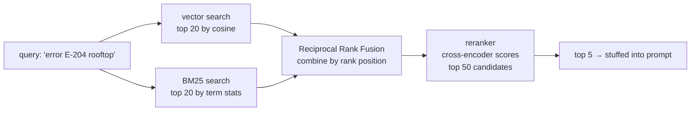

# 13 · Retrieval Quality: Hybrid Search, Reranking & Metadata Filters

> Vector search alone misses the exact strings your users actually type — SKUs, error codes, order
> numbers, the word "not." This chapter closes that gap with keyword hybrid search, reranking, and
> access-control filters — the difference between a RAG demo and a RAG system that survives contact
> with real queries.
> [← Part 3 · RAG & Retrieval](README.md) · prev: 12 · The RAG Pipeline · next: 14 · Evaluating & Debugging RAG

> **Predict first (2 min).** Write your guesses: (1) A customer searches `"error E-204"` against
> your help center. Vector search alone — does it reliably return the article documenting error
> E-204? (2) You retrieve the top 5 chunks by cosine similarity and hand them straight to the model.
> Is that generally better, worse, or about the same as retrieving the top 50 and having a second
> model *rerank* down to 5? (3) Two tenants share one help-center index. What stops tenant A's
> retrieval from returning tenant B's internal pricing doc?

---

## Where vector-only retrieval quietly fails

Chapter 03 named the failure modes: embeddings encode *topic*, not exact strings or logical
polarity. Retrieval built purely on cosine similarity inherits every one of them, and support
tickets are exactly the domain where they bite hardest — customers paste exact identifiers
constantly.

**Worked example.** Corpus contains an article titled *"Resolving Error E-204: Compressor Overcurrent
Trip"*. A customer ticket says: `"Getting error E-204 on the rooftop unit, help?"`

| Approach | What happens | Why |
|---|---|---|
| Vector-only, top-3 | Returns *"General Compressor Troubleshooting"* and *"Rooftop Unit Maintenance Schedule"* — **not** the E-204 article, or it ranks 4th | The embedding of `"error E-204"` looks like generic "error/troubleshooting" text; the alphanumeric code itself carries almost no semantic signal, so cosine similarity treats E-204 like any other error mention |
| BM25 keyword-only, top-3 | Returns the E-204 article 1st | `E-204` is a rare exact token; classic TF-IDF/BM25 scoring rewards rare-term exact matches heavily |
| Hybrid (vector + BM25, fused) | Returns the E-204 article 1st, plus a semantically related overcurrent-troubleshooting article 2nd | Gets the exact-match win *and* keeps topical recall for paraphrased queries where BM25 alone would miss |

The same asymmetry runs the other direction: a query like `"the reset button isn't working"`
(negation) is where BM25's exact match on `"not"` / `"isn't"` catches what vector search blurs
together (Chapter 03's negation failure). Neither retrieval method is strictly better — they fail
on different query shapes, which is exactly why you run both and fuse.

---

## Hybrid search: BM25 + vectors, fused

**BM25** is a classical lexical scoring algorithm (a refinement of TF-IDF): it scores a document
higher when it contains query terms that are rare across the corpus but frequent in that document.
No embeddings, no model call — pure term statistics, which is why it's fast and why it nails exact
identifiers that embeddings blur.

Running both retrieval methods gives you two *separately ranked* lists that need combining into
one. The standard technique is **Reciprocal Rank Fusion (RRF)** — it fuses on rank position, not
raw score, which sidesteps the problem that BM25 scores and cosine similarities aren't on
comparable scales:

```
RRF_score(doc) = Σ  1 / (k + rank_in_list)     (sum over each retrieval method's ranked list)
```

With the conventional constant `k = 60`:

```
Doc "E-204 article":     vector rank 4, BM25 rank 1
  RRF = 1/(60+4) + 1/(60+1) = 0.01563 + 0.01639 = 0.03202

Doc "General Troubleshooting": vector rank 1, BM25 rank 12
  RRF = 1/(60+1) + 1/(60+12) = 0.01639 + 0.01389 = 0.03028

Doc "Rooftop Maintenance":     vector rank 2, BM25 not in top 20 (rank ~40)
  RRF = 1/(60+2) + 1/(60+40) = 0.01613 + 0.01000 = 0.02613
```

The E-204 article wins the fused ranking (0.03202) despite ranking only 4th on vectors, because its
1st-place BM25 rank pulls it up — this is the whole mechanism in one worked table. RRF needs no
score normalization and no tuning of "how much to trust vectors vs keywords," which is why it's the
default fusion method in most production hybrid setups (Elasticsearch, `pgvector` + `pg_trgm`,
Weaviate, Vespa all support this pattern natively).



---

## Reranking: retrieve-50, rerank-to-5 beats retrieve-5 directly

Both vector search and BM25 are **bi-encoders** at heart — they score the query and each document
independently, then compare. That's what makes them fast enough to run over millions of documents,
but it caps their precision: the model never actually looks at the query and a candidate document
*together*.

A **reranker** (a cross-encoder) does the slower, more accurate thing: it takes the query paired
with *each* candidate document and scores that pair jointly, letting it catch relevance signals
bi-encoders miss (partial matches, query-document term interaction, subtle relevance). It's too
slow to run over your whole corpus — but it's cheap to run over 50 candidates you already narrowed
down.

This is why the standard production pattern is **retrieve-50 (broad, cheap, hybrid), rerank-to-5
(narrow, expensive, precise)** rather than retrieving 5 directly:

| Stage | Candidates in | Candidates out | Cost driver |
|---|---|---|---|
| Hybrid retrieval (vector + BM25 + RRF) | whole corpus | 50 | Fast — ANN index + inverted index, both sub-linear |
| Reranker (cross-encoder) | 50 | 5 | Slower per-pair, but only 50 pairs, not the whole corpus |

Retrieving only 5 directly means your final answer set is entirely at the mercy of the bi-encoder's
coarser ranking — if the truly best passage ranked 8th on cosine similarity, it never gets a second
look. Retrieve-50-rerank-to-5 gives the more accurate scorer a wider net to recover from the
cheaper method's ranking mistakes, then trusts it for the final cut that actually reaches the
prompt.

---

## Metadata filters: access control lives at retrieval time

A shared index across tenants, doc types, or time periods needs filtering *before* similarity
ranking, not after — otherwise a top-k search can surface another tenant's document simply because
it scored well, and you've built a data leak into your retrieval layer.

```sql
-- tenant isolation + doc-type scoping + freshness, applied as a WHERE clause
-- before the vector distance ordering even runs
SELECT chunk_text, article_id
FROM help_center_chunks
WHERE tenant_id = 'divisions-facilities-west'
  AND doc_type IN ('troubleshooting', 'policy')
  AND effective_date <= now()
ORDER BY embedding <=> $1
LIMIT 50;
```

Treat this the same way you'd treat a row-level security policy in any multi-tenant Postgres
schema — because that's exactly what it is. The retrieval layer is not a separate trust boundary
from the rest of your backend; if your Spring service enforces tenant scoping on every other query,
the RAG index needs the identical enforcement, applied *before* the expensive similarity search
runs, not as a post-hoc filter on the results.

---

## Prove it (45–60 min)

1. **Build the three configs.** On the corpus and eval questions from Chapter 12, implement:
   (a) vector-only top-5, (b) hybrid (vector + BM25 via RRF) top-5, (c) hybrid retrieve-50 + rerank
   to top-5 (use a hosted reranker API or a local cross-encoder like `ms-marco-MiniLM`).
2. **Write 10 identifier-heavy queries** — error codes, SKU-style IDs, order numbers — plus 10
   paraphrase-style queries with no exact identifiers.
3. **Measure recall@5** for each config, split by query type (identifier-heavy vs paraphrase).
   Expect vector-only to underperform sharply on the identifier split.
4. **Report all three as a table**:

   | Config | Recall@5 (identifier queries) | Recall@5 (paraphrase queries) | Recall@5 (overall) |
   |---|---|---|---|
   | Vector-only | | | |
   | Hybrid (RRF) | | | |
   | Hybrid + rerank | | | |

5. **The one-sentence reconciliation:** *"I predicted X, the recall table showed Y, because Z"* —
   e.g. *"I predicted hybrid would fix the identifier queries specifically, the table showed recall
   jumping from 30% to 90% on that split with no change on paraphrase queries, because BM25 exact-
   matches rare tokens that embeddings blur."*

---

## Self-Check (close the doc, answer out loud)

1. Walk the E-204 worked example: why does vector-only retrieval underrate an exact error code,
   and which mechanism in BM25 specifically fixes it?
2. Explain Reciprocal Rank Fusion in one sentence, and say why it fuses on rank rather than raw
   score.
3. What's structurally different between a bi-encoder (vector search) and a cross-encoder
   (reranker), and why does that difference dictate retrieve-50-rerank-to-5 instead of retrieve-5?
4. Where do metadata filters belong in the query — before or after similarity ranking — and what
   goes wrong if you get that order backwards in a multi-tenant system?
5. A teammate says "hybrid search is strictly better, just always turn it on." What's the cost
   trade-off you'd push back with (latency, infra) before agreeing?
6. Given "the bot returned the wrong article for a ticket mentioning an exact SKU," which of this
   chapter's three techniques would you check first, and why that one before the others?
