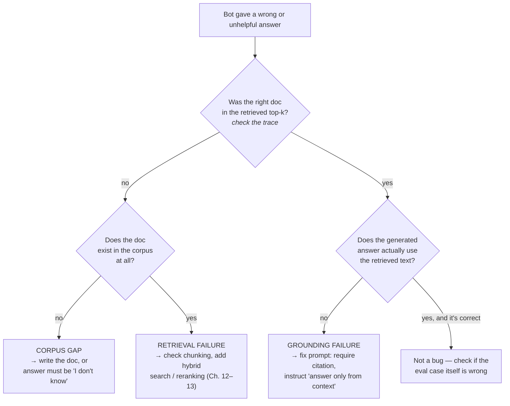

# 14 · Evaluating & Debugging RAG (where answers actually go wrong)

> "The bot hallucinates policies" is not a diagnosis — it's a symptom with three unrelated possible
> causes, each fixed differently. This chapter gives you the separation that turns RAG debugging
> from guesswork into a measured diagnosis, tying directly back to Part 2's eval habit.
> [← Part 3 · RAG & Retrieval](README.md) · prev: 13 · Hybrid Search, Reranking & Filters · next: [Part 4 · Agents](../04-agents/README.md)

> **Predict first (2 min).** Write your guesses: (1) A RAG bot gives a wrong answer. Name three
> genuinely different reasons that could be true, each requiring a different fix. (2) If retrieval
> recall@5 is 95% but end-to-end answer accuracy is 60%, where's the problem — retrieval or
> generation? (3) A customer asks a question that's genuinely *not* in the help center. What's the
> only correct answer, and why does that require its own eval slice?

---

## Three failure modes that look identical from the outside

Every "the RAG bot got it wrong" complaint collapses into exactly one of three causes — and from
the *user's* seat, all three produce the same symptom (a wrong or unhelpful answer), which is
precisely why teams without this chapter's habit spend days prompt-tweaking a retrieval bug.

| Failure mode | What actually happened | Wrong fix people try | Right fix |
|---|---|---|---|
| **Retrieval failure** | The right document exists in the corpus but never made it into top-k | Rewrite the system prompt to "be more careful" | Fix chunking, add hybrid search, add reranking (Ch. 12–13) |
| **Grounding failure** | The right document *was* retrieved and sits right there in context, but the model's answer ignores or contradicts it | Re-ingest the corpus, tune chunk size | Fix the prompt template — instruct explicit citation, penalize unsupported claims |
| **Corpus gap** | The answer genuinely isn't in any document — it was never written down | Blame retrieval, tune top-k endlessly | Write the missing doc, or the correct answer is "I don't know" |

The mental model: retrieval failure is a **search** problem, grounding failure is a **generation**
problem, and a corpus gap is a **content** problem. Confusing any two of these means you keep
pulling the lever that does nothing.

Reading a trace to answer "was the right doc in the retrieved top-k?" is a five-second check *if*
you logged retrieval results — and an unanswerable question if you didn't. This is the single
strongest argument for tracing every RAG call (full detail in Chapter 20): log the query, the
retrieved chunk IDs and scores, and the final answer, every time, from day one.

---

## The metric for each failure mode

Chapter 10 established the eval habit: never ship what you didn't measure. RAG needs **two
separate metrics**, because they catch different failure modes and can move independently:

- **Retrieval recall@k** — of the documents actually needed to answer correctly, what fraction did
  the retrieval step return in its top-k? This is graded purely against the retrieval step's output
  (chunk IDs), *before* any generation happens. Code-graded: you know in advance which `article_id`
  each eval question needs.
- **Answer faithfulness / groundedness** — given the retrieved context and the generated answer,
  does the answer's content actually appear in / follow from that context? This is graded on the
  *final* answer against the *retrieved* context, independent of whether the context was even the
  right context. Usually LLM-as-judge (Chapter 11): "given this context and this answer, is every
  claim in the answer supported by the context? yes/no + which claim isn't."
- **Answer accuracy** — is the final answer actually correct, full stop, checked against a
  reference answer. This is the metric a customer cares about, and the one that conflates both
  upstream failure modes if you only report this number.

**Worked example: recall@5 = 95%, answer accuracy = 60%.** Retrieval is doing its job — the right
document reaches the model in 95% of cases. But only 60% of answers are correct. The 35-point gap
is downstream of retrieval: either a grounding failure (model ignores good context 35% of the
time — check faithfulness score) or the eval questions include unanswerable ones the model should
be refusing but isn't (check the unanswerable slice specifically). Tuning chunk size here would be
wasted effort — recall is already high.

**Contrast: recall@5 = 55%, answer accuracy = 50%.** The two numbers move together — most of the
failure is upstream. This is a retrieval problem: fix chunking or add hybrid search (Chapter 13)
first, then re-measure before touching the prompt at all.

This paired-metric read is the entire diagnostic skill of this chapter: **always report both
numbers, and diagnose from the gap between them, not from either number alone.**

---

## The unanswerable-question slice

A RAG eval set that only contains answerable questions cannot catch the single most common
production failure: a user asks something outside the corpus, and instead of saying so, the model
confabulates a plausible-sounding policy that doesn't exist. This is Chapter 01's core lesson
resurfacing at the system level — the model always emits the *most plausible continuation*, and
"I don't know" is rarely the most plausible-*sounding* continuation unless you've explicitly made
it so.

Fixing this requires an eval slice built specifically for it: questions with **no correct answer
in the corpus**, where the only passing response is a refusal or "not covered" — not a fabricated
policy. Grade this slice separately (call it `unanswerable_accuracy`): the pass condition is "model
declined to answer / said it's not covered," and a fabricated confident answer is a hard fail, no
partial credit. A system can have 95% recall@5 and 90% answer accuracy on answerable questions
while silently failing every unanswerable one — three great-looking numbers hiding a policy-
hallucination bug that only this slice would catch.

---

## Diagnosing "the bot hallucinates policies"

Walking the decision tree above end to end on a real complaint:

1. **Pull the trace.** Find the actual request: the ticket text, the retrieved chunk IDs and their
   similarity/rerank scores, and the generated answer.
2. **Check retrieval first, always** — before touching the prompt. Was the policy document that
   *should* have answered this actually in the top-k? If the corpus has it and retrieval missed
   it, this is a retrieval failure — stop here, go fix Chapter 12–13 levers, re-measure recall@5.
3. **If retrieval was correct, check grounding.** Read the retrieved chunk text yourself. Does it
   actually contain the policy the model stated, or did the model state something adjacent-sounding
   but unsupported? If unsupported, this is a grounding failure — the fix is prompt instructions
   (see below), not a corpus or retrieval change.
4. **If the corpus genuinely has no such policy**, this is a corpus gap. The correct system
   behavior is refusal, and the fix is either writing the missing document or hardening the
   "say I don't know" instruction — check the unanswerable slice to see if this is systemic.

The discipline is ordering: **retrieval before generation, always.** Prompt-tweaking a retrieval
bug feels like progress (the wording changes) but doesn't move the number that's actually broken,
and it risks masking a real retrieval gap behind more hedging language.

---

## Build it (45–60 min)

1. **Extend the eval set** from Chapter 12 to at least: 20 corpus-answerable questions (each tagged
   with the `article_id` that answers it), 5 unanswerable questions (genuinely outside the corpus),
   and reuse the identifier/paraphrase split from Chapter 13.
2. **Measure recall@5 and answer accuracy separately** across the full set, and report
   `unanswerable_accuracy` as its own number.
3. **Find one real grounding failure.** Pick a case where retrieval recall was correct (right doc
   in top-k) but the answer still scored wrong on faithfulness. Read the actual chunk text and the
   actual generated answer side by side.
4. **Fix it with prompt instructions only** — add an explicit "answer only using the provided
   context; if the context doesn't address the question, say so" instruction, or require inline
   citation of the source chunk. Do not touch chunking, retrieval, or the corpus.
5. **Re-run the eval** and confirm the faithfulness score improved without recall@5 changing —
   *that's* the proof it was a grounding failure, not a retrieval failure, all along.
6. **The one-sentence reconciliation:** *"I predicted X, the eval showed Y, because Z"* — e.g. *"I
   predicted the grounding fix would leave recall@5 unchanged, the eval showed recall flat at 90%
   while faithfulness rose from 70% to 92%, because the bug was never in what got retrieved."*

---

## Self-Check (close the doc, answer out loud)

1. Name the three RAG failure modes and, for each, the metric that catches it and the fix that
   actually addresses it.
2. Given recall@5 = 95% and answer accuracy = 60%, where do you look first, and why not the other
   place?
3. Why does a RAG eval set need a dedicated unanswerable-question slice, and what's the pass
   condition for that slice specifically?
4. Walk the diagnosis path for "the bot hallucinates policies" in order — what do you check first,
   second, third, and why that order?
5. Explain why "the model always emits the most plausible continuation" (Chapter 01) is the same
   mechanism behind both ordinary hallucination and a RAG grounding failure.
6. A stakeholder wants one number: "is the RAG system good?" What two numbers do you insist on
   reporting instead, and what's your one-sentence justification for refusing to collapse them into
   one?
