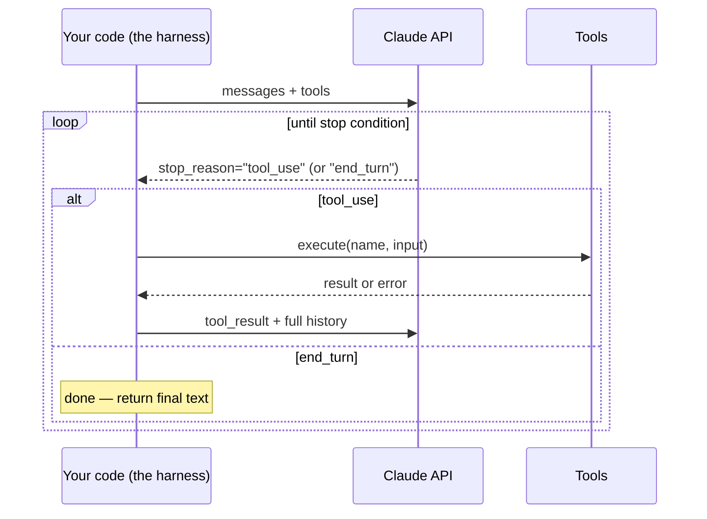

# 15 · The Agent Loop: Model + Tools + Loop

> Chapter 07 showed you one tool call: model asks, your code executes, you report back, model
> answers. An agent is that exact exchange wrapped in a `while` loop that doesn't stop after one
> round trip — it keeps going until a condition *you* wrote says stop. This chapter is that
> condition, and the harness around it.
> [← Part 4 · Agents](README.md) · prev: [Part 3 · RAG & Retrieval](../03-rag-and-retrieval/README.md) · next: 16 · Tool Design

> **Predict first (2 min).** Write your guesses: (1) If you never coded a max-turn limit, what's the
> worst thing that could happen to your token bill? (2) A tool call throws an exception inside your
> loop — should you crash, retry, or send something back to the model? (3) You have three tools and
> a customer request that clearly needs two of them in sequence. Does the model know to chain them,
> or does your code have to tell it to?

---

## An agent, in one sentence

**An agent is a model calling tools in a loop until a stop condition.** That's the whole definition
— no magic, no autonomy in the mystical sense. Everything that feels like "reasoning" or "planning"
is the model doing next-token prediction (Ch. 01) repeatedly, conditioned each time on a growing
transcript that now includes the results of things it asked your code to do. Compare it to Chapter
07's single round trip: same `tool_use` → execute → `tool_result` mechanism, just not capped at one
exchange.



Two things fall out of this immediately. First, **there is no "agent" object in the API** — Claude
has no `run_agent` endpoint. You are looking at the same `messages.create` call from Chapter 07,
called repeatedly by code you wrote. Second, **the loop is where all the engineering lives.** The
model's job — pick a tool, extract arguments, write a final answer — is a few hundred milliseconds
of forward passes. Everything else — logging, budgets, retries, deciding what "done" means, keeping
history from ballooning — is your harness. Ship a bad harness around a great model and you get a
system that loops forever, burns budget, or silently drops errors. Ship a great harness around a
mediocre model and you get something a customer can trust. **The harness is the majority of the
engineering effort in agentic systems**, and it's the part this chapter and Chapter 16 are about.

---

## Stop conditions: the four things that end a loop

An agent loop without an explicit stop condition doesn't stop — it runs until something external
kills it (a timeout, an out-of-memory error, an angry on-call engineer). You need at least one of
these, and production systems use all four:

| Stop condition | What it catches | What breaks if you omit it |
|---|---|---|
| **Max turns** | A model stuck alternating between two tools, or chasing a task it can't complete | Infinite loop — a bad tool result convinces the model to retry forever, and your token bill runs away with it |
| **Token / cost budget** | A task that's individually fine per-turn but expensive cumulatively (long history re-sent every turn — Ch. 18) | A single request quietly costs $4 instead of $0.02; at volume this is the incident, not the ticket |
| **Explicit "done" signal** | The model believes it has satisfied the user and should stop calling tools | Without a clear signal, you can't tell "the model is thinking" from "the model is stuck," and you can't log task success/failure for your eval suite (Ch. 10–11) |
| **Human approval gate** | An action with real-world consequences (refund, escalation, anything destructive) | An agent takes an irreversible action on a hallucinated premise, with no human ever in the loop — the actual nightmare scenario in every agent postmortem |

Max turns and budget are cheap insurance — a `for turn in range(MAX_TURNS)` and a running
`usage.input_tokens + usage.output_tokens` tally against a ceiling. The "explicit done" signal is
usually just `stop_reason == "end_turn"` with no pending `tool_use` blocks — the model wrote a
final answer instead of asking for another tool. The approval gate is different in kind: it's not
a loop condition at all, it's a **tool that pauses instead of executing** (this chapter's build
uses `escalate_to_human` for exactly that — the tool's job is to stop the automated loop and hand
off, not to "escalate" anything itself).

Get this ordering wrong and you get the classic failure: a team ships max-turns and budget, calls
it done, and finds out in production that the agent auto-approved a refund because nobody wired the
fourth condition. Reversibility × blast-radius (Ch. 19 formalizes this) decides which actions need
a human, but the mechanism — a tool that doesn't execute, it queues — belongs in this chapter.

---

## Workflow vs agent: who decides the next step

Not every multi-step LLM system needs a model deciding what happens next. Draw the line by asking:
**who chooses which step runs — you, at code-time, or the model, at run-time?**

- **Workflow**: you hard-code the sequence (classify → retrieve → draft → send), and the model
  fills in the content at each fixed step. Predictable, cheap to eval (each step has one job),
  cheap to debug (you know which step ran).
- **Agent**: the model looks at the current state and *decides* which tool to call next, in what
  order, how many times, whether to stop. Necessary when the right sequence depends on what earlier
  steps returned — you can't write the `if` statement in advance because you don't know what
  branches exist until the ticket is in front of you.

Signals that push a use case from workflow toward agent (Chapter 19 goes deep on this trade-off):

- The number of *valid orderings* of steps is large or unknown ahead of time.
- Later steps depend on data you can't inspect until a prior tool result comes back (you don't know
  if you need `lookup_order_status` again until you see the first result was "not found").
- The cost of a wrong path is recoverable (a wasted tool call, not a wasted refund) — agents fail
  more often than hand-coded workflows, so blast radius has to be small.

If none of those hold, write the workflow. A hard-coded `if/else` that always does the right thing
beats an agent that's right 92% of the time and costs 3x the tokens *and* is harder to eval.

---

## Errors inside the loop: the tool result IS the recovery mechanism

A tool throwing an exception is not a crash condition for the loop — it's information the model can
act on, the same way a "not found" result is information. Chapter 07 already established that the
model reads `tool_result` content as data, not as a special error channel; that's true whether the
content is a successful lookup or a stack trace. The engineering move is: **catch the exception in
your harness, and send the model a `tool_result` block describing what went wrong**, instead of one
of these two mistakes:

- **Crashing the loop.** The user gets nothing, and you've thrown away a transcript that would have
  told you exactly what failed.
- **Silently retrying without telling the model.** If the retry also fails, you've burned turns and
  budget without the model ever getting a chance to try something else — ask a clarifying question,
  try a different tool, escalate.

```json
{
  "type": "tool_result",
  "tool_use_id": "toolu_01Xy9",
  "content": "Error: lookup_order_status failed — ticket ID 'WO-4821' not found. Did you mean WO-48213? Ask the customer to confirm the ticket ID if unsure.",
  "is_error": true
}
```

That `content` string is doing the same job a good tool description does (Ch. 16 goes deep on
this): it's written *for the model to read and act on*, not for a human debugging a log file. A bad
error return — `"Error: NoneType has no attribute 'stage'"` — gives the model nothing to recover
with, and you'll see it either hallucinate a status or repeat the identical failing call. The
`is_error: true` flag matters too: it's the signal Claude uses to know the tool failed rather than
succeeded with an unusual-looking result.

---

## Build it (60–90 min)

Turn the ticket assistant from Chapters 06–07 into a real hand-rolled agent loop. **No framework** —
plain SDK calls in a `while`, so you feel every moving part before Chapter 17 hands you MCP and
Chapter 19 hands you orchestration patterns that hide this loop from you.

1. **Three tools.**
   - `search_help_center(query)` — the RAG retriever from Part 3 (Ch. 12–14), now exposed as a tool
     the model *chooses* to call instead of code you run unconditionally before every prompt. Reuse
     your Chapter 13 retrieval function; the loop just decides *when* to call it.
   - `lookup_order_status(ticket_id)` — the stub from Chapter 07's build.
   - `escalate_to_human(reason, ticket_id)` — returns a canned "queued for review" result and, per
     the approval-gate discussion above, is where you'll later wire a real queue (Ch. 19's build).
2. **Write the loop.** Pseudocode shape:
   ```python
   history = [{"role": "user", "content": user_message}]
   turn = 0
   total_tokens = 0
   while turn < MAX_TURNS and total_tokens < TOKEN_BUDGET:
       resp = client.messages.create(model=MODEL, system=SYSTEM, tools=TOOLS, messages=history)
       total_tokens += resp.usage.input_tokens + resp.usage.output_tokens
       history.append({"role": "assistant", "content": resp.content})
       tool_uses = [b for b in resp.content if b.type == "tool_use"]
       if not tool_uses:
           break  # stop_reason == end_turn, model wrote a final answer
       results = []
       for tu in tool_uses:
           try:
               output = TOOL_FUNCS[tu.name](**tu.input)
               results.append({"type": "tool_result", "tool_use_id": tu.id, "content": output})
           except Exception as e:
               results.append({"type": "tool_result", "tool_use_id": tu.id,
                                "content": f"Error: {e}", "is_error": True})
       history.append({"role": "user", "content": results})
       turn += 1
   ```
3. **Log every turn** to a JSONL trace file: turn number, `stop_reason`, every tool called with its
   input and result, running token total. This is the same trace-logging habit from Chapter 07's
   build — now it's covering multiple turns, and it's what Chapter 16's eval and Chapter 20's
   observability chapter both build on.
4. **Add the two stop conditions you control at this layer:** `MAX_TURNS` (try 6) and `TOKEN_BUDGET`
   (try 8,000 total tokens). Force a runaway case on purpose — give the model a query where
   `search_help_center` returns nothing useful every time — and confirm the loop halts instead of
   spinning, and that you log *why* it stopped (turns exhausted vs budget exhausted vs natural
   `end_turn`).
5. **Run five test tickets** spanning: a pure help-center question (one tool, one turn), an order
   status question (one tool, one turn), a question needing both tools in sequence, an angry
   customer who should trigger escalation, and one deliberately ambiguous ticket ID that forces the
   model to read your error `tool_result` and recover.
6. **Reconcile:** *"I predicted X, the API showed Y, because Z."* Specifically — which of the five
   tickets took more turns than you expected, and what in the trace explains it?

---

## Self-Check (close the doc, answer out loud)

1. Define an agent in one sentence, then draw the loop from memory — where does `tool_result` get
   appended, and what determines whether the loop runs again?
2. Name all four stop conditions and, for each, describe a concrete incident that happens if you
   omit it.
3. Why is a human-approval gate implemented as a tool, not as a loop-level `if` statement? What does
   that buy you that a hard-coded check wouldn't?
4. A tool call raises an exception. Walk through exactly what your harness does with it, and explain
   why that's different from either crashing or silently retrying.
5. Give two concrete signals that would make you rewrite an agent as a hard-coded workflow instead,
   and explain the eval-cost argument for doing so.
6. A teammate says "the agent decided to escalate the ticket." Rewrite that sentence so it's
   mechanically precise about what the model did versus what your harness did.
