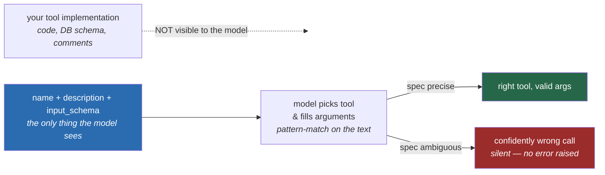

# 16 · Tool Design: The API Design Problem of the Decade

> Chapter 07 gave you the mechanics of a tool call. This chapter is what to actually put in one —
> because the caller reading your interface isn't a compiler or a careful engineer, it's a
> probabilistic model skimming a docstring under time pressure, and it will do exactly what the
> words tell it to, not what you meant.
> [← Part 4 · Agents](README.md) · prev: [15 · The Agent Loop](15-the-agent-loop-model-tools-loop.md) · next: 17 · MCP

> **Predict first (2 min).** Write your guesses: (1) You give an agent two tools that both plausibly
> handle "cancel this order" — one named `cancel_order`, one named `void_transaction`. What decides
> which one the model calls, given both have thin one-line descriptions? (2) Does a tool definition
> cost tokens on every request, even the ones where it's never called? (3) Is it better to expose
> five thin tools that mirror your internal REST endpoints, or two broad tools that each do more?

---

## Interface design, but the caller can't read your source code

Tool design is API design with one constraint that changes everything: **your caller is a
probabilistic model that only ever sees the `name`, `description`, and `input_schema` you wrote —
never your implementation.** A human engineer integrating against a bad REST endpoint can read the
source, ask in Slack, or step through a debugger. The model can't do any of that. It picks a tool
and fills in arguments based purely on pattern-matching against the text you gave it, the same way
it decides *whether* to call a tool at all (Ch. 07). This is exactly the discipline covered for
human-facing interfaces in [`../../LLD` on interface design](../../LLD) — precise names, unambiguous
parameters, documented edge cases — except here the reader can't ask a follow-up question mid-call
and will confidently do the wrong thing rather than flag "I'm not sure." Every ambiguity you leave
in a tool spec becomes a silent wrong tool call in production, not a compiler error.



---

## Rule 1: few high-level tools beat many thin API wrappers

The instinct coming from REST/microservices experience is to expose one tool per endpoint:
`get_customer`, `get_order`, `get_technician`, `get_schedule`, `update_order_status`,
`get_order_history`... This is the wrong shape for an agent, for three compounding reasons:

- **Every tool definition sits in every request's context**, whether or not it's used (Ch. 09's
  caching chapter covers the token cost of a static prefix; tool definitions are exactly that kind
  of prefix). Ten thin tools with verbose schemas can be 1,500+ tokens of system context on every
  single turn of every conversation, called or not.
- **More tools = more chances for the model to pick the wrong one**, especially when several tools
  have overlapping-sounding purposes. Tool selection is a classification problem, and classification
  accuracy degrades as the label space grows and the labels get more similar to each other.
- **A high-level tool can do the multi-step reasoning in code, deterministically**, instead of
  making the model chain three thin calls correctly across three separate forward passes. A
  `resolve_order_issue(ticket_id)` tool that internally looks up the order, checks technician
  availability, and drafts the right response is one reliable tool call instead of three chances to
  drop a step.

The rule of thumb: **design tools around the tasks a human agent would actually perform**, not
around your database schema or your microservice boundaries. "What does a support rep need to *do*"
produces a handful of coarse, purposeful tools. "What tables do we have" produces dozens of thin
ones that all look interchangeable to a model skimming descriptions.

---

## What makes a tool name, description, and schema good

Same three parts from Chapter 07 — `name`, `description`, `input_schema` — but now the bar is
*disambiguation under pressure*, not just correctness:

- **Name**: a verb + object the model won't confuse with a sibling tool. `cancel_order` and
  `void_transaction` sound like two different things to a model that's never seen either used —
  which one handles "the customer wants their money back" is genuinely ambiguous from the names
  alone, and that ambiguity is a design bug, not a training-data gap.
- **Description**: states *when to call it*, not just what it returns — this is the single biggest
  lever on tool-choice accuracy, more than the name or the schema. "Returns order status" is weaker
  than "Use this whenever a customer asks where their order is or when it will arrive; do not use
  for billing questions — see `check_billing_status`." The second sentence is doing real
  disambiguation work against a specific sibling tool.
- **`input_schema`**: constrain everything you can with `enum`, not free text you validate after the
  model has already committed to a guess. A `category` field typed as `"enum": ["hvac", "plumbing",
  "electrical", "general"]` can't be misspelled or invented; a free-text `category` string will
  occasionally come back as `"HVAC issue"` or `"heating/cooling"` and now your downstream code has
  to normalize model output instead of trusting a closed set.
- **No-results is a real response, not an absence of one.** A tool that returns an empty string or
  `null` on "not found" reads to the model like a bug, and it will sometimes retry or hallucinate a
  plausible-looking result to fill the gap. Return a structured, unambiguous "nothing matched"
  message instead (see the before/after below).

---

## Before / after: a bad vs. good tool spec

**Bad** — thin name, description tells the model *what* but not *when*, free-text field, silent
empty result:

```json
{
  "name": "get_status",
  "description": "Gets status.",
  "input_schema": {
    "type": "object",
    "properties": {
      "id": { "type": "string" }
    },
    "required": ["id"]
  }
}
```

Calling it with a nonexistent ID returns `""` — the model has no way to distinguish "not found"
from "found, empty" from "the tool is broken," and it's equally likely to invent a plausible status
as to ask the customer to double-check the ID.

**Good** — the name and description disambiguate against siblings, the schema constrains what it
can, and the no-match case is explicit:

```json
{
  "name": "lookup_order_status",
  "description": "Look up the current status of a facilities work order by its ticket ID. Returns the order's stage (received, scheduled, in_progress, completed), assigned technician, and ETA if scheduled. Use this whenever a customer asks 'where is my order' or 'when will someone arrive.' Do NOT use for billing questions (see check_billing_status) or to cancel an order (see cancel_order).",
  "input_schema": {
    "type": "object",
    "properties": {
      "ticket_id": {
        "type": "string",
        "description": "The work order ID, format WO-XXXXX (e.g. WO-48213). Extract from the customer's message; ask the customer if not present — never guess a plausible-looking ID."
      }
    },
    "required": ["ticket_id"]
  }
}
```

And its "not found" response is a message written for the model, matching Chapter 15's error
convention:

```json
{
  "stage": "not_found",
  "message": "No work order matches WO-4821. Ticket IDs are 5 digits after 'WO-'; ask the customer to confirm, or check for a typo (e.g. WO-48213)."
}
```

| | Bad spec | Good spec |
|---|---|---|
| Name | `get_status` — collides conceptually with any other "status" tool | `lookup_order_status` — specific to one domain object |
| Description | What it returns | When to call it, and what *not* to call it for |
| Schema | Free-text `id`, no format guidance | Format documented, explicit "don't guess" instruction |
| No-match case | Empty string — indistinguishable from a bug | Structured, actionable message the model can relay or act on |

---

## Token cost: tool definitions are on every request

Tool schemas are declared in full on every API call in a conversation — they are not sent once and
remembered. A moderately-sized tool with a thorough description and a few parameters runs
150–400 tokens; five such tools is easily 1,000–2,000 tokens **added to every single request**,
identical every time, exactly the kind of static prefix Chapter 09 covers for prompt caching. Ten
thin, overlapping tools (the anti-pattern from Rule 1) can push that past 3,000 tokens before the
conversation has said anything. At Chapter 01's worked rate ($3/MTok in), 2,000 tokens of tool
definitions across 100,000 tickets/month is $0.60/month by itself — trivial in isolation, but it
compounds with the rest of the system prompt and, in a multi-turn agent loop (Ch. 15), gets
re-sent on *every turn*, not just the first. Caching the tool-definition prefix (Ch. 09) is the
direct fix; consolidating tools (Rule 1) is the fix that also improves accuracy, which is why it
comes first.

---

## Consolidating vs. splitting, and namespacing at scale

Consolidate when: two tools are always used together, or one is a strict subset of what the other
already needs to check (don't make the model call `check_availability` and then `assign_technician`
separately if assignment always needs availability first — do the check inside `assign_technician`
and return a clear error if nobody's free).

Split when: two operations have genuinely different blast radius or approval requirements. Don't
fold `escalate_to_human` into a general `update_ticket` tool just to reduce the tool count — Chapter
15's approval-gate pattern depends on that action being its own named, interceptable tool.

At scale (a real deployment easily has 30–50 tools across billing, scheduling, technicians,
inventory), flat naming stops disambiguating and namespacing takes over: `billing.check_status`,
`scheduling.check_status` read as unrelated to a model, where `check_billing_status` and
`check_scheduling_status` still look like siblings competing for the same intent. This is also
where Chapter 17's MCP servers pay off structurally — a server boundary *is* a namespace, and
grouping tools by MCP server keeps a large tool surface navigable instead of one flat list of 50
similar-sounding names.

---

## Build it (45–60 min): an eval-driven tool-design exercise

You're going to break tool choice on purpose, measure it, then fix it — the eval-first habit
applied to interface design instead of prompt wording.

1. **Build a small eval set** of 15–20 test messages for the agent from Chapter 15's build, each
   labeled with the *correct* tool (or "no tool") a human reviewer agrees is right. Include several
   pairs that are genuinely close calls (an order-status question vs. a billing-adjacent one).
2. **Introduce two overlapping, vaguely-described tools.** Add `get_order_info` alongside your
   existing `lookup_order_status`, both with thin one-line descriptions ("Gets order info." /
   "Gets status.") and no guidance on when to use which.
3. **Run the eval.** For each test message, record which tool (if any) the model called and compare
   to the label. Compute tool-choice accuracy = correct calls / total. Expect it to drop measurably
   versus a single well-described tool — write down the number before you look at individual traces.
4. **Read the failures.** For each wrong call, look at which description language likely caused the
   confusion — this is the same trace-reading discipline from Ch. 10–11's eval work, applied to
   tool specs instead of final answers.
5. **Fix it**: either merge the two tools into one well-described tool, or rewrite both descriptions
   to explicitly disambiguate against each other (as in the before/after section above). Re-run the
   identical eval set.
6. **Reconcile:** *"I predicted X, the API showed Y, because Z."* Report the before/after accuracy
   numbers and name the specific description change that fixed the largest number of failures.

---

## Self-Check (close the doc, answer out loud)

1. Why is a tool's `description` closer to prompt engineering than to a docstring, and what's the
   practical consequence of getting that wrong?
2. Give the argument for few high-level tools over many thin ones — name all three reasons (context
   cost, selection accuracy, multi-step reliability), not just one.
3. What makes a "no results" response good versus bad, and what specifically goes wrong downstream
   when it's bad?
4. Walk through the token-cost math for five tools with average 300-token schemas, across a 10-turn
   agent loop. Where would you apply Chapter 09's caching to fix it?
5. Give a concrete example of when you'd split two operations into separate tools even though
   merging them would save tokens — tie it to Chapter 15's approval-gate pattern.
6. A teammate wants to expose all 40 of your internal REST endpoints as 40 tools "so the model has
   maximum flexibility." Give the case against, and describe the alternative shape you'd propose.
