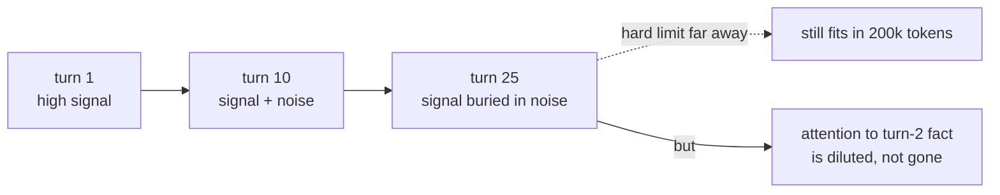
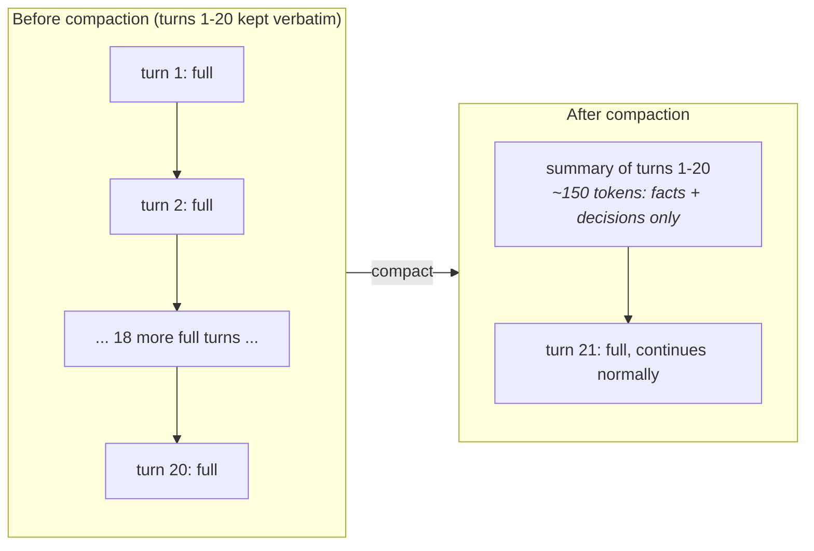

# 18 · Context Engineering: Memory, Compaction & Long-Running Agents

> Your agent works flawlessly in a 3-turn demo and gets confused, repetitive, or forgetful by turn
> 25 — while still well inside the model's context limit. This chapter explains why (attention
> dilution, not a hard cutoff) and gives you the mitigation tiers: compaction, external memory,
> sub-agents, and retrieval-on-demand.
> [← Part 4 · Agents](README.md) · prev: 17 · MCP · next: 19 · Orchestration

> **Predict first (2 min).** Write your guesses: (1) A model has a 200k-token context window; your
> conversation is at 40k tokens. Is the model's attention to early instructions the same quality as
> it was at turn 1, or does something degrade before you hit the limit? (2) An agent loop resends
> the *entire* conversation history on every turn (Ch. 12–14). At turn 20 of a support ticket
> investigation, roughly how much of that resent history is new information the model needs versus
> old tool calls it already acted on? (3) If you delete old turns to save tokens, what's the failure
> mode — and how would you notice it before a customer does?

---

## Degrading inside the limit: context rot

Chapter 01 established that attention lets any token look at any earlier token, and that this is
what makes long context *possible*. It doesn't make long context *free of quality loss*. Two
separate things get conflated under "context window":

- **The hard limit** — the token budget the model literally cannot exceed (200k for many
  Claude models; check the live docs for the exact number per model).
- **Effective attention quality** — how reliably the model actually *uses* information that's far
  back in a long context, which degrades well before the hard limit. This is sometimes called
  "context rot" or "lost in the middle": instructions and facts placed early in a long conversation
  get diluted as thousands of intervening tokens compete for attention weight. The model isn't
  forgetting in the human sense — the mechanism is that a next-token prediction over 40k tokens of
  mixed signal (some relevant, most stale) is a harder inference problem than the same prediction
  over 4k tokens of high-signal context.

Concretely, in a 25-turn ticket-investigation agent: turn 2's tool result ("customer's plan is
Premium") is still technically in context at turn 25, but it's now sitting behind 23 turns of
subsequent tool calls, retries, and reasoning — each one adds tokens the model must weigh against
it. That's Ch. 04's cost cliff (long prompts cost more) plus a *quality* cliff on top: past a point,
adding more history can make the agent *worse* at using the specific fact you needed, not just
slower and more expensive.



Engineering consequence: **"it fits in the context window" is not the same claim as "the model will
use it well."** You manage context quality the same way you'd manage a junior engineer's inbox —
by curating what's in front of them, not by forwarding everything and hoping.

---

## Context as a budget you defend token by token

Reframe the system prompt + history + tool defs + retrieved docs + tool results the way Ch. 01
framed tokens generally: every one of them is rent, paid in three currencies at once — dollars
(input tokens), latency (prefill scales worse than linearly, Ch. 01), and attention quality (context
rot, above). The engineering discipline is **deciding, per token, whether it's earning its place**:

| Goes where | Contains | Why there and not elsewhere |
|---|---|---|
| **System prompt** | Role, policy, tool definitions, few-shot examples — stable across the whole conversation | Paid once per turn but cacheable (Ch. 09); should be the *smallest* stable set that fully specifies behavior |
| **Retrieved on demand** | Help-center articles, order history, prior tickets — large, mostly irrelevant per-turn | Fetched only when a tool call asks for it (Ch. 10's RAG, Ch. 12's tool use); never pre-loaded "just in case" |
| **A tool the agent calls** | Anything computable or lookupable cheaper than storing it in text — current order status, a calculation, today's date | Keeps context small; the *result* enters context, not the capability to produce it |
| **Conversation history** | What's actually been said and decided this session | The one that silently grows every turn and is this chapter's subject |

The recurring bug this table prevents: a teammate says "let's just put the customer's full order
history in the system prompt so the agent always has it." That's paying rent on every single turn
for information needed on maybe 10% of turns — better as a tool call (`lookup_order_status`) fired
only when needed, per the "retrieval on demand" row above.

---

## The cost math of a growing conversation

An agent loop (Ch. 12) resends the *whole* running transcript every turn — that's how the API is
stateless. Model a 20-turn support-ticket investigation where each turn adds ~500 tokens (a tool
call + result) and the system prompt (with tool defs) is a fixed 1,500 tokens, at the same
illustrative Sonnet-class pricing as Ch. 01 (**$3/MTok in, $15/MTok out**, always re-check the live
pricing page):

| Turn | History sent (input) | Output this turn | Cost this turn |
|---|---|---|---|
| 1 | 1,500 (system only) | 500 | 1,500×$3/M + 500×$15/M = $0.0120 |
| 5 | 1,500 + 4×500 = 3,500 | 500 | $0.0180 |
| 10 | 1,500 + 9×500 = 6,000 | 500 | $0.0255 |
| 20 | 1,500 + 19×500 = 11,000 | 500 | $0.0405 |

```
Sum of input tokens across all 20 turns (arithmetic series):
  20 × 1,500 (system, resent every turn) + 500 × (0 + 1 + 2 + ... + 19)
= 30,000 + 500 × 190
= 30,000 + 95,000 = 125,000 input tokens just for this one ticket
```

```
Total for one ticket: 125,000 tok × $3/M (input) + 20 × 500 tok × $15/M (output)
                     = $0.375 + $0.15 ≈ $0.53 per ticket
× 10,000 tickets/month that go this long ≈ $5,300/month
```

Compare Ch. 01's single-call ticket at **$0.014**. The 20-turn version isn't 20× more expensive —
it's **~38× more expensive per ticket**, because the resent history grows every turn while the
single-call version never did. This is the "cost cliff" Ch. 01 flagged and deferred to here: the
*shape* of the cost curve for a conversational agent is quadratic-ish in turn count, not linear,
for exactly the same reason prefill cost is roughly quadratic in prompt length — you're resending
and re-attending over an ever-larger prefix every single turn.

And dollars are the easy half of the bill — the *attention quality* cost (context rot, above)
degrades on the same curve, for free, with no line item to notice it on.

---

## Mitigation tier 1: compaction / summarization

The direct fix for the growing-history problem: periodically replace old turns with a **shorter
summary** that preserves the decisions and facts that matter, discarding the verbose tool-call
back-and-forth that got you there.



Mechanically: at a trigger point (every N turns, or when input tokens cross a threshold), make one
extra LLM call — "summarize this transcript into the facts and decisions a continuing agent needs;
drop exploratory dead ends and superseded tool calls" — and splice that summary in as a synthetic
system/assistant turn, replacing the raw history it summarizes. The live conversation continues from
there with a much smaller prefix.

Trade-off to say out loud, not hide: compaction is lossy by design. A detail dropped from the
summary is gone for the rest of the conversation unless it's re-derivable by another tool call.
That's why the summary prompt matters as much as the mechanism — "keep decisions and open
questions, drop retries and dead ends" is a design choice, not a default.

---

## Mitigation tier 2: external memory (files/scratchpads)

Instead of compaction living only in the LLM's own context, let the agent read/write **files** that
persist independently of the conversation — a scratchpad the agent maintains itself. Ch. 16's agent
loop already has a tool-call shape; add `write_scratchpad(note)` and `read_scratchpad()` tools.

This inverts the trade-off from compaction: nothing is lossy (the file has everything you wrote to
it), but the agent must *decide* what's worth writing down and must *choose* to read it back — it's
not automatically re-injected. Long-running agents (Ch. 16's multi-step loop over hours, not
minutes) lean on this heavily: "investigation notes so far" living in a file survives a process
restart; a compacted summary living only in message history does not.

---

## Mitigation tier 3: sub-agents with clean contexts

Some sub-problems don't need — and are actively hurt by — the parent conversation's full history.
A "research this customer's last 6 months of tickets" sub-task doesn't need the parent's tool-call
retries from an unrelated earlier question; it needs a clean context with just the sub-task's
inputs. Spin up a sub-agent (same model, fresh context, a narrow prompt and tool set), let it work,
and return only its **final answer** to the parent — not its intermediate transcript.

This is context defense by *isolation* rather than compression: the parent's context grows by one
short result instead of by the sub-agent's entire working transcript. Ch. 19 covers when this
genuinely beats a single agent (parallel, read-heavy research) versus when it's unnecessary
overhead (sequential tasks sharing state) — the context-isolation benefit is one input to that
decision, not the whole answer.

---

## Mitigation tier 4: retrieval-on-demand instead of stuffing

The RAG instinct from Part 3 applies inside the agent loop too: don't pre-load "the last 20
tickets from this customer" into every turn's context "just in case" — expose
`get_ticket_history(customer_id, limit)` as a tool and let the model call it the one turn it's
actually relevant. This is the same "retrieved on demand" row from the budget table above, restated
as a mitigation: the fix for context bloat is very often "don't put it in context at all until
asked," not "put it in context, then compact it later."

---

## Build it (60–90 min)

1. **Build a task that overflows usefully.** Take Ch. 16's agent loop and give it a 30-turn task:
   investigate a customer's account across multiple simulated tool calls (order history, past
   tickets, escalation notes), where turns 1–10 establish facts (plan tier, past complaints) that
   turns 25–30 need to reference correctly in a final summary.
2. **Run it uncompacted.** Log `usage.input_tokens` every turn. Confirm the roughly-quadratic growth
   from the worked table above. At turn 28, ask the model to restate a fact from turn 3 — check
   whether it does so correctly (this is your context-rot canary, not a guaranteed failure — note
   whether quality visibly degrades or just cost does).
3. **Implement compaction.** After turn 20, make one summarization call: *"Summarize this
   investigation transcript into the facts, decisions, and open questions a continuing agent needs.
   Be specific — names, IDs, dates. Drop retries and resolved dead ends."* Splice the summary in,
   replacing turns 1–20, and continue turns 21–30 from there.
4. **Measure.** Compare total input tokens across the full 30 turns, with vs. without compaction.
   Compare whether the turn-28 fact-recall check still passes post-compaction (it should, *if* your
   summary prompt kept it — if it doesn't, that's a summary-prompt bug, not a compaction-strategy
   bug).
5. **Reconcile.** *"I predicted X (compaction would hurt task success), the run showed Y (token
   savings of Z% with task success intact / degraded), because [the summary did/didn't preserve the
   turn-3 fact]."* Report the actual token-savings percentage you measured.

---

## Self-Check (close the doc, answer out loud)

1. Explain "context rot" to a teammate who says "just use a bigger context window" — why doesn't
   window size alone fix the problem?
2. Walk through why a conversational agent's cost grows faster than linearly in turn count, tying it
   back to Ch. 01's prefill-cost explanation.
3. Name the four mitigation tiers and, for each, give one sentence on when it's the right tool
   versus overkill.
4. What's the concrete trade-off compaction makes, and how would you design the summarization
   prompt to minimize the downside?
5. A teammate wants to add "the customer's entire order history" to the system prompt so the agent
   "always has context." Using the budget table, argue for retrieval-on-demand instead — where
   specifically does the system-prompt version lose (three currencies)?
6. When would a sub-agent with a clean context beat compaction for the same long-running task, and
   when would it just add complexity without helping (preview of Ch. 19)?
