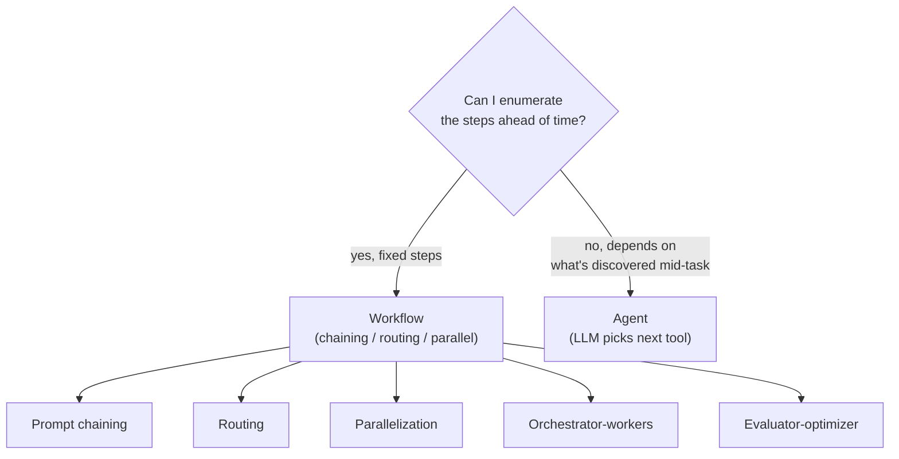
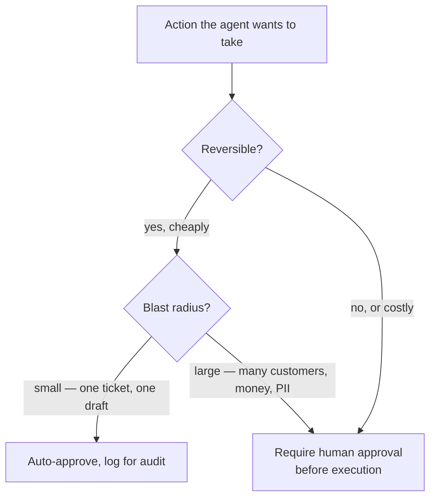

# 19 · Orchestration: Workflows vs Agents, Multi-Agent, Human-in-the-Loop

> Not every problem needs an autonomous agent looping over tools — some need a fixed pipeline,
> some need a router, some need two models checking each other's work, and some need a human to
> click approve. This chapter is the decision framework: how much structure does *this* problem
> actually need, and where does a human have to stay in the loop.
> [← Part 4 · Agents](README.md) · prev: 18 · Context Engineering · next: [Part 5 · Production](../05-production/README.md)

> **Predict first (2 min).** Write your guesses: (1) Your support assistant currently sends every
> ticket through the same single prompt regardless of whether it's a billing question, a technical
> bug, or a refund request. What's the failure mode of that, concretely? (2) You're told "add a
> second agent to review the first agent's draft reply before sending." Is that automatically
> better, or can it make things worse — and under what condition? (3) A refund request for $8,000 on
> an account with 3 prior chargebacks comes in. Should the same code path handle it as a $12 refund
> on a clean account? What's the one property of the decision that should decide?

---

## Workflows vs agents: not the same thing, not a hierarchy

Anthropic's "Building Effective Agents" draws a distinction worth keeping precise, because the
industry blurs it constantly:

- A **workflow** is a system where the LLM calls happen along **predefined code paths** — you, the
  engineer, decided the control flow (this step, then that step, then this branch) and the LLM
  fills in each step's *content*.
- An **agent** is a system where the **LLM decides the control flow** — which tool to call next, how
  many steps, when to stop (Ch. 12–16's loop).

Neither is "more advanced" than the other. A workflow is *more structure, less autonomy*: predictable,
cheap to eval (you know what each step is supposed to do, so you can score it in isolation), cheap
to run (no wasted tool calls from the model exploring a bad path). An agent is *less structure, more
autonomy*: necessary when the number of steps or the right tool sequence genuinely can't be known
ahead of time. The engineering skill is picking the *least* autonomy that solves the problem —
"agent" is not the default; it's what you reach for when a workflow provably can't do the job.

---

## The five workflow patterns, each with the case where it's right

| Pattern | Shape | Right-sized use case | Wrong-sized use case (costume jewelry) |
|---|---|---|---|
| **Prompt chaining** | Step 1's output feeds step 2's input, in a fixed sequence, often with a gate between steps | Draft a reply, then a separate call checks it's under 200 words and has no PII before sending — each step has one job | Chaining 6 steps for a task one well-prompted call does fine; adds latency and 6× the failure surface for no accuracy gain |
| **Routing** | A classifier step sends the input down one of several fixed downstream paths | Ticket comes in → classify billing / technical / refund → each category gets its own specialized prompt and tools | Routing to 15 near-identical categories that all use the same prompt anyway — the classification step is pure overhead |
| **Parallelization** | Same input run through N independent calls simultaneously, then combined (sectioning) or voted (voting) | Draft 3 candidate replies to a sensitive complaint with different tones, pick the best by an evaluator; or run a content-policy check and a tone check simultaneously since neither needs the other's output | Parallelizing steps that are cheap sequentially and where the results depend on each other — you'll just pay for redundant work |
| **Orchestrator-workers** | A central LLM call breaks a task into subtasks, dispatches each to a worker call, synthesizes results | "Summarize this customer's full history across tickets, orders, and escalations" — orchestrator decides which sources are relevant *for this customer* and dispatches a worker per source | A task where the subtask breakdown never actually varies — that's just a fixed chain wearing an orchestrator costume |
| **Evaluator-optimizer** | Generator produces a draft; a separate evaluator call critiques it against explicit criteria; loop until it passes or a max-iteration cap | Draft reply → evaluator checks tone + policy compliance against a written rubric → regenerate if it fails, capped at 2 retries | Using an LLM evaluator for something a regex or a length check does deterministically and cheaper — reserve the loop for judgment calls, not string matching |

The thread through all five: each pattern buys a *specific* thing (parallelism, isolation,
critique) at a *specific* cost (latency, tokens, complexity). Pick the pattern whose thing you
actually need this turn — not the most sophisticated-sounding one.

---

## When multi-agent genuinely beats single-agent — and when it's costume jewelry

"Multi-agent" is orchestrator-workers or parallelization applied specifically to *agents* (Ch. 12's
tool-using loop) instead of plain LLM calls. It earns its complexity under two conditions:

- **Context isolation matters.** Ch. 18 showed a growing conversation degrades attention quality and
  costs money quadratically. If sub-task A's exploration (10 tool calls chasing a dead end) has
  zero relevance to sub-task B, giving each its own clean-context agent and combining only their
  final answers keeps both contexts small and high-signal. This is the same argument as Ch. 18's
  sub-agent mitigation tier, now framed as an orchestration choice.
- **The work is genuinely parallel and read-heavy.** Researching three unrelated customer accounts
  to compile a portfolio-risk report — each account's investigation doesn't depend on the others'
  findings. Three worker agents running concurrently against read-only tools finish in the time of
  one, with no shared-state risk because none of them write anything until the orchestrator
  combines results.

It's costume jewelry — complexity with no payoff — when:

- **The work is sequential.** Agent B needs agent A's output before it can start; you've just built
  a slower, harder-to-debug single agent split across a process boundary, paying inter-agent
  serialization cost for nothing.
- **They share mutable state.** Two agents both writing to the same ticket record, same order, same
  customer flag introduce race conditions and non-deterministic outcomes that are genuinely hard to
  eval (Part 2) and harder to reproduce when they misbehave. If two "agents" need to coordinate
  through shared state rather than through a return value, that's a sign they should be one agent,
  or the shared state should live behind a lock/queue a single writer owns.
- **You added a "reviewer agent" out of habit.** A second LLM call reviewing the first's output is
  only evaluator-optimizer (useful) if it checks against **explicit, written criteria**. A vague
  "does this look good?" second call adds latency and cost for a coin-flip's worth of extra
  reliability — and gives false confidence that something was "checked."

Answering prediction #2: adding a review agent *can* make things worse — if its criteria are vague,
you've added cost and latency for noise, and worse, a team will point to "we have a review step" as
evidence of safety that isn't actually there. An evaluator step is only as good as its rubric; eval
it the same way you'd eval the generator (Part 2).

---

## Human-in-the-loop: what's auto-approved vs queued

Some agent actions are cheap to undo if wrong (drafting a reply nobody's seen yet); some are not
(issuing a $2,000 refund, deleting a record, sending an email to a customer). The design question
isn't "should this agent have human oversight" (yes, always, somewhere) — it's **which specific
actions require a human before they execute, versus which can run and be reviewed after the fact.**

The criterion that actually decides this, cleanly: **reversibility × blast radius.**

Concretely for a refund-issuing agent:

| Action | Reversible? | Blast radius | Verdict |
|---|---|---|---|
| Draft a reply to review later | Yes, trivially (it's a draft) | One ticket | Auto-approve |
| Look up order status | Yes (read-only, no side effect) | None | Auto-approve |
| Refund ≤ $25, account in good standing | Cheap to reverse (small dollar, no chargeback history) | One customer, small $ | Auto-approve, log |
| Refund > $25 or account has prior disputes | Money movement, hard to claw back once processed | One customer, real $ | **Queue for human approval** |
| Escalate to human | The escalation itself is the safety valve | None (it *adds* a human) | Auto-approve — escalating is never the risky action |
| Close/delete a ticket record | Not cleanly reversible in most systems | One record, but permanent | **Queue for human approval** |

Notice the pattern isn't "refunds are always gated" — it's the *combination* of irreversibility and
size. A small refund on a clean account is closer to "draft a reply" in risk profile than to "wire
$8,000"; treating every refund identically either over-gates (humans review trivial $12 refunds,
approval queue becomes noise they rubber-stamp) or under-gates (a human-review process that exists
on paper but is too slow/annoying to actually use, so people bypass it).

**Making review fast** is what keeps a human-in-the-loop gate real instead of theater: a queued item
should show the agent's proposed action, its stated reasoning, and the one or two facts a human
needs to approve/reject in under 10 seconds (customer's account standing, refund amount, ticket
history) — not a raw transcript the reviewer has to reconstruct context from.

---

## Sometimes the right answer is no LLM at all

The last, least glamorous pattern: a rule ("refund requests from accounts flagged for fraud always
route to a human, full stop") doesn't need a classifier call, a routing agent, or an evaluator — a
plain `if` statement is faster, free, and has zero eval burden because its behavior is exhaustively
testable. The same discipline that picks "workflow over agent" when structure suffices also picks
"code over workflow" when the decision is genuinely deterministic. Reach for an LLM call for the
part of the problem that needs judgment over ambiguous natural language — route the deterministic
part around it entirely.

---

## Build it (60–90 min)

Extend the support-ticket assistant (Ch. 12–16) with a routing front, an evaluator-optimizer pass,
and a real approval queue.

1. **Add a routing step.** One classification call: given the ticket text, output
   `{"category": "billing" | "technical" | "refund"}`. Route to three prompts, each scoped to its
   category (the technical prompt gets debugging-oriented tools/examples; the refund prompt gets the
   refund policy and the approval-queue tool below; billing gets account/invoice tools).
2. **Add an evaluator-optimizer pass.** After the category-specific agent drafts a reply, one more
   call — the evaluator — checks it against a written rubric: *"Reject if: tone is curt or
   apologetic-to-the-point-of-liability; policy details are wrong or invented; refund amount stated
   doesn't match the account record. Otherwise approve."* On reject, regenerate once (cap at 2
   total attempts) with the evaluator's specific complaint fed back in.
3. **Build a real approval queue.** A JSONL file (`approval_queue.jsonl`) where the refund/escalation
   path appends `{"ticket_id", "action", "amount", "reasoning", "account_flags", "status": "pending"}`
   instead of executing directly. A tiny CLI (`approve.py list`, `approve.py approve <id>`,
   `approve.py reject <id> <reason>`) lets a human review and flip `status`. Only a human's
   `approve` actually triggers the refund/escalation side effect.
4. **Apply the reversibility × blast-radius table.** Wire refunds ≤ $25 on clean accounts to
   auto-approve-and-log; everything else to the queue. Log every auto-approved action to the same
   JSONL with `status: "auto_approved"` so the audit trail is complete either way.
5. **Eval routed vs unrouted.** Take your eval set from Part 2 (or build 15–20 labeled tickets across
   the three categories). Run it through (a) the original single-prompt Ch. 12 agent, (b) the routed
   + evaluator-optimizer pipeline. Score both against the same rubric (correct category-appropriate
   handling, no policy violations, tone). Report the two pass rates.
6. **Reconcile.** *"I predicted X (routing would/wouldn't measurably improve pass rate), the eval
   showed Y (actual numbers), because Z (specialized prompts per category caught what the general
   prompt missed on ___, or: the general prompt was already good enough and routing mainly added
   latency)."* Either outcome is a valid, useful finding — report the real number.

---

## Self-Check (close the doc, answer out loud)

1. Define "workflow" and "agent" precisely enough that a teammate could classify any system you
   show them in one sentence. Which one should you default to, and why?
2. For each of the five workflow patterns, give a one-sentence use case where it's right-sized and
   one where it's overkill.
3. State the two conditions under which multi-agent beats single-agent, and the two anti-patterns
   that make it costume jewelry. Classify your Build-it pipeline against both lists.
4. What single property decides whether an action needs human approval before executing, and how
   would you apply it to "send an apology email" vs "process a $500 refund" vs "delete a customer
   record"?
5. A team is proud that their refund agent "has a human-in-the-loop step." What two failure modes
   (from this chapter) could make that true on paper and false in practice?
6. Give an example from your own project where the right answer was a deterministic `if`, not an
   LLM call of any kind — and explain how you'd catch a teammate reaching for an LLM there by habit.
