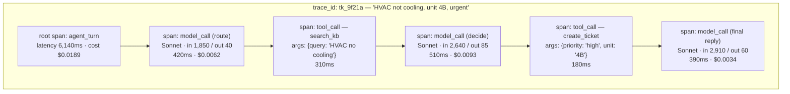
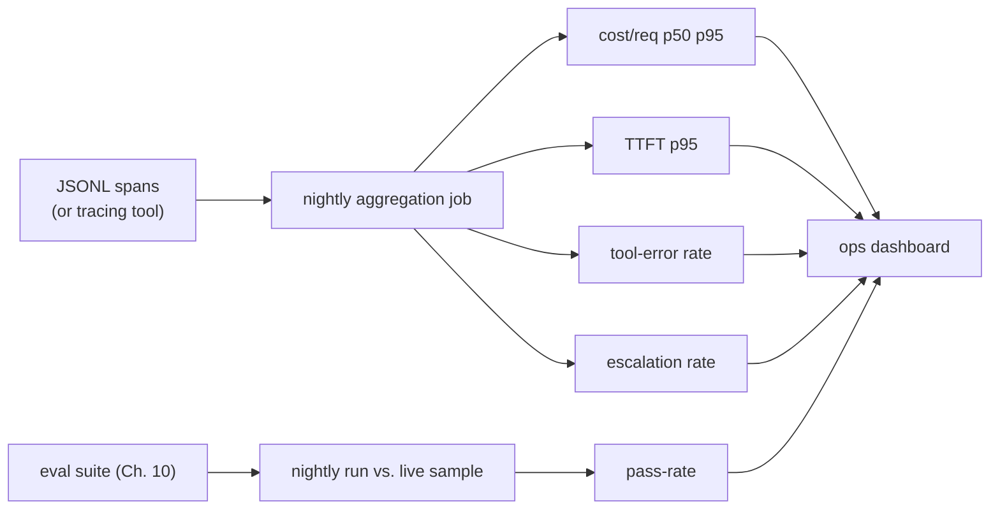

# 20 · Observability: Tracing Every Token

> What belongs in a trace for one agentic request, why the trace — not the log line, not the
> final answer — is the primary debugging artifact in this field, and how to turn 50 traces from
> your eval suite into a dashboard you'd actually trust on-call. This is the "read the traces"
> habit from Chapter 01 and Part 2, made concrete enough to build.
> [← Part 4 · Agents](../04-agents/README.md) · prev: [19 · Orchestration](../04-agents/19-orchestration-workflows-vs-agents-multi-agent-human-in-the-loop.md) · next: 21 · Security: Prompt Injection & Untrusted Input

> **Predict first (2 min).** Write your guesses: (1) Your ticket agent takes 6 seconds and calls
> two tools before answering. A user reports "it gave a wrong answer." What's the *minimum* set of
> fields you'd need captured to diagnose this without reproducing it live? (2) If you log only the
> final input/output pair per request (not each step), what class of bug becomes invisible? (3) You
> have 50 eval cases and want a single number that tells you "is this agent still healthy" every
> morning — what would you put on that dashboard?

---

## A log line is not a trace

Traditional backend logging gives you `INFO: request completed in 340ms, status 200`. That's
enough when the system inside the box is deterministic — you can read the code and know what
happened. An agent is not that box: the same input can take a different tool path on different
runs, and the thing that went wrong is usually buried three steps deep in a chain of model calls
and tool calls, each of which had its own prompt, its own output, its own latency, and its own
price. **A trace is the full, ordered record of everything the agent did to produce one answer** —
not a summary of it.

Concretely, for *one* agentic request, a trace needs, per step:

| Field | Why it's non-negotiable |
|---|---|
| `step_type` | `model_call` vs `tool_call` vs `retrieval` — you need to separate reasoning failures from execution failures |
| full prompt sent (`system` + `messages`) | the *exact* text, not a paraphrase — prompt bugs are invisible from "roughly what we sent" |
| full response (text + any `tool_use` blocks) | what the model actually decided, verbatim |
| tool name + `input` args | did the model call the right tool with the right arguments? |
| tool `output` / `is_error` | did the tool return what the model expected? |
| `usage.input_tokens` / `output_tokens` | ties every step to a dollar amount |
| `latency_ms` | ties every step to a wall-clock cost |
| `model` | which model handled this step (routers pick different models per step — Ch. 22) |
| `trace_id` + `parent_span_id` | lets you reconstruct the tree, not just a flat list |

Miss any of these and a whole failure class becomes undebuggable. If you don't capture the full
prompt, you can't tell "the model reasoned badly" from "we sent it the wrong retrieved document" —
which is exactly the retrieval-vs-grounding distinction the track's README uses as the example of
what an FDE-level diagnosis looks like.

---

## Spans and the trace tree

Borrow the vocabulary from distributed tracing (OpenTelemetry): a **trace** is the whole request; a
**span** is one step inside it; spans nest. An agent turn with two tool calls and a final answer is
three-plus spans under one root trace, and — critically — a RAG retrieval or a sub-agent call is
itself a span with children, not a leaf.



Every span carries the same fields as above, plus `parent_span_id` pointing at the span that
spawned it. This is what makes a 20-turn agent loop (Ch. 18's context problem) diagnosable at all:
without nesting you'd have 60+ flat log lines with no way to tell which model call caused which
tool call to fire.

---

## A real trace, as JSON

This is the shape you actually store — one JSON object per span, written as a JSONL line the
moment the span closes (not batched at the end, so a crash mid-request doesn't lose everything):

```json
{
  "trace_id": "tk_9f21a",
  "span_id": "sp_003",
  "parent_span_id": "sp_002",
  "span_type": "tool_call",
  "name": "create_ticket",
  "started_at": "2026-07-12T14:02:11.410Z",
  "ended_at": "2026-07-12T14:02:11.590Z",
  "latency_ms": 180,
  "input": {
    "priority": "high",
    "unit": "4B",
    "category": "hvac",
    "summary": "No cooling reported, unit 4B, tenant flagged urgent"
  },
  "output": {
    "ticket_id": "[REDACTED_TICKET_ID]",
    "status": "created"
  },
  "is_error": false,
  "metadata": {
    "eval_case_id": null,
    "model": null,
    "cost_usd": 0.0
  }
}
```

And the model-call span right before it, same trace:

```json
{
  "trace_id": "tk_9f21a",
  "span_id": "sp_002",
  "parent_span_id": "sp_001",
  "span_type": "model_call",
  "name": "decide_next_action",
  "model": "claude-sonnet-4-5",
  "started_at": "2026-07-12T14:02:10.780Z",
  "ended_at": "2026-07-12T14:02:11.290Z",
  "latency_ms": 510,
  "request": {
    "system": "You are a facilities ticket triage agent...",
    "messages": [
      {"role": "user", "content": "HVAC not cooling, unit 4B, urgent"},
      {"role": "assistant", "content": [{"type": "tool_use", "name": "search_kb", "input": {"query": "HVAC no cooling"}}]},
      {"role": "user", "content": [{"type": "tool_result", "content": "KB-042: check thermostat, then compressor..."}]}
    ]
  },
  "response": {
    "content": [
      {"type": "tool_use", "id": "toolu_01A", "name": "create_ticket",
       "input": {"priority": "high", "unit": "4B", "category": "hvac"}}
    ],
    "stop_reason": "tool_use"
  },
  "usage": {"input_tokens": 2640, "output_tokens": 85},
  "is_error": false,
  "metadata": {"eval_case_id": "evc_0187", "cost_usd": 0.0093}
}
```

Notice `metadata.eval_case_id` — this is the thread that links a live production trace back to
"which eval case does this look like," and lets you promote a real failure straight into your
regression suite (Ch. 10) instead of re-describing it from memory.

---

## Plain JSONL first, a tracing tool second

You do not need Langfuse or Braintrust to start. You need discipline: **every span, one JSON line,
appended to a file (or shipped to any log sink) the instant it closes.** That alone gets you 80% of
the value — grep-able, `jq`-able, cheap, and it teaches you what fields matter before you pay for a
tool that assumes you already know.

Reach for a dedicated tracing product (Langfuse, Braintrust, or your observability vendor's LLM
support) once you need what plain JSONL is bad at:

| Need | JSONL | Tracing tool |
|---|---|---|
| Nested trace tree view, click to expand | manual `jq` reconstruction | built-in UI |
| Tag traces by eval case / prompt version, filter/compare | write your own indexing | built-in |
| Score a trace with a judge and store the score next to it | your own glue | built-in "scores" API |
| Cost/latency aggregation dashboards | you build it | built-in |
| Team members other than you reading traces | rough | this is the actual reason to switch |

The migration path is not a rewrite: point the same span-emission code at the SDK instead of a
file, because you already defined the schema above.

---

## The ops dashboard for an LLM feature

A trace tells you about *one* request. A dashboard tells you whether the *feature* is healthy. Five
numbers, checked daily, cover most incidents before a user reports them:

| Metric | What it catches |
|---|---|
| **Cost per request** (p50/p95) | a prompt change or a routing bug quietly ballooning token usage |
| **p95 time-to-first-token (TTFT)** | prefill bloat — someone stuffed another 3k tokens into the system prompt |
| **Eval pass-rate on canary cases** | silent regressions — re-run your Ch. 10 suite against production traffic samples, nightly |
| **Tool-error rate** | a tool's schema drifted, an upstream API started rejecting a param, auth expired |
| **Escalation / human-handoff rate** | the agent quietly giving up more often — often the earliest signal of a distribution shift in incoming tickets |

None of these require a new system if you already have the spans: cost and latency come straight
off the fields in every span; tool-error rate is `count(is_error=true) / count(*)` grouped by tool
name; escalation rate is a query over your `hand_off_to_human` tool's call count. The eval pass-rate
line is the one genuinely new piece of infrastructure — it means running Ch. 10's suite against a
sample of *live* traces on a schedule, not just in CI.



---

## Build it (45–60 min)

1. **Instrument the agent from Chapter 15/19.** Wrap every model call and every tool call in a
   span-emitting function: capture `start`, `end`, full request, full response, `usage`, and write
   one JSON line per span to `traces.jsonl`. Use a shared `trace_id` for the whole agent turn and
   thread `parent_span_id` through your call stack (a simple context variable or explicit
   parameter both work).
2. **Run your 50-case eval suite** (Ch. 10) through the instrumented agent. You now have a real
   corpus of traces, one per case, each with an `eval_case_id` in its metadata.
3. **Build the per-stage breakdown.** Write a script that loads `traces.jsonl` and, grouped by
   `name` (span name — `route`, `search_kb`, `create_ticket`, `final_reply`, etc.), reports: count,
   mean and p95 latency, total and mean cost. This is the table that answers "which step is slow,
   which step is expensive" — and they are often *not* the same step.
4. **Pick the worst offender and explain it from the trace**, not from guessing: open the three
   slowest traces for that step and read the actual prompt/response. Is it prompt size (prefill),
   output length (decode), or a slow tool?
5. **The reconciliation habit:** *"I predicted step X would dominate cost/latency, the trace
   breakdown showed Y, because Z."*

---

## Self-Check (close the doc, answer out loud)

1. List the fields a trace needs for one agentic step, and explain what specific class of bug
   becomes undiagnosable if you drop the full prompt/response and keep only a summary.
2. What's the difference between a trace and a span, and why does an agent's tool call need to be
   its own span rather than a field on the model-call span?
3. You have plain JSONL logging today. Give two concrete signs it's time to adopt a dedicated
   tracing tool, and one thing that tool will *not* solve for you.
4. Design the five-metric ops dashboard for a feature you're not familiar with (say, a resume
   screener). What would "tool-error rate" and "escalation rate" even mean there?
5. Your p95 TTFT doubled overnight with no code deploy. Walk the diagnosis from dashboard metric to
   root cause using only the trace fields from this chapter.
6. A teammate says "we don't need eval pass-rate on the dashboard, CI already runs the eval suite
   before every deploy." What production failure mode does CI-only eval miss?
