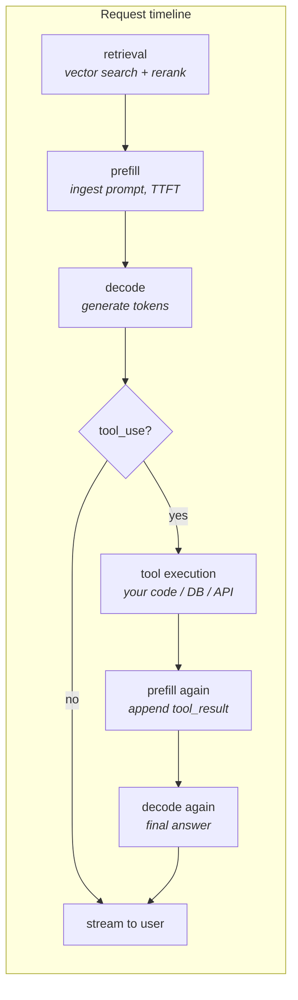

# 22 · Cost, Latency & Model Selection at Scale

> Where the seconds and the dollars actually go in an agentic request, which lever fixes which, and
> how to turn "can we use a cheaper model here?" from a guess into an eval-backed engineering
> decision. This is Chapter 04's token math and Chapter 01's prefill/decode split, scaled to a real
> production pipeline.
> [← Part 5 · Production](README.md) · prev: 21 · Prompt Injection & Untrusted Input · next: 23 ·
> Shipping: Deployment Patterns & the Java/Spring Angle

> **Predict first (2 min).** Write your guesses: (1) In a 4-step agent turn (route → retrieve →
> generate → tool call), which step do you think burns the most wall-clock time, and is it the same
> step that burns the most money? (2) If you swap your cheapest, highest-volume pipeline step from
> Sonnet to Haiku, what's the *minimum* evidence you'd want before shipping it? (3) Your ticket
> agent costs $1,400/month at 100k tickets. What does it cost at 10M tickets/month, and does
> anything about the *system* — not just the bill — break first?

---

## Latency is not one number — it's a sum of phases

"The agent is slow" is not a diagnosis. A single agentic turn for the support-ticket assistant
touches at least four different kinds of latency, and each has a different physical cause and a
different fix:



| Phase | What's happening | Typical magnitude | What moves it |
|---|---|---|---|
| Retrieval | embed query, vector search, (optional) rerank | 50–300 ms | smaller index, skip rerank for easy queries, cache embeddings |
| Prefill (TTFT) | ingest prompt tokens in parallel, compute-bound (Ch. 01) | grows with prompt size | prompt caching, shrink system prompt, trim history |
| Decode | sequential token-by-token generation | ~30–100 tok/s, linear in output length | shorter `max_tokens`, smaller model, stop sequences |
| Tool execution | your code, a DB call, an external API | 10 ms (in-memory lookup) to 2–5 s (slow downstream API) | timeouts, parallel tool calls, caching tool results |
| Round trips | every extra agent turn re-prefills the *entire* growing conversation | compounds with turn count | fewer turns, compaction (Ch. 18), summarize instead of re-send |

The trap: engineers instinctively optimize decode ("make the model write less") because it's the
part they can see streaming. In a tool-heavy agent, the dominant cost is often **prefill run
repeatedly** — every tool round trip re-sends the system prompt, the tool definitions, and the
growing history, and re-prefills all of it. A 3-tool-call turn isn't 1 prefill, it's 3 (or 4, with
the final answer).

### The lever table (memorize this)

| Symptom | Root cause | Lever |
|---|---|---|
| Slow to start responding, every turn | large/uncached system prompt, big history | prompt caching (Ch. 09), trim history, compaction (Ch. 18) |
| Slow to start, only on first turn | cold cache, huge one-off context (e.g. new document) | nothing to do but shrink it or accept it |
| Slow to finish | long `max_tokens`, verbose output format | cap output length, ask for terser format, smaller model |
| Slow overall, tool-heavy | sequential tool calls that don't depend on each other | issue independent tool calls in parallel (one turn, multiple `tool_use` blocks) |
| Slow overall, multi-turn agent | conversation re-prefilled every turn | cache the stable prefix, summarize old turns instead of keeping them verbatim |
| Fast per-call but slow in aggregate | serialized retries, no connection pooling, rate-limit backoff | concurrency limits sized to your rate-limit budget (below) |

Streaming (Ch. 08) doesn't reduce total latency — it reduces *perceived* latency by moving the
first byte earlier and letting the user read while decode continues. For a human waiting on an
answer, that's often the whole win. For a machine-to-machine call (agent calling agent, or a
downstream service waiting on the full JSON), streaming buys nothing — you still block on the last
token.

---

## Model selection is an engineering decision, not a vibe

"Just use Sonnet everywhere" and "just use Haiku everywhere" are both anti-patterns. The right
question per pipeline step is: **what's the hardest reasoning this step actually does, and does a
cheaper model clear that bar at the accuracy the eval requires?**

Steps that are frequently over-provisioned with a large model:

- **Routing / classification** — "is this billing, technical, or refunds?" is a closed-set label
  over a short input. This is squarely in small-model territory.
- **Extraction** — pulling `order_id`, `customer_name`, `urgency` out of an email into a fixed
  schema. Structured, low-creativity, well-specified — another good candidate.
- **Simple tool-arg construction** — turning "check on order 88213" into
  `{"tool": "lookup_order_status", "order_id": "88213"}`.

Steps that usually need the larger model:

- **Drafting the customer-facing reply** — tone, policy nuance, handling ambiguous or emotionally
  charged emails. This is where small models visibly degrade first.
- **Multi-step planning** — deciding *which* tools to call and in what order when the path isn't
  obvious.
- **Judging** (Ch. 11) — an LLM-as-judge grading another model's output is itself a reasoning task;
  demoting the judge silently degrades your eval's trustworthiness, which is worse than a bad
  production answer because you stop *seeing* the degradation.

The only acceptable proof that a downgrade is safe is the eval you already built in Week 3 (Ch. 10):
run the *same* eval slice through both models, compare pass-rate, and only ship the swap if the
delta is inside noise. "It looked fine in three manual tries" is not evidence — Chapter 10 already
covered why (run count, confidence).

---

## Worked example: per-stage cost and latency for the ticket agent

Same running project as Ch. 01 and Ch. 04, now broken out by pipeline stage for one ticket, at
illustrative Sonnet pricing (**$3/MTok in, $15/MTok out** — verify against the live pricing page)
and illustrative Haiku pricing (**$0.80/MTok in, $4/MTok out**):

| Stage | Model | Input tok | Output tok | Cost | Latency (p50) |
|---|---|---|---|---|---|
| 1. Route (billing/technical/refunds) | Sonnet | 1,800 (sys+email) | 15 (`{"route":"technical"}`) | $0.0056 | ~600 ms |
| 2. Retrieve (search_help_center) | — (embedding model + vector DB) | — | — | ~$0.00002 | ~150 ms |
| 3. Generate draft_reply + tool call | Sonnet | 3,200 (sys+email+3 docs) | 350 | $0.0149 | ~4.5 s |
| 4. Execute lookup_order_status | — (your code) | — | — | ~$0 | ~80 ms |
| 5. Final answer (append tool_result) | Sonnet | 3,650 (grows: history + result) | 180 | $0.0138 | ~2.6 s |
| **Total** | | | | **$0.0343/ticket** | **~7.9 s** |

```
× 100,000 tickets/month  ≈ $3,430/month,  ~220 hours of cumulative wait time
```

Now swap stage 1 (routing) from Sonnet to Haiku:

| Stage | Model | Input tok | Output tok | Cost | Latency (p50) |
|---|---|---|---|---|---|
| 1. Route | **Haiku** | 1,800 | 15 | **$0.0015** | **~200 ms** |

```
per-ticket savings:  $0.0056 − $0.0015 = $0.0041
× 100,000 tickets/month                ≈ $410/month saved
latency saved on stage 1:  ~400 ms/ticket × 100,000 ≈ 11+ hours/month of cumulative wait shaved
```

$410/month looks small next to the $3,430 total — because routing was never the expensive stage.
That's the point: **the win from downgrading a step is bounded by how much that step already cost.**
Downgrading the *generation* stage (3,200 in / 350 out) would save far more per ticket
(≈$0.011, ~3x the routing saving) — but that's also the stage most likely to lose accuracy, which
is exactly why you don't guess; you eval it (below).

---

## Capacity, throughput, and rate-limit budgeting

Cost per ticket tells you the bill. It doesn't tell you whether you can *serve* the volume. Two
numbers matter:

- **Tokens-per-minute (TPM) and requests-per-minute (RPM) limits** on your API tier. A step that
  costs $0.03 and takes 8 seconds serialized caps your throughput at ~7.5 tickets/minute per
  concurrent worker, regardless of budget.
- **Concurrency, not just rate**: 100,000 tickets/month ≈ 2,300/day ≈ ~1.6/minute on average — trivial
  — but *bursty* arrival (a Monday-morning spike) can 10x that instantaneously. Budget for p99
  arrival rate, not average, or you'll queue behind 429s exactly when it matters most.

```
avg:  100,000 tickets / 30 days / 1,440 min ≈ 2.3 tickets/min
p99 burst (10x avg): ~23 tickets/min → at 3 model calls/ticket ≈ 69 RPM, ~250k TPM
```

Check that against your actual tier limits *before* a customer finds the gap. The fix menu is the
same one from Ch. 08: exponential backoff with jitter, a request queue with bounded concurrency, and
— if you're consistently near the ceiling — batching (Ch. 09) for anything that isn't
latency-sensitive (nightly re-classification of a backlog, not live tickets).

---

## The "what does this cost at 100x" question

Every review of an LLM feature should end with this question, answered with real math, not a
shrug:

```
Current:     100,000 tickets/month × $0.0343       ≈ $3,430/month
At 100x:  10,000,000 tickets/month × $0.0343        ≈ $343,000/month
```

At that point, things that were rounding errors become the headline:

1. **The static system prompt (1,800+ input tokens, repeated every stage) dominates the input
   bill** — exactly the Ch. 01 lesson, now at a scale where prompt caching (Ch. 09) isn't an
   optimization, it's the difference between a viable feature and a canceled one.
2. **Model selection stops being a nice-to-have.** A 5% cost reduction per ticket is $17k/month at
   100x — worth a real eval investment, not a five-minute prompt tweak.
3. **Rate limits become an architecture constraint**, not a footnote — you may need enterprise
   rate-limit agreements, request batching, or horizontal fan-out across API keys/regions.
4. **The eval suite must scale too** — you can't manually spot-check your way through a
   10M/month feature; canary sampling and automated pass-rate monitoring (Ch. 20) become
   load-bearing, not optional.

This is the question a Forward Deployed Engineer is expected to answer live, in the room, with a
customer watching (Part 6) — practice doing the arithmetic without a calculator.

---

## Prove it (40–60 min)

1. **Instrument every stage.** Using your Week 9 tracing (Ch. 20), pull 50 real traces of your
   agent and produce the per-stage cost/latency table above from *actual* `usage` fields and
   wall-clock timestamps, not estimates. Identify your single most expensive stage and your single
   slowest stage — confirm or refute your Predict-first guess.
2. **Run the routing swap for real.** Downgrade the routing step to a Haiku-class model. Run your
   Week 3 eval suite (Ch. 10) on both versions, at least 3 runs each. Report: pass-rate delta,
   cost delta, latency delta. If the pass-rate holds within your noise threshold, ship it. If it
   drops, write down *which eval cases* broke and why — usually an ambiguous ticket the smaller
   model routes wrong.
3. **Do the 100x math on your own project.** Take your real per-ticket cost, multiply by 100, and
   identify the first thing that breaks that *isn't* the model bill — rate limits, database
   connections, human-review queue capacity.
4. **The reconciliation sentence.** *"I predicted X, the eval showed Y, because Z."* — write it for
   the routing swap specifically.

---

## Self-Check (close the doc, answer out loud)

1. Name the four+ distinct sources of latency in one agentic turn and, for each, the lever that
   actually moves it. Which one does streaming *not* help?
2. Why can a tool-heavy agent be dominated by "repeated prefill" rather than decode, even though
   decode is the part users watch stream?
3. What is the minimum evidence required before downgrading a pipeline step to a cheaper model?
   Why isn't "I tried it a few times and it looked fine" sufficient (tie back to Ch. 10)?
4. Walk through why the routing-step downgrade saved less money than downgrading the generation
   step would — and why you still might choose to eval the generation step more cautiously.
5. Your feature costs $3,430/month at 100k tickets. Someone proposes rolling it out to 100x volume
   unchanged. Name three things that break before the model bill becomes unaffordable.
6. A teammate says "just always use the biggest model, tokens are cheap." Give the counter-argument
   in cost *and* latency terms, with the routing-step numbers as evidence.
