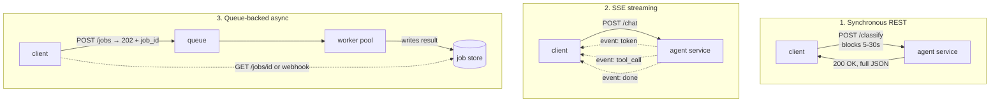
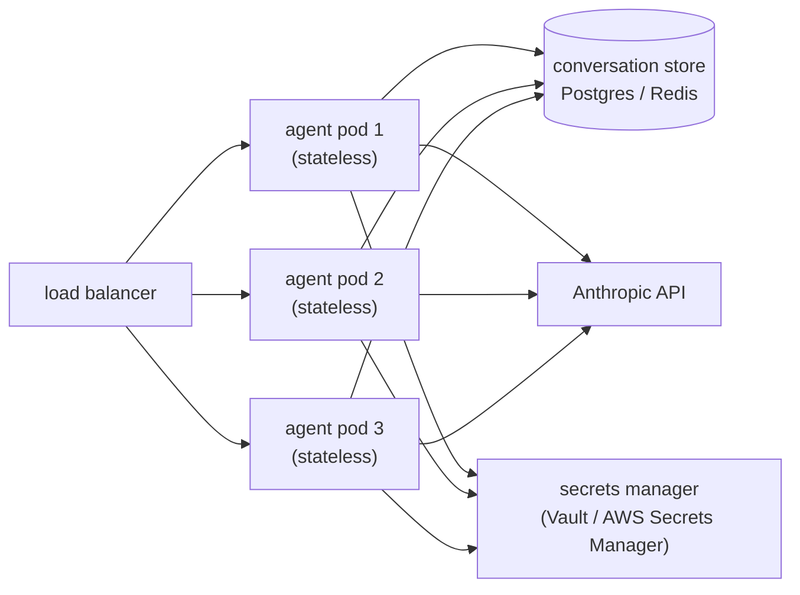
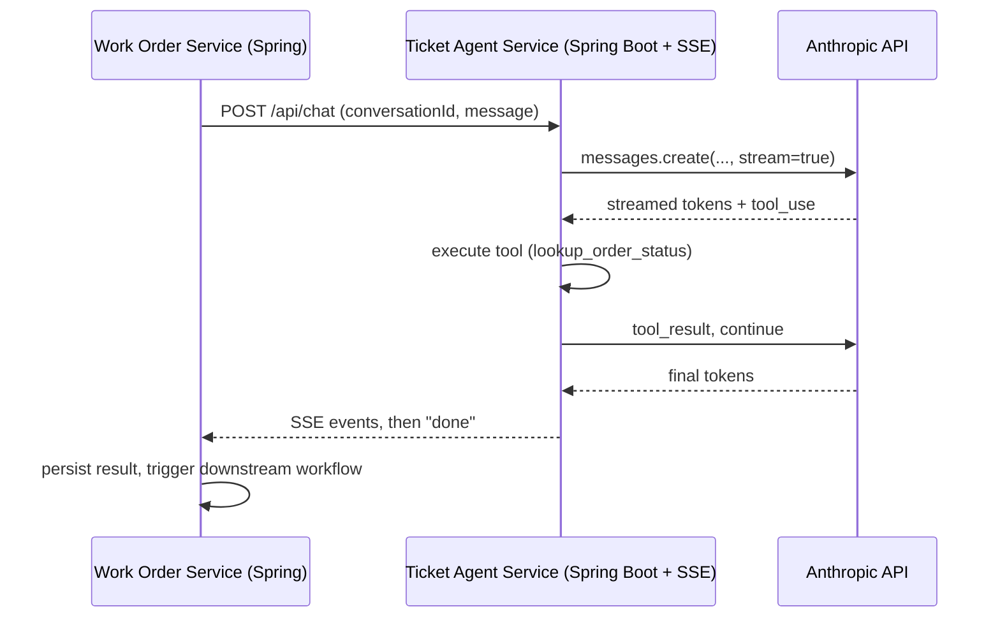

# 23 · Shipping: Deployment Patterns & the Java/Spring Angle

> How an agent actually gets exposed to the world — sync REST, SSE streaming, or queue-backed async
> — where it lives in your architecture, and why a Java/Spring background (most of you reading this)
> is an unfair advantage: most enterprises running this agent in production are Spring shops.
> [← Part 5 · Production](README.md) · prev: 22 · Cost, Latency & Model Selection at Scale ·
> next: [Part 6 · The Forward Deployed Engineer](../06-forward-deployed-engineer/README.md)

> **Predict first (2 min).** Write your guesses: (1) Your agent takes 8 seconds end-to-end with 2
> tool calls. A product manager wants it exposed as a plain synchronous `POST /tickets/classify`
> that a web frontend calls directly. What breaks first at real traffic? (2) Where does
> "conversation state" live if your agent service has to scale to 10 pods behind a load balancer?
> (3) Spring AI gives you a `ChatClient` abstraction over the raw HTTP calls you've been making by
> hand all track. What does that abstraction hide, and is hiding it always a win?

---

## Three ways to expose an agent, and when each fits

An agent is, mechanically, a loop of API calls with growing latency and unpredictable duration
(Ch. 15, Ch. 22). That shape doesn't fit cleanly into a naive "request comes in, response goes
out" web handler — you have to *choose* how to expose it.



| Pattern | Fits when | Breaks when | Client complexity |
|---|---|---|---|
| **Sync REST** | single short call, no tools, or a hard SLA under ~2–3s | multi-turn tool loops, unpredictable duration, any risk of gateway/load-balancer timeout (most default to 30–60s) | lowest — just await the response |
| **SSE streaming** | interactive UI, a human is watching, perceived latency matters (Ch. 22) | machine-to-machine calls that need the whole payload anyway; some corporate proxies buffer or kill long-lived connections | medium — client must consume an event stream |
| **Queue-backed async** | long-running or bursty work, batch reclassification, anything that must survive the caller disconnecting | requires a job store + polling/webhook, adds infra, wrong choice for a live chat UI | highest, but most robust |

The decision isn't aesthetic — it follows from the numbers in Ch. 22. A 3-tool-call agent turn at
~8s p50 (and a heavier tail when a downstream API is slow) will intermittently exceed most default
gateway timeouts under sync REST. That's not a bug you can code around — it's the shape of the
workload telling you to either stream (so the connection stays "alive" with real bytes flowing) or
go async (so the client isn't holding a connection open at all).

A common production pattern: **SSE for the interactive path** (a support agent chatting with the
assistant live) **and queue-backed async for batch/background work** (nightly reclassification of
a backlog, bulk escalation sweeps) — same agent code, two front doors.

---

## Where the agent lives, and why it must be stateless

The agent process itself should hold **no session state in memory**. Two reasons:

1. **Horizontal scaling.** If pod A holds turn 1–3 of a conversation in a local variable and the
   load balancer routes turn 4 to pod B, the conversation is gone. Every request must be able to
   land on *any* instance.
2. **Recoverability.** If the process restarts mid-conversation (deploy, crash, autoscale-down),
   an in-memory conversation is unrecoverable; an externalized one just resumes.

The fix is the same one you already know from any stateless backend service: **push state to a
store, keep the process pure.**



- **Conversation/memory state** (message history, tool results, compaction summaries from Ch. 18)
  is a row in Postgres or a Redis key, keyed by `conversation_id` — not a Python/Java list living
  in the request handler's memory.
- **Secrets** (the Anthropic API key, downstream API credentials) come from a secrets manager
  (Vault, AWS Secrets Manager, or your platform's equivalent) injected as an env var or fetched at
  startup — never hardcoded, never logged. The same key management discipline you'd apply to a
  database password applies here, with one addition: an exposed LLM API key is a *metered* credential
  someone else can spend against your bill.
- **Per-tenant isolation** matters more here than in a typical CRUD service, because a leak isn't
  just "wrong row returned" — it's one customer's help-center content or ticket history bleeding
  into another's context window. Enforce it at the data-access layer (tenant-scoped queries for
  RAG retrieval, tenant-scoped tool credentials) so a prompt-injection attempt (Ch. 21) can't reach
  across tenants even if it manipulates the model into trying.

---

## The Java/Spring angle: this is your unfair advantage

Most enterprises adopting agentic AI are not rewriting their stack in Python — they're bolting an
agent onto an existing Java/Spring estate. If you came up through `java/` and `spring-boot/` in this
curriculum, you already know the pieces; this section is where they connect.

### Exposing the agent from Spring Boot

A synchronous endpoint is exactly what you've built a hundred times:

```java
@RestController
@RequestMapping("/api/tickets")
public class TicketAgentController {

    private final TicketAgentService agentService;

    @PostMapping("/{ticketId}/classify")
    public ResponseEntity<TicketClassification> classify(@PathVariable String ticketId,
                                                           @RequestBody TicketRequest request) {
        // blocks until the full agent turn completes — fine only if you've
        // bounded worst-case latency (Ch. 22) below your gateway timeout
        return ResponseEntity.ok(agentService.classify(ticketId, request));
    }
}
```

SSE streaming is where Spring's servlet stack needs a deliberate choice. On the classic Spring MVC
(servlet) stack, `SseEmitter` works but ties up a request thread per open connection — fine at
modest concurrency, a real limit past a few hundred simultaneous streams. **Spring WebFlux**
(reactive, non-blocking) is the better fit for high-concurrency streaming, because it doesn't block
a thread per connection:

```java
@RestController
public class TicketChatController {

    @PostMapping(value = "/api/chat", produces = MediaType.TEXT_EVENT_STREAM_VALUE)
    public Flux<ServerSentEvent<String>> chat(@RequestBody ChatRequest request) {
        return agentClient.streamTurn(request.conversationId(), request.message())
            .map(event -> ServerSentEvent.builder(event.payload())
                .event(event.type())   // "token" | "tool_call" | "done"
                .build());
    }
}
```

This maps directly onto the raw SSE parsing you did by hand in Ch. 08 — WebFlux's `Flux<T>` is
just a typed, backpressure-aware version of the same event stream, wired into Spring's non-blocking
I/O instead of a thread-per-request model.

### Spring AI: where it helps, where it hides too much

**Spring AI** provides a `ChatClient` abstraction and tool/function callback support so you don't
hand-roll HTTP calls to the Messages API from Java:

```java
String reply = chatClient.prompt()
    .system(ticketSystemPrompt)
    .user(customerEmail)
    .tools(new LookupOrderStatusTool(), new SearchHelpCenterTool())
    .call()
    .content();
```

- **Where it helps:** boilerplate you don't want to re-write per project — request/response
  serialization, provider-agnostic client config (swap Anthropic for another provider via config,
  not code changes), Spring-idiomatic dependency injection of tools as `@Component` beans, and
  built-in retry/observability hooks that plug into Spring's existing Actuator/Micrometer stack.
- **Where it hides too much:** the abstraction can quietly obscure exactly the things this track
  spent 21 chapters teaching you to control deliberately — the precise token cost of a tool
  definition, whether prompt caching (Ch. 09) is actually being applied to your system prompt,
  what the raw `tool_use`/`tool_result` blocks look like on the wire, and where retries vs. timeouts
  vs. streaming errors (Ch. 08) are actually being handled. Treat Spring AI the way you'd treat an
  ORM: use it to move faster once you understand the raw layer underneath, and drop to the raw
  HTTP client when you need to see or control something the abstraction papers over — e.g.
  confirming a cache hit from `usage.cache_read_input_tokens`, or implementing a compaction strategy
  (Ch. 18) that the abstraction doesn't expose a hook for.

### Calling the agent from existing services

In most Spring shops, the agent isn't the front door — it's a capability an *existing* service
calls. A claims-processing service, a work-order system, or an internal ops tool calls into the
agent service the same way it calls any other internal microservice: a typed client, a circuit
breaker (Resilience4j — you've seen this in `../../spring-boot/`), and a timeout budget sized from
the Ch. 22 latency numbers, not guessed.



For architecture-level decisions about where this service sits (gateway placement, circuit
breakers, timeout budgets, service boundaries) see `../../HLD/`; for the Spring-specific plumbing
(WebFlux, Resilience4j, Actuator) see `../../spring-boot/`.

---

## Build it (45–60 min)

1. **Stand up the synchronous endpoint.** Wrap your ticket agent (Python or TS from earlier weeks,
   or a Java port) behind a Spring Boot `@RestController` with a single `POST /api/tickets/classify`
   endpoint. Measure real p50/p95 latency and compare against your platform's default gateway
   timeout — flag whether sync REST is actually safe here.
2. **Add SSE streaming.** Build a second endpoint using `Flux<ServerSentEvent<>>` (WebFlux) that
   streams tokens as they arrive from the Anthropic API. Confirm in a browser or `curl -N` that
   tokens appear incrementally, not all at once at the end.
3. **Build the approval queue as a real endpoint.** Take the JSONL-file approval queue from Ch. 19
   (Week 8) and expose it properly: `POST /api/approvals` (agent enqueues an action needing human
   sign-off), `GET /api/approvals/pending`, `POST /api/approvals/{id}/approve|reject`. Back it with
   a real table, not a file, and make the agent's `escalate_to_human` / refund tool call this
   endpoint instead of writing to disk.
4. **Externalize conversation state.** Move conversation history out of any in-memory map into
   Postgres or Redis, keyed by `conversation_id`. Kill and restart the service mid-conversation and
   confirm the next turn resumes correctly.
5. **The reconciliation sentence.** *"I predicted X about [sync REST / SSE / the state model], the
   real behavior was Y, because Z."*

---

## Self-Check (close the doc, answer out loud)

1. Given a described workload (turn count, tool calls, expected latency), pick sync REST vs SSE vs
   queue-backed async and justify it against gateway timeouts and client complexity.
2. Why must the agent process be stateless, and where does conversation state actually live instead?
   What breaks if you get this wrong under horizontal scaling?
3. Walk through exposing your agent via Spring WebFlux `SseEmitter`/`Flux` vs classic Spring MVC —
   what's the concrete difference in how connections consume threads, and when does it matter?
4. Name two things Spring AI's `ChatClient` abstraction genuinely saves you, and two things it can
   hide that you specifically need visibility into for a production agent (tie to Ch. 08 and Ch. 09).
5. Design the trust boundary for per-tenant isolation in a multi-tenant deployment of this agent —
   where do you enforce it, and why is "the prompt tells it not to mix tenants" not a defense
   (tie back to Ch. 21)?
6. A colleague on an existing Spring team asks "why not just call the Anthropic API directly from
   our monolith?" Give the case for a separate agent service — and the honest case against it, for
   a team of two.
