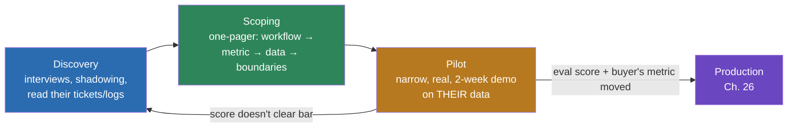

# 24 · Discovery & Scoping: Finding the Workflow Worth Automating

> How to find the workflow worth automating, run a discovery call that surfaces it, and write a
> POC one-pager narrow enough to demo in two weeks but real enough that success is undeniable.
> The trap this chapter exists to prevent: solutioning before you understand the workflow.
> [← Part 5 · Production](../05-production/README.md) · [Part 6 index](README.md) · next: 25 · The Demo-Driven POC

> **Predict first (2 min).** Write your guesses: (1) A VP tells you "just put AI on everything" —
> what three questions do you ask before writing a line of code? (2) Two workflows: one is 200
> tickets/month with a 15-minute review each; the other is 40,000 tickets/month with a 90-second
> triage each. Which do you pick first, and why isn't "which one impresses more" the right test?
> (3) Why does building the eval set come *before* building the agent, even in week one?

---

## The trap: solutioning before understanding

Every AI engineer who has shipped an agent walks into their first customer conversation wanting to
talk about architecture — RAG vs fine-tuning, which model, which framework. The customer wants to
talk about a queue of angry emails that never gets shorter. **The single most common way FDE
engagements fail is skipping straight to "here's what I'll build" before establishing "here's the
workflow, here's what it costs today, here's how we'll know it worked."** Discovery is the
unglamorous 20% of the job that determines whether the other 80% matters to anyone.

The instinct to fight: you are not there to demonstrate that you know agentic AI. You are there to
find the most expensive, most tolerable-to-automate, most measurable pain the organization has —
and only *then* decide what to build.



Note the loop back: a pilot that doesn't clear the bar isn't a failure, it's a return to discovery
with better information — usually "we scoped the wrong workflow," not "the model isn't good
enough."

---

## What makes a workflow worth automating

Score every candidate workflow against four filters, in order. A workflow that fails any one of
the first three isn't ready, regardless of how good your agent is:

| Filter | Question | Why it gates |
|---|---|---|
| **Volume** | Does this happen often enough that a percentage-point improvement is real money/hours? | 20 cases/month means even 100% automation saves an afternoon. Not worth a pilot. |
| **Text-heavy** | Is the input/output mostly unstructured text (emails, tickets, chat, documents)? | This is the substrate LLMs are actually good at. Numeric optimization or rigid rule-following isn't. |
| **Rule-describable** | Can a competent human explain the decision in a paragraph, even if it's fuzzy? | If your best human expert says "I just know," you have a research problem, not an engineering one. |
| **Tolerable error cost** | Is a wrong answer a "human notices and fixes it" event, or a "wire the wrong $2M" event? | Sets your automation ceiling: full auto vs draft-and-review vs advisory-only (Ch. 19's approval-queue pattern). |

The filter people skip: **the customer's own top-3 pain list, not your tech preferences.** You
will be tempted to pick the workflow that's the most interesting RAG or agent problem. The
customer doesn't care. Ask "if you could wave a wand and fix three things about how your team
spends its day, what are they" — and build against *that* list, ranked by *their* priority, not
yours. A support-ticket triage system that saves 30 minutes/day per agent across 40 agents is a
better first project than an impressive multi-agent research pipeline nobody asked for.

---

## The discovery call: an actual question list

Run this as a working session with the people who *do* the workflow today, not just their manager.
Managers describe the process as documented; the people doing it describe the process as it
actually runs, exceptions and all — and the exceptions are where your eval set comes from.

**Volume & cost (get numbers, not impressions):**
1. How many of these come in per day/week/month? Is that growing?
2. How long does one take a competent person, start to finish?
3. What does the org pay for that time today (headcount, contractor cost, overtime)?
4. What happens when volume spikes — does quality drop, does a queue build, does someone burn out?

**The workflow itself:**
5. Walk me through the last one you did, screen by screen, decision by decision.
6. Where do you go for information you don't already have memorized? (This tells you your RAG
   corpus and tool list — Ch. 12, Ch. 16.)
7. What's the most common mistake a *new hire* makes on this task? (This tells you the hard cases —
   put them in the eval set.)
8. What's an example that broke the "normal" pattern completely? (Edge cases the customer already
   knows about — gold for the eval set, and a preview of what will embarrass you in the demo if you
   don't handle it.)

**Success & risk:**
9. How do you *currently* know if this was done well? Is there a metric already tracked (CSAT,
   resolution time, error rate, escalation rate)? — **anchor your success metric to this, not a
   new one you invent.**
10. What's the cost of a wrong answer here — annoyed customer, redone work, compliance exposure,
    money moved?
11. Who has to sign off before this goes live, and what would make them say no?
12. If this worked perfectly, what would you do with the time it freed up? (If the honest answer
    is "nothing, we'd still staff the same," you've found a workflow with no economic buyer —
    keep looking.)

**Data & access:**
13. Can I get 50–100 real (or realistically anonymized) examples of this task, including the messy
    ones?
14. Where does this data live today, and who can grant access to it?

---

## Writing the POC one-pager

The one-pager is the contract for what "done" means before either side has invested real time.
Five sections, always in this order:

```
POC ONE-PAGER — Support Ticket Triage & Draft Reply

1. CURRENT WORKFLOW
   Support agents (12 FTE) manually read each incoming ticket, classify it
   (category, urgency), look up order/asset status in the internal system,
   and draft a reply. Average handle time: 6.5 min/ticket. Volume: ~14,000
   tickets/month. Backlog during peak (Mon AM, post-storm) regularly exceeds
   200 tickets, driving next-business-day SLA misses.

2. PROPOSED
   An agent reads the incoming ticket, classifies category + urgency,
   looks up relevant order/asset status via existing internal API, and
   produces a draft reply + confidence flag. A human reviews and sends
   (no auto-send in the pilot). Ambiguous or high-risk tickets
   (urgency = high, or classifier confidence < 0.7) are flagged for
   priority human handling rather than drafted.

3. SUCCESS METRIC
   Primary (tied to a metric they already track): average handle time
   per ticket drops from 6.5 min to ≤ 4 min for tickets the agent drafts,
   measured over a 2-week pilot on live (or shadow) traffic, WITHOUT a
   drop in the existing CSAT score (currently 4.2/5).
   Secondary (our eval, reported alongside): ≥85% category-accuracy and
   ≥90% urgency-accuracy against a 50-case hand-labeled eval set; 0
   fabricated order/asset facts (checked against tool ground truth).

4. DATA NEEDED
   - 100 real, anonymized historical tickets (mixed categories/urgencies)
     for the eval set — including 10 "hard mode" cases the team already
     considers tricky.
   - Read access (sandboxed/staging) to the order-status lookup API.
   - The current help-center/knowledge-base articles (for RAG, if scoped
     into phase 2 — not required for this pilot).

5. OUT OF SCOPE (this pilot)
   - Auto-sending replies without human review.
   - Refund/credit-issuing actions of any kind.
   - Non-English tickets.
   - Any ticket flagged urgency = high (routed to human immediately,
     unchanged from today).
   - Any change to the ticketing system's UI — draft is inserted as a
     comment/suggestion field.
```

Every section earns its place: (1) proves you understood the workflow before proposing anything;
(2) is deliberately narrow — one clear behavior change, not a platform; (3) is a number the buyer
*already reports upward*, so the pilot's win is automatically legible to their leadership, plus
your own eval score as the mechanism-level evidence; (4) is a request you can actually get in two
weeks, not "give us everything"; (5) is the section that saves the engagement — write down what
you are explicitly *not* doing, in writing, before anyone can assume you were.

---

## Scoping narrow enough, real enough

The tension: narrow enough to build and demo credibly in ~2 weeks, but real enough that a skeptical
stakeholder can't wave the result away as a toy. The resolution is to narrow the *scope of action*,
not the *reality of the data*:

- **Narrow the action, not the data.** "Draft, don't send" is a narrower scope than "auto-reply,"
  but it still runs on 100 real tickets, not 10 cherry-picked ones.
- **Narrow the ticket population, not the difficulty.** "Only billing-category tickets in the
  pilot" is fine. "Only the easy ones" defeats the purpose — the eval set must include the hard
  cases from question 7/8 above, or the pilot proves nothing.
- **Narrow the integration surface, not the workflow correctness.** Reading from a staging copy of
  the order-status API is fine for a pilot; giving the agent write access to production billing is
  not (that's Ch. 26's territory, gated behind trust you haven't earned yet).

If you can't hit two weeks with a real, if reduced, slice of the actual problem, the scope is still
too big — cut the ticket population or the action surface further, don't cut corners on data
realism.

---

## Do it

Run this against a real domain — your own company's support/ops queue, a friend's small business,
or a public dataset (e.g., a public complaints/tickets dataset) if you have no other access. Do
not open an editor until step 3 is done.

1. **Pick one workflow.** Score it against the four filters (volume, text-heavy, rule-describable,
   tolerable error cost). Write one sentence per filter — if you can't, you don't understand the
   workflow yet, go back and ask more questions.
2. **Run a discovery conversation** (with a real person if you can, with your own research/reading
   of the domain if you can't) using the question list above. Write down the actual numbers —
   volume, current handle time, current success metric — don't estimate them.
3. **Write the one-pager**, all five sections, using the template above as the shape. The success
   metric MUST be something the buyer already tracks (or a proxy one hop away from it) — inventing
   a metric nobody asked for is a scoping smell.
4. **Collect or construct 50–100 real examples** of the workflow's input, including the hard cases
   the domain experts already know about.
5. **Build the eval set from those examples BEFORE writing any agent code** — expected
   category/urgency/output for each, per the Ch. 10 eval-suite format. This ordering is the whole
   point of the chapter: you cannot know if you built the right thing until you've defined "right"
   from the customer's own examples, and doing that after the agent exists means you'll
   unconsciously write an eval set the agent already passes.
6. **Reconcile out loud:** "I predicted the hardest part would be X, discovery showed it was
   actually Y, because Z." (Common Z: the hardest part is rarely the model — it's a messy edge case
   the domain experts consider routine, or a metric that turns out to be tracked differently than
   you assumed.)

---

## Self-Check (close the doc, answer out loud)

1. Name the four filters for "is this workflow worth automating," and give a workflow that fails
   each one individually.
2. Why does the success metric in the one-pager have to be something the buyer *already tracks*,
   rather than a new metric you propose?
3. A stakeholder says "just automate everything, AI can do anything now." What three questions do
   you ask before agreeing to scope anything?
4. Explain, to a skeptical engineer, why the eval set has to be built from the customer's real
   examples *before* the agent is built, not after.
5. Give an example of narrowing a pilot's *scope of action* while keeping the *data* real — and
   contrast it with a narrowing that would secretly gut the pilot's credibility.
6. Your one-pager's "out of scope" section gets challenged in the kickoff meeting: "why can't it
   also handle refunds?" What's your answer, and how does it connect to error-cost tolerance?
