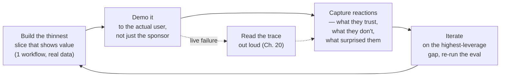

# 25 · The Demo-Driven POC: From First Meeting to Working Pilot

> Why FDEs build and demo against the customer's own data from day one, how to run the
> demo-driven iteration loop, and what to do — deliberately, calmly — when the agent fails
> live in the room.
> [← Part 6 index](README.md) · prev: 24 · Discovery & Scoping · next: 26 · POC → Production

> **Predict first (2 min).** Write your guesses: (1) Why would a demo on synthetic, cleaned-up
> sample data actually *hurt* your credibility more than help it? (2) The agent gives a wrong
> answer live in front of the VP. What are the two worst things you could do in the next 10
> seconds, and what's the one thing that turns it into a trust-building moment instead? (3) What's
> the difference between a demo that closes a deal and a "science-fair" demo?

---

## Demo with their data, always

The single highest-leverage decision in the whole POC phase: **never demo on synthetic or
cherry-picked data if you can possibly get real data instead.** Three reasons, in order of how
often they bite people who skip this:

1. **Their data has their weirdness in it** — the abbreviations their team uses, the way their
   tickets actually get worded, the edge cases their process has accreted. A demo on clean sample
   data proves your agent can handle clean sample data. Nobody in the room is buying that.
2. **Credibility compounds.** The moment someone in the room recognizes an *actual* ticket ("oh,
   that's the one from the Riverside account") the demo stops being a pitch and starts being
   evidence. That recognition is worth more than any slide.
3. **It's the only way you find real failure modes before the customer does.** Synthetic data is
   generated by *your* mental model of the problem; it can't surprise you. Real data surprises you
   in exactly the ways that matter — which is uncomfortable in week one and is precisely why you
   want it in week one, not in production.

This is why Chapter 24's discovery step insists on getting 50–100 real examples *before* any code
is written — the demo-driven loop below only works if there's real data to iterate against from
the first cycle.

---

## The demo-driven delivery loop

FDE delivery is not "build the whole thing, then show it." It is a tight loop, usually daily or
every few days, of showing *something real* and letting reactions steer the next slice of work:

"Thinnest slice that shows value" is doing real work in that diagram. For the ticket assistant,
the first demo is not the full pipeline — it's often just "here's the model reading 10 of *your*
real tickets and classifying them correctly," shown before RAG, before tools, before the approval
queue exist. That's a 2-day build, not a 2-week one, and it buys you the single most valuable
thing in a new engagement: an early, low-risk *yes, keep going* from the room.

Two traps this loop prevents:

- **The all-at-once build.** If you disappear for two weeks and come back with the "finished"
  pilot, you've made every design decision without customer feedback, and you find out about
  wrong assumptions at the worst possible time — the final demo.
- **Demoing only to the sponsor.** The VP who greenlit the project is not the person who will
  actually use it. Demo to the support agents, the ops coordinators, the people in the workflow —
  their reactions ("it would never catch that this ticket is actually two issues") are the ones
  that catch real gaps; sponsors mostly react to the vibe.

---

## When the agent fails live in the meeting

It will happen. The tool call times out, the model hallucinates a policy, the classifier gets an
edge case wrong in front of the one person in the room who'd immediately notice. Your response in
the next ten seconds sets the tone for the rest of the engagement.

**What not to do:**
- Don't apologize profusely and try to hide it (re-run silently, change the input, move on
  quickly) — the room noticed, and now they've also noticed you flinched.
- Don't claim it's a fluke without evidence — "huh, that's weird, let me just try again" with no
  explanation reads as *you don't understand your own system*, which is a worse signal than the
  failure itself.

**What to do — turn it into the tracing habit from Chapter 20, live:**
1. Say what you're about to do out loud: "Let's look at exactly what happened — I log every model
   call and tool call for this reason."
2. Open the actual trace. Show the input the model saw, the tool calls it made, the output it
   produced.
3. Narrate the diagnosis in plain language: "The ticket mentioned two issues in one email — our
   classifier is tuned for single-issue tickets, so it picked the first one and missed the second.
   That's a real gap, and here's exactly where it lives."
4. State what you'd do about it, concretely: "I'd add multi-issue tickets as a labeled slice in
   the eval set and either split them into sub-tickets before classification or explicitly prompt
   the model to enumerate every issue it sees. I can have that change evaluated by tomorrow."

This sequence converts a live failure from "the demo broke" into "this person has complete,
instrumented visibility into their own system and a plan in under a minute" — which is a stronger
trust signal than a clean run, because a clean run never proves you *could* diagnose a failure if
one happened. It is the single best argument for building tracing (Ch. 20) before you ever demo
anything.

---

## Managing expectations: show the scorecard, not the highlight reel

The temptation after a good week is to demo only the cases that went well. Resist it — for the
same reason a green test suite you cherry-picked is worthless (Ch. 10). Every demo past the first
should include the eval scorecard, not just live wins:

| Slice | n | Pass rate | Notes |
|---|---|---|---|
| Category classification | 50 | 88% | 3 misses all in "multi-issue" tickets (known gap, see above) |
| Urgency classification | 50 | 94% | — |
| Draft reply — faithfulness (no fabricated facts) | 50 | 100% | grounded via `lookup_order_status` tool, verified against ground truth |
| Draft reply — tone/policy (LLM judge, spot-checked) | 50 | 82% pass | judge–human agreement 91% on 20-case audit |
| Escalation routing correct | 50 | 96% | 2 misses, both borderline-urgency, escalated anyway per the "flag on low confidence" rule |

Showing the misses alongside the wins, with a plan for each, is what separates a **demo that
closes** from a **science-fair demo**:

| | Science-fair demo | Demo that closes |
|---|---|---|
| Data | Cherry-picked or synthetic, chosen to look good | The customer's real, messy data, unfiltered |
| Framing | "Look what it can do" | "Here's the score, here's what's still wrong, here's the fix plan" |
| Failure handling | Hidden or explained away | Shown, diagnosed live, tied to a concrete next step |
| What it proves | The demo works | The *system* — including you — can be trusted to run in production |
| Audience reaction | Impressed, then skeptical on reflection ("but what about my weird cases?") | Already answered "what about my weird cases," because those were in the eval set |

**Speed as trust.** The other lever alongside the scorecard: how fast you turn a reaction into a
measured change. "You mentioned yesterday it missed multi-issue tickets — I added 8 of those to
the eval set overnight, here's the score before and after a one-line prompt fix" said at the start
of the next demo does more for trust than any slide. It demonstrates the eval-first loop is real,
not decoration — the same "I changed X, the score moved from A to B, because Z" sentence from the
rest of the track, now said to a buyer instead of a rubber duck.

---

## Demo runbook / checklist

Run through this before every customer-facing demo, not just the final one:

- [ ] Data is the customer's real (or realistically shadowed) data — not synthetic, not
      cherry-picked.
- [ ] Eval suite has been re-run since the last change; scorecard is printed/ready to share, not
      just described from memory.
- [ ] At least one known failure case is queued to show intentionally, with its trace and its
      fix-plan ready — don't leave live failure entirely to chance.
- [ ] Tracing/logging is on and you can pull up a trace in under 15 seconds — rehearse this.
- [ ] You know, before the meeting starts, the one metric from the one-pager (Ch. 24) that this
      demo is meant to move, and you say it out loud at the start: "today I'm showing progress on
      [X]."
- [ ] The audience includes at least one person who actually does the workflow today, not only the
      sponsor.
- [ ] "Out of scope" items from the one-pager are still out of scope — don't improvise new
      capabilities live to impress; improvised, unevaluated behavior is exactly what erodes trust
      later.
- [ ] You have a one-sentence answer ready for "what happens when this is wrong" — pointing at the
      approval/review step (Ch. 19), not at "it usually isn't."

---

## Build it

This is the capstone build — the running project from the rest of the track, pointed at the real
domain you scoped in Chapter 24.

1. **Build the thinnest slice** that demonstrates value on the real data from your one-pager —
   likely just classification + draft reply on 10–20 real examples, no RAG or tools yet if those
   weren't in scope for week one.
2. **Demo it to yourself as if to the stakeholder**, out loud, timing it — 5 minutes covering the
   metric from the one-pager, the live agent running on real input, and the eval scorecard.
3. **Deliberately include one failure-and-diagnosis moment.** Pick (or wait for) a real case the
   agent gets wrong, and rehearse narrating the trace: what the model saw, what it did, why, and
   what the fix would be. Do not skip this — it is the single most FDE-specific skill in this
   chapter and it does not develop by accident.
4. **Record it** (even just screen + voice). Watch it back once. Cut anything that isn't the
   metric, the live run, the scorecard, or the failure-and-diagnosis moment.
5. **Reconcile out loud:** "I predicted the failure moment would feel bad to include, the recording
   showed [X], because [Z]" — most people find, on watching it back, that the diagnosis moment is
   the strongest 90 seconds of the demo, not the weakest.

---

## Self-Check (close the doc, answer out loud)

1. Give the three reasons demoing on the customer's real data beats synthetic data, in your own
   words.
2. Walk the demo-driven delivery loop from memory — what's the "thinnest slice," and why does the
   loop run in days, not weeks?
3. The agent fails live. Narrate, out loud, the exact sequence you'd follow in the next 60 seconds.
4. What's the difference between a demo that closes and a science-fair demo — name at least three
   axes.
5. Why does showing the eval scorecard (including the misses) build more trust than showing only
   wins, even though it feels riskier in the moment?
6. A stakeholder, impressed, asks you to add a capability live that wasn't in the one-pager's
   scope. What do you say, and why does saying yes on the spot actually hurt you?
