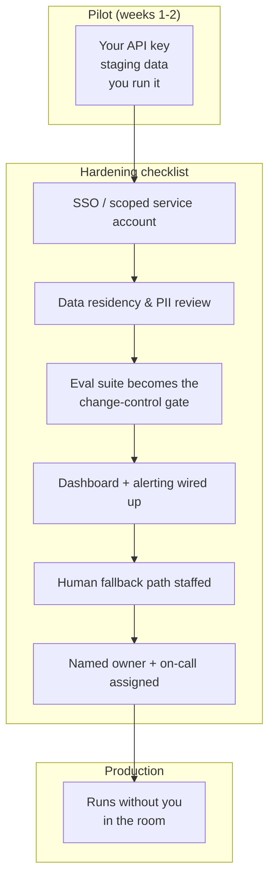

# 26 · POC → Production: Enterprise Integration, Trust & Handoff

> What actually changes between a working pilot and a production system nobody's afraid of:
> access control, compliance, eval-gated changes, monitoring, a human fallback, and — the
> question every pilot eventually gets asked — who owns this after you leave.
> [← Part 6 index](README.md) · prev: 25 · The Demo-Driven POC · next: back to the [track README](../README.md)

> **Predict first (2 min).** Write your guesses: (1) Your pilot ran on your laptop with your own
> API key against a staging copy of their data. Name three things that have to change before it
> touches production customer data — before reading the "what changes" table. (2) A CISO asks
> "what happens when this is compromised." What's the honest, specific answer for an agent with
> tool access? (3) What's "pilot purgatory," and what causes it?

---

## What changes between pilot and production

A pilot proves the *idea* works. Production proves the *organization* can run it without you in
the room. The gap between them is not more model capability — it's the infrastructure and
ownership work around the model, most of which the pilot deliberately skipped to stay narrow (Ch.
24's "out of scope" section is exactly this list, deferred):

| Dimension | Pilot | Production |
|---|---|---|
| **Access control** | Your API key, staging data, you run it | SSO-integrated service account, scoped to least-privilege tool access (Ch. 21), audited per-request |
| **Data residency / compliance** | Whatever staging environment you were handed | Customer's actual data-residency requirements (region, retention, PII handling) — often the hard blocker, not the model |
| **Prompt/config changes** | You edit and re-run locally | **Eval-gated**: no prompt, tool, or model change ships without the eval suite re-running and clearing the bar — the eval suite *is* the change-control process |
| **Monitoring** | You watch the terminal | Dashboards + alerting on cost/req, p95 latency, eval pass-rate on a canary set, tool-error rate, escalation rate (Ch. 20, Ch. 22) |
| **Human fallback** | You are the fallback | A documented, staffed path: who gets paged, what queue fills up, what the SLA is when the agent can't proceed |
| **Ownership** | You | A named team/role on the customer's side — this is the question that most often gets skipped and most often kills the deal later |

Two of these deserve their own weight because they're where deals actually die.

**Eval-gated changes as the contract.** In a pilot, you can tweak a prompt and eyeball the next
five outputs. In production, that's how regressions ship silently. The rule: *no change reaches
production without the eval suite re-run and the score reported* — the same discipline from Ch.
10/11, now enforced as a gate, not a habit. This is also the answer to "what if your engineer
leaves and someone here has to change the prompt" — they can, safely, as long as they run the
suite and don't merge a regression. **The eval suite is what makes the system maintainable without
you.**

**Who owns it after you leave.** Every pilot that succeeds eventually asks this question, and if
you don't have an answer ready, the project stalls in "we love it, but nobody's assigned to run
it" — the definition of pilot purgatory (below). Decide and document, before the engagement ends:
who watches the dashboard, who gets paged when the escalation rate spikes, who has authority to
approve a prompt change, and who re-runs the eval suite against the next model release.



---

## The honest cost-at-scale conversation

Every buyer eventually asks "what does this cost at 100× volume?" — usually right before signing.
Answer it with live token math (Ch. 22), not a hand-wave. Extend the pilot's cost model:

```
Pilot: 500 tickets over 2 weeks, ~14,000 tickets/month at full volume (from the Ch. 24 one-pager)

Per-ticket cost today (measured, not estimated, from the pilot's actual usage logs):
  input:   2,650 tok × $3  / 1,000,000 = $0.00795   (cached system prompt ~90% cheaper after Ch. 09)
  output:    400 tok × $15 / 1,000,000 = $0.00600
                                per ticket ≈ $0.014

At 14,000 tickets/month:            ≈ $196/month
At 100× pilot volume (50,000/mo):   ≈ $700/month
Compare to: 12 FTE at 6.5 min/ticket saved down to ~1.5 min review each
            → ~40 hours/week of agent time reclaimed across the team
```

The honest version of this conversation has three parts, always: (1) the raw model cost, computed
from *measured* usage in the pilot, not guessed; (2) the fact that cost scales roughly linearly
with volume while the human-time saved scales with it too — so the ratio, not the raw number, is
the argument; (3) an explicit note on what could make the linear assumption wrong — a bigger
model needed for a harder ticket mix, a longer agent loop if scope grows, prompt caching hit-rate
assumptions. Never present the extrapolation as more certain than it is — say "measured at pilot
scale, projected linearly, re-verify at each order-of-magnitude milestone."

---

## Building trust with a skeptical enterprise

By the time you're talking production, security and compliance stakeholders are in the room, and
they are right to be skeptical — you're asking to connect a probabilistic system to real customer
data and real actions. The trust conversation draws directly on Chapter 21's security work:

- **Least-privilege tools, stated plainly.** "This agent can read order status and draft replies.
  It cannot issue refunds, cannot send email without human approval, cannot access any account
  outside the support-ticket domain." Precise negative claims land better than vague positive
  ones.
- **The injection eval results, not just a promise.** "We ran 10 prompt-injection attempts against
  this agent, including injections hidden in ticket bodies and in the knowledge-base articles it
  retrieves. Success rate before defenses: 6/10. After least-privilege tool scoping and output
  filtering: 0/10 for [these categories], 1/10 residual for [that category], mitigated by the
  human-approval gate on anything irreversible." This is a security *eval*, reported with numbers,
  same discipline as the accuracy eval.
- **The CISO's actual question, answered directly.** "What happens when this is fully
  compromised?" The honest answer is never "it can't be" — it's "here's the blast radius": no
  standing write access to production billing, no ability to email externally without approval,
  full audit trail of every tool call, and a kill switch that disables the agent without touching
  the underlying systems it integrates with. Detection is not the defense — containment is (Ch.
  21's core lesson, now said to a non-engineer).
- **The audit trail as the trust artifact.** Every request/tool-call/response logged (Ch. 20)
  means any disputed action has a complete, reviewable record — this alone answers a large
  fraction of enterprise objections, because it converts "trust the AI" into "trust the log,
  which you can read yourself."

---

## The handoff artifacts

Whatever you build, the engagement ends. What you leave behind determines whether the system
survives that transition:

1. **The runbook** — how to run it, restart it, roll back a bad deploy, rotate keys, what each
   config value does. Written for the person who inherits this, not for you.
2. **The eval suite** — the actual test cases, the runner, and the pass-rate history over time.
   This is the contract: *any future change must clear this bar.* Hand over the failing cases too,
   not just the passing ones — they're the known-gaps list.
3. **The dashboard** — cost/request, p95 latency, eval pass-rate on a rolling canary set,
   tool-error rate, escalation rate, all in one place someone checks without you.
4. **"When to page a human" rules** — a short, explicit document: which conditions route to a
   human today (confidence threshold, urgency flag, tool failure, injection-pattern match), what
   queue they land in, and what SLA applies. This is the human-fallback path made concrete and
   assignable.
5. **A named owner and escalation path** — who's on-call, who approves prompt changes, who
   re-evaluates against new model releases. Without a name attached, the other four artifacts rot.

---

## Avoiding pilot purgatory

**Pilot purgatory**: the pilot works, everyone likes it, and it never ships to production because
nobody owns the next ten decisions — who pays for the ongoing API cost, who's accountable when it's
wrong, whose security review it needs, whose roadmap it competes with for engineering time. It is
the single most common way a successful FDE engagement fails to convert into a lasting deployment,
and it is caused by *organizational* gaps, not technical ones.

The prevention is procedural, not technical, and it starts in Chapter 24, not here:

- The one-pager's success metric was tied to something a specific person already reports upward —
  that person has a reason to keep pushing after you leave.
- Ownership is assigned and named *before* the pilot ends, not discovered afterward — put it in
  the handoff artifacts explicitly, with a name, not a team name.
- The production hardening checklist (SSO, compliance, monitoring) is scoped and estimated
  *during* the pilot, not treated as a surprise "phase 2" nobody budgeted for.
- You leave a working, demonstrable system with numbers attached — pilot purgatory happens to
  vague wins ("people seem to like it"), rarely to a system with a scorecard and a dollar figure.

---

## Ship it

This is the capstone finish — the artifact you carry into FDE interviews. Complete it against the
real domain from Chapter 24/25, using everything built across the track.

1. **Working agent on real domain data** — the pilot from Ch. 25, with whatever RAG/tools/routing
   your scoped workflow actually needed (Parts 3–4).
2. **Eval suite with reported scores** — the full scorecard (Ch. 10/11), including known-gap
   cases, not just passing ones.
3. **Tracing dashboard** — cost/latency/pass-rate/escalation-rate visible in one place (Ch. 20,
   Ch. 22).
4. **Injection results** — your red-team attempts and the before/after mitigation numbers (Ch. 21).
5. **Approval flow** — the human-in-the-loop gate for anything irreversible (Ch. 19).
6. **A 10-minute recorded demo** — following the runbook from Ch. 25: metric stated up front, live
   run on real data, scorecard shown, one failure-and-diagnosis moment included deliberately.
7. **A one-page architecture doc** — the same shape as the Ch. 24 one-pager plus a system diagram:
   workflow → components → data flow → where humans sit in the loop → cost at current and 100×
   volume.

Package all seven together. This is the **portfolio artifact** — stronger evidence in an
interview than any certificate, because it's a working system with numbers, not a claim.

**The final ROADMAP checkpoint IS the FDE interview.** If you can deliver this out loud, cold, in
front of someone who's never seen it — the workflow, the live agent, a failure trace and its
diagnosis, the eval scorecard, the security story, and the production plan — you can do it in an
actual FDE interview, because that is a word-for-word description of what one is.

---

## Self-Check (close the doc, answer out loud)

1. Name the six things that change between pilot and production. Which one most often turns out
   to be the actual blocker, and why is it rarely the model?
2. Why does "the eval suite is the contract" matter more in production than in a pilot? What
   breaks if a teammate changes the prompt without re-running it?
3. A CISO asks what happens if the agent is fully compromised. Give the honest, specific,
   two-sentence answer — not "it can't be compromised."
4. Do the live token math: at $3/$15 per MTok, 3,000 input / 500 output tokens per request, what's
   the cost per request, and at 200,000 requests/month? What's the single biggest lever to cut it
   (link back to Ch. 09/22)?
5. Define pilot purgatory and name two concrete prevention steps that happen *during* the pilot,
   not after.
6. Someone hands you this chapter's five handoff artifacts for a system you've never seen. Which
   one would you read first to decide if you can safely change the prompt, and why?
