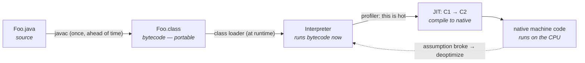

# 01 · The Java Platform & Execution Pipeline

> What actually happens between `javac` and a running method — the *two* compilers, the
> interpret-then-JIT model, and why "write once, run anywhere" is a property of the *runtime*, not the
> language. This is the mental model the entire track rests on.
> [← Part 0 · The Platform & Mental Model](README.md) · next: 02 · The Class File & Bytecode

> **Predict first (2 min).** When you run `javac Foo.java`, do you get *native machine code*? When you
> then run `java Foo`, is the bytecode compiled to native code, interpreted, or both? Write your
> guesses — most people get the second one wrong.

---

## "Java" is two things wearing one name

Almost every confusion about the platform comes from conflating these:

- **The language** — what `javac` parses and type-checks, defined by the *Java Language Specification (JLS)*.
- **The platform (the JVM)** — what *loads, verifies, and executes* compiled bytecode, defined by the
  *JVM Specification (JVMS)*.

Between them sits a stable contract: **bytecode**. `javac` compiles your `.java` to `.class`
bytecode; the JVM runs the bytecode. Neither side knows or cares about the other's internals — which
is why **Kotlin, Scala, Clojure, and Groovy run on the JVM** (they emit the same bytecode), and why
the JVM can keep getting faster at running your *unchanged* `.class` files. Hold the
language/platform/bytecode split in your head and the rest of this curriculum becomes one coherent
story instead of a pile of facts.

### JDK vs JRE vs JVM

- **JVM** — the engine that executes bytecode (HotSpot is the common one).
- **JRE** — the JVM + the standard class library (enough to *run* apps). *(No longer shipped
  separately since Java 11; you build a runtime image with `jlink`.)*
- **JDK** — the JRE + development tools (`javac`, `javap`, `jcmd`, `jlink`, …). You develop against
  the JDK; you ship a runtime.

---

## The execution pipeline: two compilers, interpret-first

There are **two** compilers in Java, and confusing them is the classic mistake:

1. **`javac` — the *source* compiler.** Runs **ahead of time, once**, turning `.java` into portable
   **bytecode**. It does *almost no optimization* — it's a fairly literal translation.
2. **The JIT — the *runtime* compiler (C1/C2 inside the JVM).** Turns hot **bytecode into optimized
   native code** *while the program runs*.

> ▶ **Watch it:** [`pipeline.html`](visualizations/pipeline.html) — follow one method from source
> through javac, the class loader, the interpreter, the JIT, to native code — and a deopt back to the
> interpreter.

So the predictions, both answered:

- **`javac` does *not* produce native code** — it produces bytecode (an intermediate, portable form).
- **At runtime the JVM does *both*:** it **interprets** the bytecode immediately (instant startup, no
  compile cost), **profiles** it to find the hot ~10%, and **JIT-compiles only that** to native
  code — and can **deoptimize** (throw the native code away) if a speculative assumption breaks. The
  interpret-then-JIT loop is the heart of Parts 1–2 ([the JIT in depth](../02-execution-and-performance/)).

This is why Java "starts slow and gets fast": early on you're interpreting + compiling; once the hot
code is C2-compiled, you're at peak. It's also why benchmarks must *warm up* ([chapter 13](../02-execution-and-performance/)).

---

## "Write once, run anywhere" is a *runtime* fact

The portability isn't in the language or the compiler — it's that **every platform ships a JVM that
executes the same bytecode**. `javac` on your Mac and `javac` on Linux produce *identical* `.class`
files; the macOS JVM and the Linux JVM each turn that same bytecode into their own native
instructions at runtime. The bytecode is the portable artifact; the JIT is the per-platform
"finish the compilation" step. (The trade-off vs. an ahead-of-time-to-native language like Go: you
pay startup warmup and ship a JVM, but gain portability and the JIT's profile-guided peak — the
deployment tension [native image](../05-io-interop-deployment/) revisits.)

---

## Make it visible

- **See bytecode, not native.** `javac Foo.java` then `javap -c Foo` — you'll see *bytecode*
  mnemonics (`iload`, `invokevirtual`), not x86/ARM. That's the portable artifact. ([Chapter 02](README.md) reads it in depth.)
- **Watch the JIT kick in.** Run a hot loop with `java -XX:+PrintCompilation` and watch methods get
  compiled (and their tiers) *after* the program starts — proof that compilation is a *runtime* event.
- **Confirm the split.** `java -version` shows the JVM (e.g. "HotSpot 64-Bit Server VM"); that's the
  platform. The same `Foo.class` runs unchanged under a different vendor's JVM.

---

## Self-Check (close the doc, answer out loud)

1. Distinguish the *language* from the *platform*. What contract sits between them, and why does that
   let Kotlin run on the JVM?
2. JDK vs JRE vs JVM — what's in each, and which do you ship?
3. Name the two compilers in Java. What does each take as input and produce, and *when* does each run?
4. Does `javac` produce native code? At runtime, is bytecode interpreted or compiled?
5. Why does a Java app "start slow and get fast"? What does that imply for benchmarking?
6. In what concrete sense is "write once, run anywhere" a property of the runtime rather than the
   compiler?

> **Go deeper:** the JVMS §1–2 (overview); *The Well-Grounded Java Developer* on the platform; then
> [02 · The Class File & Bytecode](README.md) to open up that `.class` file.
