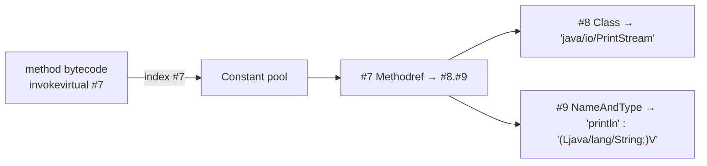

# 02 · The Class File & Bytecode

> What's actually inside a `.class` file, why the **constant pool** is its backbone, and how the JVM
> runs bytecode as a **stack machine** — the layer every "how does Java do X under the hood" question
> bottoms out in.
> [← Part 0 · The Platform & Mental Model](README.md) · prev: 01 · Platform & Pipeline · next: 03 · Class Loading

> **Predict first (2 min).** For `int f(int a,int b,int c){ return a + b*c; }`, how many *registers*
> does the bytecode use? Write the instruction sequence you think `javac` emits. (Trick question —
> there are no registers.)

---

## Anatomy of a `.class` file

A class file is a rigid binary format (JVMS §4), in order:

| Section | What |
|---|---|
| **magic** | `0xCAFEBABE` — "this is a class file" |
| **version** | minor/major (major 65 = Java 21) — the JVM rejects newer versions (`UnsupportedClassVersionError`) |
| **constant pool** | the file's **symbol table** (see below) — the largest part |
| **access flags** | `public`/`final`/`abstract`/`interface`… |
| **this / super / interfaces** | indices into the constant pool |
| **fields / methods** | each with name, **descriptor**, flags, and attributes (methods' `Code` attribute holds the bytecode) |
| **attributes** | `SourceFile`, `LineNumberTable`, `StackMapTable` (for fast verification), annotations, `BootstrapMethods` (for `invokedynamic`)… |

**Descriptors** encode types compactly: `I`=int, `Ljava/lang/String;`=String ref, `[I`=int[]; a method
`(II)I` takes two ints, returns int. `javac` output is portable across OS/CPU — this format *is* the
"write once" artifact ([chapter 01](README.md)).

---

## The constant pool — the symbol table

Almost every instruction and structure references the **constant pool** by index (`#7`), instead of
inlining values. It holds: UTF-8 strings, `int`/`long`/`float`/`double` literals, and **symbolic
references** — `Class`, `Fieldref`, `Methodref`, `InterfaceMethodref`, `NameAndType`, plus
`MethodHandle`/`InvokeDynamic` entries. Benefits: **deduplication** (one entry, many uses) and
**late binding** — references are *symbolic* (by name/descriptor) until **resolved** during linking
([chapter 03](README.md)), which is how the JVM links classes it wasn't compiled against.



So `System.out.println("hi")` isn't a hard-coded address — it's `invokevirtual #7`, and `#7` unfolds
(via the pool) into "the method `println(String)void` on class `PrintStream`," resolved at runtime.

---

## The JVM is a stack machine

Every method call gets a **frame** containing a **local variable array** (arguments + locals, by
index) and an **operand stack** (the scratchpad instructions compute on). **There are no registers**
in bytecode (unlike a real CPU or Dalvik) — instructions push operands, consume them, and push
results. That's the answer to the prediction: `f` uses **zero registers**; it loads locals onto the
operand stack and computes there.

`return a + b*c` compiles to (via `javap -c`):

```
iload_0   // push a          operand stack: [a]
iload_1   // push b          [a, b]
iload_2   // push c          [a, b, c]
imul      // pop c,b push b*c [a, b*c]
iadd      // pop b*c,a push + [a + b*c]
ireturn   // pop, return it   []
```

> ▶ **Watch it:** [`operand-stack.html`](visualizations/operand-stack.html) — step through
> `a + b*c` and watch each instruction push/pop the operand stack while the locals sit in their array.

Note **operator precedence became structure**: `imul` runs before `iadd` because `javac` ordered the
instructions that way — the bytecode is already "parsed."

---

## The instruction families (recognize, don't memorize)

- **Load/store** — locals ↔ stack: `iload`/`istore` (int), `aload`/`astore` (reference), `lload`… (typed).
- **Arithmetic/logic** — `iadd`, `imul`, `idiv`, `ishl`, … (type-prefixed).
- **Stack** — `dup`, `pop`, `swap`.
- **Control flow** — `if_icmpge`, `goto`, `tableswitch`/`lookupswitch`, `ireturn`/`areturn`/`return`.
- **Object/field** — `new`, `getfield`/`putfield` (instance), `getstatic`/`putstatic`.
- **Method invocation (the 5)** — `invokestatic` (static), `invokespecial` (constructors, `private`,
  `super`), `invokevirtual` (normal instance dispatch), `invokeinterface` (through an interface),
  **`invokedynamic`** (bootstrapped call site — powers **lambdas** and modern **string concatenation**).

### Verification
Before running, the **bytecode verifier** proves type safety and that the operand stack is balanced
and correctly typed at every point (using the `StackMapTable`). ⚡ this is why you can't hand-craft
malicious bytecode that corrupts the JVM — verification is the JVM's safety gate (Verify phase,
[chapter 03](README.md)).

---

## Make it visible

- **See it.** `javac Foo.java` then **`javap -c -p Foo`** (`-c` = code, `-p` = private members). Read
  the operand-stack instructions for a method you wrote.
- **The whole file.** `javap -v Foo` dumps the **constant pool**, versions, flags, descriptors, and
  the `StackMapTable` — the entire structure above, made concrete.
- **Predict, then check.** Guess the bytecode for a ternary, a `for` loop, `"a"+b` (⚡ modern javac
  emits `invokedynamic` to `StringConcatFactory`, not `StringBuilder` chains), and an `Integer i = 5`
  (autoboxing → `Integer.valueOf`). Reconcile every surprise — that's the syllabus.

---

## Self-Check (close the doc, answer out loud)

1. Name the top-level sections of a `.class` file. What does the magic number and version guard against?
2. What is the constant pool, and why do instructions reference it by index instead of inlining values?
   What does "symbolic reference" enable?
3. Why is the JVM a *stack* machine? Walk `a + b*c` through the operand stack.
4. Name the five `invoke*` instructions and what each is for. Which one powers lambdas and string concat?
5. What does the bytecode verifier check, and why does it make the platform safe?
6. What does `(Ljava/lang/String;)V` mean as a descriptor?

> **Go deeper:** JVMS §4 (class file) & §6 (instruction set); read `javap -v` on your own classes;
> then [03 · Class Loading, Linking & Initialization](README.md) — where those symbolic references
> get resolved.
