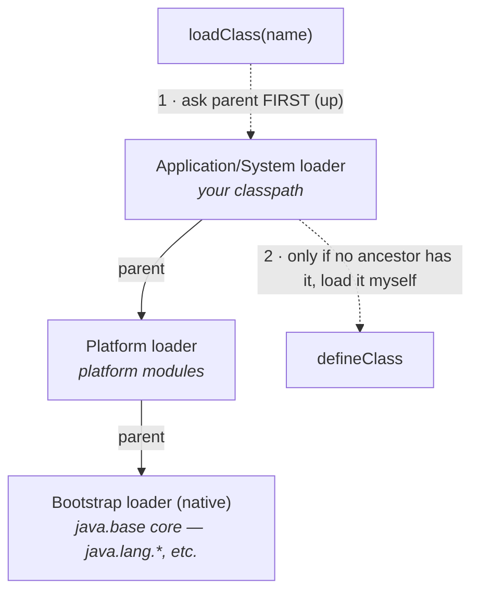

# 03 · Class Loading, Linking & Initialization

> The five-phase journey from "class referenced" to "class usable," the **parent-delegation** loader
> hierarchy that keeps the platform safe, and *exactly* when a class's static initializer runs.
> [← Part 0 · The Platform & Mental Model](README.md) · prev: 02 · Class File & Bytecode · next: 04 · Runtime Data Areas

> **Predict first (2 min).** `class A { static int x = compute(); }` — does `compute()` run when the
> JVM *loads* `A`, or later? And: can user code put a fake `java.lang.String` on the classpath and
> have the JVM use it? Write your guesses.

---

## The five phases

A class goes **Loading → Linking(Verify → Prepare → Resolve) → Initialization**:

| Phase | What happens |
|---|---|
| **Load** | find the `.class` bytes, create the `Class<?>` object in memory (via a classloader) |
| **Verify** | the **bytecode verifier** proves type-safety & stack balance ([chapter 02](README.md)) — the safety gate |
| **Prepare** | allocate static fields, set them to **default zero values** (`0`/`false`/`null`) — *not* your initializers yet |
| **Resolve** | turn **symbolic references** (constant-pool names) into **direct references** — can be **lazy** (on first use) |
| **Initialize** | run **`<clinit>`**: static initializer blocks + static field assignments, in textual order |

So the prediction: `compute()` runs in **Initialization** (`<clinit>`), **not** at Load. And Prepare
already set `x` to `0` first; Initialization overwrites it with `compute()`'s result. The gap between
Prepare (zero) and Initialize (real value) is a real source of subtle bugs.

### When does `<clinit>` run? (active use — lazy, on first touch)
- creating an instance (`new A()`), invoking a **static method**, reading/writing a **non-constant
  static field**, reflection (`Class.forName`), initializing a **subclass** (triggers superclass first),
  and the class containing `main`.
- ⚡ **NOT** triggered by: reading a **compile-time constant** (`static final` inlined at compile
  time), referencing the class only through an array type, or `Class.forName(name, false, cl)`.
- `<clinit>` runs **exactly once**, and the JVM holds an **initialization lock** — thread-safe by the
  spec. That guarantee is the whole basis of the **lazy-holder singleton** idiom.

---

## The classloader hierarchy & parent delegation

Three built-in loaders form a parent chain:

**Parent delegation:** when asked to load a class, a loader **first asks its parent** (recursively up
to Bootstrap); it loads the class itself **only if no ancestor could**. 

> ▶ **Watch it:** [`classloader-delegation.html`](visualizations/classloader-delegation.html) — a load
> request delegating up the chain, then loading at the right level; and a spoof attempt getting blocked.

That answers the second prediction: **no, you can't spoof `java.lang.String`.** A request for it
delegates up to the **Bootstrap** loader, which already has the real one and returns it — your
classpath's fake is never reached. Delegation buys two things: **security** (core classes come only
from the trusted loader) and **consistency** (one `String` type, no duplicates).

### Class identity = (loader, name)
A class's runtime identity is its **fully-qualified name *plus* the loader that defined it**. ⚡ The
*same* class name loaded by *two different* loaders yields **two incompatible types** — assigning one
to the other throws `ClassCastException`. This is a feature: it's how **app servers isolate
deployed apps** (each webapp gets its own loader, often **child-first** to prefer its own libs) and
how plugin systems, OSGi, and hot-reload work. You write a custom loader by extending `ClassLoader`
and calling `defineClass(name, bytes, …)`.

---

## The errors (know them cold)

- **`ClassNotFoundException`** — an *explicit* load (`Class.forName`, `loader.loadClass`) couldn't find
  the class. (A checked exception — someone asked by name.)
- **`NoClassDefFoundError`** — the class was present at *compile* time but is missing/failed to load at
  runtime (classpath problem, or its `<clinit>` previously failed).
- **`ExceptionInInitializerError`** — a `<clinit>` threw — the class is now permanently unusable in that loader.
- **`LinkageError`/`UnsupportedClassVersionError`** — verification/version/linkage failure.

---

## Make it visible

- **Who loads what.** Run with `-Xlog:class+load` (or `-verbose:class`) and watch each class load with
  the loader that defined it — you'll see `java.lang.*` from bootstrap, yours from the app loader.
- **Prove the lazy `<clinit>`.** Put a `System.out.println` in a static block; reference the class only
  via a `static final` constant → it *won't* print (constant inlined); call a static method → it prints.
- **Two loaders, two types.** Load the same class with two custom loaders and assign across → watch the
  `ClassCastException`. This is app-server isolation in miniature.

---

## Self-Check (close the doc, answer out loud)

1. List the five phases in order. What does Prepare do that Initialize then overrides?
2. Name four things that trigger `<clinit>` and two that don't. Why is `<clinit>` thread-safe?
3. Explain parent delegation. What two problems does it solve, and how does it block spoofing `String`?
4. What makes up a class's runtime identity, and what happens if two loaders load the same name?
5. When would you write a custom classloader? Name two real systems that rely on this.
6. `ClassNotFoundException` vs `NoClassDefFoundError` vs `ExceptionInInitializerError` — when each?

> **Go deeper:** JVMS §5 (Loading, Linking, Initializing); *The Well-Grounded Java Developer* on
> classloaders; then [04 · JVM Runtime Data Areas](README.md) — where loaded classes and their objects live.
