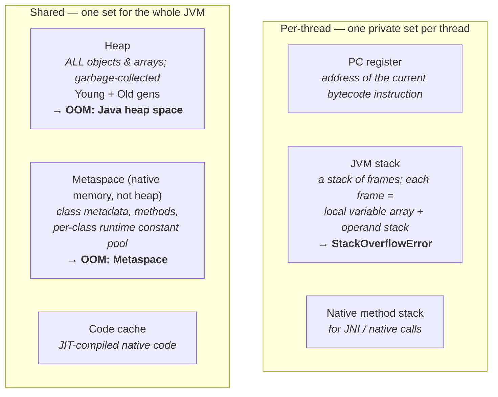

# 04 · JVM Runtime Data Areas

> The full memory map: what's **per-thread** vs **shared**, where every value in your program lives,
> and which region throws `StackOverflowError` vs which flavor of `OutOfMemoryError`. The capstone of
> Part 0 — it ties together where the bytecode, classes, and objects from ch. 01–03 actually reside.
> [← Part 0 · The Platform & Mental Model](README.md) · prev: 03 · Class Loading

> **Predict first (2 min).** For `void f(){ Order o = new Order(); }` — where does the *variable* `o`
> live, and where does the *object* it points to live? And which error do you get from infinite
> recursion vs. from allocating too many objects? Write your guesses.

---

## Two axes: per-thread vs shared

The JVM partitions memory into regions along one key axis — **who owns it**:

So the first prediction resolves cleanly: the **variable `o`** (a reference) lives in the current
method's **frame** on the **thread's JVM stack**; the **`Order` object** it points to lives on the
**shared heap**. Locals point *from* the stack *into* the heap — the fundamental split.

---

## Per-thread regions

- **PC register** — holds the address of the instruction currently executing (undefined during a
  native method). One per thread; how each thread tracks "where am I."
- **JVM stack** — a stack of **frames**, one pushed per method call, popped on return. Each frame
  holds a **local variable array** (arguments + locals by index; `this` is slot 0 for instance
  methods), an **operand stack** ([chapter 02](README.md)), and a reference to the runtime constant
  pool. Sizes with `-Xss`. Two failure modes:
  - **`StackOverflowError`** — the stack grows past its limit (deep/infinite recursion). ← the recursion prediction.
  - **`OutOfMemoryError: unable to create new native thread`** — no memory to allocate *another*
    thread's stack (too many threads). This is why "one thread = ~1 MB" matters at scale ([Part 3](../03-concurrency-and-jmm/)).
- **Native method stack** — the equivalent for native (JNI) code.

## Shared regions

- **Heap** — where **every object and array** lives, created by `new`, reclaimed by GC. Generational
  collectors split it into **Young** (Eden + Survivors) and **Old** ([Part 1](../01-memory-and-gc/)).
  Sized with `-Xms`/`-Xmx`. Exhaustion → **`OutOfMemoryError: Java heap space`** (the allocation
  prediction — a leak or an undersized heap). Note: the **interned string pool lives in the heap**
  (since Java 7 — it was in PermGen before).
- **Metaspace** — **class metadata**: the loaded `Klass` structures, method bytecode, field info, and
  each class's **runtime constant pool** (the loaded form of the `.class` constant pool from
  [chapter 02](README.md)). ⚡ It's in **native memory, not the heap** — it *replaced PermGen* in Java
  8. Grows dynamically (`-XX:MaxMetaspaceSize`); exhaustion → **`OutOfMemoryError: Metaspace`**, whose
  usual cause is a **classloader leak** (an app/classloader redeployed repeatedly, loading classes
  that never unload — common in app servers).
- **Code cache** — where the JIT stores compiled native code ([Part 2](../02-execution-and-performance/)).
  ⚡ if it fills (`-XX:ReservedCodeCacheSize`), the JIT stops compiling and the app silently degrades to interpreted.

### Off-heap / direct memory (the region people forget)
`DirectByteBuffer` and the Foreign Memory API allocate **native memory outside the heap** (great for
zero-copy I/O — [Part 5](../05-io-interop-deployment/)); it's bounded by `-XX:MaxDirectMemorySize` and
throws **`OutOfMemoryError: Direct buffer memory`**. So "the process is using far more RAM than
`-Xmx`" is normal: total footprint = heap + metaspace + thread stacks + code cache + direct/native
buffers + the JVM itself.

---

## The OOM taxonomy (recognize instantly)

| Message | Region | Usual cause |
|---|---|---|
| `StackOverflowError` | thread stack | deep/infinite recursion |
| `OutOfMemoryError: Java heap space` | heap | leak or undersized `-Xmx` |
| `OutOfMemoryError: Metaspace` | metaspace | classloader leak (classes never unload) |
| `OutOfMemoryError: unable to create new native thread` | native/OS | too many threads (stack memory) |
| `OutOfMemoryError: Direct buffer memory` | off-heap | leaked/unbounded direct buffers |

Reading the *exact* message tells you *which region* and therefore *which lever* — the fastest triage
a principal does. (Fixing the leak → [Part 5 · Diagnostics](../05-io-interop-deployment/).)

---

## Make it visible

- **Blow each region on purpose.** Infinite recursion → `StackOverflowError`; `new byte[1<<30]` in a
  loop with small `-Xmx` → heap OOM; generate classes in a loop (or redeploy) with a small
  `-XX:MaxMetaspaceSize` → Metaspace OOM. Reading each message once makes it instant in prod.
- **See total native footprint.** Enable **Native Memory Tracking** (`-XX:NativeMemoryTracking=summary`)
  and run `jcmd <pid> VM.native_memory summary` — it breaks down heap vs metaspace vs thread vs code
  vs internal, explaining "why is RSS ≫ `-Xmx`."
- **Watch stacks & heap live.** `jstack` dumps every thread's frames; `jmap -histo`/a heap dump shows
  what's on the heap.

---

## Self-Check (close the doc, answer out loud)

1. Which data areas are per-thread and which are shared? For `Order o = new Order();`, where does the
   reference live and where does the object live?
2. What's in a stack frame? Which two errors come from the JVM stack, and what causes each?
3. What is metaspace, what does it hold, how does it differ from the heap, and what replaced what in
   Java 8?
4. Where does the interned string pool live now (vs. before Java 7)?
5. Give the OOM message for: recursion, a memory leak, a classloader leak, too many threads.
6. Why is a JVM's total RSS usually larger than `-Xmx`, and how would you break the footprint down?

> **Go deeper:** JVMS §2.5 (runtime data areas); then **Part 0 is complete** — you can trace a program
> from source ([01](README.md)) to bytecode ([02](README.md)), through loading ([03](README.md)), into
> the right memory region. Next: [Part 1 · Memory & GC](../01-memory-and-gc/), which lives almost
> entirely in the heap you just mapped.
