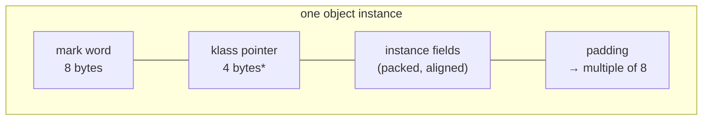

# 05 · Object Layout in Memory

> What an object *actually* looks like in memory — the header (mark word + klass pointer), field
> packing, alignment, and compressed oops — and how to compute its real size with JOL.
> [← Part 1 · Memory & GC](README.md) · next: 06 · Allocation & the Heap

> **Predict first (2 min).** How many bytes does a `new Object()` take on a 64-bit HotSpot JVM with
> default settings? And a class with a single `boolean` field? Write both down. Most people are
> surprised by *both* answers.

---

## Why this is the first chapter of Part 1

You can't reason about garbage collection, cache behavior, or "why does this collection use so much
memory?" without knowing what one object costs. The size isn't "the sum of the fields" — there's a
**header** you didn't declare, **alignment padding** the JVM inserts, and a **pointer
representation** that changes at a certain heap size. This chapter makes the invisible layout
visible, and the tool that does it — [JOL](https://github.com/openjdk/jol) — is one you'll use for
the rest of the track.

---

## The anatomy of an object

Every non-array object on a 64-bit HotSpot JVM is laid out as:


<sub>* 4 bytes when compressed class pointers are on (the default below ~32 GB heaps); 8 bytes otherwise.</sub>

- **Mark word (8 bytes)** — per-object metadata the JVM mutates at runtime: the identity hash code,
  the GC age, and the lock state all live here. (Detailed below — it's the star of the animation.)
- **Klass pointer (4 bytes, compressed)** — points to the class metadata (the `Klass` in metaspace)
  that says "what type am I, what are my methods/fields." Compressed to 4 bytes by default.
- **Instance fields** — your declared fields, but the JVM **reorders** them for packing (not in
  source order), grouping by size to minimize gaps.
- **Padding** — the whole object is rounded up to a multiple of **8 bytes** (the alignment), so the
  next object starts on an 8-byte boundary.

> ▶ **Watch it:** [`object-header.html`](visualizations/object-header.html) — toggle the mark word
> through its states (unlocked → hashed → aged → locked) and see identity hash, GC age, and lock
> bits share the same 64 bits.

So the prediction: `new Object()` = 8 (mark) + 4 (klass) = 12 bytes, padded up to **16 bytes**. A
class with one `boolean`? 8 + 4 + 1 (the boolean) = 13, padded to **16 bytes** — the boolean is
*free* in the padding you were already paying. That non-linearity is why "just add a flag field"
often costs nothing, and why a tiny wrapper object costs far more than its data.

---

## The mark word — where runtime state hides

The 64-bit mark word is **reused** for different purposes depending on the object's lock state
(HotSpot, JDK 15+, after biased locking was removed):

| Lock state | What the 64 bits hold |
|---|---|
| **Unlocked (neutral)** | unused : identity hashcode (31 bits) : GC age (4) : lock tag `01` |
| **Lightweight locked** | pointer to the lock record on the locking thread's stack : tag `00` |
| **Heavyweight (inflated)** | pointer to the OS-level monitor (`ObjectMonitor`) : tag `10` |
| **Marked for GC** | tag `11` (used during collection) |

Three consequences a principal keeps in mind:

1. **The identity hash code is computed lazily and then stored in the mark word.** Before you ever
   call `System.identityHashCode(o)` (or the default `Object.hashCode()`), there's no hash; the
   first call computes one and **stamps it into the header**, where it stays for the object's life.
2. **The GC age lives in the header** — that's the "survived N collections" counter from
   [chapter 07](README.md) that drives promotion to the Old generation.
3. **Locking mutates the header.** `synchronized` flips the lock tag and may replace the mark word
   with a pointer (lightweight) or inflate to a heavyweight monitor under contention. That's why a
   locked object's identity hash has to be *displaced* and restored — and it's the bridge to
   [Part 3 · Locks & Synchronization](../03-concurrency-and-jmm/).

One header, three jobs (identity, GC, locking), reused by state. That density is deliberate — the
header is pure overhead, so every bit is spent.

---

## Compressed oops — the 32 GB cliff

An **oop** ("ordinary object pointer") is a reference. On a 64-bit JVM a raw pointer is 8 bytes, but
that doubles the memory spent on references versus 32-bit. So HotSpot uses **compressed oops**: it
stores references as 32-bit offsets and, because objects are 8-byte aligned, shifts them by 3 bits to
address 8 × 4 GB = **32 GB** of heap with a 32-bit value. References (and the klass pointer) become
**4 bytes** — a large, free-ish memory saving.

The catch — and a genuine production gotcha:

> **Crossing ~32 GB of heap (`-Xmx32g+`) turns *off* compressed oops**, so every reference becomes
> 8 bytes. A 31 GB heap can hold *more live objects* than a 33 GB heap, because the larger heap
> spends so much more on fat pointers. The principal move: stay just under the threshold (e.g.
> `-Xmx31g`) unless you genuinely need far more, in which case jump well past it so the extra space
> outweighs the pointer tax.

---

## Field packing, alignment, and arrays

The JVM reorders fields to pack them and honor each type's alignment (a `long`/`double` wants 8-byte
alignment, an `int` 4, etc.). So this class:

```java
class Mixed { boolean a; long b; int c; boolean d; }
```

is **not** laid out `a,b,c,d`. The JVM groups the larger fields first to avoid gaps — roughly
`b (long), c (int), a (boolean), d (boolean)`, then pads to 8. You don't control the order (without
hacks), but you *can* observe it, and it explains why two classes with the same fields can differ in
size, and why splitting one object into two costs two headers.

**Arrays** have one extra header word: a 4-byte **length** field after the klass pointer (so an
array header is larger than a plain object header), followed by the elements, then padding.

---

## Make it visible: JOL

Don't trust the arithmetic — print the layout. Add the JOL dependency and:

```java
System.out.println(ClassLayout.parseInstance(new Object()).toPrintable());
```

```
java.lang.Object object internals:
OFF  SZ   TYPE DESCRIPTION               VALUE
  0   8        (object header: mark)     0x0000000000000001
  8   4        (object header: class)    0x00006d05
 12   4        (object alignment gap)
Instance size: 16 bytes
Space losses: 0 bytes internal + 4 bytes external = 4 bytes total
```

There it is: 8 + 4 header, a **4-byte alignment gap**, **16 bytes total**. Now run it on `new
Mixed()` and watch the field reordering and the gaps for yourself. Two more high-value experiments:

- `ClassLayout.parseInstance(new long[0])` vs `new int[0]` — see the array length word and how the
  element size changes the footprint.
- `GraphLayout.parseInstance(someHashMap).toFootprint()` — the *deep* size of a whole object graph,
  which is how you discover that a `HashMap<Integer,Integer>` of N entries costs far more than
  `2 × N × 4` bytes (every key/value is a boxed `Integer` *object* with its own 16-byte header — the
  motivation for primitive collections, revisited in [chapter 21](../04-language-in-depth/)).

---

## Why this matters (the payoff)

- **Object headers dominate small objects.** A wrapper holding one `int` is 16 bytes for 4 bytes of
  data — 75% overhead. Millions of tiny objects = mostly headers. This is *the* argument for value-ish
  designs, primitive arrays, and (eventually) Project Valhalla's value types.
- **Footprint drives GC.** More/bigger objects → higher allocation rate → more GC ([chapter 07](README.md)).
  Knowing real sizes lets you predict it.
- **Layout drives cache behavior.** How fields pack and how objects sit in memory decides what shares
  a cache line — the subject of [Part 2 · Mechanical Sympathy](../02-execution-and-performance/).

---

## Self-Check (close the doc, answer out loud)

1. Draw an object's layout. What's in the header, and how big is each part with compressed oops on?
2. Why is `new Object()` 16 bytes, and why does adding one `boolean` field often not change that?
3. Name the three distinct things the mark word holds, and when each gets written.
4. What are compressed oops, what's the ~32 GB cliff, and how do you tune around it?
5. Why might two classes with identical fields have different sizes? What does an array header add?
6. Why does a `HashMap<Integer,Integer>` cost far more than its raw numbers — in terms of *headers*?

> **Go deeper:** Aleksey Shipilëv's "[Java Objects Inside Out](https://shipilev.net/jvm/objects-inside-out/)"
> and the JOL samples; then [06 · Allocation & the Heap](README.md) for how these objects are born,
> and [07 · GC Fundamentals](README.md) for how the header's age field drives promotion.
