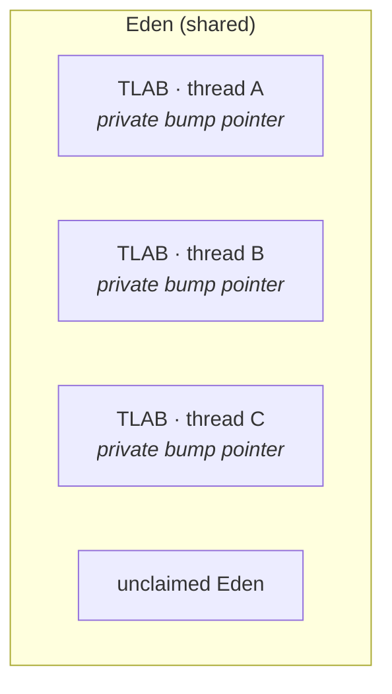

# 06 · Allocation & the Heap

> Why creating an object is *nearly free* — TLABs and bump-pointer allocation — and how the cleverest
> allocation is the one that never happens (escape analysis & scalar replacement).
> [← Part 1 · Memory & GC](README.md) · prev: 05 · Object Layout · next: 07 · GC Fundamentals

> **Predict first (2 min).** Two threads both do `new Foo()` at the same instant. Do they contend on
> a shared "next free address" pointer (and need a lock)? And: does `for (i<1e9) { Point p = new
> Point(x,y); sum += p.dist(); }` actually allocate a billion `Point`s? Write your guesses.

---

## Allocation is a pointer bump

In the young generation, free memory is one contiguous block (that's what the copying collector in
[chapter 07](README.md) maintains). So allocating an object is, in the common case, just:

```
address = top;        // the current "next free" pointer
top     = top + size; // bump it past the new object
return address;       // (then zero the fields)
```

No free-list search, no `malloc` — a **pointer bump**. That's why "allocation is cheap, GC is the
cost" ([chapter 07](README.md)). But a naïve shared `top` pointer would be a contention nightmare:
every thread on every `new` would have to atomically compare-and-swap the same word. The JVM avoids
that with **TLABs**.

---

## TLABs — thread-local allocation buffers

Each thread is handed its **own chunk of Eden** — a **TLAB** — and bumps a pointer *within its own
chunk*. Because the chunk is private, the bump needs **no synchronization** at all:



> ▶ **Watch it:** [`tlab-allocation.html`](visualizations/tlab-allocation.html) — watch three
> threads bump-allocate in their own TLABs with no contention, then hit the slow path to refill.

So the prediction answers:

- **No, two threads don't contend** on a shared pointer — each bumps its own TLAB pointer. The *only*
  synchronized step is the **slow path**: when a thread's TLAB is full, it atomically claims a fresh
  TLAB from the shared Eden top. That's rare (once per TLAB-worth of allocations, not once per
  object), so it amortizes to almost nothing.

This is the **fast path / slow path** split that runs through all of JVM performance: the common case
is lock-free and a few instructions; the rare case pays a bit more.

- A TLAB has a size (tuned adaptively per thread by allocation behavior; `-XX:TLABSize` /
  `-XX:+ResizeTLAB`). Objects too large for any TLAB are allocated straight in Eden (or even the Old
  gen if huge), taking the slow path directly.

---

## Escape analysis — the object that's never born

The second prediction is the surprising one. The JIT performs **escape analysis**: it proves whether
an object can *escape* the method that created it (be stored in a field, returned, passed somewhere
that outlives the method). If an object **does not escape**, the JIT can apply **scalar replacement**
— it doesn't allocate the object at all; it just keeps its fields in registers/stack slots.

```java
for (int i = 0; i < 1_000_000_000; i++) {
    Point p = new Point(x, y);   // never escapes the loop body…
    sum += p.dist();             // …so the JIT keeps x,y in registers — ZERO allocations
}
```

Once this loop is JIT-compiled (C2), it allocates **nothing** — the billion `Point`s are never born.
The `dist()` call is inlined, `p`'s fields become locals, and the object vanishes. So the honest
answer to "does it allocate a billion Points?" is: *in the interpreter and early tiers, yes; once C2
optimizes it, no.* (This is also a Part 2 / JIT topic — see
[12 · JIT Optimizations](../02-execution-and-performance/).)

**What breaks it:** store `p` in a field, return it, put it in a collection, pass it to a method the
JIT can't inline, or make the call site megamorphic — any of these lets `p` escape, and the
allocation comes back. A principal knows escape analysis is *best-effort and fragile*: don't rely on
it for correctness, but understand it so a profiler's "zero allocations here?!" doesn't mystify you.

---

## Allocation rate is the real GC lever

Tie it together with [chapter 07](README.md): every object you *do* allocate fills Eden, and a full
Eden triggers a minor GC. So your **allocation rate** (bytes/sec of new objects) directly sets how
often the GC runs. The levers, in order of impact:

1. **Allocate less.** Reuse buffers, avoid autoboxing (`Long` vs `long`), prefer primitive arrays
   over collections of boxed types ([chapter 21](../04-language-in-depth/)), don't build throwaway
   intermediate objects in hot loops.
2. **Let escape analysis help** by keeping hot-path objects local and call sites inlinable.
3. *Then* tune the collector — distant last, and only with measurements.

A worked feel: at a **1 GB/s** allocation rate with a **512 MB** Eden, you fill Eden — and trigger a
minor GC — about **twice a second**. Halve the allocation rate (kill the boxing) and you halve the GC
frequency, for free, with a code change you can measure. No flag does that.

---

## Make it visible

- **See TLAB activity.** Run with `-Xlog:gc+tlab=trace` to watch TLABs being handed out, their
  sizes, and refills per thread.
- **Measure allocation rate.** A JFR recording's "Allocation" view (or async-profiler in `alloc`
  mode) shows *where* your bytes are born — usually a shocking, fixable hot spot (an autoboxed key, a
  per-call `new ArrayList<>()`).
- **Catch escape analysis.** Benchmark the loop above with JMH and watch allocations (the
  `-prof gc` profiler) drop to ~0 once warm; then add `escape = p;` to a field and watch them return.
  (Diagnostic flags: `-XX:+UnlockDiagnosticVMOptions -XX:+PrintEliminateAllocations`.)

---

## Self-Check (close the doc, answer out loud)

1. Walk the fast path of an allocation. Why is it just a pointer bump, and why no lock?
2. What is a TLAB, and what exactly is the slow path? How often does the synchronized step happen?
3. What does escape analysis prove, and what does scalar replacement then do? Give two things that
   make an object *escape*.
4. Does the billion-`Point` loop allocate? Answer for the interpreter vs. C2-compiled, and explain.
5. Your Eden is 512 MB and you allocate 2 GB/s. How often does a minor GC fire? What's the
   highest-impact way to reduce it?
6. A profiler shows a hot method with surprisingly zero allocations. What happened, and what one code
   change would make the allocations reappear?

> **Go deeper:** Shipilëv's "[JVM Anatomy Quark #4: TLAB allocation](https://shipilev.net/jvm/anatomy-quarks/)"
> and the escape-analysis quarks; then [07 · GC Fundamentals](README.md) for what happens when Eden
> finally fills.
