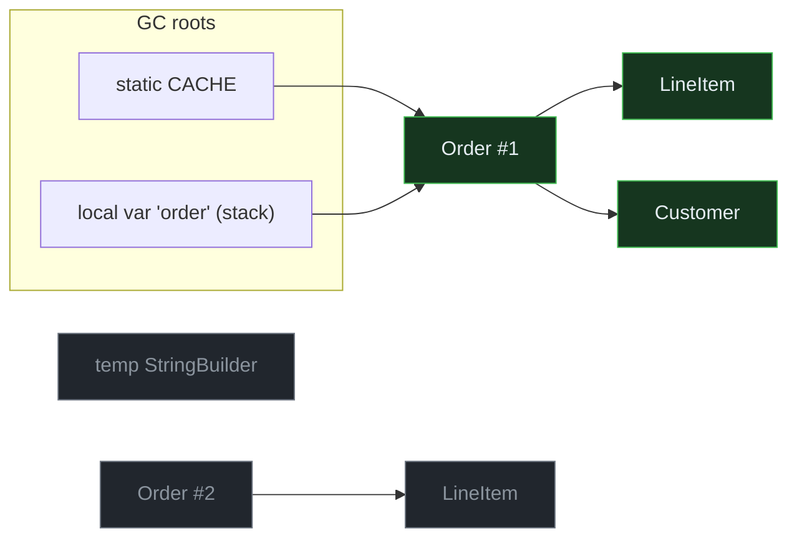
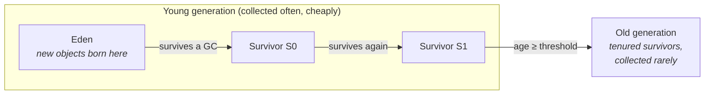

# 07 · Garbage Collection Fundamentals

> How the JVM decides what's garbage and reclaims it — reachability, the core algorithms
> (mark-sweep / mark-compact / copying), the generational hypothesis, and *why a minor GC is cheap*.
> [← Part 1 · Memory & GC](README.md) · prev: 06 · Allocation & the Heap · next: 08 · The Modern Collectors

> **Predict first (2 min).** Before reading: a program allocates 10 million temporary objects in a
> loop and keeps none of them. Roughly how much *work* does the garbage collector do to clean them
> up — proportional to 10 million, or to something else? Write down your guess. The answer is the
> whole point of this chapter.

---

## Why garbage collection exists

In a manual-memory language you `free()` what you `malloc()`. Get it wrong and you get the two
worst bug classes in systems programming: **use-after-free** (freed too early — a security hole) and
**leaks** (freed too late, or never). The JVM's bet is that a collector can decide *automatically*
when an object is unreachable, and do it safely. That bet is so good it's now the default in most
modern languages — but "automatic" is not "free," and a principal's job is to know exactly what it
costs and when.

The key reframing this chapter builds: **the collector does not look for garbage. It looks for what's
*alive*, and everything else is garbage by definition.** That single fact explains why the answer to
the prediction above is *not* "proportional to 10 million."

---

## Reachability: what "alive" means

An object is **live** if it is *reachable* — if there's a chain of references to it starting from a
**GC root**. Roots are the references the JVM knows are definitely in use right now:

- **local variables and operands** on every thread's stack (the method you're in, and its callers),
- **static fields** of loaded classes,
- **JNI references** held by native code,
- a few others (the thread objects themselves, monitors held, etc.).

From the roots, the collector traces every reference it can follow. Anything it reaches is kept;
anything it can't is unreachable and may be reclaimed.



`Order #1` is reachable from two roots; its `LineItem` and `Customer` are reachable *through* it —
all live (green). `Order #2`, its `LineItem`, and that stray `StringBuilder` have **no path from any
root** — unreachable (gray), and therefore garbage, *regardless of whether they still reference each
other*. This is why Java has no "reference-counting" leak from cycles: two dead objects pointing at
each other are still dead, because neither is reachable from a root.

> **A leak in a GC language is a *reachability* bug, not a free() bug.** If memory grows without
> bound, something is still *reachable* that you've stopped using — the classic culprit is a
> `static` collection (a root!) you keep adding to and never remove from. The GC is working
> perfectly; your object graph is the problem. (See [09 · Reference Types](README.md) for the
> weak/soft references that let you hold something *without* keeping it reachable.)

---

## The three core algorithms

Once you can mark the live set, you still have to reclaim the rest. There are three classic
strategies, and every real collector is a combination of them.

| Algorithm | How it reclaims | Cost is proportional to | Leaves behind |
|---|---|---|---|
| **Mark-Sweep** | mark live; sweep the rest onto a free list | live set (mark) + whole heap (sweep) | **fragmentation** (free space in scattered holes) |
| **Mark-Compact** | mark live; slide live objects together | live set + moving live objects | a single contiguous free block |
| **Copying** | copy live objects to a fresh space; abandon the old one | **live set only** | a single contiguous free block; *wastes half the space* |

The trade-offs:

- **Mark-Sweep** never moves objects (cheap, references stay valid) but **fragments** the heap — over
  time you have plenty of free bytes but no contiguous run big enough for a large allocation, forcing
  a compaction or an `OutOfMemoryError` despite "free" memory.
- **Mark-Compact** fixes fragmentation by sliding survivors to one end and updating every reference
  to them — fast allocation afterward (just bump a pointer), but moving + pointer-fixup is expensive.
- **Copying** is the cleverest: it touches *only live objects* (copies them to a "to-space"), then
  declares the entire old "from-space" free in one step. Dead objects cost **nothing** — they're
  never visited. The price is that you keep a second, empty space to copy into, so you "waste" up to
  half the region.

> ▶ **Watch it:** [`mark-sweep-compact.html`](visualizations/mark-sweep-compact.html) — step through
> all three on one heap and *see* the fragmentation a sweep leaves, and what compaction buys.

This table is the answer to the prediction. A **copying** collector cleaning up 10 million dead
objects and 4 live ones does work proportional to **4**, not 10,000,004. That asymmetry is the engine
of the next idea.

---

## The generational hypothesis

Decades of measurement across real programs converge on one empirical law:

> **The generational hypothesis: most objects die young.** The vast majority of allocations become
> garbage almost immediately (loop temporaries, intermediate strings, per-request objects); the few
> that survive their first collection tend to live a long time.

If most objects die young, then a *copying* collector run over only the young objects is nearly free
(few survivors to copy). So the JVM splits the heap by **age**:



- New objects are allocated in **Eden** (a bump-pointer allocation — see [06](README.md)).
- When Eden fills, a **minor GC** copies the few survivors into a **Survivor** space and reclaims all
  of Eden at once. Most objects never leave Eden alive.
- Objects that survive enough minor GCs (the **tenuring threshold**) are **promoted** to the **Old**
  generation, which is collected far less often (a **major** / **full** GC, which is expensive).

> ▶ **Watch it:** [`young-gen-copy.html`](visualizations/young-gen-copy.html) — step through two
> minor GCs: allocation into Eden, marking, copying survivors, aging, and promotion to Old. Watch the
> dead objects get reclaimed *for free* (never copied).

### Minor vs. major vs. full

- **Minor (young) GC** — collects only the young generation. Frequent, short, copying. Cheap because
  cost ∝ the (small) live set.
- **Major GC** — collects the Old generation.
- **Full GC** — collects the entire heap (young + old), usually with compaction. Rare and the one you
  *feel* as a long pause. A storm of full GCs means something is wrong (promotion too fast, heap too
  small, a leak).

---

## Why a minor GC is cheap — with numbers

Say Eden is 256 MB and your code allocates 64-byte objects, of which ~2% survive each minor GC
(typical for request-handling code). Eden fills after ~4 million allocations. The minor GC then:

- **does not touch** the ~3.92 million dead objects — they're abandoned with Eden,
- **copies** only the ~80,000 survivors (≈ 5 MB) into a Survivor space,
- reclaims all 256 MB of Eden by resetting one pointer.

Work done ≈ proportional to **5 MB copied**, not 256 MB allocated. That's why minor GCs are
milliseconds even on large heaps. The corollary is the most important tuning fact in this whole part:

> **The GC's cost is driven by your *allocation rate* and your *survival rate*, not your heap size.**
> Halving how much garbage you create (kill the autoboxing, reuse a buffer, let escape analysis
> stack-allocate — see [06](README.md)) halves how often this runs. "Make less garbage" beats almost
> any flag, and it's a *code* change you can measure. (This is the part's
> [principal-level insight](README.md#the-principal-level-insight).)

---

## The catch: old → young references (the write barrier)

A minor GC traces only the young generation — but what if an *old* object references a *young* one?
That young object is live, but the roots-and-young-objects trace wouldn't find it without scanning
the *entire* old generation, which would make minor GCs as expensive as full ones.

The fix: the collector tracks cross-generational references in a **remembered set** (in G1) or a
**card table** (older collectors) — a compact map of "which old regions contain references into the
young gen." Maintaining it requires a **write barrier**: a tiny snippet the JIT inserts after *every*
reference-field store (`obj.field = other`) that records the old→young pointer. So every pointer
write you do carries a small, usually-negligible GC tax — one of the rare places GC bookkeeping
touches your code's hot path. This is also why a sea of mutations into long-lived objects can quietly
raise GC cost.

---

## Make it visible: read a real GC log

Don't believe any of this — make the JVM show you. Run with unified logging:

```
java -Xlog:gc*:stdout:tags,time,uptime,level MyApp
```

A single minor (young) collection under G1 looks like:

```
[2.418s][info][gc,start] GC(7) Pause Young (Normal) (G1 Evacuation Pause)
[2.421s][info][gc      ] GC(7) Pause Young (Normal) (G1 Evacuation Pause) 256M->9M(512M) 3.104ms
```

Decoded, this is the entire chapter in one line:

- `GC(7)` — the 8th collection since start.
- `Pause Young` — a **minor** GC (young generation only).
- `G1 Evacuation Pause` — G1's name for a copying ("evacuating") collection.
- `256M->9M(512M)` — heap used went from **256M before** to **9M after**, out of a **512M** total.
  The young gen was ~full and **only 9 MB survived** — the generational hypothesis, measured.
- `3.104ms` — the stop-the-world pause. Milliseconds, because cost ∝ the 9 MB live set, not the
  247 MB reclaimed.

Watch a handful of these scroll by under load and you'll *see* allocation rate (how often `GC(n)`
increments) and survival rate (the `before->after` gap) directly. That habit — reading GC logs as a
matter of routine — is what separates "increase `-Xmx`" from a real diagnosis.

---

## Myths to drop (version-anchored, Java 17+)

- **"`System.gc()` forces a collection."** It's a *hint*; the JVM may ignore it, and calling it in
  application code almost always *hurts* (it can force a full GC). Don't.
- **"GC means Java is slow."** Allocation is a pointer bump; minor GC is milliseconds. The pauses
  worth worrying about are *full* GCs and *old-gen* work — which the [modern collectors](README.md)
  (G1/ZGC/Shenandoah) do largely concurrently.
- **"Finalizers clean up my object."** `finalize()` is deprecated for removal, runs at an
  unpredictable time (or never), and *delays* collection. Use `try-with-resources` /
  [`Cleaner`](README.md) (chapter 09).
- **"A bigger heap is always better."** A bigger heap means *less frequent* but potentially *longer*
  collections, and more memory you're paying for. The lever is usually allocation rate, not size.

---

## Self-Check (close the doc, answer out loud)

1. Define reachability and name four kinds of GC root. Why can't two dead objects referencing each
   other keep themselves alive?
2. Contrast mark-sweep, mark-compact, and copying. Which fragments? Which wastes space? Which has cost
   proportional to the live set only?
3. State the generational hypothesis and use it to explain why a minor GC is cheap, in terms of *what
   gets copied*.
4. A service has 1-second pause spikes. Walk your first diagnostic steps. Which log? Which numbers in
   the line tell you survival rate vs. allocation rate?
5. Why does an old→young reference need a write barrier, and what does that cost your code?
6. Your heap grows until OOM even though most objects are short-lived. It's not the collector's fault —
   what is it, mechanically, and where would you look first?

> **Go deeper:** *The Garbage Collection Handbook* (Jones, Hosking, Moss), Ch. 2–4; the
> [Java Platform GC tuning guide](https://docs.oracle.com/en/java/javase/21/gctuning/); then
> [08 · The Modern Collectors](README.md) for how G1, ZGC, and Shenandoah build on these primitives.
