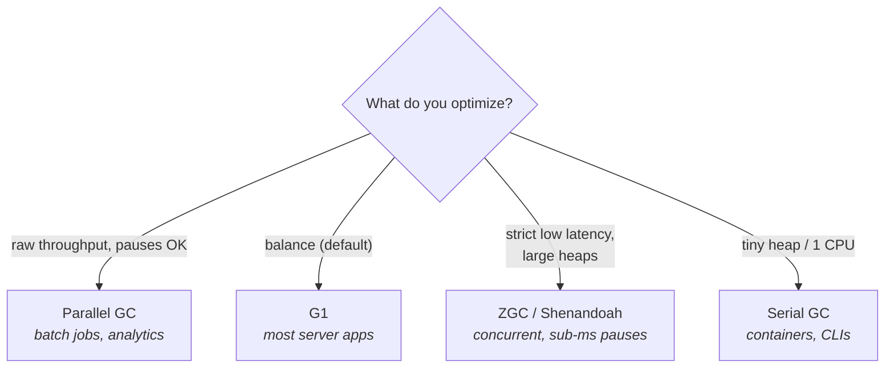

# 08 · The Modern Collectors

> Serial, Parallel, G1, ZGC, Shenandoah — the throughput–latency–footprint trilemma, what each pays
> for low pauses, and how to pick one (and read its log).
> [← Part 1 · Memory & GC](README.md) · prev: 07 · GC Fundamentals · next: 09 · Reference Types & Cleaners

> **Predict first (2 min).** You have a 200 GB heap and a hard p99.9 latency SLA of 10 ms. You switch
> from the default collector to one with sub-millisecond pauses and your *throughput drops ~10%* and
> *memory use goes up*. Why would lower pauses cost you throughput and footprint? Write your guess.

---

## The one trade-off behind all of them

Every collector is a different point on the same three-way trade-off — you cannot maximize all three:

- **Throughput** — fraction of time doing *app* work, not GC. Maximized by collecting in big
  stop-the-world batches with parallel threads (less coordination overhead).
- **Latency (pause time)** — how long the app freezes. Minimized by doing GC work *concurrently*
  (while the app runs) — which needs **barriers** on the app's reads/writes and burns extra CPU.
- **Footprint** — memory/CPU overhead. Concurrent collectors keep more metadata and need headroom to
  collect while allocation continues.

That's the answer to the prediction: a low-pause collector (ZGC) does its work **concurrently**,
which means **read/write barriers** on every app access (throughput tax) and **extra heap headroom +
metadata** (footprint tax). You bought 10 ms pauses with ~10% throughput and some memory. *There is
no free low-pause collector* — knowing the bill is the principal-level insight.

---

## The five collectors

| Collector | Flag | How it works | Best for | Pays |
|---|---|---|---|---|
| **Serial** | `-XX:+UseSerialGC` | single GC thread, stop-the-world | tiny heaps, 1 vCPU, CLIs/containers | long pauses, no parallelism |
| **Parallel** (throughput) | `-XX:+UseParallelGC` | many GC threads, stop-the-world young+old | batch/throughput jobs that tolerate pauses | multi-hundred-ms pauses on big heaps |
| **G1** (Garbage-First) | default (Java 9+) | region-based, incremental, **pause-time target**, concurrent marking + mixed collections | most server apps — the balanced default | some throughput vs Parallel; tuning |
| **ZGC** | `-XX:+UseZGC` | concurrent, region-based, **colored pointers + load barriers**; sub-ms pauses; TB heaps; **generational** since JDK 21 | strict latency SLAs, very large heaps | throughput + footprint (barriers, headroom) |
| **Shenandoah** | `-XX:+UseShenandoahGC` | concurrent compaction via load-reference barriers; pauses independent of heap size | low-latency, heap-size-independent pauses | throughput + footprint |

A few load-bearing facts:

- **G1 is the default** since Java 9 (Parallel was the default through Java 8). It splits the heap
  into ~2,048 equal **regions**, each dynamically Eden / Survivor / Old / Humongous, and tries to
  meet `-XX:MaxGCPauseMillis` (default 200 ms) by collecting only as many regions as fit in that
  budget — picking the **highest-garbage regions first** ("garbage first").
- **ZGC and Shenandoah are *concurrent*** — they mark *and relocate* objects while your app runs,
  using barriers so the app never sees a half-moved object. That's how pauses stay sub-millisecond
  even on a 200 GB heap. **Generational ZGC** (JDK 21) added a young/old split for much better
  throughput, and is the one to reach for now.
- The "concurrent" collectors don't make GC *cheaper* — they move the cost *off the pause* and onto
  app-thread barriers + CPU. Throughput-bound batch jobs are often *faster* on Parallel.

> ▶ **Watch it:** [`g1-regions.html`](visualizations/g1-regions.html) — watch G1 mark per-region
> garbage and then collect the highest-garbage regions first to hit a pause target.

---

## Choosing one (a principal's heuristic)

1. **Start with the default (G1).** It's the right answer for the large majority of server apps.
2. **Strict latency SLA and/or a big heap (tens of GB+)?** → **Generational ZGC**. Measure the
   throughput/footprint cost; usually worth it when pauses are the SLA.
3. **Throughput-only batch job, pauses irrelevant?** → **Parallel**. It'll often beat G1 on raw work.
4. **Tiny heap / single CPU / fast-exit container or CLI?** → **Serial** (less overhead than G1).

And the move that beats all of the above for most teams: **reduce allocation rate** ([chapter 06](README.md))
so *whichever* collector runs less often. Collector choice matters; allocation rate usually matters more.

> **Don't cargo-cult flags.** The biggest GC mistakes in production are pasted flag soups. Change
> **one** thing (often: the collector, or `-Xmx`, or `MaxGCPauseMillis`), measure before/after with
> the GC log, and keep it only if it helped.

---

## Make it visible

- **A/B the collectors.** Run the same allocation-heavy workload under `-XX:+UseG1GC`,
  `-XX:+UseParallelGC`, and `-XX:+UseZGC`, each with `-Xlog:gc*`. Compare **max pause** and
  **throughput** (app time / wall time). Watch the trade-off appear in real numbers.
- **Read a G1 mixed collection.** In a G1 log, find `Pause Young (Mixed)` vs `Pause Young (Normal)`;
  the mixed ones are reclaiming Old regions chosen by garbage-first.
- **Watch ZGC stay flat.** Under ZGC, pauses stay sub-millisecond even as the heap grows — the log's
  pause lines barely move while `before->after` swings hugely. That's concurrent relocation.

---

## Self-Check (close the doc, answer out loud)

1. State the three-way trade-off. Why can't a collector maximize all three?
2. Why does a sub-millisecond-pause collector *cost* throughput and footprint? Name the mechanism.
3. What is G1's region model, and what does "garbage-first" mean? What's `MaxGCPauseMillis`?
4. Map each collector to the workload it's the best default for, in one phrase each.
5. When would Parallel GC *beat* ZGC, and why?
6. A service on G1 has occasional long pauses. Name three things you'd check before changing the
   collector. (Hint: allocation rate, heap size, humongous allocations.)

> **Go deeper:** the per-collector tuning chapters of *Java Performance* (Oaks) and the
> [HotSpot GC tuning guide](https://docs.oracle.com/en/java/javase/21/gctuning/); then
> [09 · Reference Types & Cleaners](README.md).
