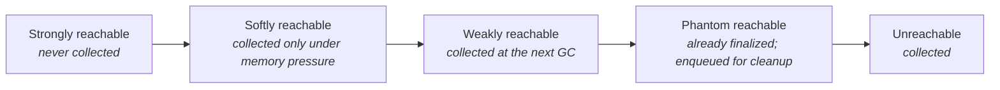

# 09 · Reference Types & Cleaners

> Strong, soft, weak, and phantom references — who decides when each clears — plus why `finalize()`
> is dead and what `Cleaner` and `try-with-resources` do instead.
> [← Part 1 · Memory & GC](README.md) · prev: 08 · The Modern Collectors

> **Predict first (2 min).** You put objects in a `WeakHashMap` as keys and never touch them again.
> Do they stay in the map? And: if you wrap a cache value in a `SoftReference`, when exactly does the
> JVM throw it away? Write your guesses.

---

## Reachability has degrees

[Chapter 07](README.md) said an object lives if it's *reachable from a GC root*. The full truth:
reachability has **strengths**, and an object's fate is decided by the **strongest** reference chain
to it.

| Reference | Cleared when | `get()` | Use for |
|---|---|---|---|
| **Strong** (ordinary) | never, while strongly reachable | the object | normal references |
| **`SoftReference`** | only when memory is low (last resort before `OutOfMemoryError`) | object, until cleared | memory-sensitive caches |
| **`WeakReference`** | at the **next GC** once only weakly reachable | object, until cleared | canonicalizing maps, metadata that mustn't prevent collection |
| **`PhantomReference`** | after the object is collected | **always `null`** | scheduling cleanup of native/external resources |

> ▶ **Watch it:** [`reference-strength.html`](visualizations/reference-strength.html) — four objects,
> one per reference type; run a normal GC and then a memory-pressure GC and watch which survive and
> which get enqueued.

So the predictions:

- **`WeakHashMap` keys don't stay.** Its keys are held by *weak* references, so once you drop your
  strong reference, the next GC collects the key and the entry vanishes. (That's the point — it's for
  associating metadata without keeping the key alive. Caveat below.)
- **A `SoftReference` is cleared at the GC's discretion only when memory is tight** — it survives
  arbitrarily long while there's headroom, then the JVM reclaims softly-reachable objects rather than
  OOM. That makes it a *memory-sensitive* cache, but a blunt one (the GC may clear them all at once;
  real caches like Caffeine use smarter policies).

---

## ReferenceQueue — knowing *when* a reference cleared

A `SoftReference`/`WeakReference`/`PhantomReference` can be registered with a **`ReferenceQueue`**.
When the GC clears the reference, it **enqueues** it, so you can poll the queue and run cleanup. This
is the backbone of resource management: you get a callback *after* the object is gone, without the
object having to reference your cleanup logic.

A **`PhantomReference`**'s `get()` *always* returns `null` — you can never resurrect or even touch the
referent through it. Its only job is to be **enqueued after collection** so you know it's safe to
release the *associated* external resource (a file handle, native memory, a socket).

---

## `finalize()` is dead — use `Cleaner` / `try-with-resources`

`Object.finalize()` is **deprecated for removal** ([JEP 421](https://openjdk.org/jeps/421)). It was a
trap on every axis:

- **Unpredictable / may never run** — there's no guarantee a finalizer ever executes.
- **Delays collection** — a finalizable object survives an *extra* GC cycle (to run the finalizer),
  bloating the heap.
- **Resurrection & swallowed exceptions** — a finalizer can make the object reachable again; thrown
  exceptions are ignored.

The replacements:

1. **`try-with-resources` / `AutoCloseable`** — *deterministic* cleanup when the scope is known. This
   is the right answer the vast majority of the time: `try (var in = Files.newInputStream(p)) { … }`.
2. **`java.lang.ref.Cleaner`** — a *safety net* for when deterministic close isn't guaranteed. You
   register the object plus a cleanup `Runnable`; the cleaner runs it after the object becomes
   phantom-reachable. **Critical rule:** the cleanup action must **not** reference the object it
   cleans up — otherwise the object is never unreachable and the cleaner never fires (a leak). Make
   the state a separate `static` class.

---

## Pitfalls a principal watches for

- **The static-collection leak (again).** A `static` `List`/`Map` you add to and never remove from is
  the #1 memory leak — those are *strong* roots ([chapter 07](README.md)). Weak/soft references are
  one tool to avoid it (e.g. weak listeners), but the real fix is usually lifecycle discipline.
- **`WeakHashMap` whose *values* strongly reference their *keys*.** Then the key is still strongly
  reachable (via the value), never goes weakly reachable, and the entry never clears — a silent leak.
- **Soft references as a "free cache."** Under pressure the GC may dump them all at once, causing a
  latency cliff. Prefer a real cache (size/TTL-bounded) for anything that matters.

---

## Make it visible

- **Weak clears at GC.** `var ref = new WeakReference<>(obj); obj = null; System.gc();` then assert
  `ref.get() == null`. Watch it clear.
- **Soft survives until pressure.** Hold many `SoftReference`s in a small `-Xmx`; allocate until near
  OOM and watch `get()` start returning `null` — the GC reclaiming softs as a last resort.
- **Phantom + queue.** Register a `PhantomReference` with a `ReferenceQueue`, drop the strong ref,
  GC, and `queue.poll()` to see it enqueued — that's your cleanup signal.

---

## Self-Check (close the doc, answer out loud)

1. Order the four reference strengths and say *who* (and *when*) clears each.
2. Why don't `WeakHashMap` keys survive once you drop your strong reference? What breaks this (the
   value→key trap)?
3. When does the JVM clear a `SoftReference`, and why does that make it a mediocre general cache?
4. What does `PhantomReference.get()` return, and what is a phantom reference actually *for*?
5. List three reasons `finalize()` is dead, and name the two things that replace it.
6. What's the one rule about a `Cleaner`'s cleanup action, and what happens if you break it?

> **Go deeper:** *Effective Java* Item 8 ("Avoid finalizers and cleaners"); the `java.lang.ref`
> package docs and the `Cleaner` JavaDoc. **This completes Part 1 · Memory & GC** — you can now reason
> about an object from birth ([06](README.md)) through layout ([05](README.md)), collection
> ([07](README.md)–[08](README.md)), and cleanup. Next: [Part 2 · Execution & Performance](../02-execution-and-performance/).
