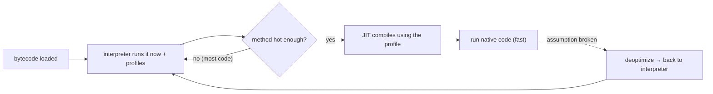

# 10 · The Interpreter & the Execution Engine

> Before the JIT ever fires, *something* has to run your bytecode from the very first instruction —
> the **interpreter**. Understanding it explains why Java starts running instantly but slowly, why
> "warmup" exists at all, and what the JIT is actually replacing.
> [← Part 2 · Execution & Performance](README.md) · next: 11 · The JIT Compilers

> **Predict first (2 min).** A freshly launched JVM runs your `main` immediately — no compile-to-native
> step you wait on. So what's executing the bytecode in that first millisecond, before any method is
> "hot"? And if that thing is slower than native code, why not just compile everything up front? Write
> your guesses.

---

## The execution engine: interpret first, compile later

The JVM's **execution engine** turns the bytecode in a loaded class file ([ch.02](../00-platform-and-mental-model/))
into actions on the hardware. It has two collaborating halves:

1. **The interpreter** — reads bytecode **one instruction at a time** and performs it immediately. No
   compile step, so execution starts the instant a method is entered.
2. **The JIT compiler(s)** — in the background, compile *hot* methods to native code
   ([ch.11](README.md)), which the engine then runs instead of interpreting.

The prediction's first answer: **the interpreter** runs everything at first. Its superpower is
**zero startup latency** — it begins executing immediately, which is exactly what you want for code
that runs a few times (startup, config, one-shot methods). Its weakness is **speed**: per-instruction
dispatch overhead makes it far slower than compiled native code.

## How the interpreter executes bytecode: the operand stack

Java bytecode is a **stack machine** ([ch.02](../00-platform-and-mental-model/)) — most instructions
push/pop the per-frame **operand stack** rather than naming registers. The interpreter's core is a
dispatch loop: fetch the next opcode, jump to its handler, mutate the stack/locals, advance.

```
source:  int r = a + b;

bytecode:            interpreter does:
  iload_1     ; push local 'a'      → stack: [a]
  iload_2     ; push local 'b'      → stack: [a, b]
  iadd        ; pop 2, push sum     → stack: [a+b]
  istore_3    ; pop into local 'r'  → stack: []
```

Every step is a **fetch-decode-execute** cycle in software. HotSpot uses a **template interpreter**:
at startup it generates a small chunk of machine code per bytecode (a "template") and dispatches
through those, which is faster than a naïve C `switch`-loop — but it's *still* interpretation, still
paying dispatch cost per instruction. That per-instruction tax is the entire reason a hot loop wants
to be compiled.

## Why not compile everything up front (AOT)?

The prediction's second answer — compiling everything eagerly is usually a *net loss* for a
server app:

- **Startup latency:** you'd pay compile time before *any* code runs. Most methods run a handful of
  times; compiling them never pays back.
- **No profile yet:** the interpreter isn't just running code — it's **collecting profiles** (branch
  frequencies, which types actually show up at a call site, how hot a loop is). The JIT *spends* that
  profile to make speculative optimizations ([ch.11](README.md), [ch.12](README.md)) an AOT compiler,
  blind to runtime behavior, simply cannot. Interpreting first is what makes the JIT smart.
- **Memory/footprint:** native code for every method bloats the code cache.

So the JVM's model — **interpret immediately, profile while interpreting, compile only what's hot,
using the profile** — is a deliberate trade: instant start *and* eventual peak speed. That interval
between "just started, interpreted" and "hot code compiled" is what everyone calls **warmup**, and why
benchmarks must discard it ([ch.13](README.md)).



- ⚡ **AOT does have a place:** fast-start, short-lived, or scale-to-zero workloads (CLIs, serverless,
  GraalVM native-image) trade peak throughput for near-instant start and low footprint — the opposite
  end of the same trade. Project Leyden / CDS are the JDK's moves to shorten warmup without giving up
  the JIT. But for a long-running server, interpret-then-JIT wins.
- ⚡ **Deoptimization** ([ch.11](README.md)) means the interpreter is never retired — when a
  speculative compile's assumption breaks, execution falls *back* to the interpreter for that frame.
  Interpreter and JIT are lifelong partners, not phases.

## Make it visible

- **Watch the two engines hand off.** Run any loop-heavy program with `-XX:+PrintCompilation` — the
  first iterations log nothing (interpreted); then you see methods compile as they go hot. That
  silence-then-compile *is* the interpreter giving way.
- **Force interpret-only.** Run with `-Xint` (interpreter only) vs `-Xcomp` (compile everything
  eagerly) vs the default mixed mode. `-Xint` starts instantly but a hot loop crawls; `-Xcomp` has an
  ugly startup pause. Default beats both — that's the trade made concrete.
- **See warmup as a curve.** Time the *same* workload across many iterations in one JVM: the first
  runs are slow (interpreted), then throughput jumps as C1/C2 kick in and plateaus at peak.

## Self-Check (close the doc, answer out loud)

1. What runs your bytecode in the first millisecond, and what's its one big advantage and one big weakness?
2. Walk `a + b` through the operand stack as the interpreter sees it.
3. What is a template interpreter, and why is it still "interpretation"?
4. Give three reasons the JVM doesn't compile everything up front — and why interpreting first makes the JIT *smarter*.
5. When *is* AOT (native-image) the right call, and why is the interpreter never fully retired even after JIT?

> **Go deeper:** `-XX:+PrintCompilation`, `-Xint`/`-Xcomp`; the HotSpot template-interpreter design;
> GraalVM native-image and Project Leyden for the AOT end of the trade; then
> [11 · The JIT Compilers](README.md) — what the engine upgrades hot code *into*.
