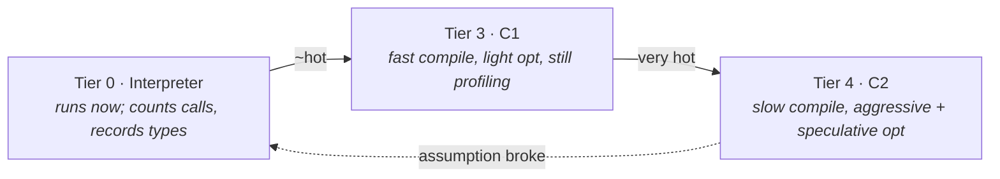

# 11 · The JIT Compilers

> Why the same method runs three different ways over its life — interpreter → C1 → C2 — how
> speculative optimization makes Java fast, and why the JVM sometimes **throws away** code it just
> compiled (deoptimization).
> [← Part 2 · Execution & Performance](README.md) · prev: 10 · The Interpreter · next: 12 · JIT Optimizations

> **Predict first (2 min).** A method is called in a tight loop a million times. Roughly how many
> times does the JVM *compile* it — zero, one, or more than one? And why might it ever *un*-compile a
> method that's running hot? Write your guesses.

---

## Interpret first, compile the hot part

Compiling every method up front (like a C compiler) would mean slow startup and wasted work on code
that runs once. Interpreting everything would mean slow steady-state. The JVM does **both, over
time**: it interprets immediately (instant startup), **profiles** to find the hot ~10% of code that
actually matters, and **JIT-compiles just that** to optimized native code.

- **The interpreter (tier 0)** executes bytecode directly and bumps **invocation** and **back-edge**
  counters, and records **what types show up at each call site**.
- **C1, the client compiler (tiers 1–3)** compiles fast with light optimization. Tier 3 keeps
  *profiling* so C2 has rich data.
- **C2, the server compiler (tier 4)** compiles slowly but optimizes aggressively, using the profile.
- **Tiered compilation** (the default) walks a method **0 → 3 → 4** as it heats up — so a hot method
  is compiled **more than once** (answer to the prediction: typically C1 *then* C2, ≥2 compiles).

> ▶ **Watch it:** [`tiered-compilation.html`](visualizations/tiered-compilation.html) — watch the
> invocation counter climb through the C1 and C2 thresholds, then a deoptimization when a speculation
> fails.

---

## Speculative optimization — the JVM bets on the profile

This is what makes a managed language reach C-like speed. C2 doesn't just optimize the bytecode; it
**speculates based on the observed profile** and compiles code that's only valid *if the bet holds*:

- **Monomorphic inlining.** If a call site (`shape.area()`) has only ever seen *one* concrete type
  (`Circle`), C2 inlines `Circle.area()` directly — eliminating the virtual dispatch — guarded by a
  cheap type check. (This is the key to [chapter 12](README.md)'s optimizations; inlining enables the
  rest.)
- **Branch pruning.** A branch never taken in the profile is compiled as a cold path (or a trap).
- **Implicit null/range assumptions.** If a value was never null, skip the check.

Every speculation is backed by a **guard**. As long as the guard holds, the code runs flat-out.

---

## Deoptimization — undoing the bet

What happens when the bet is wrong — a `Square` finally shows up at that "always `Circle`" call site?
The compiled code is now *invalid*. So the JVM **deoptimizes**:

1. Marks the compiled method "not entrant" (no new calls enter it).
2. **Transfers the currently-running frame back to the interpreter** mid-execution (this is the hard
   part — it reconstructs the interpreter's stack from the compiled frame).
3. Re-profiles with the new reality, and later **recompiles** with a weaker assumption (e.g.
   *bimorphic* — inline both `Circle` and `Square`).

That's the answer to the second prediction: **the JVM un-compiles hot code when a speculation it
made is violated.** Far from a bug, deoptimization is *what lets C2 be aggressive* — it can make
optimistic bets precisely because it can cleanly undo them. A principal reads a storm of "made not
entrant" in the compile log as "my code's behavior is shifting under the JIT's feet" (e.g. a call
site that started monomorphic went megamorphic).

### On-stack replacement (OSR)

A method that's entered once but loops millions of times would never hit the invocation threshold —
so the JVM counts **back-edges** and can compile the method *while the loop is running*, swapping the
executing frame over to the compiled version mid-loop. That's **OSR**; in `PrintCompilation` it's the
entry marked `%`.

---

## The code cache (a real production gotcha)

Compiled code lives in the **code cache**, a fixed-size native region
(`-XX:ReservedCodeCacheSize`). If it **fills up**, the JIT *stops compiling* and the JVM silently
falls back to the interpreter — your throughput craters with no obvious error. A principal knows to
check code-cache occupancy (`-XX:+PrintCodeCache`, JFR) when "the app got slow after running a while"
and nothing else explains it.

---

## Make it visible

- **Watch it tier up.** `-XX:+PrintCompilation` prints each compile with the tier and method; run a
  hot loop and watch a method go C1 (tier 3) then C2 (tier 4). The `%` marks OSR; `made not entrant`
  marks a deoptimization.
- **Force a deopt.** Call a method through an interface with only one implementer (monomorphic) in a
  hot loop, then start passing a *second* implementer. Watch `PrintCompilation` show the deopt +
  recompile.
- **See what got inlined.** `-XX:+PrintInlining` (with `-XX:+UnlockDiagnosticVMOptions`) shows inline
  decisions — `too large`, `not inlineable` (megamorphic), etc. (More in [chapter 12](README.md).)

---

## Self-Check (close the doc, answer out loud)

1. Why interpret first instead of compiling everything? What does tiered compilation add?
2. How many times is a very hot method compiled, and by which compilers, in what order?
3. What is speculative optimization? Give an example and explain the guard.
4. Walk deoptimization step by step. Why is the *ability* to deopt what makes C2 aggressive?
5. What is OSR and what problem does it solve? How does it show up in `PrintCompilation`?
6. The app is fast at first, then throughput drops after hours with no errors. Name one JIT-related
   cause and how you'd confirm it.

> **Go deeper:** *Java Performance* (Oaks), the compiler chapter; JITWatch for visualizing
> `PrintCompilation`/inlining logs; then [12 · JIT Optimizations](README.md) for what C2 actually
> does once a method is hot.
