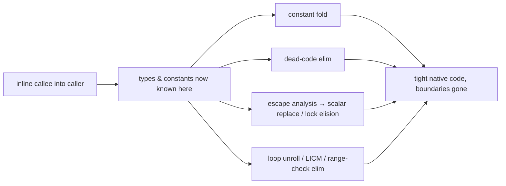

# 12 · What the JIT Actually Does — Inlining & the Optimizations It Unlocks

> The JIT isn't a black box that "makes code fast." It runs a pipeline of concrete transformations —
> and **inlining is the mother of them all**, because it exposes the caller and callee to each other so
> every *other* optimization can fire across the old method boundary.
> [← Part 2 · Execution & Performance](README.md) · prev: 11 · The JIT Compilers · next: 13 · Benchmarking the JVM Correctly

> **Predict first (2 min).** A getter `int x() { return this.x; }` called in a hot loop a billion
> times — how much does the *call* cost at peak? And: you allocate a `new Point(1,2)` inside a hot
> method, use its fields, and never let it escape — does it hit the heap? Write your guesses.

---

## Inlining: replace the call with the callee's body

Method calls aren't free — argument setup, a jump, a new frame, the return. For a tiny hot method
that overhead can *dwarf* the actual work. **Inlining** copies the callee's body into the caller,
deleting the call entirely. The prediction's first answer: a hot getter costs **~nothing** — it
inlines to a single field read, often then folded into surrounding code.

But the deletion of the call is the *small* win. The real payoff: once the bodies are merged, the C2
compiler ([ch.11](README.md)) sees one larger method and can optimize *across* what used to be a
boundary — constants flow in, types are known, dead branches vanish. **Inlining is the enabler; the
compounding is the point.**

```
before                          after inlining sum()            after const-fold + fold
int r = sum(2, 3) * 10;         int r = (2 + 3) * 10;            int r = 50;
int sum(int a,int b){return a+b;}
```

**The inlining budget (why big/cold methods don't inline).** The JIT won't inline everything — code
bloat hurts the instruction cache. HotSpot gates it:

- `-XX:MaxInlineSize=35` — small methods (≤35 bytes of bytecode) inline even when not hot.
- `-XX:FreqInlineSize=325` — hot methods inline up to a larger size.
- `-XX:MaxInlineLevel=15` (~) — how deep the inline chain can nest.
- Not compiled yet / too big / too deep / call is megamorphic → **not inlined**.

Practical takeaway: keep hot methods small and monomorphic, and don't hand-inline — the JIT does it
better and adapts. ⚡ Inspect with `-XX:+PrintInlining` (needs `-XX:+UnlockDiagnosticVMOptions`):
you'll see `inline (hot)`, `too large`, or `not inlineable`.

> ▶ **Watch it:** [`inlining.html`](visualizations/inlining.html) — a hot call site inlines the
> callee, then constant-folding and escape analysis cascade through the merged body; a too-big callee
> is left as a real call.

## Devirtualization: turning `virtual` calls into direct (then inlinable) ones

Most Java calls are **virtual** (dispatched on the runtime type) — and you can't inline what you can't
resolve. The JIT uses profiling to fix this:

- **Monomorphic** (one type seen): compile a **direct** call + a type guard, then inline it. Fast.
- **Bimorphic** (two types): guard both, inline both.
- **Megamorphic** (many types): give up — an indirect call through the vtable, **not inlined**.

This is why a call site hammered with one implementation (the common case) is dramatically faster than
one that sees a zoo of types. Interfaces with a single hot implementor devirtualize beautifully; a
hot polymorphic dispatch is a genuine cost. ⚡ The guard is a **speculative** optimization: if a new
type shows up, the guard fails and the JIT **deopts** ([ch.11](README.md)) and recompiles.

## Escape analysis: the allocation that never happens

If the JIT can prove an object **never escapes** the compiling method (not stored to a field, not
returned, not passed somewhere that keeps it), it can:

- **Scalar-replace** it — don't allocate the object at all; keep its fields in registers/stack slots.
- **Elide the lock** — `synchronized` on a provably-thread-local object becomes a no-op.
- **Stack-allocate** the storage in effect.

The prediction's second answer: a non-escaping `new Point(1,2)` used locally often **never touches the
heap** — it's scalar-replaced into two ints. This is why "small short-lived objects are cheap" is
*true at peak* — but note it **depends on inlining first** (the constructor and uses must be visible
in one method) and it's fragile: return the object, stash it in a field, or hand it to a
non-inlined method and escape analysis fails, and it allocates for real. ⚡ Don't rely on it for
correctness or for hot-path allocation you *know* matters — measure ([ch.13](README.md)).

## The rest of the pipeline (all amplified by inlining)

- **Constant folding / propagation:** compute constant expressions at compile time (`(2+3)*10` → `50`).
- **Dead-code elimination:** drop branches/values that can't affect output — often whole
  `if (DEBUG)` blocks when `DEBUG` folds to `false`.
- **Loop optimizations:** *unrolling* (fewer branch checks per iteration), *loop-invariant code
  motion* (hoist work that doesn't change out of the loop), *range-check elimination* (prove an array
  index is in bounds once, skip per-access checks).
- **Intrinsics:** hand-written optimal machine code the JIT swaps in for known hot methods
  (`Math.sqrt`, `System.arraycopy`, `String.indexOf`, `Integer.bitCount`, checksum/vector ops) —
  faster than compiling the Java.
- **On-Stack Replacement (OSR):** a long-running loop can be swapped from interpreted to compiled
  **mid-execution**, at a loop back-edge, without waiting for the method to be re-entered.



## Make it visible

- **See inlining decisions.** Run a microbenchmark with
  `-XX:+UnlockDiagnosticVMOptions -XX:+PrintInlining` — watch the getter inline `(hot)` and a big
  method report `too large`. Bump `-XX:MaxInlineSize` and see a decision flip.
- **Escape analysis on/off.** JMH a method allocating a non-escaping wrapper in a loop, then re-run
  with `-XX:-DoEscapeAnalysis` — allocation and GC pressure reappear; that gap *is* scalar replacement.
- **Megamorphic penalty.** Benchmark a call site with one implementer, then feed it 4+ implementers —
  throughput drops as it goes megamorphic and stops inlining.

## Self-Check (close the doc, answer out loud)

1. Why is inlining called the "mother of optimizations" — what does it *enable* beyond deleting the call?
2. What limits inlining, and what makes a call site un-inlinable?
3. Monomorphic vs megamorphic call sites — why does the first inline and the second not?
4. What three things can escape analysis do, and what breaks it? Why can't you rely on it?
5. Name three optimizations inlining amplifies, and give a one-line effect of each.

> **Go deeper:** `-XX:+PrintInlining` / `-XX:+PrintCompilation` on a real workload; JITWatch to
> visualize compilation logs; then [13 · Benchmarking the JVM Correctly](README.md) — because every
> claim here is only true *after* warmup, and only a real benchmark proves it.
