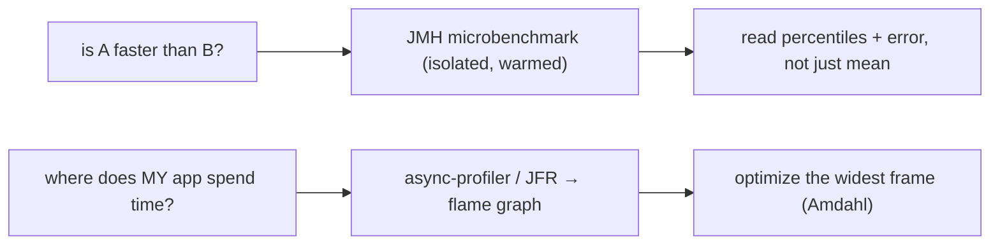

# 13 · Benchmarking the JVM Correctly

> Every performance claim in this part — JIT speedups, escape analysis, cache effects — is only true
> *after warmup* and only *if you measured it right*. On a JIT+GC platform, a naïve `System.nanoTime()`
> loop doesn't just give a fuzzy number; it gives a **confidently wrong** one. This chapter is how to
> not lie to yourself.
> [← Part 2 · Execution & Performance](README.md) · prev: 12 · JIT Optimizations

> **Predict first (2 min).** You time a method in a `for` loop with `System.nanoTime()` and it reports
> **0.3 ns** — faster than a single CPU cycle. What happened? And separately: your first 10,000
> iterations are 20× slower than the rest. Which number is "the" performance? Write your guesses.

---

## Why hand-rolled JVM benchmarks lie

The JVM is a *dynamic* runtime: it interprets, then profiles, then compiles, then re-compiles, all
while a GC runs concurrently. Measuring it like static native code produces artifacts:

- **Dead-code elimination.** If you never use the result, the JIT ([ch.12](README.md)) proves the
  work has no effect and **deletes it** — hence the prediction's *0.3 ns*: you measured an empty
  loop. The computation was optimized away.
- **Constant folding.** Benchmarking with literal inputs lets the JIT precompute the answer at
  compile time — you measure a constant load, not the algorithm.
- **Warmup / mixed tiers.** The prediction's second answer: *neither raw number alone.* Early
  iterations run interpreted or C1; only after the method goes hot and C2 compiles it do you see
  **steady-state peak** ([ch.11](README.md)). Averaging cold+hot measures a transient nobody runs in.
- **On-stack replacement & loop artifacts**, **GC pauses** landing inside a sample, **CPU frequency
  scaling / turbo**, and **the other JIT tricks** all skew a naïve loop.

The lesson: **don't hand-roll JVM microbenchmarks.** Use a harness built by people who fought these
exact demons — **JMH (Java Microbenchmark Harness)**, from the OpenJDK team.

## JMH: the tool, and the pieces that matter

JMH forks a **fresh JVM**, runs **warmup** iterations (discarded) until steady state, then **measurement**
iterations, across multiple forks, and reports a distribution:

```java
@BenchmarkMode(Mode.AverageTime)
@OutputTimeUnit(TimeUnit.NANOSECONDS)
@Warmup(iterations = 5, time = 1)      // discarded — let C2 compile
@Measurement(iterations = 5, time = 1) // recorded
@Fork(3)                               // fresh JVMs — average out layout luck
@State(Scope.Thread)
public class MyBench {
  @Benchmark
  public long measure(Blackhole bh) {  // return / consume the result!
    return compute(input);
  }
}
```

Two APIs exist *specifically* to defeat the optimizer:

- **`Blackhole`** — consume results so the JIT can't dead-code-eliminate the work. Return the value
  from `@Benchmark` (JMH sinks it) or call `bh.consume(x)`.
- **`@State` + non-`final`, non-constant inputs** — JMH supplies inputs the compiler can't fold, so
  you measure computation, not a precomputed constant.

⚡ `@Fork` matters: a single JVM can get "lucky/unlucky" with code layout, inlining decisions, and GC
timing. Multiple forks expose that variance instead of hiding it.

## Reading the result honestly

JMH reports **mean ± error** and **percentiles**. For anything user-facing, **percentiles beat the
mean** — p99/p99.9 latency is what your slowest requests feel, and GC pauses live in that tail. A
great mean with an ugly p99.9 is a bad service.

- **Score ± error overlapping?** The "difference" between two variants may be noise — don't ship a
  refactor on a difference inside the error bars.
- **`@BenchmarkMode`:** `Throughput` (ops/s) vs `AverageTime` vs `SampleTime` (percentile
  distribution) vs `SingleShotTime` (cold, one-shot — for measuring *startup*/first-call cost, the
  opposite regime).

## Beyond micro: profile the real thing

Microbenchmarks answer "is A faster than B in isolation?" — they do **not** tell you where *your app*
spends time. For that:

- **`async-profiler`** — low-overhead sampling of CPU, allocations, locks, cache misses; produces
  **flame graphs**. The wide frames are where the time goes — optimize those, ignore the rest.
- **JFR (Java Flight Recorder) + JDK Mission Control** — always-on, low-overhead production profiling:
  allocation, GC, locks, I/O, JIT events. ⚡ The principal move is **profile first, optimize the
  measured hot path** — never guess.
- **Amdahl's law reality check:** optimizing code that's 2% of runtime caps your win at 2%. Find the
  wide frame first.



## Make it visible

- **Watch a benchmark lie, then fix it.** Time an arithmetic method in a naïve `nanoTime` loop
  without using the result → absurd 0-ish ns. Port it to JMH with a `Blackhole` → a real, stable
  number. The gap is every artifact above.
- **See warmup.** `-XX:+PrintCompilation` alongside a JMH run — watch methods compile during warmup;
  the steady-state number arrives only after C2 fires.
- **Flame graph your app.** Run async-profiler on a real workload for 30s, open the flame graph, find
  the widest frame — usually *not* where you guessed.

## Self-Check (close the doc, answer out loud)

1. Give two reasons a naïve `nanoTime` loop reports a *faster-than-possible* number. What optimization causes each?
2. Why must JVM benchmarks warm up, and which number is "the" performance?
3. What do `Blackhole` and non-constant `@State` inputs defend against, respectively?
4. Why report percentiles (p99/p99.9), not just the mean — and where do GC pauses show up?
5. Microbenchmark vs profiler: which question does each answer, and what does Amdahl's law tell you to do first?

> **Go deeper:** JMH samples in the OpenJDK repo (read the "pitfalls" ones); Aleksey Shipilëv's JMH
> talks; async-profiler + Brendan Gregg on flame graphs. 🎉 This closes **Part 2 · Execution &
> Performance** — you now know how the JVM runs, optimizes, and how to *prove* it.
