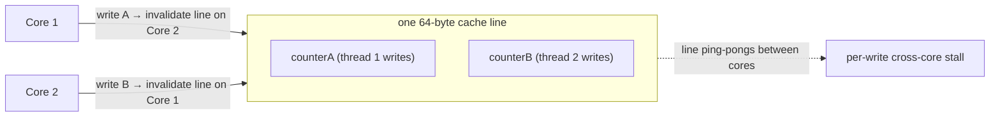

# 14 · Mechanical Sympathy

> Writing JVM code that respects the hardware underneath — the memory hierarchy, the **64-byte cache
> line**, **false sharing**, and data locality. Where a 64-byte accident costs you an order of
> magnitude, and where cache behavior beats Big-O for small N.
> [← Part 2 · Execution & Performance](README.md) · prev: 13 · Benchmarking the JVM Correctly

> **Predict first (2 min).** Two threads each increment their *own* `long` counter — no shared state,
> no locks. If those two `long`s happen to sit next to each other in memory, is it as fast as if they
> were far apart? And: summing a 2-D array row-by-row vs column-by-column — same work, same speed?
> Write your guesses.

---

## The memory hierarchy (why "just RAM" is a lie)

The CPU is *starved* waiting for memory; caches hide the gap — but only if you use them well:

| Level | Latency (~) | Size (~) |
|---|---|---|
| register | <1 ns | bytes |
| **L1** | ~1 ns (a few cycles) | ~32–64 KB / core |
| **L2** | ~4 ns | ~256 KB–1 MB / core |
| **L3** | ~10–20 ns | shared, MBs |
| **main memory** | **~100 ns** | GBs |
| SSD | ~16 µs | — |

An L1 hit vs a main-memory miss is **~100×**. So performance is often about *cache hits*, not
instruction count — a cache miss is ~hundreds of stalled cycles. (These are the same numbers behind
the [HLD track's](../../HLD/) "latency numbers every engineer should know.")

## Cache lines & false sharing (the first prediction)

Memory moves between caches in **64-byte cache lines**, not individual bytes. Coherency is per *line*:
when a core writes anywhere in a line, other cores' copies of that **whole line** are invalidated.

**False sharing:** two threads write two *different* variables that happen to share one cache line.
There's no logical contention — but the hardware ping-pongs the line's ownership between cores on
every write, each paying a cross-core stall. So the prediction: **no** — adjacent counters can be
**many times slower** than well-separated ones, purely from geometry. Correctness is fine; throughput
is destroyed by 64 bytes.

> ▶ **Watch it:** [`cpu-cache-false-sharing.html`](visualizations/cpu-cache-false-sharing.html) — two
> threads on one shared line ping-ponging ownership, then padded apart and flying.

**The fix — padding / `@Contended`:** push the two fields onto separate lines. Manual padding
(dummy longs around the hot field), or `@jdk.internal.vm.annotation.Contended` (needs
`-XX:-RestrictContended`), which the JVM honors by padding the field. This is *exactly* why
`LongAdder` stripes its cells onto separate lines ([chapter 18](../03-concurrency-and-jmm/)) and why
JCTools/Disruptor pad their hot fields.

## Data locality (the second prediction)

Because whole lines load, **access patterns that read contiguous memory are far faster.** Row-major
Java arrays: iterating a 2-D array **row-by-row** touches contiguous addresses (each cache line
prefetched serves many accesses); **column-by-column** strides across memory, missing the cache on
nearly every access — the *same* work, **several times slower**. So the prediction: **not the same
speed** — row-major wins big.

Corollaries a principal exploits:
- **Array-of-structs vs struct-of-arrays:** if you only touch one field across many elements, SoA
  (parallel primitive arrays) keeps that field contiguous — huge for scans.
- ⚡ **Pointer-chasing kills locality:** `LinkedList`, `HashMap` node chains, and object graphs
  scatter across the heap — each hop a likely miss. This is why `ArrayList`/`ArrayDeque` and
  primitive arrays beat "theoretically equal" linked structures ([chapter 21](../04-language-in-depth/)),
  and why **compact objects + fewer indirections** matter.
- **Branch prediction:** the CPU speculates branch direction; unpredictable branches cause
  mispredict stalls (~15–20 cycles). Sorted/predictable data can run dramatically faster than random
  through the same branch — sometimes worth sorting first.

## When this matters (and when it doesn't)

Mechanical sympathy is the *last* layer, not the first: get the algorithm and the allocation rate
right ([Part 1](../01-memory-and-gc/)) before you count cache lines. But for **hot inner loops,
tight data structures, and high-throughput concurrent code**, cache behavior *is* the performance —
and for small, cache-resident N, a "worse" Big-O with great locality routinely beats a "better" one
that pointer-chases. Measure it ([chapter 13](README.md)) — don't assume.

## Make it visible

- **Reproduce false sharing.** Two threads incrementing two adjacent `volatile long`s in a shared
  object; JMH the throughput. Pad them (7 dummy longs between, or `@Contended`) and re-measure — a
  multiple-x speedup from moving 64 bytes.
- **Row vs column.** JMH summing a large `int[N][N]` row-major vs column-major — same operations,
  several-x difference. That gap *is* the cache.
- **The sorted-branch trick.** Sum only elements `> threshold` over a large array, random vs
  pre-sorted — the sorted version runs faster thanks to branch prediction.

## Self-Check (close the doc, answer out loud)

1. Give the rough latency of L1 vs main memory. Why does that make "cache hits" more important than instruction count?
2. What is a cache line, and mechanically what is false sharing? Why is it invisible to correctness?
3. How do you fix false sharing, and what real classes rely on that fix?
4. Why is row-major array iteration faster than column-major? What are AoS vs SoA?
5. Why does pointer-chasing (LinkedList, node chains) hurt, and what does that imply for data-structure choice?
6. When should you *not* be thinking about cache lines yet?

> **Go deeper:** Martin Thompson's "Mechanical Sympathy" blog & the LMAX Disruptor; Ulrich Drepper's
> *"What Every Programmer Should Know About Memory"*; then [Part 3 · Concurrency](../03-concurrency-and-jmm/)
> where false sharing and `LongAdder` recur.
