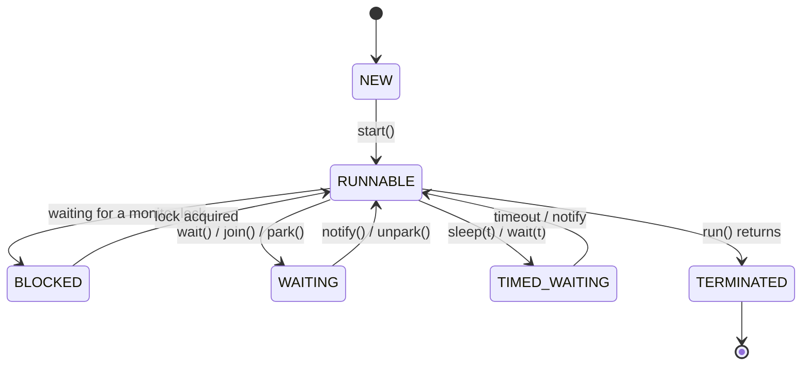

# 15 · Threads & the OS

> What a Java thread *is* underneath — an OS thread with a real cost — its states and scheduling, and
> why "just add more threads" stops scaling. The foundation the whole concurrency part rests on (and
> the problem virtual threads later solve).
> [← Part 3 · Concurrency & the JMM](README.md) · next: 16 · The Java Memory Model

> **Predict first (2 min).** Roughly how much memory does one idle platform thread cost, and about
> how many can a typical server create before it falls over? And: with 8 CPU cores, does running 800
> threads get your CPU-bound work done ~100× faster? Write your guesses.

---

## A platform thread *is* an OS thread

`new Thread()` (the classic "platform" thread) is a **thin wrapper over a native OS thread** —
`Thread.start()` makes a system call; the **OS kernel scheduler** owns it from there. That inheritance
sets the cost:

- **Stack memory:** each thread reserves a stack — **~1 MB** by default (`-Xss`), committed lazily but
  reserved up front. So ~a few thousand threads ≈ **gigabytes** of stack; you hit
  `OutOfMemoryError: unable to create native thread` in the **low thousands** on typical settings
  (that's the first prediction — not tens of thousands). Stack lives *outside* the heap
  ([chapter 04](../00-platform-and-mental-model/) — this OOM isn't a heap OOM).
- **Context switches** are a kernel operation (~µs) that also **cold the CPU caches** — real work lost
  on every switch. Thousands of runnable threads on a few cores = **thrashing**, not throughput.
- **Creation** is heavyweight — hence **thread pools** ([chapter 18](README.md)): reuse threads
  instead of paying start/stop repeatedly.

That answers the whole "add threads = go faster" myth: with 8 cores you get **~8-way parallelism** for
CPU-bound work regardless of thread count; 800 threads just add switching overhead and memory
pressure. More threads help only when threads are **waiting** (I/O) — and even then thread *cost* caps
you, which is exactly the wall [virtual threads](README.md) break.

---

## Thread states (the `Thread.State` enum)

⚡ **`RUNNABLE` is a lie of omission:** the JVM can't tell "running on a CPU" from "runnable but
waiting for a core" from "blocked in a native/OS call (e.g. socket read)" — they're *all* `RUNNABLE`.
So a thread dump showing many `RUNNABLE` threads in socket reads is *waiting on I/O*, not burning CPU.
`BLOCKED` = specifically waiting to enter a `synchronized` monitor ([chapter 17](README.md));
`WAITING`/`TIMED_WAITING` = `wait`/`join`/`park`/`sleep`.

## Daemon vs non-daemon, priorities, interruption

- **Daemon threads** don't keep the JVM alive — the JVM exits when only daemons remain (background
  workers, GC threads are daemons). ⚡ Set `setDaemon(true)` *before* `start()`.
- **Priorities** (`setPriority`) are a **hint** the OS may ignore — don't design around them.
- **Interruption** is cooperative: `interrupt()` sets a flag / wakes a blocking call with
  `InterruptedException`; code must *check* it. ⚡ `Thread.stop()` is dead (unsafe — could corrupt
  state mid-mutation); there is no safe forcible kill — you cooperate.

---

## Make it visible

- **Feel the ceiling.** Loop `new Thread(() -> sleep(large)).start()` and count how many succeed before
  `unable to create native thread` — a few thousand. Then do it with
  `Executors.newVirtualThreadPerTaskExecutor()` — *millions* ([chapter 19](README.md)).
- **Read a thread dump.** `jstack <pid>` (or `jcmd <pid> Thread.print`): each thread shows its
  `Thread.State` and stack. Spot `BLOCKED` on a monitor (contention), and a deadlock (jstack flags
  "Found one Java-level deadlock" with the cycle).
- **Watch context-switch cost.** Run CPU-bound work with `threads = cores`, then `= cores × 100`;
  throughput *drops* with the oversubscription. Prove the myth wrong with numbers.

---

## Self-Check (close the doc, answer out loud)

1. What is a platform thread in relation to the OS? Name its two main costs.
2. About how much memory per thread, and roughly how many before `unable to create native thread`?
   Which memory region is that?
3. Why doesn't 800 threads on 8 cores speed up CPU-bound work ~100×? When *do* more threads help?
4. Name the `Thread.State`s. Why is `RUNNABLE` ambiguous, and what does `BLOCKED` specifically mean?
5. Daemon vs non-daemon; when does the JVM exit? Why are priorities unreliable?
6. Why is `Thread.stop()` gone, and how do you actually stop a thread?

> **Go deeper:** *Java Concurrency in Practice* ch. 1; the `Thread`/`Thread.State` JavaDoc; then
> [16 · The Java Memory Model](README.md) — the rules that make multi-threaded code *correct*, and
> [19 · Virtual Threads](README.md) — how Loom escapes this chapter's cost ceiling.
