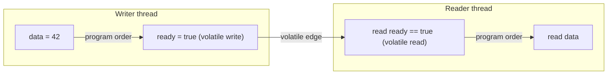

# 16 · The Java Memory Model

> Why a correctly-looking concurrent program can produce results that seem *impossible* — and the one
> concept (**happens-before**) that is the entire contract for making it correct.
> [← Part 3 · Concurrency & the JMM](README.md) · prev: 15 · Threads & the OS · next: 17 · Locks & Synchronization

> **Predict first (2 min).** One thread does `data = 42; ready = true;`. Another does
> `if (ready) print(data);`. With no `volatile`/locks, can the second thread print **0**? And: can a
> reader looping `while (!stop) {}` on a plain `boolean stop` loop **forever** after another thread
> sets `stop = true`? Write your guesses.

---

## Your code is not executed in the order you wrote it

For single-threaded correctness the JVM only has to preserve *as-if-serial* semantics — the result
must look like your program order *to that one thread*. To go fast, three layers reorder and delay
your memory operations, and all of it is invisible within one thread but **visible across threads**:

- **The compiler (javac + JIT)** reorders independent operations.
- **The CPU** executes out-of-order and buffers stores (a write may sit in a store buffer, unseen by
  other cores, for a while).
- **Caches** mean a write by core A isn't instantly visible to core B.

So `data = 42; ready = true;` has *no dependency* between the two stores — and any of those layers
may make `ready = true` visible to another thread **before** `data = 42`. That's the answer to the
first prediction: **yes, the reader can print 0.**

> ▶ **Watch it:** [`reordering.html`](visualizations/reordering.html) — shuffle two threads'
> operations within the rules, watch a data race produce the "impossible" result, then add a
> `volatile` edge that forbids it.

---

## Happens-before: the entire contract

The Java Memory Model doesn't describe *which* reorderings happen (that varies by CPU/JIT). It gives
you a single guarantee to reason with:

> **If action A *happens-before* action B, then A's effects are visible to B, and A is ordered before
> B.** If there is *no* happens-before edge between two conflicting accesses, you have a **data race**
> and **no guarantees at all**.

You don't reason about caches and store buffers; you reason about **edges**. These are the ways to
create one:

| happens-before edge | A happens-before B when… |
|---|---|
| **Program order** | A precedes B in the *same thread* |
| **Monitor** | an unlock of monitor M (A) precedes a later lock of M (B) |
| **`volatile`** | a write to a volatile field (A) precedes a later read of it (B) |
| **Thread start** | `t.start()` (A) precedes any action in thread `t` (B) |
| **Thread join** | any action in `t` (A) precedes another thread's return from `t.join()` (B) |
| **Transitivity** | A hb B and B hb C ⟹ A hb C |

The chain that makes the flag example correct: `data=42` **hb** `ready=true` (program order) **hb**
`read ready` (volatile) **hb** `read data` (program order). By transitivity, `data=42` happens-before
`read data` — so the reader is **guaranteed** to see 42. Remove `volatile` and the middle edge
vanishes; the chain breaks; 0 becomes possible.

---

## `volatile` — exactly what it gives, and what it doesn't

A `volatile` field provides two things:

1. **Visibility** — a write is immediately visible to subsequent reads (no caching staleness).
2. **Ordering** — it acts as a fence: operations before a volatile *write* can't move after it
   (release), and operations after a volatile *read* can't move before it (acquire).

What it does **not** give you: **atomicity of compound actions.** `volatile int n; n++;` is *still* a
race — `n++` is read-modify-write, three operations, and two threads can interleave and lose an
update. `volatile` makes each *single* read and write visible/ordered; it does not make a
read-modify-write indivisible. For that you need an atomic (`AtomicInteger`) or a lock
([chapters 17–18](README.md)).

That's the second prediction: **`while (!stop) {}` on a plain `boolean` can loop forever** — with no
happens-before edge, the JIT may hoist the read out of the loop (it's allowed to assume no other
thread changes it) and never re-read `stop`. Mark `stop` **`volatile`** and the loop is guaranteed to
terminate. This exact bug is a rite of passage.

---

## `final` fields — safe publication for free

There's a special guarantee for `final` fields: once a constructor completes, a thread that obtains
the object reference is guaranteed to see the **correctly-initialized values of its `final` fields**,
*without any synchronization* — **provided the `this` reference did not escape during construction**
(don't publish `this`, e.g. register a listener, before the constructor returns). This is *why
immutable objects are automatically thread-safe to share*: their `final` fields are safely published,
so any thread sees fully-constructed values. (It's also the deep reason `String` immutability is
load-bearing — [chapter 22](../04-language-in-depth/).)

---

## Data races vs. race conditions

- A **data race** is the *memory-model* defect above: conflicting accesses (≥1 write) with no
  happens-before edge. A program with data races has **undefined** ordering/visibility — it can
  produce results no sequential interleaving allows (the "impossible" outcome).
- A **race condition** is a *logic* bug (check-then-act, lost update) that can exist even in
  perfectly synchronized code. Don't conflate them. A principal eliminates data races *entirely*
  (every shared mutable access is ordered by some edge) and then reasons about race conditions on top.

---

## Make it visible

- **The visibility loop.** Write a reader that spins on a non-`volatile` `boolean` another thread
  flips after a delay. With the JIT warm, it often **never stops**. Add `volatile` → it stops. You
  just observed a missing happens-before edge.
- **The "impossible" result.** Use [jcstress](https://github.com/openjdk/jcstress) (the JCStress
  harness) to run the `x=1;r1=y | y=1;r2=x` test millions of times; it will report the `r1==0 &&
  r2==0` outcome that no interleaving explains — reordering, measured.
- **Reason in edges.** For any shared field, ask out loud: "what happens-before edge makes this
  write visible to that read?" If you can't name one, it's a data race.

---

## Self-Check (close the doc, answer out loud)

1. Name the three layers that reorder/delay your memory operations. Why is it invisible single-threaded?
2. State the happens-before guarantee in one sentence. What does the *absence* of an edge mean?
3. List the happens-before edges. Trace the chain that makes the `data`/`ready` flag example correct.
4. What two things does `volatile` guarantee, and what does it explicitly *not*? Why is `volatile`
   `n++` still a race?
5. Why can `while (!stop){}` on a plain boolean loop forever, and what fixes it?
6. State the `final`-field guarantee and its one precondition. Why does it make immutable objects
   safe to share?

> **Go deeper:** *Java Concurrency in Practice* (Goetz) ch. 3 & 16; JLS §17.4 (the JMM — the primary
> source); Aleksey Shipilëv's "Close Encounters of the Java Memory Model Kind". Then
> [17 · Locks & Synchronization Internals](README.md), which is happens-before via monitors.
