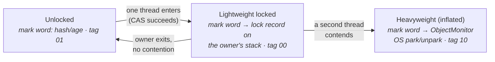

# 17 · Locks & Synchronization Internals

> What `synchronized` actually does — the monitor in the **mark word**, the cheap **lightweight
> (CAS)** path, **inflation** to a heavyweight OS monitor under contention, and `wait`/`notify`
> mechanics. The takeaway: *uncontended locks are nearly free; contention is what costs.*
> [← Part 3 · Concurrency & the JMM](README.md) · prev: 16 · The Java Memory Model · next: 18 · java.util.concurrent

> **Predict first (2 min).** A `synchronized` block that only one thread ever enters — roughly how
> expensive is acquiring it: a system call, a context switch, or a single atomic CPU instruction?
> And what changes the moment a *second* thread starts competing for it? Write your guesses.

---

## Every object is a monitor (it's in the header)

`synchronized` locks an **object monitor**, and the lock state lives in the object's **mark word**
([chapter 05](../01-memory-and-gc/05-object-layout-in-memory.md) — the header bits animation showed
these exact states). The JVM escalates the implementation as contention appears:

### The lightweight path (the common case)

Entering an uncontended `synchronized`: the JVM copies the mark word into a **lock record** on the
thread's stack and does **one CAS** to swing the object's mark word to point at that record. Exit =
one CAS back. **No system call, no OS involvement** — that's the answer to the first prediction:
**a single atomic instruction**, a few nanoseconds. This is why "synchronized is slow" is folklore
for uncontended locks (and the JIT may even **elide or coarsen** locks it can prove safe —
[chapter 12](../02-execution-and-performance/)).

### Inflation (what contention buys you)

The moment a second thread's CAS **fails** — the second prediction — spinning briefly may help, but
persistent contention makes the JVM **inflate** the lock: it allocates an **`ObjectMonitor`** (a
native structure with an owner, an entry queue, and a wait set) and points the mark word at it
(displacing the hash/age bits into the monitor). Now blocked threads **park** — a *system call*, the
thread descheduled by the OS — and are **unparked** when the owner exits. Cost jumps from nanoseconds
to microseconds+ (park/unpark, context switches, cache-cooling). ⚡ Inflation is effectively one-way
(deflation is rare) — one burst of contention leaves the lock heavyweight.

> ▶ **Watch it:** [`lock-inflation.html`](visualizations/lock-inflation.html) — one thread CAS-ing
> the mark word (cheap), a second thread contending, the monitor inflating, and threads parking in
> the entry queue.

⚡ **Biased locking is gone** (disabled JDK 15, removed 18) — old blogs describe a "biased" first
state; on modern JVMs the ladder starts at lightweight. And this inflation story is exactly why
**virtual threads pin** inside `synchronized` on Java 21 ([chapter 19](README.md)) — the monitor is
JVM/OS-level, opaque to Loom's unmounting.

---

## `wait` / `notify` — the monitor's second queue

An inflated monitor has **two** thread sets: the **entry queue** (blocked trying to *enter*) and the
**wait set** (called `wait()` — gave the lock back and sleeps until notified):

- You must **hold the monitor** to call `wait`/`notify`/`notifyAll` (else
  `IllegalMonitorStateException`).
- `wait()` atomically **releases the lock** and joins the wait set; `notify()` moves one (arbitrary)
  waiter to the entry queue — it still must **re-acquire** the lock before returning from `wait()`.
- ⚡ **Always `wait()` in a loop** re-checking the condition: **spurious wakeups** are permitted, and
  with multiple waiters/conditions, being notified ≠ your condition is true.
  `while (!ready) lock.wait();` — never `if`.
- Prefer `notifyAll()` unless you can prove one waiter suffices; better yet, prefer the j.u.c.
  equivalents (`Condition.await/signal`) or higher-level tools ([chapter 18](README.md)).

### `synchronized` vs `ReentrantLock` (the practical choice)

Both are **reentrant** (the owner can re-enter; a hold count tracks depth) and create the same
happens-before edges ([chapter 16](README.md)). `synchronized`: zero ceremony, can't forget to
unlock, but no timeout/interrupt/fairness — and pins virtual threads (21). `ReentrantLock`:
`tryLock(timeout)`, `lockInterruptibly()`, optional fairness, multiple `Condition`s — and
virtual-thread-friendly. Default to `synchronized` for simple guards; reach for `ReentrantLock` when
you need any of those features (or run virtual threads around blocking calls).

---

## Make it visible

- **Measure the cliff.** JMH an uncontended `synchronized` increment (single thread), then the same
  with 8 threads — watch ns/op jump ~an order of magnitude as the lock inflates and threads park.
- **See the mark word change.** JOL `ClassLayout.parseInstance(obj)` before, inside, and after a
  `synchronized(obj)` block (and from a contended run) — the header prints unlocked / lightweight /
  fat-lock states.
- **Catch a spurious-wakeup bug.** Write a `wait()` guarded by `if`; with two producer/consumer pairs
  on one lock, watch a consumer proceed on a false condition. Change to `while` — fixed.

---

## Self-Check (close the doc, answer out loud)

1. Where does a lock live for an unlocked/lightweight/inflated monitor? What's in the mark word in each state?
2. What does entering an *uncontended* `synchronized` cost, mechanically? Why is "synchronized is slow" folklore?
3. What triggers inflation, what is an `ObjectMonitor`, and why does contention cost microseconds?
4. Entry queue vs wait set. Walk `wait()` → `notify()` → return-from-`wait()` — who holds the lock when?
5. Why must `wait()` be in a loop? What removed feature do old blogs still describe?
6. When do you pick `ReentrantLock` over `synchronized`? Which pins virtual threads on Java 21?

> **Go deeper:** the HotSpot `ObjectMonitor` sources; Shipilëv's JVM Anatomy Quarks on locking; then
> [18 · java.util.concurrent](README.md) — locks built *in Java* on CAS + AQS instead of monitors.
