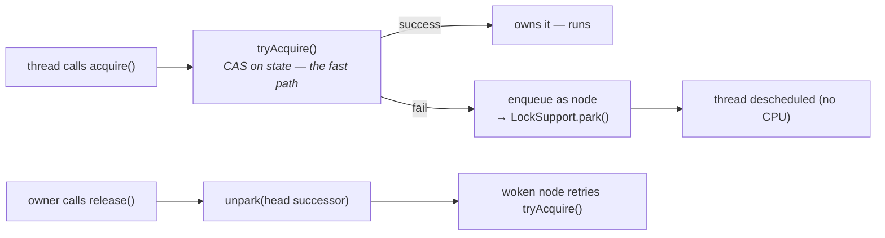

# 18 · java.util.concurrent

> The toolkit built *in Java* on two primitives — **CAS** and **`AbstractQueuedSynchronizer`** — and
> how one queue mechanism powers `ReentrantLock`, `Semaphore`, `CountDownLatch`, and friends. Plus
> the atomics, `ConcurrentHashMap`, and sizing thread pools like you mean it.
> [← Part 3 · Concurrency & the JMM](README.md) · prev: 17 · Locks & Synchronization · next: 19 · Virtual Threads

> **Predict first (2 min).** `ReentrantLock` blocks threads without using `synchronized` — so *how*
> does a losing thread actually wait (spin? sleep? something else)? And: 32 threads hammering one
> counter — is `AtomicLong` or `LongAdder` faster, and why? Write your guesses.

---

## CAS — the primitive under everything

**Compare-and-swap**: *"if this memory location still holds `expected`, set it to `new` — atomically,
in one CPU instruction."* Fail? Loop and retry. This **lock-free optimistic** loop is how
`AtomicInteger.incrementAndGet()` works — no monitor, no parking, just retry-until-win:

```java
do { cur = value.get(); } while (!value.compareAndSet(cur, cur + 1));
```

- The **atomics** (`AtomicInteger/Long/Reference`, field updaters, `VarHandle`) wrap CAS with the
  right memory semantics (volatile-strength happens-before — [chapter 16](README.md)).
- ⚡ **The ABA problem:** CAS only checks the *value*. If it went A→B→A while you weren't looking,
  your CAS succeeds on stale assumptions. Fix: `AtomicStampedReference` (value + version stamp) —
  mostly a concern for lock-free data structures reusing nodes.

### `AtomicLong` vs `LongAdder` (the second prediction)

Under heavy contention every CAS on an `AtomicLong` fights for the **same cache line** — most
attempts fail and retry (and false-sharing-style ping-pong burns the bus —
[chapter 14](../02-execution-and-performance/)). **`LongAdder` wins big**: it **stripes** the count
across multiple cells (each on its own cache line); threads CAS *different* cells; `sum()` adds them
up. Trade-off: reads are weaker/costlier — use `LongAdder` for hot write-mostly counters (metrics),
`AtomicLong` when you need exact reads or CAS semantics.

---

## AQS — one queue, many synchronizers

`AbstractQueuedSynchronizer` is the framework behind most of j.u.c. It provides two things:

1. an **atomic `int state`** manipulated by CAS, and
2. a **FIFO queue** (CLH-style, doubly-linked) of waiting threads, parked and unparked precisely.



So the first prediction: a losing `ReentrantLock.lock()` **enqueues itself and calls
`LockSupport.park()`** — the thread is descheduled (no spinning, no sleep-polling) until a `release`
**unparks** the head's successor, which retries. Subclasses only define what `state` *means* by
overriding `tryAcquire`/`tryRelease`:

| Synchronizer | `state` means | acquire succeeds when |
|---|---|---|
| **`ReentrantLock`** | hold count (0 = free) | CAS 0→1, or owner re-enters (state++) |
| **`Semaphore`** | permits remaining | state ≥ n → CAS state−n *(shared mode)* |
| **`CountDownLatch`** | remaining count | state == 0 (await parks until countDown hits 0) |
| **`ReentrantReadWriteLock`** | high bits = readers, low = writer | read: no writer; write: fully free |

> ▶ **Watch it:** [`aqs-queue.html`](visualizations/aqs-queue.html) — threads CAS-ing `state`,
> losers parking in the FIFO queue, and `release` unparking them in order.

**Fair vs non-fair:** non-fair (default) lets a fresh thread **barge** — CAS before checking the
queue — better throughput, possible starvation; fair always queues — predictable, slower.
(`Condition.await/signal` are the `wait/notify` analog, built on the same queue machinery — and
unlike monitors, one lock can have *several* Conditions.)

---

## `ConcurrentHashMap` & friends (recall from [ch.21](../04-language-in-depth/21-collections-internals.md))

Reads are lock-free volatile reads; writes CAS an empty bin or `synchronized` on just that bin's
head; resize is cooperative; `size()` uses `LongAdder`-style cells. ⚡ No nulls; iterators weakly
consistent. Use `compute`/`merge`/`putIfAbsent` for atomic read-modify-write per key — ⚡
`if (!map.containsKey(k)) map.put(k,v)` is a check-then-act race. Also know: `CopyOnWriteArrayList`
(read-mostly listener lists — every write copies the array), `BlockingQueue` (`ArrayBlockingQueue`
bounded / `LinkedBlockingQueue` / `SynchronousQueue` handoff) — the producer-consumer backbone.

---

## Executors & thread pools — size them deliberately

`ThreadPoolExecutor(core, max, keepAlive, workQueue, rejectionHandler)` — and the interplay is the
trap: ⚡ **max kicks in only when the queue is FULL.** With an *unbounded* queue (what
`Executors.newFixedThreadPool` uses), `max` never matters and the queue can OOM.

- **Sizing:** CPU-bound → ≈ cores. IO-bound → cores × (1 + wait/compute) — or on Java 21, use
  **virtual threads** ([chapter 19](README.md)) and stop sizing for I/O entirely.
- **Queue:** bounded (`ArrayBlockingQueue`) = backpressure; `SynchronousQueue` = direct handoff.
- **Rejection:** `AbortPolicy` (default, throws), **`CallerRunsPolicy`** (the submitter runs it —
  natural throttling), `Discard*` (silent — ⚡ rarely right).
- ⚡ Avoid `Executors.newCachedThreadPool` (unbounded *threads*) and unbounded-queue fixed pools in
  prod; construct `ThreadPoolExecutor` explicitly and name your threads.

---

## Make it visible

- **Park, not spin.** Have 4 threads contend a `ReentrantLock` held for 2 s; `jstack` shows waiters in
  `WAITING (parking)` at `LockSupport.park` — with the AQS frame right below.
- **`LongAdder` vs `AtomicLong`.** JMH both with 1 vs 32 threads — watch `AtomicLong` collapse under
  contention while `LongAdder` scales.
- **The unbounded-queue trap.** Fixed pool of 2 + unbounded queue + producers faster than consumers:
  watch queue depth (and heap) climb forever. Swap in a bounded queue + `CallerRunsPolicy` → stable.

---

## Self-Check (close the doc, answer out loud)

1. What does CAS do, what's the retry loop, and what's the ABA problem + its fix?
2. Why does `LongAdder` beat `AtomicLong` under contention? What's the trade-off?
3. What two things does AQS provide? How does a losing thread wait, and how is it woken?
4. What does `state` mean for `ReentrantLock`, `Semaphore`, and `CountDownLatch`?
5. Fair vs non-fair locking — mechanism and trade-off?
6. Why can `max` threads never kick in on a `newFixedThreadPool`? Name a safe pool recipe.

> **Go deeper:** Doug Lea's AQS paper (*"The java.util.concurrent Synchronizer Framework"*); read
> `AbstractQueuedSynchronizer.java` (the JDK's best-commented class); *JCiP* ch. 13–15. Then
> [19 · Virtual Threads](README.md) — which changes the *cost model* these tools were built for.
