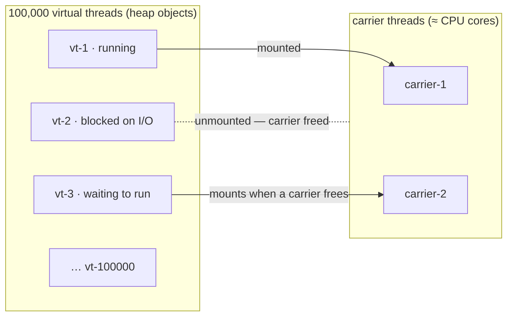

# 19 · Virtual Threads & Structured Concurrency (Project Loom)

> Millions of threads, blocking made nearly free — how virtual threads **mount and unmount** on a few
> carrier threads, the one bug to hunt (**pinning**), and the model that brings thread-per-request back.
> [← Part 3 · Concurrency & the JMM](README.md) · prev: 18 · java.util.concurrent

> **Predict first (2 min).** 100,000 virtual threads each block on a 1-second network call. Roughly
> how many *OS threads* does the JVM need to run them — 100,000, a few thousand, or about the number
> of CPU cores? And: what happens if one of those blocking calls sits inside a `synchronized` block?
> Write your guesses.

---

## The problem: platform threads are expensive

A **platform thread** wraps an OS thread ([chapter 15](README.md)): ~1 MB of stack, kernel scheduling,
costly context switches. A server doing blocking I/O ties up one for the *entire* request — mostly
**waiting**. That's why we got thread pools ("don't create too many"), and then reactive stacks
("never block") — both are workarounds for *thread cost*, and reactive pays with inverted, harder code.

**Virtual threads** (standard since **Java 21**, JEP 444) attack the cost itself: a virtual thread is
a **cheap object on the heap** (a *continuation* — its stack lives on the heap, growing/shrinking as
needed, starting at a few hundred bytes), scheduled *by the JVM*, not the OS.

---

## Mount, unmount, and why blocking becomes free

The JVM keeps a small pool of **carrier threads** (platform threads, defaults ≈ CPU cores, a
ForkJoinPool). A virtual thread **mounts** a carrier to run and **unmounts** the moment it blocks:

When `vt-2` calls a blocking operation (socket read, `sleep`, `Lock`, `Future.get` — the JDK's
blocking calls were retrofitted), the JVM **parks the continuation on the heap and releases the
carrier**, which immediately runs another virtual thread. When the I/O completes, `vt-2` is
rescheduled onto *some* carrier.

So the first prediction: 100,000 blocked virtual threads need **≈ CPU-cores** OS threads — the
carriers. Blocking a virtual thread costs a heap-state save, not an OS thread. **You get NIO-like
scalability while writing plain, sequential, blocking code.**

> ▶ **Watch it:** [`virtual-threads.html`](visualizations/virtual-threads.html) — many virtual
> threads sharing two carriers: blocking unmounts, the carrier picks up the next one — then a
> `synchronized` block **pins** a carrier and throughput collapses.

### The rules that follow

- **Don't pool virtual threads.** They're cheap — create one per task
  (`Executors.newVirtualThreadPerTaskExecutor()`, `Thread.ofVirtual().start(...)`). Pooling them
  reintroduces the scarcity they eliminate. For **rate-limiting** a resource, use a `Semaphore`, not a pool.
- **Same memory model.** Everything from [chapter 16](README.md) (happens-before, `volatile`, locks)
  applies unchanged — Loom changes the *cost model*, not the JMM.
- **⚡ `ThreadLocal` still works but scales badly** (a value per million threads); prefer
  **`ScopedValue`** (structured, immutable per-scope).
- **CPU-bound work gains nothing** — there's no waiting to reclaim; you still have ~cores of parallelism.

---

## Pinning — the one bug to hunt

The second prediction: if the blocking call sits **inside a `synchronized` block** (or a native/JNI
frame), the virtual thread **cannot unmount** — it stays **pinned** to its carrier, which blocks like
a plain OS thread. A few pinned carriers = the whole scheduler starves; throughput collapses exactly
where you expected Loom to shine.

- **Detect:** `-Djdk.tracePinnedThreads=full` prints a stack trace whenever a pinned thread blocks;
  JFR emits `jdk.VirtualThreadPinned` events.
- **Fix:** replace `synchronized` around blocking calls with **`ReentrantLock`** (j.u.c. locks
  unmount fine — [chapter 18](README.md)); upgrade libraries that hold monitors around I/O.
- **Version note:** JDK 24 (JEP 491) removes most `synchronized` pinning — but on **21 LTS**, pinning
  is real and this is *the* production gotcha.

---

## Structured concurrency (the companion model)

`StructuredTaskScope` (preview through 21+, standard in later versions — see
[VERSION-CHANGES](../VERSION-CHANGES.md)) treats concurrent subtasks like a *scope*: fork subtasks,
join them all, and the scope **cannot leak** a running thread — cancel-on-failure
(`ShutdownOnFailure`), errors propagate with clean stack traces. It replaces the "fire
`CompletableFuture`s and hope" style with block-structured lifetimes — and `ScopedValue` carries
context down the tree.

### Virtual threads vs reactive (the decision)

Same scalability goal, different programming model: reactive (WebFlux/Reactor) gets it with
**non-blocking composition** (harder to write/debug, infectious types); virtual threads get it with
**plain blocking code**. On Java 21+, for typical request/response services, **virtual threads make
reactive unnecessary**; reactive still earns its keep for *streaming*, backpressure-heavy pipelines.
(Spring Boot 3.2+: `spring.threads.virtual.enabled=true` — [the spring track](../../spring-boot/03-web-mvc-and-reactive/).)

---

## Make it visible

- **100k threads, trivially.** `try (var ex = Executors.newVirtualThreadPerTaskExecutor()) { IntStream.range(0,100_000).forEach(i -> ex.submit(() -> { Thread.sleep(1000); return i; })); }` —
  finishes in ~1s. Try that with platform threads and watch the OOM (`unable to create native thread`).
- **See the carriers.** Print `Thread.currentThread()` inside tasks — virtual threads show
  `VirtualThread[#…]/runnable@ForkJoinPool-1-worker-N`: the worker *is* the carrier, and it changes
  across a blocking call (proof of unmount/remount).
- **Cause and catch pinning.** Wrap the sleep in `synchronized` and rerun with
  `-Djdk.tracePinnedThreads=full` — watch the stack traces and the elapsed time balloon.

---

## Self-Check (close the doc, answer out loud)

1. What *is* a virtual thread (where does its stack live), and what's a carrier thread?
2. Walk mount → block → unmount → resume. Why does blocking become nearly free?
3. Why should you never pool virtual threads, and what do you use instead to limit concurrency?
4. What is pinning, what causes it on Java 21, how do you detect it, and how do you fix it?
5. What does structured concurrency add over spawning futures? What replaces `ThreadLocal`?
6. Virtual threads vs reactive — when is each the right call on Java 21+?

> **Go deeper:** JEP 444 (virtual threads), JEP 453 (structured concurrency), JEP 491 (pinning fix);
> *"Java's Virtual Threads"* deep-dives by the Loom team. **This closes Part 3's core arc:** threads
> ([15](README.md)) → the JMM ([16](README.md)) → locks ([17](README.md)) → j.u.c. ([18](README.md)) →
> Loom.
