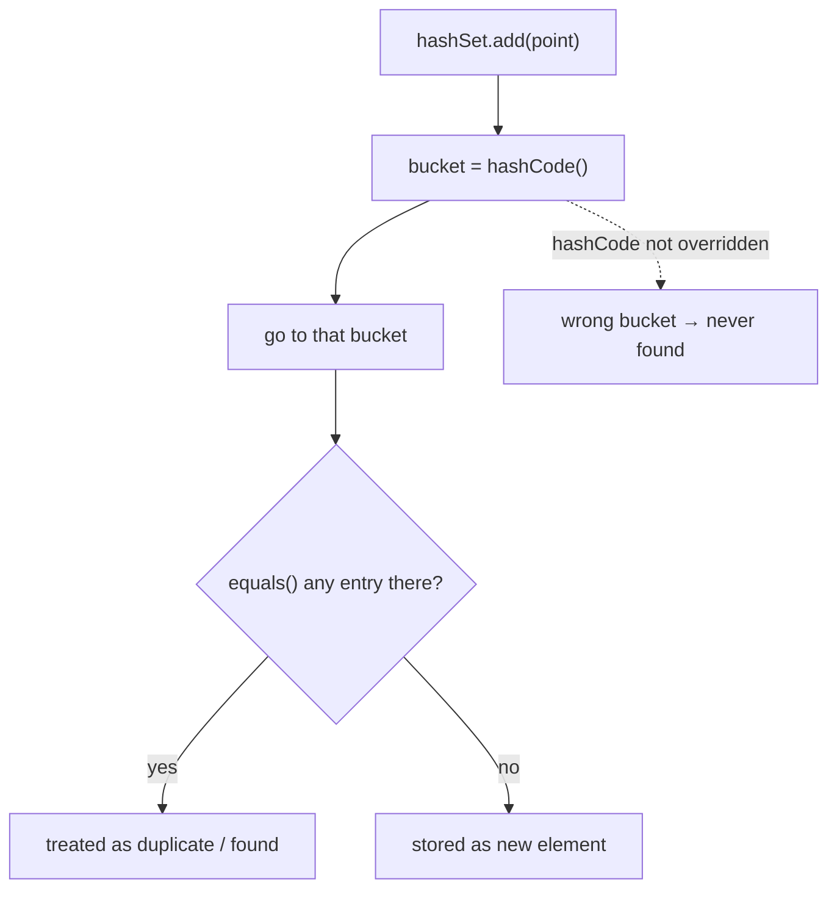

# 23 · Equality: equals, hashCode & Comparable

> Get `equals`/`hashCode` subtly wrong and objects **vanish** from `HashMap`s, duplicates slip into
> `HashSet`s, and `TreeMap` silently drops entries. This chapter is the contract — and *why* every
> hash-based and sorted collection depends on you honoring it.
> [← Part 4 · The Language in Depth](README.md) · next: 24 · Modern Java Features

> **Predict first (2 min).** You override `equals` on a `Point` (equal if x,y match) but forget to
> override `hashCode`. You put a `Point(1,2)` into a `HashSet`, then call `contains(new Point(1,2))`.
> What does it return, and why? Write your guess.

---

## The `equals` contract — five rules the JDK assumes

`Object.equals` defaults to **reference identity** (`==`). Overriding it for *value* equality means
honoring a contract every collection relies on:

- **Reflexive:** `x.equals(x)` is true.
- **Symmetric:** `x.equals(y) == y.equals(x)`. (Broken famously by subclass-vs-superclass equals.)
- **Transitive:** `x.equals(y)` and `y.equals(z)` ⇒ `x.equals(z)`.
- **Consistent:** repeated calls give the same result (don't depend on mutable/random state).
- **Non-null:** `x.equals(null)` is false.

⚡ A correct `equals` checks `this == o` (fast path), does an exact-class check (`getClass() != o.getClass()`
— `instanceof` breaks symmetry across subclasses), then compares the significant fields.

## `hashCode`: the contract that makes hashing work

The rule that bites everyone — the prediction's answer:

> **If `a.equals(b)` is true, then `a.hashCode() == b.hashCode()` must be true.**

Forget to override `hashCode` and two "equal" `Point`s get **different** default (identity)
hashes. In a `HashSet`/`HashMap`, the lookup goes to the **bucket** for `hashCode` first, only *then*
uses `equals` within that bucket ([ch.21](README.md)). Different hash → different bucket → `equals`
is never even consulted → `contains(new Point(1,2))` returns **`false`**, and your object has
effectively vanished. That's the single most common Java correctness bug.

- The **reverse is not required:** unequal objects *may* share a hashCode (a collision) — legal, just
  slower. But a good `hashCode` spreads values to minimize collisions.
- ⚡ **Always override them together.** `equals` without `hashCode` = broken hashing; `hashCode`
  without `equals` = pointless. Modern Java: `Objects.equals(a,b)` and `Objects.hash(f1,f2,…)` make
  both one-liners — or use a **`record`** ([ch.24](README.md)), which generates both correctly from
  the components.

```java
record Point(int x, int y) {}          // equals + hashCode auto-generated, contract-correct
// vs the manual form:
@Override public boolean equals(Object o){
  if (this == o) return true;
  if (o == null || getClass() != o.getClass()) return false;
  Point p = (Point) o; return x == p.x && y == p.y;
}
@Override public int hashCode(){ return Objects.hash(x, y); }
```

## The mutability trap

⚡ **Never key a collection on a field you then mutate.** If you put an object in a `HashMap`, then
change a field that `hashCode` depends on, its hash no longer points to the bucket it's stored in —
you can't find it, remove it, or reliably iterate to it. Keys should be **immutable** (another reason
`record`s and `String` shine as keys). Same hazard: don't override `equals`/`hashCode` on a
JPA entity using a *generated* id that's null before persist ([spring ch.21](../../spring-boot/04-data-and-transactions/)).

## `Comparable` & `Comparator`: ordering, and its own contract

Sorted collections (`TreeMap`/`TreeSet`) and `Collections.sort` order by **`compareTo`**
(`Comparable`, the natural order) or an external **`Comparator`**:

- `compareTo` returns `<0 / 0 / >0`. Its contract must be a **total order** and **consistent with
  equals is recommended** — because `TreeMap`/`TreeSet` decide equality by `compareTo == 0`, *not* by
  `equals`. If they disagree, a `TreeSet` can reject a "different" element or hold what a `HashSet`
  would call a duplicate — a subtle, collection-specific surprise.
- ⚡ **Don't hand-roll subtraction** (`return a - b`) — it overflows for large/negative ints. Use
  `Integer.compare(a,b)` and `Comparator.comparing(...).thenComparing(...)`.



## Make it visible

- **Watch an object vanish.** Give `Point` an `equals` but *no* `hashCode`; add one to a `HashSet`
  and `contains(new Point(1,2))` → `false`. Add `hashCode` → `true`. That flip is the contract.
- **Break it with mutation.** Put a mutable key in a `HashMap`, mutate its hash-bearing field, then
  try `get`/`remove` — the entry is stranded.
- **equals-vs-compareTo divergence.** Make a `Comparator` that compares only *part* of the object,
  put items in a `TreeSet`, and watch it treat compareTo-equal-but-not-equals items as duplicates.

## Self-Check (close the doc, answer out loud)

1. State the five `equals` rules and the one `hashCode` rule tying it to `equals`.
2. Exactly why does a missing `hashCode` make `HashSet.contains` return false for an "equal" object?
3. Is unequal-objects-same-hashCode allowed? What's the cost?
4. Why must hash keys be effectively immutable, and what's the JPA-entity version of the trap?
5. What does `TreeSet` use to decide equality, and why can that disagree with `equals`?

> **Go deeper:** Effective Java items "Obey the equals contract," "Always override hashCode,"
> "Consider implementing Comparable"; `Objects.hash`/`Objects.equals`, `Comparator` combinators; then
> [24 · Modern Java Features](README.md), where `record` makes correct equality the default.
