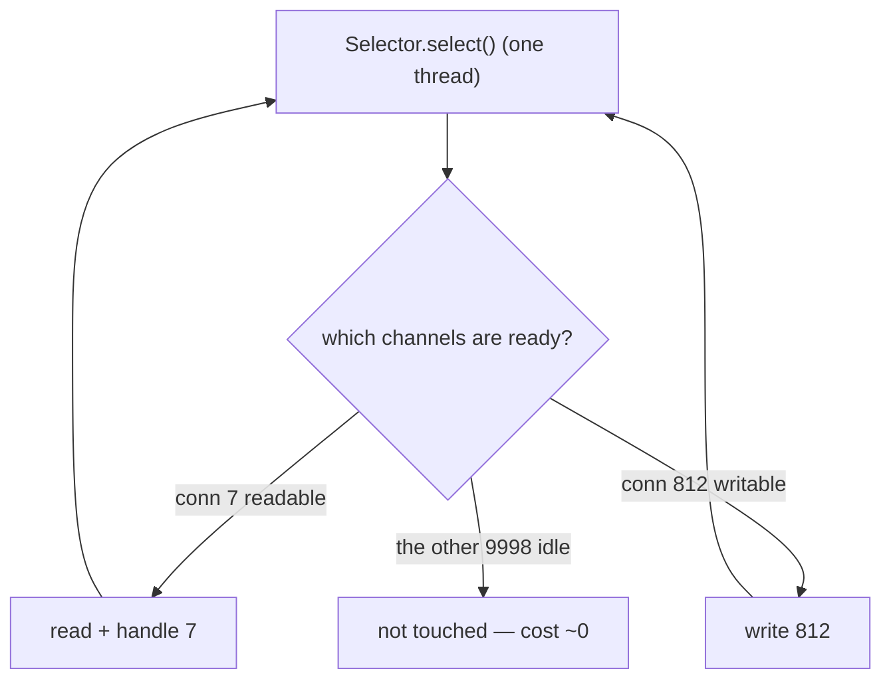

# 25 · I/O & NIO

> How Java talks to files and sockets — and why the shift from **one-thread-per-connection blocking
> I/O** to **one-thread-many-connections readiness-based NIO** reshaped every high-throughput server,
> right up until virtual threads made simple blocking code scale like NIO anyway.
> [← Part 5 · I/O, Interop & Deployment](README.md) · next: 26 · Native Interop

> **Predict first (2 min).** A server holds 10,000 idle-but-open connections. With classic
> `java.io` (a thread per connection), roughly what does that cost in threads and memory? With NIO
> and a `Selector`, how many threads? And where does a `MappedByteBuffer` put the file's bytes? Write
> your guesses.

---

## Blocking I/O (`java.io`): simple, but one thread per connection

The classic model: `InputStream`/`OutputStream` (bytes), `Reader`/`Writer` (chars). A `read()`
**blocks** the calling thread until data arrives. To serve N concurrent connections you dedicate **N
threads** — each parked in a blocking `read` most of the time.

The prediction's first answer: 10,000 connections ≈ **10,000 platform threads**, each with a ~1 MB
stack ([ch.15](../03-concurrency-and-jmm/)) → **~10 GB** of stacks plus scheduler churn, most of them
just *waiting*. Blocking I/O is beautifully simple to write but doesn't scale to massive idle
concurrency — the threads, not the CPU, are the ceiling.

## Non-blocking NIO: channels, buffers, and the `Selector`

`java.nio` inverts it. Three pieces:

- **`Channel`** — a bidirectional conduit to a file/socket (`SocketChannel`, `FileChannel`).
- **`Buffer`** — a fixed-size container you read into / write from; you drive it with
  **position/limit/capacity** and **`flip()`** between filling and draining. (The classic NIO
  gotcha: forgetting to `flip()` before reading back what you wrote.)
- **`Selector`** — the key to scale: register many channels (in **non-blocking** mode) with one
  selector, then `select()` **blocks once** and returns the set of channels that are **ready** (readable/
  writable). One thread services thousands of connections by only touching the ready ones.

The prediction's second answer: with a selector, those 10,000 connections need **one (or a few)**
threads — the **readiness model**. This is the **reactor pattern**: an event loop waits for readiness
and dispatches handlers. It's exactly what Netty ([spring WebFlux ch.18](../../spring-boot/03-web-mvc-and-reactive/)),
nginx, and Node's libuv are built on.

## Buffers: direct vs heap, and memory-mapped files

- **Heap buffers** (`ByteBuffer.allocate`) live on the Java heap; **direct buffers**
  (`allocateDirect`) live **off-heap** in native memory so the OS can do I/O straight to/from them
  without an extra copy — faster for real I/O, but slower to allocate and **not** reclaimed by normal
  GC (a `Cleaner` frees them — [ch.09](../01-memory-and-gc/)).
- ⚡ **Memory-mapped files** (`FileChannel.map` → `MappedByteBuffer`): the prediction's third answer —
  the file is mapped into the process's **virtual address space**; you access gigabytes as if it were
  a buffer and the **OS page cache** pages data in/out on demand. No read/write syscalls per access,
  no heap copy — the trick behind Kafka, Lucene, and high-speed file processing.
- **Off-heap in general** bypasses GC pressure ([Part 1](../01-memory-and-gc/)): big, long-lived,
  or I/O buffers don't add to heap-scan cost — at the price of manual lifecycle care.

## The twist: virtual threads make blocking code scale again

⚡ NIO's power came at a cost: **callback/reactor code is hard to write and debug** (the same
complexity as reactive — [spring ch.18](../../spring-boot/03-web-mvc-and-reactive/)). **Virtual
threads** (Java 21, [ch.19](../03-concurrency-and-jmm/)) change the calculus: a blocking
`socketChannel.read()` on a virtual thread **unmounts** its carrier while waiting, so you can write
plain, linear, one-thread-per-connection blocking code and still handle **millions** of connections —
NIO-level scalability with `java.io`-level simplicity. For most new servers that's the sweet spot;
raw `Selector` code is now reserved for the lowest-level frameworks. NIO's *concepts* (channels,
buffers, the OS readiness model) still matter — you're just less likely to hand-write the selector loop.

> ▶ **Watch it:** [`nio-selector.html`](visualizations/nio-selector.html) — one selector thread over
> many connections, waking only for the ready ones, vs a thread-per-connection pool sitting blocked.

## Make it visible

- **Thread cost of blocking.** Spin up a thread-per-connection echo server and a few thousand idle
  clients; watch thread count and RSS climb. Rewrite with a `Selector` (or virtual threads) — one/few
  carriers, flat memory.
- **`flip()` or bust.** Write to a `ByteBuffer`, then `get()` without `flip()` — read garbage/nothing;
  add `flip()` — correct. The position/limit model made visible.
- **mmap a huge file.** `FileChannel.map` a multi-GB file and random-access it; watch RSS stay modest
  as the page cache serves pages — no full-file heap load.

## Self-Check (close the doc, answer out loud)

1. Why doesn't thread-per-connection blocking I/O scale to 10k idle connections — what's the actual ceiling?
2. What do `Channel`, `Buffer`, and `Selector` each do, and what is the readiness/reactor model?
3. Direct vs heap `ByteBuffer` — where does each live, and what's the trade-off?
4. What does a `MappedByteBuffer` do, and why is it fast for large files?
5. How do virtual threads recover NIO-level scalability while keeping blocking-style code?

> **Go deeper:** the `java.nio` package docs and the `Selector`/`ByteBuffer` javadoc; the reactor
> pattern; Netty's architecture; then [26 · Native Interop](README.md) — leaving the JVM entirely for
> native code.
