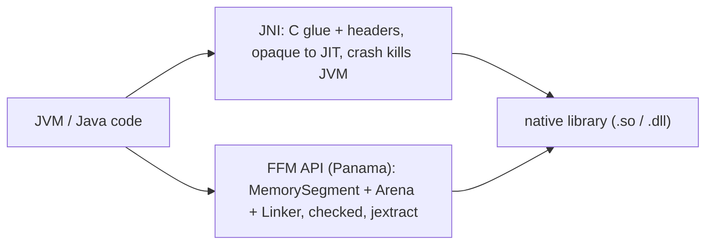

# 26 · Native Interop (JNI → the Foreign Function & Memory API)

> Sometimes the JVM has to leave its own world — call a C library, touch off-heap memory, talk to the
> OS directly. The old door (**JNI**) is powerful but treacherous; the new one (**Panama's FFM API**,
> final in Java 22) is safer, faster, and pure Java.
> [← Part 5 · I/O, Interop & Deployment](README.md) · prev: 25 · I/O & NIO · next: 27 · Diagnostics & Observability

> **Predict first (2 min).** A native C function you call via JNI dereferences a bad pointer and
> segfaults. What happens to your *entire Java application*? And: crossing from JVM code into native
> code — is that boundary free, or does it cost something the JIT can't optimize away? Write your
> guesses.

---

## Why leave the JVM at all

Managed Java can't do everything: you may need a **native library** (a codec, CUDA, OpenSSL, a
vendor SDK), **OS/hardware features** with no Java API, or **raw performance** on a hot native path.
Interop is the escape hatch — used deliberately, because it forfeits the JVM's safety guarantees.

## JNI: the old boundary and its costs

**Java Native Interface** has been the bridge since Java 1.1: declare a `native` method, implement it
in C/C++ against generated headers, load the `.so`/`.dll` with `System.loadLibrary`. It works, but
the costs are real — the prediction's answers:

- ⚡ **A native crash takes down the whole JVM.** A segfault or memory corruption in native code isn't
  a catchable `Exception` — it kills the **entire process**, all threads, no stack trace. You've left
  the safety net.
- ⚡ **The boundary isn't free.** Each JNI call has **transition overhead**, and the JIT
  ([ch.12](../02-execution-and-performance/)) **cannot inline across it** — the native side is
  opaque, so the biggest optimization ([inlining](../02-execution-and-performance/)) stops at the
  border. Chatty fine-grained JNI calls are slow; you want few, coarse crossings.
- **GC interaction is delicate:** objects passed to native code must be pinned/copied so the GC
  ([Part 1](../01-memory-and-gc/)) doesn't move them mid-call; getting the reference lifecycle wrong
  leaks or corrupts. And JNI is **boilerplate-heavy** — headers, manual marshalling, fragile builds.

## The Foreign Function & Memory API (Project Panama)

Java's modern replacement, **final in Java 22** (`java.lang.foreign`), does both halves in pure Java:

- **Foreign Memory** — allocate/access **off-heap** memory through `MemorySegment` with a
  **`Arena`** that owns its lifetime (`try (Arena a = Arena.ofConfined())`), giving *deterministic*
  freeing and **bounds/lifetime checks** the raw `Unsafe`/direct-buffer world never had.
- **Foreign Function** — call a C function via a `Linker` + `MethodHandle` bound to its native symbol
  and a described signature — **no C glue, no JNI headers.**

```java
try (Arena arena = Arena.ofConfined()) {
  MemorySegment cName = arena.allocateUtf8String("world");
  MethodHandle strlen = Linker.nativeLinker().downcallHandle(
      Linker.nativeLinker().defaultLookup().find("strlen").get(),
      FunctionDescriptor.of(JAVA_LONG, ADDRESS));
  long len = (long) strlen.invoke(cName);   // calls C strlen, pure Java
}                                            // arena closes → memory freed deterministically
```

Why it's better: **safer** (bounds- and lifetime-checked segments; a confined arena catches
use-after-free and cross-thread misuse), **faster** (designed for JIT optimization, less transition
overhead than JNI), and **no separate C build** — plus **`jextract`** can generate the bindings from
a C header automatically. It doesn't make crashing impossible (you're still calling native code) but
it removes most of the *accidental* footguns.



## When to reach for it (and when not)

- **Do** for a required native lib, a real measured hot path, or OS features with no Java API — and
  prefer **FFM over JNI** for anything new.
- **Don't** as a premature-optimization reflex: the boundary cost, the loss of safety, and the
  build/deploy complexity usually outweigh the win unless you've *measured* ([ch.13](../02-execution-and-performance/))
  that the native path is worth it. Most "I'll drop to C for speed" instincts lose to a well-warmed
  JIT ([ch.12](../02-execution-and-performance/)).
- ⚡ Off-heap via FFM also serves the [ch.25](README.md) use case — large I/O/buffer memory outside
  the GC-managed heap — with a safer API than direct `ByteBuffer`.

## Make it visible

- **Call C from pure Java.** Use the FFM snippet above to call `strlen`/`getpid` with no C file and no
  JNI — run it and see the native result come back.
- **Feel the arena.** Allocate a `MemorySegment` in a confined `Arena`, close the arena, then touch
  the segment → a clear `IllegalStateException` (lifetime check) instead of JNI-style silent
  corruption.
- **`jextract` a header.** Point `jextract` at a small C header and see it generate the Java bindings
  automatically — the JNI boilerplate that used to be hand-written.

## Self-Check (close the doc, answer out loud)

1. Name three legitimate reasons to leave the JVM for native code.
2. What happens to your app when native code segfaults, and why is that different from a Java exception?
3. Why can't the JIT optimize across the JNI boundary, and what does that imply for call granularity?
4. What are `MemorySegment`, `Arena`, and `Linker` in the FFM API, and how is each safer than the JNI/`Unsafe` era?
5. When should you *not* reach for native interop, and which should you prefer for new code?

> **Go deeper:** the `java.lang.foreign` docs and JEP 454 (FFM final); `jextract`; Project Panama
> talks; then [27 · Diagnostics & Observability](README.md) — seeing inside a running JVM.
