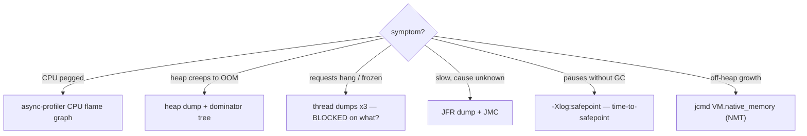

# 27 · Diagnostics & Observability

> The 2 a.m. skill: a JVM is misbehaving in production — pegged CPU, creeping heap, frozen threads.
> The right tool finds it in minutes; the wrong one wastes the incident. This chapter maps **symptom →
> tool**: JFR, flame graphs, heap dumps, thread dumps, and `jcmd`.
> [← Part 5 · I/O, Interop & Deployment](README.md) · prev: 26 · Native Interop · next: 28 · Startup, Footprint & Native Image

> **Predict first (2 min).** Production heap grows 1% per hour until OOM, over days. Would you reach
> for a CPU profiler, a thread dump, or something else? And: can you afford to run a profiler
> *continuously in production*, or is that only for dev? Write your guesses.

---

## JFR: the always-on flight recorder

**Java Flight Recorder** is built into the JVM and records events — allocations, GC, locks, I/O, JIT,
exceptions — at **~1% overhead**, which answers the prediction's second question: **yes, run it in
production, always.** Like an aircraft's black box, when something goes wrong the data is *already
there*.

```bash
java -XX:StartFlightRecording=maxsize=250M,maxage=6h ...   # always-on ring buffer
jcmd <pid> JFR.dump filename=incident.jfr                  # snapshot when things go bad
```

Open the `.jfr` in **JDK Mission Control (JMC)**: allocation by class, GC pauses, lock contention,
hot methods. JFR is the *first* tool for "something is slow and I don't know what."

## Flame graphs: where CPU (or allocation) actually goes

**async-profiler** samples stacks with low overhead and renders a **flame graph**: x-axis = share of
samples (NOT time order), y-axis = stack depth. **Wide frame = where the resource goes.** Modes:
`-e cpu` (cycles), `-e alloc` (allocation pressure — feeds GC tuning, [Part 1](../01-memory-and-gc/)),
`-e lock` (contention, [Part 3](../03-concurrency-and-jmm/)).

- Read it in one move: find the **widest tower**, walk down to the first frame you own — that's your
  optimization target ([Amdahl, ch.13](../02-execution-and-performance/)).

## Heap dumps: hunting leaks with the dominator tree

The prediction's first answer: slow monotonic heap growth is a **memory leak** → **heap dump**, not a
CPU tool. `jcmd <pid> GC.heap_dump dump.hprof` (or `-XX:+HeapDumpOnOutOfMemoryError` so the OOM
itself leaves evidence). Open in Eclipse MAT / JMC:

- The **dominator tree** shows *retained* size — what memory would be freed if this object died. The
  top dominators **are** your leak suspects.
- Classic culprits: an unbounded cache/map, a listener list nobody deregisters from, a `ThreadLocal`
  on pooled threads ([Part 3](../03-concurrency-and-jmm/)), growing `static` collections.

## Thread dumps: what is everyone doing *right now*?

For "the app is frozen / requests hang": `jcmd <pid> Thread.print` (or `jstack`). Read states with
[ch.15](../03-concurrency-and-jmm/)'s lens — `BLOCKED` (monitor wait — who holds it?), `WAITING`
(park/join), `RUNNABLE` (maybe really running, maybe in native I/O). Take **2–3 dumps a few seconds
apart**: threads stuck on the *same* frame across dumps are the story. Deadlocks are detected and
printed explicitly. ⚡ Virtual threads: `jcmd <pid> Thread.dump_to_file -format=json` includes them;
classic `jstack` shows only platform threads.

## Safepoints: the hidden pause multiplier

Many JVM operations (some GC phases, deopt, revoking locks, heap dump) require **all threads at a
safepoint** — a stop point threads reach by polling. The pause is set by the **slowest** thread
(**time-to-safepoint**): a long-running counted loop or a big array copy can delay everyone — so the
"GC pause" you observe = time-to-safepoint + the operation. Diagnose with
`-Xlog:safepoint`. This is why some pauses appear with *no* GC cause.

## `jcmd`: the swiss-army knife

One CLI to rule them: `jcmd <pid> help` lists everything. The greatest hits:

| Command | Question it answers |
|---|---|
| `Thread.print` | what's everyone doing? (deadlock?) |
| `GC.heap_dump` / `GC.class_histogram` | who's eating the heap? |
| `JFR.start/dump/stop` | record/snapshot behavior |
| `VM.flags`, `VM.system_properties` | how is this JVM actually configured? |
| `VM.native_memory summary` | off-heap usage (NMT, [ch.04](../00-platform-and-mental-model/)) |
| `Compiler.queue` | JIT backlog ([ch.11](../02-execution-and-performance/)) |

## Symptom → tool (the incident map)



## Make it visible

- **Leak on purpose.** Add objects to a static list forever; watch heap climb in JFR/jconsole, dump
  the heap, and find your list at the top of MAT's dominator tree.
- **Flame-graph a hot loop.** Run async-profiler against a busy app for 30s — the widest frame is
  rarely where you guessed ([ch.13](../02-execution-and-performance/)).
- **Freeze and diagnose.** Create a 2-thread deadlock, take `jcmd Thread.print`, and read the
  explicit "Found one Java-level deadlock" section with both stacks.

## Self-Check (close the doc, answer out loud)

1. Why is JFR safe to run always-on in production, and what's the ring-buffer + dump pattern?
2. How do you read a flame graph (axes, what "wide" means), and what are the three main profile modes?
3. Heap leaking slowly — exact tool chain, and what does *retained size / dominator tree* tell you?
4. Why take multiple thread dumps, and what does `BLOCKED` vs `WAITING` vs `RUNNABLE` each suggest?
5. What is time-to-safepoint, and how does one slow thread lengthen everyone's pause?

> **Go deeper:** JFR/JMC docs; async-profiler README (it's excellent); Eclipse MAT's dominator-tree
> tutorial; Nitsan Wakart on safepoints; then [28 · Startup, Footprint & Native Image](README.md) —
> the last java chapter of this part.
