# Java Internals — The Last-Minute Crash Course

> Every topic in the [java track](README.md) — plus the everyday standard-library APIs
> (Streams, `ExecutorService`, `CompletableFuture`, …) in Part 7 — explained in plain English so
> you can absorb it in one sitting. Where the [CHEATSHEET](CHEATSHEET.md) is compressed for *recall*, this is written
> for *understanding fast* — read it top to bottom in ~45–60 minutes the night before you need it.
> Each topic ends with **One line to remember**. Targets Java 21+ / HotSpot.

---

## Part 0 · Platform & Mental Model

### 1. The platform & execution pipeline
Java has **two compilers**, and confusing them causes most misconceptions. `javac` compiles your
source into **bytecode** (`.class` files) — portable instructions for an imaginary machine, with
almost no optimization. At runtime the JVM **interprets** that bytecode immediately (so startup is
instant), watches which methods run hot, and hands the hot ~10% to the **JIT compiler**, which
turns them into optimized native machine code. If the JIT's assumptions break, it throws the
native code away and falls back to interpreting ("deoptimization"). "Write once, run anywhere"
works because every OS ships a JVM that understands the same bytecode.

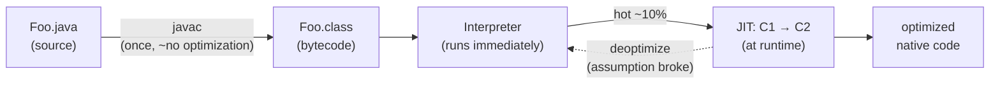

**One line to remember:** `javac` makes bytecode, not native code — the JVM interprets first and JIT-compiles only what's hot.

### 2. The class file & bytecode
A `.class` file starts with magic bytes `0xCAFEBABE`, then a version, then the **constant pool** —
a symbol table holding every class name, method reference, and string literal; most bytecode
instructions just point into it. The JVM is a **stack machine**: instructions push and pop values
on an operand stack instead of using registers (`iload_1`, `iadd`, `ireturn`). Method calls use
five invoke instructions — the ones worth knowing are `invokevirtual` (normal calls),
`invokestatic`, `invokespecial` (constructors/private), `invokeinterface`, and `invokedynamic`
(powers lambdas and string concatenation). See any of this yourself with `javap -c -p`.

**One line to remember:** the JVM is a stack machine, and the constant pool is the symbol table everything points into.

### 3. Class loading, linking & initialization
A class goes through **Load → Link → Initialize**. Linking has three steps: *verify* (is this
bytecode safe?), *prepare* (static fields get default values like 0/null), *resolve* (turn
symbolic references into real ones). *Initialize* runs `<clinit>` — your static initializers and
static field assignments — and it happens **lazily**, on first real use of the class. Three
built-in loaders form a chain — **Bootstrap → Platform → Application** — with **parent
delegation**: a loader always asks its parent first, which is why nobody can smuggle in a fake
`java.lang.String`. Gotcha: the same class loaded by two different loaders is **two different
types** at runtime.

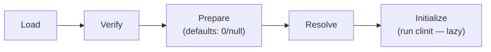

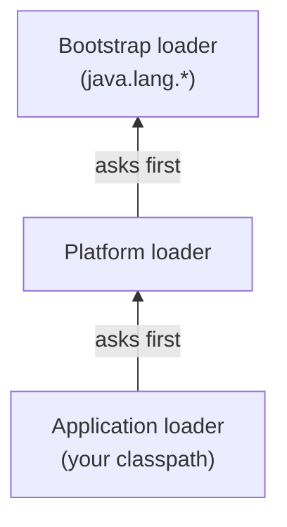

**One line to remember:** load → link → init, init is lazy, and loaders delegate to their parent first.

### 4. JVM runtime data areas
The memory map: the **heap** (shared by all threads, where objects live, GC'd), one **stack per
thread** (method frames with local variables and the operand stack — overflow it and you get
`StackOverflowError`), a **PC register** per thread (which instruction it's on), **Metaspace**
(class metadata — it's *native* memory, not heap; it replaced PermGen in Java 8), and the **code
cache** (where JIT output lives). Each area has its own way to run out: heap →
`OutOfMemoryError: Java heap space`, metaspace → `OutOfMemoryError: Metaspace`, stack →
`StackOverflowError`.

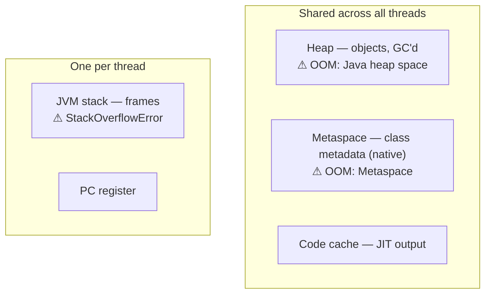

**One line to remember:** objects on the shared heap, method calls on per-thread stacks, class metadata in native Metaspace.

---

## Part 1 · Memory & GC

### 5. Object layout in memory
Every object carries a header: an 8-byte **mark word** (holds the identity hashCode, GC age, and
lock bits — one word, three jobs) plus a 4-byte compressed **klass pointer** (which class this
is). So a plain `new Object()` costs **16 bytes**; fields follow, padded to a multiple of 8.
**Compressed oops** keep references at 4 bytes as long as the heap stays under ~32 GB — cross that
and every reference doubles to 8 bytes, which is why a 33 GB heap can hold *less* than a 31 GB
one. This is also why boxed collections are so heavy: every `Integer` in a
`HashMap<Integer,Integer>` is a full 16-byte object.

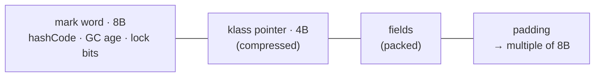

**One line to remember:** every object pays a ~16-byte header tax, and references are 4 bytes only below ~32 GB heaps.

### 6. Allocation & the heap
Allocation in Java is nearly free. Each thread gets a private chunk of Eden called a **TLAB**
(thread-local allocation buffer), and `new` is usually just "bump a pointer forward" — no locks,
a handful of instructions. The only synchronization is grabbing a fresh TLAB, which is rare.
Better still, **escape analysis** lets the JIT prove an object never leaves a method, and then it
isn't allocated at all — its fields become locals ("scalar replacement"). The performance
consequence: what stresses the GC isn't heap *size* but **allocation rate** — how fast you churn
out short-lived objects.

**One line to remember:** allocation is a lock-free pointer bump in a TLAB; allocation *rate*, not heap size, drives GC pressure.

### 7. Garbage collection fundamentals
GC doesn't find garbage — it finds the **live** objects (everything reachable from **GC roots**:
thread stacks, static fields, JNI handles) and treats the rest as free space. Three base
algorithms: mark-sweep (fast but fragments), mark-compact (defragments but must move objects and
fix pointers), and copying (copies live objects to a new space — cost proportional to *survivors
only*). The **generational hypothesis** — most objects die young — is why heaps split into a young
and old generation: a **minor GC** copies the few survivors out of Eden cheaply, while a full GC
is the expensive one. References from old to young objects are tracked with a **card table**
maintained by a write barrier. A "memory leak" in Java is really a *reachability* bug — usually
something stuck in a static collection.

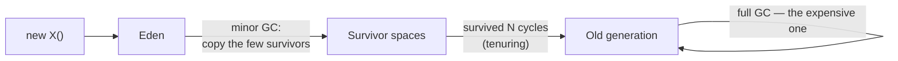

**One line to remember:** GC traces the live set from roots; young-gen collection is cheap because its cost scales with survivors, not garbage.

### 8. The modern collectors
Every collector trades between **throughput, latency, and footprint** — you can't max all three.
**Serial**: tiny heaps, one CPU. **Parallel**: best raw throughput, but stop-the-world pauses grow
with the heap — fine for batch jobs. **G1** (the default): divides the heap into regions, collects
the most-garbage regions first, and aims at a pause target (`-XX:MaxGCPauseMillis`). **ZGC** and
**Shenandoah**: do almost everything concurrently for sub-millisecond pauses, paying with some
throughput and extra memory (ZGC is generational since Java 21). Reading a GC log line:
`256M->9M(512M) 3ms` means heap went from 256 MB to 9 MB (of 512 MB total) in a 3 ms pause.
Golden rule: producing less garbage beats any tuning flag.

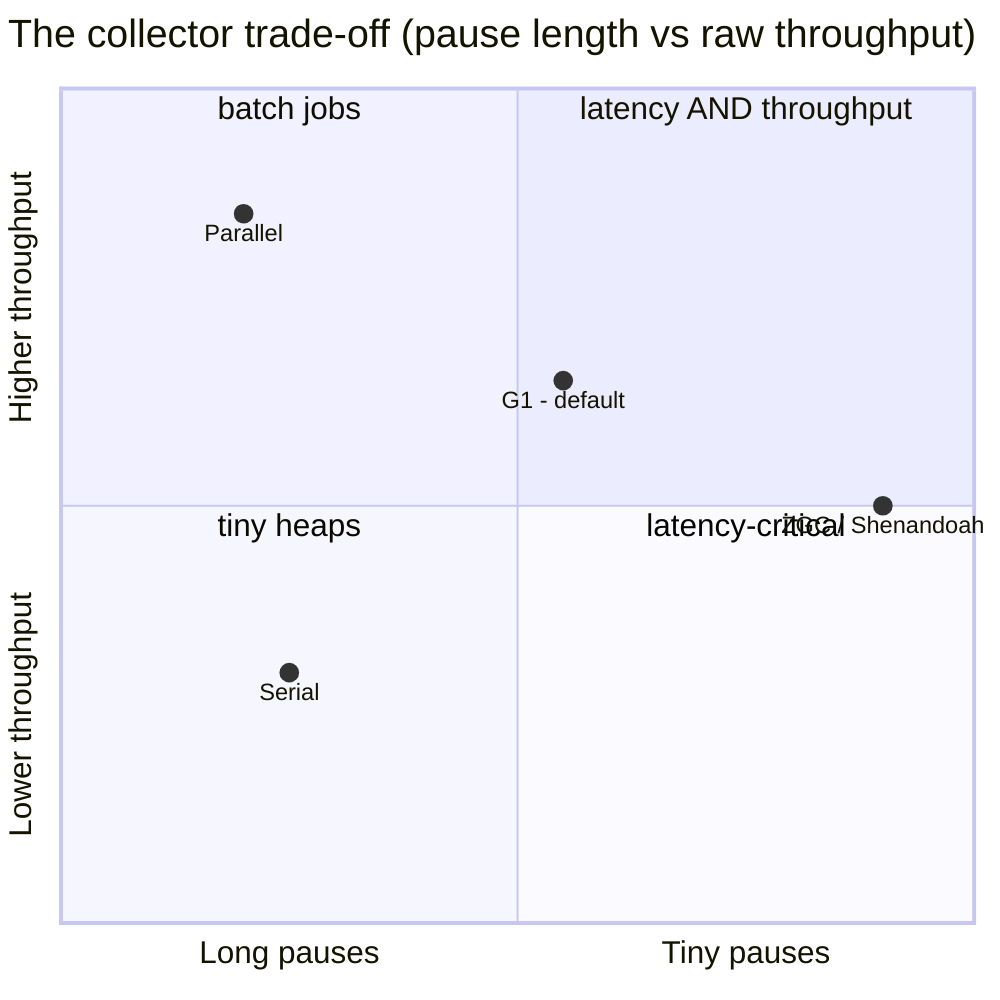

**One line to remember:** default to G1; strict latency on a big heap → ZGC; batch throughput → Parallel — and less garbage beats more flags.

### 9. Reference types & cleaners
Four strengths of reference. **Strong** (normal) — never collected while reachable. **Soft** —
cleared only under memory pressure, so: memory-sensitive caches. **Weak** — cleared at the next
GC once no strong refs remain, so: canonical maps and metadata (`WeakHashMap`). **Phantom** —
`get()` always returns null; it's only enqueued on a `ReferenceQueue` after collection, so:
post-mortem cleanup. `finalize()` is **removed for practical purposes** (deprecated for removal,
JEP 421) — for resources use `try-with-resources` (deterministic), with `Cleaner` as a safety
net. Cleaner trap: the cleanup lambda must not capture the object it cleans, or the object stays
reachable forever and cleanup never runs.

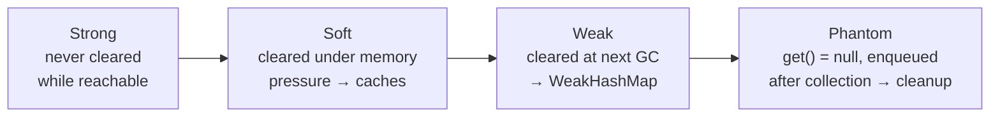

**One line to remember:** strong > soft (caches) > weak (maps) > phantom (cleanup); `finalize()` is dead — use try-with-resources.

---

## Part 2 · Execution & Performance

### 10. The interpreter & bytecode execution
Why interpret at all? Because compiling everything up front would make startup terrible, and most
code runs once or twice — only ~10% is hot enough to be worth compiling. The interpreter executes
bytecode instruction by instruction on the operand stack, immediately, while counters and type
profiles accumulate underneath. That profile data is exactly what makes the JIT's aggressive
optimizations possible later.

**One line to remember:** the interpreter buys instant startup and gathers the profile data the JIT needs.

### 11. The JIT compilers
The same method can run three ways over its life: interpreted → compiled by **C1** (fast compile,
lightly optimized, keeps profiling) → compiled by **C2** (slow compile, aggressively optimized).
This is **tiered compilation**. C2 optimizes *speculatively* — "this call site has only ever seen
one type, so I'll inline it behind a cheap type check." When a guard fails, the JVM
**deoptimizes**: it discards the native code mid-flight, transfers the running frame back to the
interpreter, and recompiles with weaker assumptions. **OSR** (on-stack replacement) compiles a
long-running loop *while it's running*. Sneaky failure mode: if the **code cache** fills up, the
JIT silently stops compiling and everything slows down.

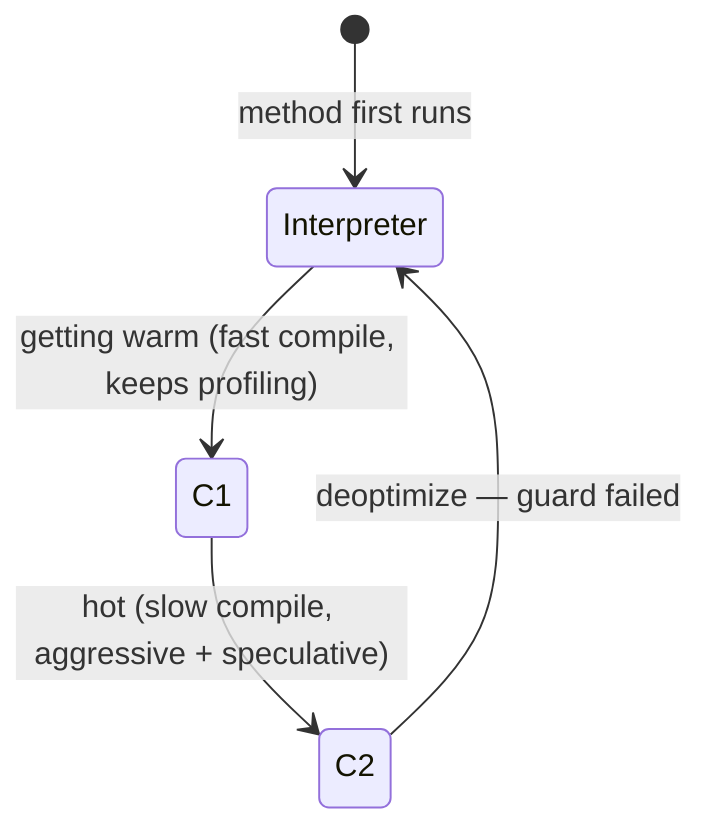

**One line to remember:** interpret → C1 → C2, optimize on speculation, deoptimize when a guess breaks.

### 12. JIT optimizations
**Inlining is the mother of all optimizations** — not because calls are slow, but because pulling
the callee's body into the caller exposes every other optimization across the boundary. It's
blocked by *megamorphic* call sites (3+ receiver types seen) and very large methods. On top of
that: escape analysis + scalar replacement (objects never allocated), **lock elision** (removing
locks on objects that never escape a thread), loop unrolling, range-check elimination, and
**intrinsics** — methods like `System.arraycopy` and `Math.max` replaced with hand-tuned machine
code. The takeaway for your code: small, monomorphic methods are what the JIT loves.

**One line to remember:** inlining unlocks everything else — keep methods small and call sites predictable.

### 13. Benchmarking correctly
A naive `System.nanoTime()` loop lies to you in at least four ways: no **warmup** (you time the
interpreter, then the compiler kicks in), **dead-code elimination** (the JIT deletes your
unused computation and you time nothing), constant folding, and OSR distorting loop compilation.
**JMH** exists to defeat exactly these: `@Warmup` and `@Measurement` iterations, multiple
**forks** for fresh JVM profiles, and `Blackhole` to force results to be "used." Also decide
honestly *what* you're measuring — throughput, latency, or allocation (`-prof gc`).

**One line to remember:** never trust a hand-rolled microbenchmark — warmup, dead code, and OSR all lie; use JMH.

### 14. Mechanical sympathy
The memory ladder is brutal: L1 cache ~1 ns, L3 ~10 ns, main RAM ~100 ns. CPUs move memory in
**64-byte cache lines**, which creates **false sharing**: two threads writing *different*
variables that happen to sit on the *same* cache line force the line to ping-pong between cores —
a massive, invisible slowdown, fixed with padding or `@Contended`. Data layout matters too:
iterating an array of primitives (contiguous, prefetchable) can beat a "better" Big-O structure
that chases pointers all over the heap.

**One line to remember:** memory is fetched in 64-byte lines — locality and false sharing can matter more than Big-O.

---

## Part 3 · Concurrency & the Java Memory Model

### 15. Threads & the OS
A platform thread is a thin wrapper around an **OS thread**: ~1 MB of stack reserved, scheduled
by the kernel, with a real context-switch cost. That's why "just add more threads" stops scaling
— thousands of threads means gigabytes of stacks and a scheduler thrashing between them. This
ceiling is the entire motivation for virtual threads (topic 19).

**One line to remember:** platform threads are OS threads — expensive enough that you can't have tens of thousands.

### 16. The Java Memory Model
Three layers reorder or delay your memory operations: the compiler, the CPU (out-of-order
execution, store buffers), and the cache hierarchy. Single-threaded you can never tell; across
threads you can. The JMM's entire contract is **happens-before**: if action A happens-before B,
A is visible to and ordered before B. **No happens-before edge = data race = no guarantees at
all.** The edges you get: program order within a thread, unlock → later lock of the same monitor,
**volatile write → later volatile read**, `Thread.start()`/`join()`, and transitivity. So
`volatile` gives **visibility + ordering** — but *not* atomicity (`volatile n++` is still a
race). Classic bug: a plain `while (!stop) {}` can spin forever because the read gets hoisted —
`stop` must be volatile. And **final fields** are safely visible after construction (if `this`
doesn't escape the constructor), which is exactly why immutable objects can be shared freely.

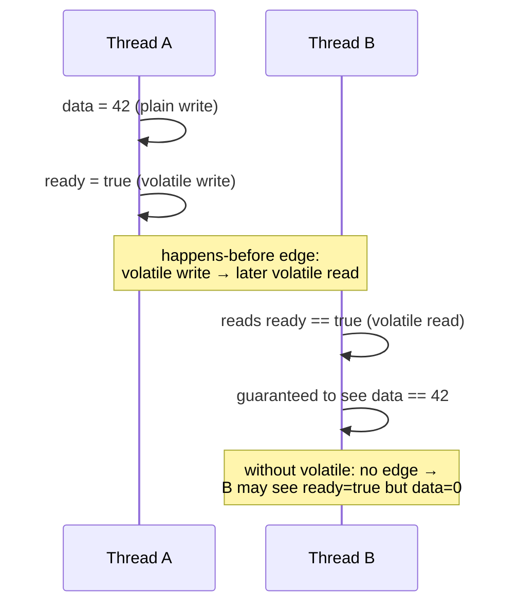

**One line to remember:** no happens-before edge, no guarantees — volatile gives visibility and ordering, never atomicity.

### 17. Locks & synchronization internals
`synchronized` uses the object's **monitor**, whose state lives in the mark word's lock bits.
Uncontended locking is cheap — a single CAS ("lightweight locking"). Under real contention the
lock **inflates** to a heavyweight OS monitor where losing threads are parked by the kernel.
(Biased locking, the old third mode, was **removed** in JDK 18 — retire that folklore.)
`wait()`/`notify()` require holding the monitor, and `wait` must always sit in a loop re-checking
its condition, because spurious wakeups are allowed.

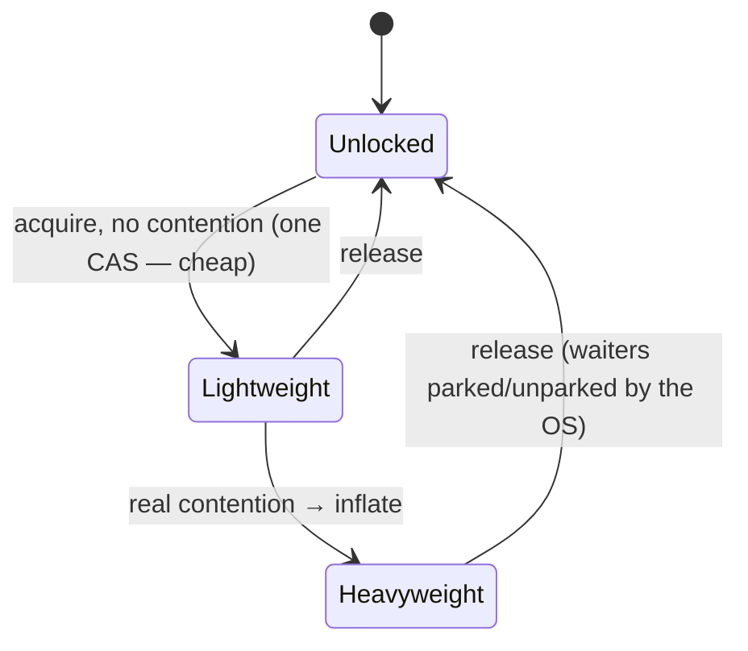

**One line to remember:** monitors are cheap until contended, then they inflate to OS-level parking; always `wait()` in a loop.

### 18. `java.util.concurrent`
Three ideas carry the whole package. (1) **CAS** — compare-and-swap, the hardware primitive
behind `AtomicInteger` and every lock-free structure: read, compute, swap-if-unchanged, retry on
failure. (2) **AQS** (`AbstractQueuedSynchronizer`) — one queue-of-waiting-threads engine that
implements `ReentrantLock`, `Semaphore`, `CountDownLatch`, and friends; learn it once and you
understand them all. (3) **Executors** — never hand-roll threads; a
`ThreadPoolExecutor(core, max, keepAlive, queue, rejectionPolicy)` sized deliberately, with a
*bounded* queue so overload produces backpressure instead of an `OutOfMemoryError`.
`ConcurrentHashMap` gives you lock-striped, non-blocking reads — the default answer for shared
maps.

**One line to remember:** CAS is the primitive, AQS is the engine behind all the locks, and thread pools need bounded queues.

### 19. Virtual threads & structured concurrency (Loom)
A **virtual thread** is a stack the *JVM* manages instead of the OS — cheap enough to create
millions. It runs mounted on a small pool of **carrier** (platform) threads; when it blocks on
I/O, the JVM **unmounts** it, parks its stack on the heap, and lends the carrier to another
virtual thread. Result: the simple thread-per-request style scales like async code, without the
async code. Rules: **don't pool them** (create per task), and watch for **pinning** — blocking
inside a `synchronized` block used to pin the carrier thread (fixed in Java 24, but know the
history). Use `ScopedValue` instead of `ThreadLocal`, and structured concurrency
(`StructuredTaskScope`) to keep related tasks' lifetimes tied together.

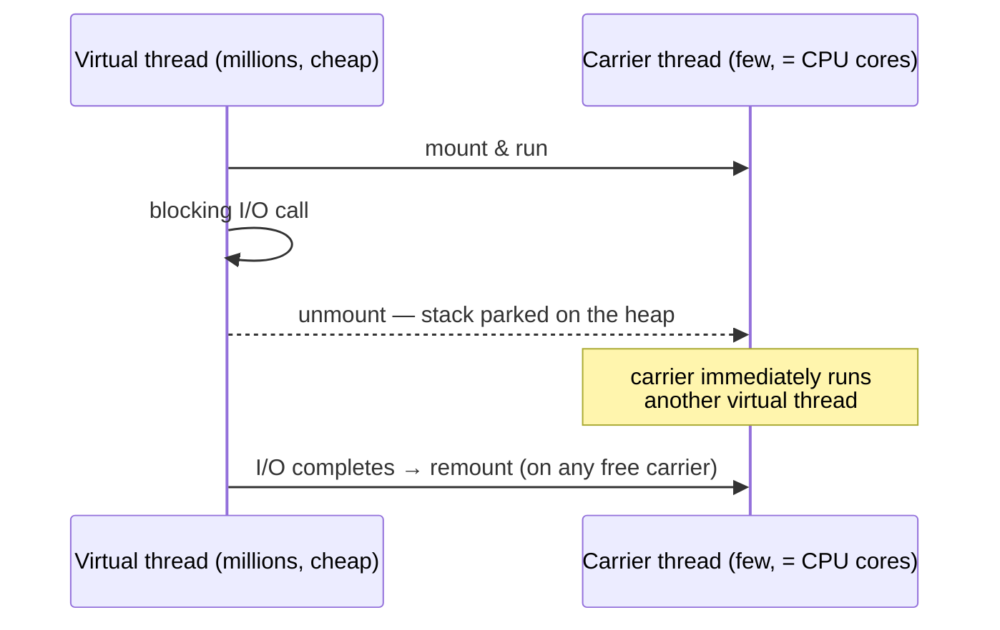

**One line to remember:** virtual threads make blocking cheap — thread-per-request is back; don't pool them.

---

## Part 4 · The Language, In Depth

### 20. Generics & type erasure
Generics are a **compile-time** phenomenon: after `javac` checks them, erasure replaces `T` with
its bound (usually `Object`) and inserts casts at use sites. At runtime a `List<String>` and a
`List<Integer>` are the same class — hence no `new T[]`, no `instanceof List<String>`, and
**bridge methods** generated to keep overriding working. For variance remember **PECS**: a
producer you read from is `? extends T`; a consumer you write into is `? super T`.

**One line to remember:** generics vanish at runtime (erasure) — PECS: producer `extends`, consumer `super`.

### 21. Collections internals
`ArrayList` is a growable array (grows ×1.5 by copying — pre-size when you know the count).
`HashMap`: index = `hash & (length-1)` into a power-of-two table; collisions chain into linked
lists, which **treeify** into red-black trees past 8 entries per bin (defends against hash-DoS);
resize doubles the table and re-distributes every entry — the expensive event. Mutating a key's
hash-relevant state after insertion *loses the entry*. `ConcurrentHashMap` locks per-bin and
reads without locking. Fail-fast iterators throw `ConcurrentModificationException` on structural
change even single-threaded — remove via the iterator or `removeIf`. `ArrayDeque` beats `Stack`
and `LinkedList` for stack/queue work.

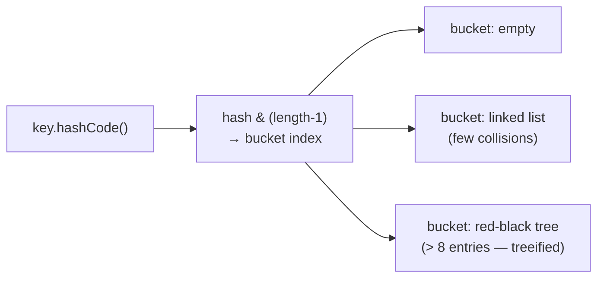

**One line to remember:** `HashMap` = power-of-two table + treeified bins; resize is the expensive event; never mutate keys.

### 22. Strings
`String` is immutable, and that's **load-bearing**: it's what makes strings safe as `HashMap`
keys, shareable across threads, and eligible for the **string pool** (literals are deduplicated;
`==` compares identity, so always use `equals`). Since Java 9, **compact strings** store
Latin-1-only text at one byte per char instead of two — a large real-world memory win. Modern
`+` concatenation compiles to an `invokedynamic`-based strategy that's efficient for single
expressions, but concatenation **in a loop** is still O(n²) — use `StringBuilder` there.

**One line to remember:** immutability makes String safe to share, pool, and cache — but loop concatenation still needs StringBuilder.

### 23. Equality, identity & comparison
`==` compares identity (same object); `equals` compares meaning — and whenever you override
`equals` you **must** override `hashCode` so that equal objects share a hash, or hash collections
silently break (the object goes into one bucket and is looked up in another). The `equals`
contract: reflexive, symmetric, transitive, consistent. `compareTo`/`Comparator` should be
consistent with `equals`, or `TreeMap` and `TreeSet` (which compare, never call `equals`) will
disagree with `HashMap` about which objects are "the same." `record` generates all of this
correctly for free.

**One line to remember:** override `equals` and `hashCode` together, keep `compareTo` consistent with them — or use a record.

### 24. Modern language features as design tools
These features exist to make **illegal states unrepresentable**. `record` = a transparent,
immutable data carrier (equals/hashCode/toString for free; validate in the compact constructor).
`sealed` = an exhaustive, closed set of subtypes. Combine them and `switch` **pattern matching**
gives you compile-checked case analysis: seal the hierarchy, switch over it with record patterns,
omit the `default` — and adding a new subtype becomes a compile error at every switch you forgot
to update.

**One line to remember:** records + sealed types + pattern-matched switch = the compiler enforces your case analysis.

---

## Part 5 · I/O, Interop & Deployment

### 25. I/O & NIO
Classic `java.io` streams block a thread per connection; NIO **channels + buffers + selectors**
let one thread multiplex thousands of connections (the model under Netty). **Memory-mapped
files** (`MappedByteBuffer`) let you read a file as if it were memory, with the OS paging it.
**Direct buffers** live off-heap so the OS can do I/O without copying — faster for I/O, but
allocation is expensive and the memory is invisible to normal heap monitoring. Note: virtual
threads make *blocking* code scale, which removes most reasons for application code to touch NIO
selectors directly.

**One line to remember:** NIO multiplexes many connections per thread — but virtual threads now let plain blocking code scale too.

### 26. Native interop
**JNI** is the old road to native code: powerful, but every crossing has real overhead, C glue
code, and a native crash takes the whole JVM down. The modern replacement is the **FFM API**
(Foreign Function & Memory, Project Panama, final in Java 22): call native functions and manage
off-heap memory from pure Java — `MemorySegment` for memory with explicit bounds and lifetime
(`Arena`), `Linker` for calls — safer and faster than JNI, no C glue required.

**One line to remember:** JNI is legacy; the Foreign Function & Memory API is the modern, pure-Java way to call native code.

### 27. Diagnostics & observability
The toolbox: **JFR** (Java Flight Recorder) — always-on, ~1% overhead event recording built into
the JVM; open recordings in JDK Mission Control. **async-profiler** — CPU and allocation **flame
graphs** (wide frame = where the time goes). Heap leak hunt: `jmap`/`jcmd` heap dump → open in
MAT/JMC → find the biggest retained set → walk its path back to a GC root (the leak is usually a
static collection). Know **safepoints**: many JVM operations must pause *all* threads, and one
thread stuck in a long counted loop delays everyone (time-to-safepoint). First responders on a
sick JVM: `jcmd <pid>` and `jstack` for thread dumps.

**One line to remember:** JFR + flame graphs find where time goes; heap dump → retained set → GC-root path finds leaks.

### 28. Startup, footprint & native image
The JIT model gives the best *peak* speed but pays for it with slow warm-up — a problem for
serverless and autoscaling. The spectrum of fixes: **CDS/AppCDS** (pre-parsed class archive,
cheap win), **Project Leyden / AOT cache** (Java 24+: cache loaded classes and profiles across
runs), and at the far end **GraalVM native image** — compile everything ahead-of-time into one
binary: startup in milliseconds, tiny memory, but a **closed-world** constraint (all
reflection/proxies/resources must be declared at build time) and no JIT so peak throughput is
usually lower.

**One line to remember:** JIT = slow start, best peak; native image = instant start, lower peak, closed world — pick per workload.

---

## Part 6 · Principal Skills

### 29. Performance reasoning
The discipline that separates levels: **hypothesis → measurement → one change → re-measure**.
Never optimize from folklore; profile first (JFR/async-profiler), find where the time or the
allocations *actually* go, change the one thing the data indicts, and verify the needle moved.
State costs and trade-offs out loud: every optimization spends something (memory, complexity,
startup) to buy something.

**One line to remember:** measure, don't guess — and re-measure after the fix.

### 30–31. Reading the specs & going deeper
When sources disagree, the primary sources win: the **JLS** (language), the **JVMS** (the VM and
class files), and **JEPs** (what changed in each release, with the *why* written by the authors).
The JDK source itself is readable — start with a collection you use daily. Canon worth your time:
*Effective Java* (Bloch), *Java Concurrency in Practice* (Goetz), and JVM talks by Shipilev,
Thompson, and Rose.

**One line to remember:** blogs rot; the JLS, JVMS, and JEPs are the ground truth.

---

## Part 7 · The Standard Library, Applied *(the APIs you use every day)*

### 32. Lambdas, functional interfaces & Streams
A lambda is a compact implementation of a **functional interface** — an interface with one
abstract method. Know the big five: `Function<T,R>` (transform), `Predicate<T>` (test),
`Supplier<T>` (produce), `Consumer<T>` (accept), `UnaryOperator<T>`. A Stream pipeline =
**lazy intermediate ops** (`map`, `filter`, `flatMap`, `sorted`, `distinct`) that do nothing
until a **terminal op** triggers the whole thing (`collect`, `reduce`, `count`, `findFirst`,
`forEach`). Collectors do the aggregation: `groupingBy`, `partitioningBy`, `joining`, and `toMap`
(which **throws on duplicate keys** — always supply a merge function). Traps: streams are
**single-use**; avoid stateful lambdas and side effects; `peek` is for debugging only. And
**parallel streams** run on the shared `ForkJoinPool.commonPool` — fine for large, CPU-bound,
splittable work; never for blocking I/O or inside a request thread.

```java
// The big five functional interfaces
Function<String, Integer> len   = String::length;          // transform: T -> R
Predicate<String>         blank = String::isBlank;         // test:      T -> boolean
Supplier<List<String>>    fresh = ArrayList::new;          // produce:   () -> T
Consumer<String>          log   = System.out::println;     // accept:    T -> void
UnaryOperator<String>     trim  = String::trim;            // T -> T
```

```java
record Order(String customer, String status, double amount) {}

// Pipeline: lazy intermediates -> one terminal op
double shippedTotal = orders.stream()
    .filter(o -> o.status().equals("SHIPPED"))   // lazy — nothing runs yet
    .mapToDouble(Order::amount)                  // primitive stream: no boxing
    .sum();                                      // terminal — NOW it all runs

// groupingBy: one line from list to Map<customer, total>
Map<String, Double> totalByCustomer = orders.stream()
    .collect(Collectors.groupingBy(Order::customer,
             Collectors.summingDouble(Order::amount)));

// flatMap: one-to-many, then flatten  [ ["a","b"], ["c"] ] -> "a","b","c"
List<String> allTags = posts.stream()
    .flatMap(p -> p.tags().stream())
    .distinct()
    .toList();                                   // Java 16+; unmodifiable

// toMap THROWS on duplicate keys — always give a merge function
Map<String, Double> latestBid = bids.stream()
    .collect(Collectors.toMap(Bid::item, Bid::price,
             (oldV, newV) -> newV));             // keep the newest
```

```java
// ⚡ Trap 1: streams are single-use
var s = list.stream().filter(x -> x > 2);
s.count();
s.count();                        // IllegalStateException: already consumed

// ⚡ Trap 2: stateful lambda — races under .parallelStream(), order lost
List<Integer> out = new ArrayList<>();
nums.parallelStream().map(n -> n * 2).forEach(out::add);   // WRONG
List<Integer> ok = nums.parallelStream().map(n -> n * 2).toList(); // right
```

**One line to remember:** intermediate ops are lazy until a terminal op fires; `toMap` needs a merge function; parallel streams are for CPU-bound work only.

### 33. Optional
`Optional<T>` is a **return type** that makes "maybe absent" explicit — it is not meant for
fields, method parameters, or collection elements. Chain instead of null-checking:
`repo.find(id).map(User::getEmail).filter(e -> e.endsWith("@x.com")).orElseThrow(...)`. Prefer
`orElseGet(supplier)` (lazy) over `orElse(value)` (the fallback is computed even when present).
Never call `.get()` bare, and don't wrap collections — return an empty collection instead.

**One line to remember:** Optional is a return type for "maybe absent" — chain `map`/`filter`/`orElseGet`, never bare `get()`.

### 34. ExecutorService & thread pools
Never hand-roll threads — submit tasks to an `ExecutorService`. The one constructor to actually
understand: `ThreadPoolExecutor(corePoolSize, maxPoolSize, keepAlive, workQueue,
rejectionPolicy)`. The counterintuitive part: **max kicks in only after the queue fills** — with
an unbounded queue, `maxPoolSize` never matters. So the queue choice *is* the design: **bounded
queue = backpressure** under overload; unbounded queue = an `OutOfMemoryError` waiting for a
traffic spike. Rejection policies: `AbortPolicy` (default, throws), `CallerRunsPolicy` (the
submitter runs the task itself — natural backpressure), `Discard`. Avoid the `Executors`
factories in production (`newCachedThreadPool` = unbounded threads, `newFixedThreadPool` =
unbounded queue) — size deliberately: ~cores for CPU-bound work, larger for blocking I/O (or use
virtual threads, topic 19). Always shut pools down (`shutdown()` + `awaitTermination`).

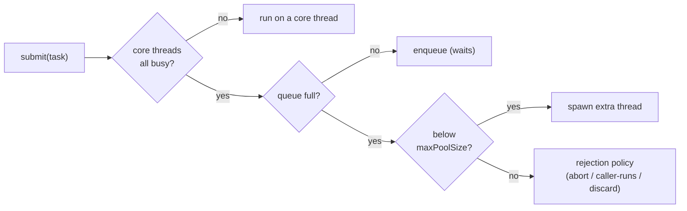

**One line to remember:** the queue is the design — bounded queue for backpressure, and extra threads only spawn after the queue is full.

### 35. CompletableFuture
`CompletableFuture` composes async steps into a pipeline instead of blocking on futures. The
vocabulary: `supplyAsync(fn, executor)` starts work; **`thenApply`** transforms the result
(synchronous, like `map`); **`thenCompose`** chains another async call (like `flatMap` — use it
when the next step itself returns a CompletableFuture); **`thenCombine`** zips two independent
futures; `allOf`/`anyOf` fan in many. Handle errors in the pipeline with `exceptionally` (recover)
or `handle` (see both result and error). Two traps: the `*Async` methods default to the shared
`ForkJoinPool.commonPool` — **pass an explicit executor** for anything blocking; and `.get()`/
`.join()` block the calling thread, defeating the point — keep composing instead, and if you must
block, use a timeout (`orTimeout`, Java 9+).

```java
ExecutorService pool = Executors.newFixedThreadPool(10);  // explicit, not commonPool

// thenApply = map (sync transform of the result)
CompletableFuture<String> emailCf =
    CompletableFuture.supplyAsync(() -> fetchUser(id), pool)   // async start
        .thenApply(User::email);                               // User -> String

// thenCompose = flatMap (next step is ITSELF async)
CompletableFuture<List<Order>> ordersCf =
    CompletableFuture.supplyAsync(() -> fetchUser(id), pool)
        .thenCompose(user -> fetchOrdersAsync(user));  // returns CompletableFuture<List<Order>>
        // thenApply here would give CompletableFuture<CompletableFuture<List<Order>>> — nested!

// thenCombine = zip two INDEPENDENT futures (they run concurrently)
CompletableFuture<Cart> userCf   = CompletableFuture.supplyAsync(() -> fetchCart(id), pool);
CompletableFuture<Prices> priceCf = CompletableFuture.supplyAsync(() -> fetchPrices(), pool);
CompletableFuture<Double> totalCf =
    userCf.thenCombine(priceCf, (cart, prices) -> checkout(cart, prices));

// allOf = fan-in: wait for many, then collect their results
List<CompletableFuture<Report>> futures =
    regions.stream().map(r -> CompletableFuture.supplyAsync(() -> report(r), pool)).toList();
CompletableFuture<List<Report>> all =
    CompletableFuture.allOf(futures.toArray(CompletableFuture[]::new))
        .thenApply(v -> futures.stream().map(CompletableFuture::join).toList());
        // join() here doesn't block — allOf guarantees they're all done

// Error handling + timeout
CompletableFuture<Price> priceOrFallback =
    CompletableFuture.supplyAsync(() -> callPricingService(sku), pool)
        .orTimeout(2, TimeUnit.SECONDS)              // fail the future after 2s
        .exceptionally(ex -> Price.DEFAULT);         // recover with a fallback
        // .handle((price, ex) -> ex == null ? price : Price.DEFAULT)  — sees both
```

```java
// ⚡ Trap 1: no executor -> shared commonPool; blocking I/O here starves
//   parallel streams and every other commonPool user in the JVM
CompletableFuture.supplyAsync(() -> jdbcQuery());        // WRONG for blocking work
CompletableFuture.supplyAsync(() -> jdbcQuery(), pool);  // right

// ⚡ Trap 2: blocking mid-pipeline defeats the point
Order o = fetchOrderAsync(id).get();     // thread parked — you built sync code, slowly
return process(o);
return fetchOrderAsync(id)               // keep composing instead
    .thenApply(this::process);
```

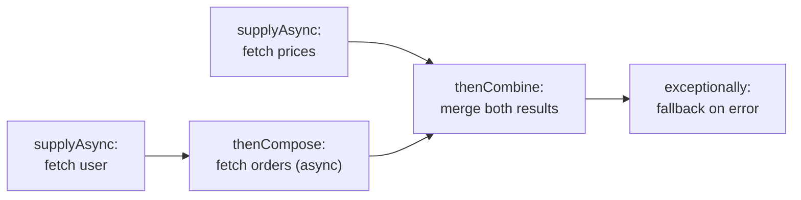

**One line to remember:** `thenApply` = map, `thenCompose` = flatMap, `thenCombine` = zip — pass your own executor and don't `.get()` mid-pipeline.

### 36. Coordination utilities & ThreadLocal
The waiting-room toolkit: **`CountDownLatch`** — one-shot "wait until N things finish"
(`await()` + N × `countDown()`); **`CyclicBarrier`** — reusable "all N threads meet here, then
proceed together"; **`Semaphore`** — N permits limiting concurrent access to a resource (a
poor-man's connection limiter); `Phaser` — a more flexible barrier for phased work.
**`ThreadLocal`** gives each thread its own copy of a value (request context, non-thread-safe
formatters) — but in a thread *pool* the thread survives the request, so a stale value leaks to
the next task: **always `remove()` in a `finally`**. With virtual threads, prefer
**`ScopedValue`** — immutable, scoped, no leak.

**One line to remember:** latch = one-shot wait-for-N, barrier = reusable rendezvous, semaphore = N permits — and `ThreadLocal` in a pool must be `remove()`d.

### 37. Choosing collections & concurrent collections
Defaults that are almost always right: `ArrayList` (not `LinkedList` — pointer-chasing loses on
real hardware), `HashMap`, `ArrayDeque` for stacks and queues (beats the legacy `Stack`),
`PriorityQueue` for a heap, `TreeMap`/`TreeSet` only when you need sorted order or range queries.
For sharing across threads: **`ConcurrentHashMap`** (the default answer — plus its atomic
`computeIfAbsent` for caches), `CopyOnWriteArrayList` (read-mostly listener lists — every write
copies the array), and **`BlockingQueue`** (`ArrayBlockingQueue`/`LinkedBlockingQueue`) for
producer–consumer handoff with built-in backpressure. Remember: wrapping with
`Collections.synchronizedMap` protects single calls, not check-then-act sequences — that's why
`ConcurrentHashMap`'s atomic compound operations matter.

**One line to remember:** `ArrayList`/`HashMap`/`ArrayDeque` by default; `ConcurrentHashMap` + `BlockingQueue` when threads share — with atomic compound ops, not check-then-act.

### 38. The everyday utility belt
**Date/time (`java.time`)**: `Instant` = a UTC timestamp (store and transmit this);
`LocalDate`/`LocalDateTime` = no zone attached; `ZonedDateTime` = zone-aware for display;
`Duration` vs `Period` for amounts of time vs dates. All immutable and thread-safe — the legacy
`Date`/`Calendar`/`SimpleDateFormat` are mutable and broken; don't use them. **HTTP**: the
built-in `java.net.http.HttpClient` (Java 11+) does async and HTTP/2 — no library needed for
simple calls. **Serialization**: Java's built-in `Serializable` is a security liability (RCE
gadget chains) and a coupling trap — use JSON (Jackson), protobuf, or Avro on the wire.
**Exceptions**: try-with-resources for anything `AutoCloseable`; prefer unchecked exceptions for
application code; never swallow (`catch {}`) — wrap with context and rethrow.

**One line to remember:** store time as `Instant` (UTC), serialize with JSON/protobuf (never Java serialization), and clean up with try-with-resources.

---

## If you only remember ten things

1. `javac` makes bytecode; the JIT makes native code from the hot ~10%, speculatively, and can deoptimize.
2. Every object pays a ~16-byte header; allocation is a TLAB pointer bump; allocation *rate* drives GC.
3. GC traces live objects from roots; young-gen is cheap because cost ∝ survivors. Default G1; latency-critical → ZGC.
4. No happens-before edge = data race. `volatile` = visibility + ordering, never atomicity.
5. Immutability (final fields, safe publication) is the cheapest correct concurrency strategy.
6. Thread pools: bounded queues, deliberate sizing. Virtual threads: create freely, never pool.
7. `HashMap`: power-of-two table, treeified bins, expensive resize — and `equals`/`hashCode` must agree.
8. Inlining is the mother of all JIT optimizations; small monomorphic methods feed it.
9. Never trust an unmeasured performance claim — JMH for micro, JFR/flame graphs for macro.
10. Records + sealed types + pattern matching make illegal states unrepresentable.
