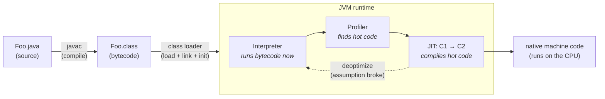

# Java, In Depth — From the Bytecode Up to Principal

> A self-study curriculum that takes you from *writing Java* to *reasoning about what the JVM
> actually does with your code* — the way a principal engineer does. Built for a focused 3-month
> intensive, and built to be **seen**: every hard-to-picture process here has a Mermaid diagram or
> an interactive animation.

This is not another "learn Java syntax" course, and it is not a list of APIs. You already write
features. The gap between you and a principal engineer is **not** knowing more of `java.util`; it
is understanding *why the platform behaves the way it does* well enough to reason about
performance, correctness, and failure from first principles.

A junior says *"the loop is slow, I'll add a cache."* A principal says *"the loop allocates a
`Long` per iteration because of autoboxing, those die in Eden so the cost is GC pressure not the
cache miss you assumed — here's the JFR allocation profile proving it, and the fix is a primitive
`long[]`, which also lets the JIT vectorize it. I'd revisit only if the array stops fitting in L2."*
Everything here is built to grow that second voice in your head — and to back it with a number
you measured on a real JVM.

---

## Who this is for

You, specifically: an engineer in the **first couple of years** who can write working Java but
treats the JVM as a black box. You want real depth — bytecode, class loading, memory layout,
garbage collection, the JIT, the memory model, concurrency, virtual threads — **fast, and without
the hand-waving.** The track **builds the platform up from scratch** (what a `.class` file is, how
it's loaded and executed) before assuming any internals background, then climbs all the way to GC
tuning, the Java Memory Model, Project Loom, and reading the JVM specification itself.

If you're already comfortable with bytecode and class loading, skim Part 0 and start at Part 1.

> **Companion, not replacement, for the [LLD track](../LLD/).** LLD asks *"what's the cleanest way
> to structure the classes inside one component?"* This track asks *"what does the machine do with
> those classes at runtime?"* They meet in the middle — e.g. *why* an immutable value type is cheap
> (escape analysis, scalar replacement) is an internals answer to an LLD design choice.

---

## How to use this (read this part — it's the difference between learning and skimming)

Reading these documents will make you *feel* knowledgeable. That feeling is a trap. But Java
internals have a superpower the design tracks don't: **the JVM is a real machine you can
interrogate.** You never have to *believe* a claim here — you can *prove* it. That makes the loop
slightly different and far more powerful:

1. **Predict, then read.** Before a writeup, spend 2 minutes guessing the answer to its title
   (*"what's actually in an object header?"*, *"why is a young-gen GC fast?"*). Reading to *check* a
   guess sticks far better than reading cold.
2. **Read actively.** Each writeup ends with a **Self-Check**. Close the doc and answer out loud,
   in your own words, as if explaining to a colleague. If you can't, you don't know it yet.
3. **Then *measure it* on a real JVM.** This is the habit that separates this track from a blog
   binge. Almost every claim here is verifiable with a tool you already have:
   - `javap -c -p` to read the bytecode your source compiled to,
   - [JOL](https://github.com/openjdk/jol) to print an object's real memory layout,
   - [JMH](https://github.com/openjdk/jmh) to benchmark without lying to yourself,
   - `-Xlog:gc*`, [JFR](https://docs.oracle.com/en/java/javase/21/jfapi/) + JDK Mission Control, and
     [async-profiler](https://github.com/async-profiler/async-profiler) to *watch* GC, allocation,
     and hot methods,
   - `jcmd`, `jstack`, `jmap` to inspect a live JVM.

   When the measurement surprises you — and it will — that gap *is* the learning. Reconcile it
   against the writeup and, when in doubt, against the spec.
4. **Build one thing per part.** Reading about TLAB allocation is one tenth of understanding it. The
   [ROADMAP](ROADMAP.md) gives each part a small hands-on artifact (write a classloader, force a
   `OutOfMemoryError` of each kind on purpose, find a false-sharing slowdown and fix it with
   `@Contended`). Touching the real thing converts knowledge into intuition.

> **The single highest-ROI habit in this track: never trust a performance claim you didn't
> measure — including the ones in here.** "Verify against the primary source" is a principal habit;
> for the JVM the primary source is *the running JVM* and *the specification*.

### See it move — the visual layer

You asked for this to be **rich in graphics and animations**, and that's not decoration: JVM
internals are mostly **processes over time** — garbage being collected and the heap compacted, a
hot loop being recompiled and then deoptimized, two threads' memory operations being reordered,
a `HashMap` resizing and treeifying. Static prose undersells motion. So every such process gets a
visual, in one of two media:

- **Mermaid diagrams**, inline in the markdown, for *structure* (the runtime data areas, the
  classloader hierarchy, the AQS state machine).
- **Standalone interactive HTML animations**, in each part's `visualizations/` folder, for
  *dynamics* you can play, pause, step, and scrub. Self-contained single files — no build, no
  dependencies, no network. Just open in a browser.

The full approach and the catalog of planned animations is in **[VISUALIZATIONS.md](VISUALIZATIONS.md)**.

### The mental model everything rests on

Your `.java` is compiled *once* to portable bytecode. At runtime the JVM **interprets it
immediately** (fast startup), **profiles** it to find the ~hot 10% that matters, and **JIT-compiles
just that** to optimized native code — and will **throw the native code away** ("deoptimize") if a
speculative assumption turns out wrong. Almost every "Java is slow / Java is fast" argument is
really an argument about *this loop*. Parts 0–2 take it apart completely.

---

## The curriculum

Work top to bottom — each part assumes the previous ones. The [ROADMAP](ROADMAP.md) sequences all
of this into 12 weeks; [STUDY-METHOD.md](STUDY-METHOD.md) is *how* to learn it fast (read it before
Week 1 — it matters more than the order).

### Part 0 — The Platform & Mental Model *(what every later idea rests on)*
What the JVM *is*, and what happens between `javac` and a running method.
- **01 · The Java Platform & Execution Pipeline** — JDK/JRE/JVM, source → bytecode → interpret → JIT → native, why "write once, run anywhere" is a runtime fact not a compiler one.
- **02 · The Class File & Bytecode** — anatomy of a `.class`, the constant pool, the operand-stack machine, reading real bytecode with `javap`.
- **03 · Class Loading, Linking & Initialization** — the load→link(verify/prepare/resolve)→init lifecycle, the loader hierarchy and delegation, when `<clinit>` actually runs.
- **04 · JVM Runtime Data Areas** — the full memory map: heap, thread stacks, metaspace, PC registers, native memory — what lives where and who can run out.

### Part 1 — Memory & Garbage Collection *(the heart of the internals)*
- **05 · Object Layout in Memory** — the object header (mark word, klass pointer), field packing & alignment, compressed oops, and how to compute an object's real size with JOL.
- **06 · Allocation & the Heap** — TLABs and bump-pointer allocation, why allocation is nearly free, escape analysis and scalar replacement (the object that's never born).
- **07 · Garbage Collection Fundamentals** — reachability and GC roots, mark-sweep-compact, the generational hypothesis, copying collectors, and why young-gen GC is cheap.
- **08 · The Modern Collectors** — Serial / Parallel / G1 / ZGC / Shenandoah: the throughput-vs-pause trade-off, when to pick each, and how to read a GC log.
- **09 · Reference Types & Cleaners** — strong/soft/weak/phantom references, `ReferenceQueue`, why `finalize()` is dead, and how `Cleaner` replaces it.

### Part 2 — Execution & Performance *(how your code actually runs)*
- **10 · The Interpreter & Bytecode Execution** — the operand-stack machine in motion, template interpretation, why the interpreter exists at all.
- **11 · The JIT Compilers** — C1 vs C2, tiered compilation, profile-guided & speculative optimization, deoptimization, on-stack replacement (OSR).
- **12 · JIT Optimizations** — inlining (the mother of all optimizations), escape analysis, lock elision/coarsening, loop unrolling, intrinsics — what the compiler does *for* you.
- **13 · Benchmarking the JVM Correctly** — why naïve microbenchmarks lie, warmup, dead-code elimination, and using JMH so your numbers mean something.
- **14 · Mechanical Sympathy** — CPU caches, cache lines, false sharing, branch prediction, data locality: writing JVM code that respects the hardware underneath.

### Part 3 — Concurrency & the Java Memory Model *(the hardest internals — slow down here)*
- **15 · Threads & the OS** — platform threads as OS threads, thread states & scheduling, the real cost of a thread.
- **16 · The Java Memory Model** — happens-before, visibility, reordering, the *exact* meaning of `volatile` and `final`-field semantics. The contract that makes concurrent code correct.
- **17 · Locks & Synchronization Internals** — object monitors, `synchronized`, lock inflation (lightweight → heavyweight), `wait`/`notify` mechanics.
- **18 · `java.util.concurrent`** — AbstractQueuedSynchronizer (AQS), CAS and the atomics, concurrent collections, executors and thread pools done right.
- **19 · Virtual Threads & Structured Concurrency (Project Loom)** — continuations, carrier threads, mounting/unmounting, pinning, and the model that changes how you write servers.

### Part 4 — The Language, In Depth *(semantics the internals explain)*
- **20 · Generics & Type Erasure** — what erasure really removes, bridge methods, variance & wildcards, why arrays and generics disagree.
- **21 · Collections Internals** — `ArrayList` growth, `HashMap` hashing/resize/treeification, `ConcurrentHashMap`, `TreeMap` — the data structures you use every day, from the inside.
- **22 · Strings** — immutability and why it's load-bearing, the string pool & interning, compact strings (Latin-1 vs UTF-16), concatenation and `StringBuilder`.
- **23 · Equality, Identity & Comparison** — the `equals`/`hashCode`/`Comparable` contracts and the collection machinery that depends on them (ties straight back to Part 1's object layout and Part 4's collections).
- **24 · Modern Language Features as Design Tools** — records, sealed types, pattern matching, and `switch` expressions — and how they let you make illegal states unrepresentable (the bridge to the LLD track).

### Part 5 — I/O, Interop & Deployment *(the JVM in production)*
- **25 · I/O & NIO** — blocking vs non-blocking, channels/buffers/selectors, memory-mapped files, off-heap (`DirectByteBuffer`).
- **26 · Native Interop** — JNI and its costs, and the modern Foreign Function & Memory API (Project Panama).
- **27 · Diagnostics & Observability** — JFR, async-profiler and flame graphs, heap dumps & leak hunting, safepoints and time-to-safepoint.
- **28 · Startup, Footprint & Native Image** — class-data sharing, AOT, GraalVM native image, and the startup-vs-peak-throughput trade-off that decides your deployment.

### Part 6 — Principal Skills *(the meta-skills that define the level)*
- **29 · Performance Reasoning & Data-Driven Trade-offs** — forming a hypothesis, measuring, and choosing with evidence instead of folklore.
- **30 · Reading the Specs & the Source** — navigating the JLS and JVMS, following JEPs, reading OpenJDK source — so you can answer questions no blog post covers.
- **31 · The Java Internals Reading List** — the specs, books, talks, and people worth your time, and what to study *after* this.

---

## What "principal-level" actually means here

As you study, measure yourself against these markers. They matter more than any single fact.

| Junior thinking | Senior thinking | Principal thinking |
|---|---|---|
| "It works." | "It works and it's fast enough." | "Here's where the time and the allocations actually go — I profiled it — and here's the one change that moves the needle and what it costs." |
| "Java manages memory for me." | "The GC cleans up; I avoid leaks." | States which collector is running, why *that* pause happened, what the allocation rate is, and which knob (or which code change) fixes it. |
| Reasons about source code. | Reasons about source code. | Reasons about the **bytecode and the native code** — knows the JIT inlined this, scalar-replaced that, and elided this lock. |
| "Add `synchronized` to be safe." | Uses `volatile`/locks correctly by recipe. | Reasons from **happens-before**: states exactly which writes are visible to which reads, and why the data race is benign or fatal. |
| Trusts a benchmark number. | "Warm it up first." | Knows *why* the number could be a lie (DCE, no warmup, on-stack replacement) and structures the measurement so it can't be. |
| "The library does it." | Can read the library. | Has read the JDK source for it, knows its complexity and its failure modes, and can predict its behavior under load. |

If you finish this curriculum able to *talk* like the right-hand column — with the bytecode, the
GC log, and the profiler flame graph to back it up — you'll be operating well above your years.

---

## A note on honesty

Java internals are a minefield of confidently-wrong folklore (*"objects are 8× a primitive,"*
*"`String` interning is always a win,"* *"`final` makes it thread-safe,"* *"biased locking is still
a thing"* — it was removed). Two defenses are built into this track:

1. **Every claim is paired with the tool that checks it.** Don't believe the writeup — run `javap`,
   JOL, JMH, or read the GC log, and see for yourself.
2. **The primary source is the spec.** When something surprises you, go to the
   [JVM Specification](https://docs.oracle.com/javase/specs/jvms/se21/html/), the
   [Java Language Specification](https://docs.oracle.com/javase/specs/jls/se21/html/), or the
   relevant [JEP](https://openjdk.org/jeps/0). *Internals change between releases* — these writeups
   target a modern LTS (Java 21+) and call out where behavior is version-specific. Verifying against
   primary sources is itself a principal habit.

Now open the [**ROADMAP**](ROADMAP.md) and start Week 1 — but read [STUDY-METHOD.md](STUDY-METHOD.md) first.
