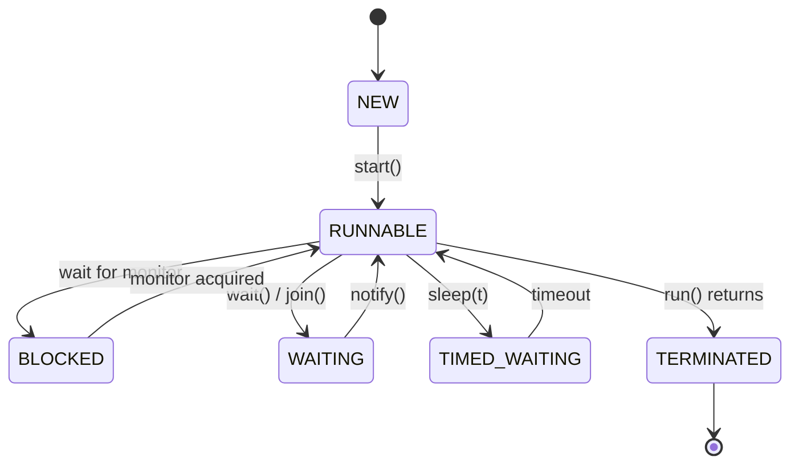

# The Visual Layer — Graphics & Animations

> Why this track is built to be *seen*, the two media it uses, the conventions every visual
> follows, and the full catalog of planned animations. [← back to the index](README.md)

## Why animate the JVM at all

Most JVM internals are **processes that unfold over time**, and time is exactly what a paragraph or
a static diagram can't show. Consider:

- **Garbage collection** is *motion* — live objects copied across regions, the heap compacted,
  pointers fixed up. A still picture of "before" and "after" hides the entire mechanism.
- The **JIT** *recompiles a hot loop mid-flight* and later *deoptimizes back to the interpreter*.
  The whole point is that the same code's execution strategy changes as it runs.
- The **Java Memory Model** is about *reordering* — operations sliding past each other across two
  threads until a happens-before edge pins them. You have to watch them slide.
- A **`HashMap` resize** rehashes every entry into a bigger table and treeifies a hot bucket. It's a
  small animation; it's an incomprehensible wall of arrows as a diagram.

So: anything that *moves* in the JVM gets something that *moves* on the page. That's the whole
philosophy — not eye-candy, but choosing the medium that matches the mechanism.

---

## Two media, by job

### 1. Mermaid — for *structure*
Inline in the markdown chapters, rendered by GitHub and most editors. Use Mermaid for things that
are fundamentally **a fixed shape**: hierarchies, state machines, pipelines, memory maps.

Good Mermaid candidates: the runtime data areas, the classloader delegation chain, the
compile→interpret→JIT pipeline, the thread state machine, the AQS node queue, the object
reachability graph, the GC collector family tree.

*(A taste — the real version, annotated, lives in Part 3 · Threads & the OS.)*

### 2. Standalone interactive HTML — for *dynamics*
One self-contained `.html` file per animation, living in the relevant part's `visualizations/`
folder. These are for things you need to **play, pause, step, and scrub**: the actual motion of a
GC cycle, a JIT tier-up, a memory reordering.

**Hard rules for every HTML visualization** (so they stay drop-in and never rot):

- **Self-contained.** One file. All CSS and JS inline. **No build step, no dependencies, no
  network, no CDN.** It must work by double-clicking it, offline, in five years.
- **Vanilla only.** Plain HTML + CSS + JS, with `<canvas>` or inline SVG for the graphics. No
  frameworks, no `npm`.
- **Driven by controls, not a clock.** Every animation has **Play / Pause / Step / Reset** and a
  scrubber. The learner controls time — *stepping one GC phase at a time* is where understanding
  happens. Auto-play is opt-in, never the only mode.
- **A "what to notice" caption.** Each visualization states, in one or two sentences, the single
  thing the motion is meant to reveal — so it teaches rather than just dazzles.
- **Honest, not magical.** Annotate with the real terms (Eden / Survivor / Old, `mark word`,
  `happens-before`) so the picture maps directly onto the prose and the spec.
- **Consistent look.** Dark background (terminal-friendly), a shared palette (one color for
  "live/reachable," one for "garbage," one for "moving/active," one for "frozen/safepoint"), and a
  link back to the chapter that explains it.

> A lightweight shared stylesheet/JS scaffold (`visualizations/_shared/`) will be added with the
> first animation so they all look and behave alike; until then each file is fully standalone.

---

## The animation catalog

The marquee animations, by part. This doubles as the **build spec** — each part's
`visualizations/README.md` tracks the status of its own list. (Built alongside the chapters; the
full-scaffold pass reserves the folders and specs them.)

### Part 0 — Platform & Mental Model
- **`pipeline.html`** — a method's journey: source → bytecode → interpreter → (hot!) → C1 → C2 →
  native, with a deopt arrow firing. *Notice: the same method changes how it executes as it runs.*
- **`operand-stack.html`** — step through `a + b * c` as bytecode pushing/popping the operand stack.
  *Notice: the JVM is a stack machine, not a register machine.*
- **`classloader-delegation.html`** — a load request walking *up* the loader chain (app → platform →
  bootstrap) then resolving *down*. *Notice: parents get first refusal — that's what prevents class spoofing.*

### Part 1 — Memory & Garbage Collection *(the visual centerpiece of the track)*
- **`object-header.html`** — the bits of an object header (mark word + klass pointer), toggling
  through states: unlocked, hash-stamped, GC-age, locked. *Notice: identity hashCode and lock state live in those bits.*
- **`tlab-allocation.html`** — threads bump-pointer-allocating in their own TLABs, then refilling.
  *Notice: allocation is a pointer add, not a malloc.*
- **`young-gen-copy.html`** — a generational copying collection: Eden fills, survivors copy between
  S0/S1, aging objects promote to Old. *Notice: only live objects are touched; dead ones cost nothing.*
- **`mark-sweep-compact.html`** — the three phases on one heap, steppable, with fragmentation before
  and compaction after. *Notice: why "stop-the-world" exists and what compaction buys.*
- **`g1-regions.html`** — the heap as a grid of regions; G1 picks the highest-garbage ones to
  collect (the "garbage first" idea). *Notice: G1 collects regions, not generations, to hit a pause target.*
- **`reference-strength.html`** — strong/soft/weak/phantom holders and what survives a GC under
  memory pressure, with the `ReferenceQueue` filling. *Notice: the GC, not you, decides when soft/weak clear.*

### Part 2 — Execution & Performance
- **`tiered-compilation.html`** — invocation counters climbing, thresholds tripping C1 then C2, and a
  deoptimization when a speculative type check fails. *Notice: the JVM bets, and pays to be wrong.*
- **`inlining.html`** — a call tree collapsing as the JIT inlines, then optimizes across the merged
  body. *Notice: inlining is what *enables* the other optimizations.*
- **`cpu-cache-false-sharing.html`** — two threads writing two fields on the *same cache line*,
  ping-ponging ownership; then padded apart and flying. *Notice: correctness is fine, speed is destroyed — by 64 bytes.*

### Part 3 — Concurrency & the Java Memory Model
- **`reordering.html`** — two threads' instructions on a timeline you can shuffle within the rules,
  showing a data race produce a "impossible" result, then a `volatile` edge forbidding it.
  *Notice: happens-before is the only thing standing between you and that result.*
- **`lock-inflation.html`** — a monitor going lightweight (CAS) → contended → heavyweight (OS
  park/unpark). *Notice: uncontended locks are cheap; contention is what costs.*
- **`aqs-queue.html`** — threads acquiring/failing/parking in the AQS CLH queue, then being unparked
  in order. *Notice: this one class powers `ReentrantLock`, `Semaphore`, `CountDownLatch`, …*
- **`virtual-threads.html`** — many virtual threads mounting/unmounting on a few carrier threads,
  parking on I/O without blocking a carrier — and one *pinning* and blocking a carrier.
  *Notice: blocking a virtual thread is free; pinning is the bug to hunt.*

### Part 4 — The Language, In Depth
- **`hashmap-resize.html`** — entries rehashing into a doubled table, a hot bucket treeifying past 8
  collisions. *Notice: resize is O(n) and amortized; treeification rescues the degenerate case.*
- **`arraylist-growth.html`** — capacity growth (1.5×) and the array copies, vs a pre-sized list.
  *Notice: the cost you don't see is the copies.*
- **`string-pool.html`** — literals interning into the pool vs `new String` on the heap; `==` vs
  `.equals`. *Notice: where identity comes from, and the interning footgun.*

### Part 5 — I/O, Interop & Deployment
- **`nio-selector.html`** — one selector thread multiplexing many channels via readiness events vs a
  thread-per-connection model. *Notice: how one thread serves thousands of connections.*
- **`startup-vs-peak.html`** — throughput-over-time curves: interpreter start → JIT warmup → C2 peak,
  vs an AOT/native-image flat-from-zero curve. *Notice: the crossover that decides your deployment.*

---

## How visuals are referenced from the chapters

Each chapter embeds its Mermaid inline and links its HTML animation with a one-line callout, e.g.:

> ▶ **Watch it:** [`young-gen-copy.html`](visualizations/young-gen-copy.html) — step through one
> minor GC and watch live objects copy out of Eden while the dead ones simply vanish.

So the prose carries the precise explanation, Mermaid carries the structure, and the HTML carries
the motion — three views of the same idea, which is exactly how something hard becomes obvious.
