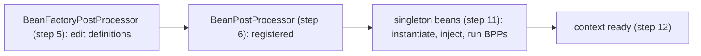

# 02 · ApplicationContext & BeanFactory

> The container from [ch.01](README.md) has a concrete type — and a **fixed, ordered bootstrap** you
> can recite. Once you know `refresh()`, "when does my bean get created?", "when does the web server
> start?", and "why did that `BeanFactoryPostProcessor` run before my beans?" all have exact answers.
> [← Part 0 · Foundations: The Container](README.md) · prev: 01 · What Spring Is · next: 03 · Bean Definitions & Component Scanning

> **Predict first (2 min).** Your app has 200 singleton beans and one `@Bean` marked `@Lazy`. When
> `SpringApplication.run()` returns, how many of the 200 have been *instantiated*? And at what point
> in startup did the embedded Tomcat begin accepting requests — before or after those beans exist?
> Write your guesses.

---

## `BeanFactory` vs `ApplicationContext`: superset, not alternative

`BeanFactory` is the **minimal** container interface: hold bean definitions, hand back beans, do DI.
It's **lazy** by default — a bean is created when first requested.

`ApplicationContext` **extends** `BeanFactory` and is what you actually use. Same bean container
underneath, plus the things a real app needs:

| Adds on top of `BeanFactory` | Why it matters |
|---|---|
| **Eager singleton instantiation** | all non-lazy singletons built at startup → fail-fast, not at first request |
| **Events** (`ApplicationEventPublisher`) | publish/subscribe within the app ([ch.09](../01-extension-and-aop/)) |
| **`Environment`** | properties & profiles ([ch.14](../02-spring-boot-core/)) |
| **`MessageSource`** | i18n |
| **Resource loading** | `classpath:`/`file:` resource abstraction |
| **Automatic `BeanPostProcessor`/`BeanFactoryPostProcessor` registration** | the extension model ([Part 1](../01-extension-and-aop/)) |

So it's not "which do I pick" — `ApplicationContext` *is* a `BeanFactory` with the batteries
included. (Concrete Boot type: `AnnotationConfigServletWebServerApplicationContext` for a servlet web
app.)

## `refresh()`: the fixed, ordered bootstrap

Every context boots through **`AbstractApplicationContext.refresh()`** — one synchronized method with
a fixed sequence. This ordering *is* the syllabus; memorize it:

```
refresh():
  1  prepareRefresh()                    // flags, validate required properties
  2  obtainFreshBeanFactory()            // load/parse BeanDefinitions → the factory
  3  prepareBeanFactory()                // register standard deps (Environment, etc.)
  4  postProcessBeanFactory()            // subclass hook (web contexts add scopes)
  5  invokeBeanFactoryPostProcessors()   // BFPPs run — can MODIFY definitions
                                          //   (ConfigurationClassPostProcessor scans @Configuration here)
  6  registerBeanPostProcessors()        // BPPs registered (not yet run) — AOP/@Autowired infra
  7  initMessageSource()                 // i18n
  8  initApplicationEventMulticaster()   // event plumbing
  9  onRefresh()                         // subclass hook — ★ EMBEDDED WEB SERVER STARTS HERE
  10 registerListeners()                 // wire @EventListener / ApplicationListener beans
  11 finishBeanFactoryInitialization()   // ★ INSTANTIATE ALL NON-LAZY SINGLETONS (DI + BPPs run)
  12 finishRefresh()                     // publish ContextRefreshedEvent, lifecycle start
```

Two landmarks answer the prediction:

- **Non-lazy singletons are created at step 11**, `finishBeanFactoryInitialization`, *eagerly*. So of
  your 200 beans, **199 are instantiated** when `run()` returns; only the `@Lazy` one waits for first
  use. Eager creation is a feature — a missing dependency or bad config **fails at startup**, not at
  2 a.m. on the first request.
- **The web server starts at step 9** (`onRefresh`) — *before* step 11. But it only begins **serving
  traffic** at the very end; Boot delays taking requests until the context is fully refreshed so you
  never serve from a half-built context. (Chapter 13 in [Part 2](../02-spring-boot-core/) traces the
  Boot-level `run()` around this.)

## Why BFPP-before-BPP-before-beans matters

The order in `refresh()` is not arbitrary — it's a **dependency order** among three kinds of thing:



- **BFPPs run first** because they *edit the blueprints* (`BeanDefinition`s) — e.g.
  `ConfigurationClassPostProcessor` parses your `@Configuration`/`@ComponentScan` and *registers* more
  definitions; a `PropertySourcesPlaceholderConfigurer` resolves `${...}`. They must finish before any
  bean is built from those blueprints.
- **BPPs are registered next** but *run later*, wrapping each bean as it's created (step 11) — this is
  where `@Autowired` injection and **AOP proxy creation** happen ([ch.04](README.md),
  [Part 1](../01-extension-and-aop/)).
- ⚡ A classic bug: making a BPP depend on a regular bean can force that bean to instantiate **too
  early**, before other BPPs are ready — Spring even logs "not eligible for auto-proxying." Knowing
  the order tells you *why*.

## Make it visible

- **Count the eager beans.** Print `ctx.getBeanDefinitionCount()` in `main` after `run()`; add a
  `@Lazy @Bean` with a logging constructor and confirm its constructor log appears only when you first
  *use* it, while every other bean logged during startup.
- **Trace `refresh()`.** Set a breakpoint in `AbstractApplicationContext.refresh()` (or read its
  source) and step the twelve calls — the sequence above becomes real.
- **Watch the server-start landmark.** Enable debug logging; you'll see "Tomcat started on port(s)"
  emitted from `onRefresh` *before* the "Started App in … seconds" that follows `finishRefresh`.

## Self-Check (close the doc, answer out loud)

1. Is `ApplicationContext` an alternative to `BeanFactory` or a superset? Name three things it adds.
2. At which `refresh()` step are non-lazy singletons instantiated — and how many of 200 beans exist when `run()` returns?
3. Where does the embedded web server start in `refresh()`, and why doesn't it serve traffic yet?
4. Why must `BeanFactoryPostProcessor`s run before `BeanPostProcessor`s and before beans?
5. What goes wrong if a `BeanPostProcessor` depends on an ordinary bean?

> **Go deeper:** read `AbstractApplicationContext.refresh()` in the Spring source (it's ~40 lines and
> the whole framework hangs off it); then [03 · Bean Definitions & Component Scanning](README.md), which
> zooms into step 5 — how definitions get created in the first place.
