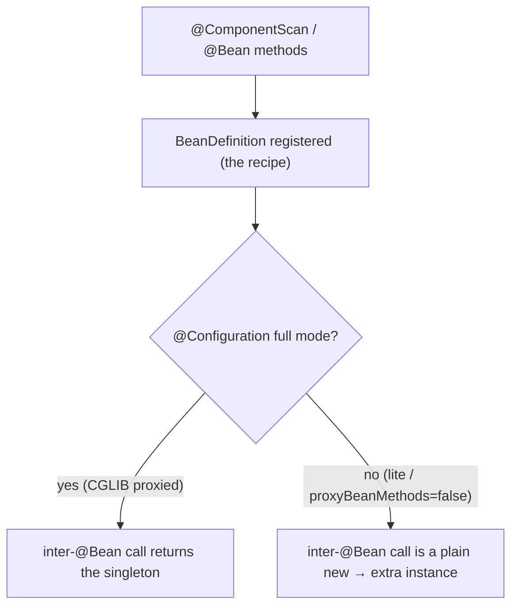

# 03 · Bean Definitions & Component Scanning

> `@Component` and `@Bean` look different, but they produce the *same* thing — a **`BeanDefinition`**,
> the container's recipe for a bean. Seeing that (and how scanning finds them, and why `@Configuration`
> is CGLIB-enhanced) finishes the "there is no magic" picture from [ch.01](README.md).
> [← Part 0 · Foundations: The Container](README.md) · prev: 02 · ApplicationContext & BeanFactory · next: 04 · The Bean Lifecycle & Scopes

> **Predict first (2 min).** Inside an `@Configuration` class, method `a()` calls `b()` — both
> `@Bean`. You call `a()` twice via the container. How many times does `b()` actually execute, and how
> many `B` instances exist? Now imagine the same two methods in a plain `@Component`. Same answer?
> Write your guesses.

---

## The `BeanDefinition`: the container's recipe

Before any bean exists as an object, it exists as a **`BeanDefinition`** — metadata the container
registered describing *how* to make it:

- **class** (or factory method), **scope** (singleton/prototype/…), **lazy** flag,
- **constructor args / property values** (the dependencies to inject),
- **init/destroy method** names, **primary/qualifier** hints, autowire mode.

Everything downstream — DI, lifecycle, AOP — reads this recipe. The two ways you "define a bean" are
just two ways to *register a `BeanDefinition`*; neither is more real:

| Route | How the definition is created |
|---|---|
| **Component scanning** | `@Component`/`@Service`/`@Repository`/`@Controller` classes discovered on the classpath |
| **`@Bean` methods** | a factory method in a `@Configuration` class; return value becomes the bean |

## Component scanning: how stereotypes are found

`@ComponentScan` tells Spring which **base packages** to walk; it reads class metadata (via ASM, no
class-loading needed) and registers a definition for every type carrying a **stereotype** annotation.

- The stereotypes are all `@Component` under the hood — `@Service`/`@Repository`/`@Controller` add
  *semantics* (e.g. `@Repository` triggers persistence-exception translation) but are scan targets
  just the same.
- ⚡ **`@SpringBootApplication` includes `@ComponentScan` with no base package**, so it defaults to
  scanning **the annotated class's own package and everything below it.** This is why "put your main
  class at the root package" is the convention — beans in sibling packages *above* it won't be found.

## `@Bean` and why `@Configuration` is CGLIB-enhanced

The prediction is the crux. In a **`@Configuration`** class, Spring **CGLIB-proxies** the class so
that a `@Bean` method calling another `@Bean` method is intercepted and returns the **container-managed
singleton** — not a fresh object:

```java
@Configuration
class Config {
  @Bean A a() { return new A(b()); }   // the b() call is intercepted →
  @Bean B b() { return new B(); }      // returns the ONE singleton B
}
```

The prediction's answer: **`b()` executes once; there is one `B`.** Even though `a()` textually calls
`b()`, the CGLIB subclass routes that call through the container. This is **"full" `@Configuration`
mode.**

⚡ Contrast **"lite" mode** — `@Bean` methods in a plain `@Component` (or a class *not* annotated
`@Configuration`, or `@Configuration(proxyBeanMethods = false)`): **no CGLIB interception**, so an
inter-bean method call is a *plain Java call* → runs `b()` again and creates a **second, unmanaged
`B`**. Setting `proxyBeanMethods = false` is a valid startup-time optimization *when* your `@Bean`
methods don't call each other — Boot's own auto-configs use it.



## When to use which

- **Component scanning** for *your own* classes — annotate and forget.
- **`@Bean` methods** for types you **don't own** (a third-party client, a `DataSource`), for
  **conditional/complex construction**, or when you need to wire something the scanner can't annotate.
- ⚡ Prefer **not** relying on inter-`@Bean` calls for wiring; take dependencies as **method
  parameters** instead (`@Bean A a(B b)`) — the container supplies `b`, and it works identically in
  full and lite mode. This sidesteps the whole proxy question.

## Make it visible

- **One definition, two routes.** Register a bean by `@Component` and another by `@Bean`; print
  `ctx.getBeanDefinition("name").getClass()` / the bean names — both are ordinary definitions.
- **Prove the CGLIB interception.** In a `@Configuration`, log inside `b()`; call `a()` and `b()` as
  beans — `b()` logs **once**. Flip to `@Configuration(proxyBeanMethods = false)` (or move to
  `@Component`) and watch `b()` log **twice** with two `B` instances.
- **See the scan boundary.** Move a `@Service` to a package *above* your main class; watch it
  silently not get picked up until you add its package to `@ComponentScan`.

## Self-Check (close the doc, answer out loud)

1. What is a `BeanDefinition`, and what do `@Component` scanning and `@Bean` methods have in common?
2. What does `@SpringBootApplication` scan by default, and why does main-class placement matter?
3. In full `@Configuration` mode, how many times does an inter-`@Bean` call run — and *why*?
4. What changes in "lite" mode / `proxyBeanMethods = false`, and when is that the right choice?
5. What's the cleaner alternative to inter-`@Bean` method calls for wiring dependencies?

> **Go deeper:** the Spring reference → "Classpath Scanning" and "Using the `@Configuration`
> annotation"; read `ConfigurationClassPostProcessor` (the BFPP from [ch.02](README.md) that does this
> registration); then [04 · The Bean Lifecycle & Scopes](README.md), where a registered definition
> becomes a living bean.
