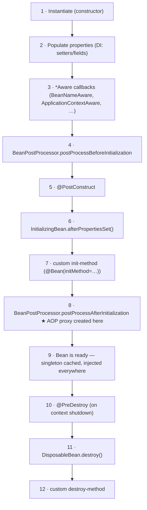

# 04 · The Bean Lifecycle & Scopes

> The exact, ordered pipeline every bean goes through — instantiate → inject → initialize → use →
> destroy — *where in it the AOP proxy is created*, and what the scopes really mean.
> [← Part 0 · Foundations: The Container & IoC](README.md) · prev: 03 · Bean Definitions · next: 05 · DI Internals & Circular Dependencies

> **Predict first (2 min).** A bean has both a `@PostConstruct` method and implements
> `InitializingBean.afterPropertiesSet()`. Which runs first? And: when does the `@Transactional`
> proxy get created — before or after those init callbacks? Write your guesses.

---

## Why the order matters

"Spring wires my bean and it works" is fine until a `@PostConstruct` reads a field that isn't
injected yet, or a `@Transactional` method called from inside `init` doesn't start a transaction
(the proxy isn't there yet), or a `@PreDestroy` doesn't fire (prototype scope). Every one of those is
a *lifecycle ordering* question. The lifecycle is a **fixed, ordered pipeline** that runs the same
way for every bean — memorize it once and these stop being mysteries.

---

## The full lifecycle, in order



> ▶ **Watch it:** [`bean-lifecycle.html`](visualizations/bean-lifecycle.html) — step through all 12
> stages and watch the **proxy get created at stage 8**, *after* your init callbacks ran on the raw
> object.

So the predictions: **`@PostConstruct` runs before `afterPropertiesSet()`** (stage 5 before 6), and
the **proxy is created at stage 8 — *after* all your init callbacks**. Two consequences a principal
keeps in mind:

1. **Your init code runs on the raw object, not the proxy.** A `@Transactional`/`@Async` method
   called from within `@PostConstruct` won't be advised — the proxy doesn't exist yet (and even once
   it does, a self-call wouldn't cross it — see [chapter 07](../01-extension-and-aop/)).
2. **`BeanPostProcessor` wraps initialization on both sides** (stages 4 and 8). The auto-proxy
   creator is just a `BeanPostProcessor` running at stage 8 — which is *why* the lifecycle and the
   extension model ([chapter 06](../01-extension-and-aop/)) are the same story.

### Prefer `@PostConstruct` (or constructor logic)

Of the three init hooks (`@PostConstruct`, `InitializingBean`, `init-method`), prefer
`@PostConstruct` for annotation-driven code, or just do the work in the **constructor** when all
dependencies are constructor-injected (then the object is fully valid the moment it exists).
`InitializingBean`/`DisposableBean` couple your code to Spring interfaces — usually avoid.

---

## Scopes — how many instances, and for how long

A **scope** decides how many instances the container creates and how long each lives.

| Scope | Instances | Lifetime | Destroy callbacks? |
|---|---|---|---|
| **singleton** (default) | **one per container** | the whole context | ✅ yes |
| **prototype** | **a new one every time it's requested/injected** | not managed after creation | ❌ **no** (Spring hands it off and forgets it) |
| **request** (web) | one per HTTP request | the request | ✅ |
| **session** (web) | one per HTTP session | the session | ✅ |
| **application** (web) | one per `ServletContext` | the app | ✅ |
| **websocket** (web) | one per WebSocket session | the session | ✅ |

Two traps worth their own paragraph:

- **"Singleton" is not the GoF Singleton, and it is not thread-safe.** It means *one instance per
  Spring container* — shared across all threads. Spring guarantees one instance, **not** the absence
  of shared mutable state. Keep singletons **stateless** (or guard their state yourself, → the
  [java track's Java Memory Model](../../java/03-concurrency-and-jmm/)). This is the single most
  common concurrency bug in Spring apps: mutable fields on a `@Service`.
- **Prototype gets no destroy callback.** Spring creates a prototype, injects/returns it, and then
  *stops managing it* — `@PreDestroy` never runs. If a prototype holds a resource, you must close it.

### The prototype-in-singleton problem

Inject a **prototype** bean into a **singleton** the naive way and you get… one instance, forever —
because the singleton is wired *once*, at its creation, so it captures *one* prototype and reuses it.
To actually get a fresh prototype per use, inject an `ObjectProvider<T>` (or a `@Lookup` method) and
call it each time:

```java
@Service
class ReportService {
    private final ObjectProvider<ReportJob> jobs;   // not ReportJob directly
    ReportService(ObjectProvider<ReportJob> jobs) { this.jobs = jobs; }
    void run() { ReportJob job = jobs.getObject(); /* fresh prototype each call */ }
}
```

---

## Make it visible

Don't trust the diagram — make the container narrate it:

- **Watch the order.** Make one bean that implements `BeanNameAware`, `ApplicationContextAware`,
  `InitializingBean`, `DisposableBean`, *and* has a `@PostConstruct`, a `@PreDestroy`, and an
  `@Bean(initMethod=…, destroyMethod=…)`. Log a line in each. Run it; read the order against the
  pipeline above until nothing surprises you. (Trigger destruction with a clean
  `context.close()` / app shutdown.)
- **See the proxy timing.** Log `this.getClass()` inside `@PostConstruct` (prints your raw class) and
  compare to the class another bean sees when it injects this one (prints the `…$$SpringCGLIB$$…`
  proxy). The difference *is* stage 8.
- **Confirm a prototype is fresh.** Inject an `ObjectProvider`, call `getObject()` twice, and print
  `System.identityHashCode` — two different objects. Do it without the provider — same object.

---

## Self-Check (close the doc, answer out loud)

1. Recite the lifecycle in order. Where does `@PostConstruct` fall relative to
   `afterPropertiesSet()` and the custom init-method?
2. At which stage is the AOP proxy created, and what surprising consequence does that have for code
   running in `@PostConstruct`?
3. What does `BeanPostProcessor` do, and why is it the link between the lifecycle and AOP?
4. Why is a singleton bean *not* thread-safe by default, and what's the rule of thumb that avoids the
   bug?
5. Why does a `@PreDestroy` on a prototype-scoped bean never run?
6. You inject a prototype into a singleton and always get the same instance. Why — and how do you fix
   it?

> **Go deeper:** the Spring reference → "Bean lifecycle callbacks" and "Bean scopes"; read
> `AbstractAutowireCapableBeanFactory.doCreateBean` in the source to see stages 1–8 in one method;
> then [05 · DI Internals & Circular Dependencies](README.md).
