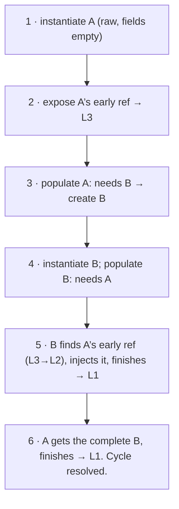

# 05 · Dependency Injection Internals & Circular Dependencies

> How the container resolves `@Autowired`, why **constructor injection** is the default to reach for,
> and the **three-level cache** that lets *setter* cycles resolve while *constructor* cycles can't.
> [← Part 0 · Foundations: The Container & IoC](README.md) · prev: 04 · Bean Lifecycle & Scopes · next: Part 1 · 06 · BeanPostProcessor

> **Predict first (2 min).** Bean `A` needs `B` and bean `B` needs `A`. If both use **field/setter**
> injection, does the context start? If both use **constructor** injection, does it? Write both
> answers and *why they differ*.

---

## How `@Autowired` resolves

Injection is not magic wiring — it's **resolution against the bean graph**:

1. **By type first.** For a dependency of type `T`, find the bean definition(s) of type `T`.
2. **Disambiguate** if there's more than one: a `@Primary` bean wins; otherwise a `@Qualifier("name")`
   selects; otherwise the **field/parameter name** is matched against bean names; otherwise it's an
   error — `NoUniqueBeanDefinitionException` (a *startup* failure, not runtime).
3. **Recurse:** to inject `T`, `T` must itself be created first (its own dependencies resolved). This
   recursion is what makes circular dependencies possible — and is the heart of this chapter.

`Optional<T>`, `ObjectProvider<T>`, `List<T>`/`Map<String,T>` (all beans of a type), and `@Lazy` are
all resolution *modes* the container understands.

---

## Prefer constructor injection

Three injection styles; the choice is a real design decision:

| Style | How | Verdict |
|---|---|---|
| **Constructor** | deps as constructor params | **Default.** Fields can be `final`; the object is **fully initialized and valid the instant it exists**; missing deps fail fast at construction; trivially unit-testable with `new` (no Spring). |
| **Setter** | `@Autowired` on setters | For genuinely *optional* or reconfigurable deps. |
| **Field** | `@Autowired` on a field | Concise but worst: can't be `final`, hides dependencies, needs reflection/Spring to test. Avoid. |

Constructor injection's "fully valid the instant it exists" property is exactly what makes
constructor *cycles* impossible to resolve — which is the next section, and a *feature*, not a bug.

---

## Circular dependencies and the three-level cache

When `A` needs `B` and `B` needs `A`, the recursion in step 3 above would loop forever — unless the
container can hand out a reference to a *half-built* bean. For **singletons with setter/field
injection**, it can, using a **three-level cache** inside the singleton factory:

| Level | Map | Holds |
|---|---|---|
| **L1** | `singletonObjects` | fully initialized, ready beans |
| **L2** | `earlySingletonObjects` | early references that have been exposed during creation |
| **L3** | `singletonFactories` | factories that can *produce* an early reference (incl. the right proxy) |

> ▶ **Watch it:** [`circular-dependency.html`](visualizations/circular-dependency.html) — step
> through the three-level cache resolving a setter cycle, then a constructor cycle failing.

So the predictions:

- **Setter/field cycle → resolves.** `A` is instantiated first (a raw object exists), its early
  reference is exposed, so when `B` asks for `A` it gets that early reference, finishes, and then `A`
  finishes with the complete `B`. The half-built object is the escape hatch.
- **Constructor cycle → fails** with `BeanCurrentlyInCreationException`. To *construct* `A` you need
  `B` already, and to construct `B` you need `A` already — neither object exists yet, so there's
  **nothing to expose** as an early reference. Structurally unrescuable.

> **Version fact (Boot 2.6+):** circular references are **prohibited by default**
> (`spring.main.allow-circular-references=false`). Even a resolvable setter cycle fails at startup
> unless you opt back in — Spring's own guidance is that a cycle is a **design smell**. The right fix
> is almost never `@Lazy` or flipping the flag; it's to **break the cycle** (extract the shared logic
> into a third bean, or rethink the responsibilities). `@Lazy` on one dependency (injecting a proxy
> that resolves on first use) is the escape hatch when you truly can't restructure.

---

## Make it visible

- **Force both cases.** Wire `A↔B` with setters, set `spring.main.allow-circular-references=true`,
  and watch it start. Then rewrite with constructor injection and watch
  `BeanCurrentlyInCreationException` at startup — read the cycle it prints.
- **See resolution disambiguate.** Define two beans of one interface; inject by type → watch
  `NoUniqueBeanDefinitionException`; fix with `@Primary`, then `@Qualifier`, then field-name matching.
- **Watch the early reference.** Set a breakpoint in
  `DefaultSingletonBeanRegistry.getSingleton(...)` and step the L3→L2→L1 promotion for the setter
  cycle. The three maps are right there.

---

## Self-Check (close the doc, answer out loud)

1. Walk `@Autowired` resolution: by type, then how is ambiguity broken, and what error if it can't be?
2. Why is constructor injection the default? Give three concrete benefits.
3. Name the three cache levels and what each holds. How does an early reference resolve a setter cycle?
4. Why can't a *constructor* cycle be resolved, mechanically? What exception do you get?
5. What changed in Boot 2.6 about circular references, and what's the *right* fix for a cycle?
6. When is `@Lazy` the appropriate escape hatch, and what does it actually inject?

> **Go deeper:** read `DefaultSingletonBeanRegistry` and `AbstractAutowireCapableBeanFactory` in the
> Spring source to see the three maps; then on to [Part 1 · The Extension Model & AOP](../01-extension-and-aop/),
> where `BeanPostProcessor` and proxies build on everything in Part 0.
