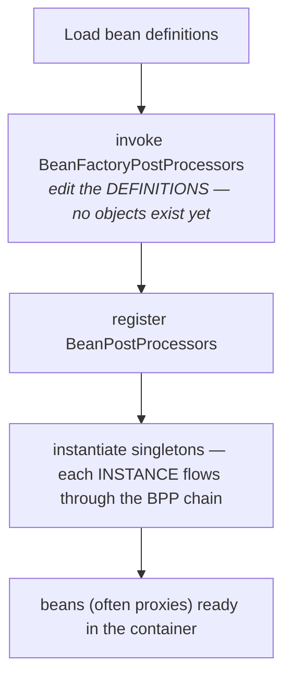

# 06 · BeanPostProcessor & BeanFactoryPostProcessor

> The two extension points that *make Spring Spring*. `@Autowired`, `@PostConstruct`, `@Configuration`,
> `@Transactional`, AOP — all of them are implemented as one of these two hooks.
> [← Part 1 · The Extension Model & AOP](README.md) · next: 07 · Spring AOP: Proxies

> **Predict first (2 min).** When does `${db.url}` in your `@Value` get replaced with the real value
> — before or after your bean is instantiated? And when does Spring turn your `@Service` into a
> `@Transactional` proxy — before or after `@PostConstruct`? Write your guesses; the two hooks below
> are the answer.

---

## Spring is built out of its own hooks

Here's the reframing that makes the whole framework click: **the container has exactly two
general-purpose extension points, and Spring implements its own features through them.** Once you see
that, "magic" features become ordinary, inspectable, and extensible — by Spring and by you.

| Hook | Operates on | When (in `refresh()`) | Examples Spring implements with it |
|---|---|---|---|
| **`BeanFactoryPostProcessor`** (BFPP) | bean **definitions** (the metadata/blueprints) | *before* any bean is instantiated | `PropertySourcesPlaceholderConfigurer` (resolves `${…}`), `ConfigurationClassPostProcessor` (parses `@Configuration`/`@Bean`) |
| **`BeanPostProcessor`** (BPP) | bean **instances** | *around* each bean's initialization (before/after) | `AutowiredAnnotationBeanPostProcessor` (`@Autowired`/`@Value`), `CommonAnnotationBeanPostProcessor` (`@PostConstruct`/`@PreDestroy`), `AnnotationAwareAspectJAutoProxyCreator` (AOP proxies) |



> ▶ **Watch it:** [`bpp-pipeline.html`](visualizations/bpp-pipeline.html) — watch a BFPP rewrite the
> blueprints, then each instance flow through the BPP chain and emerge as a proxy.

So the predictions:

- **`${db.url}` is resolved before instantiation**, by a `BeanFactoryPostProcessor` editing the bean
  *definition*. (No instance exists yet to inject into.)
- **The `@Transactional` proxy is created after `@PostConstruct`**, by a `BeanPostProcessor`
  (`AnnotationAwareAspectJAutoProxyCreator`) in `postProcessAfterInitialization` — exactly stage 8 of
  the [bean lifecycle](../00-foundations-the-container/). Your init code runs on the raw object; the
  proxy wraps it on the way out.

---

## BeanFactoryPostProcessor — rewrite the blueprints

A BFPP runs once, early, with access to the `ConfigurableListableBeanFactory` — i.e. all the
**`BeanDefinition`s** — *before* the container instantiates anything. It can add, remove, or modify
definitions: change a scope, set a property, register a brand-new bean, resolve placeholders.

The most important one you never see: **`ConfigurationClassPostProcessor`** is a BFPP — it's what
parses your `@Configuration` classes, runs `@Bean` methods' metadata, and processes `@ComponentScan`
and `@Import`. So "auto-configuration" (Part 2) ultimately rides on a BFPP turning configuration
classes into bean definitions.

---

## BeanPostProcessor — wrap the instances

A BPP gets a callback **around every bean's initialization**:

```java
interface BeanPostProcessor {
    default Object postProcessBeforeInitialization(Object bean, String name) { return bean; }
    default Object postProcessAfterInitialization(Object bean, String name)  { return bean; }
}
```

Crucially, it can **return a different object** — which is exactly how AOP works: the auto-proxy
creator returns a *proxy* in place of your bean. `@Autowired` field injection, `@PostConstruct`
invocation, `*Aware` callbacks — all are BPPs. The chain runs in order (control it with `Ordered` /
`PriorityOrdered`), and every instantiated bean flows through all of them.

### The bootstrapping gotcha

BPPs must exist *before* the beans they process, so the container instantiates BPPs **early**, ahead
of normal beans. Consequence: a `BeanPostProcessor` (or anything it depends on) is created too early
to itself be advised/processed by *other* BPPs — so **don't make a BPP depend on regular application
beans**, or you'll get "not eligible for auto-proxying" warnings and beans that quietly skip advice.

---

## Write your own (it's a few lines)

```java
@Component
class TimingBeanPostProcessor implements BeanPostProcessor {
    public Object postProcessAfterInitialization(Object bean, String name) {
        if (bean.getClass().isAnnotationPresent(Timed.class))
            return Proxy.newProxyInstance(...);   // your own advice, your own proxy
        return bean;
    }
}
```

That's the entire mechanism behind `@Transactional`, just yours. Understanding it means you can read
*any* "how does Spring do X" question as "which BFPP/BPP, and what does it return?"

---

## Make it visible

- **Log every bean through the pipeline.** Register a `BeanPostProcessor` that prints
  `name + " -> " + bean.getClass()` in `postProcessAfterInitialization`. You'll see exactly which
  beans come out as `…$$SpringCGLIB$$…` proxies — the AOP BPP at work.
- **Watch a BFPP edit definitions.** Set a breakpoint in
  `PropertySourcesPlaceholderConfigurer.postProcessBeanFactory` and watch `${…}` placeholders get
  resolved in the definitions before any bean exists.
- **See the order.** Enable `logging.level.org.springframework.beans.factory=DEBUG` and watch BFPPs
  run, then BPPs register, then singletons instantiate.

---

## Self-Check (close the doc, answer out loud)

1. BFPP vs BPP: what does each operate on, and when does each run in `refresh()`?
2. Name two Spring features implemented as a BFPP and three implemented as a BPP.
3. How does a BPP turn your bean into a proxy — what's the key thing its method is allowed to do?
4. Why is `${…}` resolved before instantiation but the AOP proxy created after `@PostConstruct`?
5. Why must BPPs be instantiated early, and what's the gotcha that follows from it?
6. You want to add a metric to every method of beans annotated `@Timed`. Which hook, and what does it
   return?

> **Go deeper:** read `AbstractAutowireCapableBeanFactory.applyBeanPostProcessors*` and
> `PostProcessorRegistrationDelegate` in the source; then [07 · Spring AOP: Proxies](README.md), which
> is the auto-proxy BPP up close.
