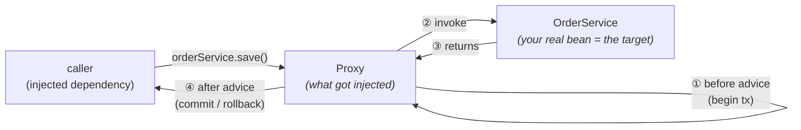

# 07 · Spring AOP: Proxies (JDK Dynamic vs CGLIB)

> How `@Transactional`, `@Async`, `@Cacheable`, and method security actually work — they're **advice
> on a proxy** — and the single trap that silently disables all of them.
> [← Part 1 · The Extension Model & AOP](README.md) · prev: 06 · BeanPostProcessor · next: 08 · Environment & Config Binding

> **Predict first (2 min).** You put `@Transactional` on a `public void audit()` method. Another
> method *in the same class* calls `this.audit()`. Does a transaction start? Write your answer and
> *why*. By the end of this chapter you'll know the answer cold — and why it's the most common
> "Spring didn't do the thing" bug in the world.

---

## The problem AOP solves

Some concerns cut *across* many methods: transactions, security checks, caching, retries, metrics,
logging. You don't want a `try { tx.begin() … tx.commit() } catch { tx.rollback() }` dance copy-pasted
into every service method — that's noise, and it's error-prone. **Aspect-Oriented Programming** lets
you declare such a *cross-cutting concern* once (an **aspect**) and have it apply to many methods
(the **join points**) selected by a **pointcut**, running extra behavior (**advice**) around them.

Spring implements this with the one mechanism it reaches for again and again: **a proxy**.

---

## How Spring AOP works: proxies

When a bean needs advice, Spring doesn't give you *your* object. During bean creation a
`BeanPostProcessor` (see [chapter 06](README.md)) wraps your bean in a **proxy** — an object of a
*different* class that implements/extends your type, intercepts each method call, runs the advice,
and delegates to your real object (the **target**).



So the object other beans hold a reference to is the **proxy**, not your class. Every external call
goes *through* it, which is where `begin/commit`, the cache lookup, the security check, etc. happen.

> ▶ **Watch it:** [`proxy-interception.html`](visualizations/proxy-interception.html) — watch a call
> route caller → proxy → target with advice firing on both sides, then a self-invocation that
> bypasses the proxy entirely.

`@Transactional`, `@Async`, `@Cacheable`, and `@PreAuthorize` are all just advice on such a proxy.
Understand the proxy and you understand all of them at once — including how they break.

---

## Two kinds of proxy: JDK dynamic vs CGLIB

Spring can build the proxy two ways:

| | **JDK dynamic proxy** | **CGLIB proxy** |
|---|---|---|
| Mechanism | implements your bean's **interface(s)** | generates a **subclass** of your bean's class |
| Requires | the bean to have an interface | a non-`final` class with a non-`final` method |
| Can't proxy | n/a (interface-based) | `final` classes, `final`/`private`/`static` methods |
| Identity | proxy `instanceof YourInterface` (not your class) | proxy `instanceof YourClass` (a subclass) |

- A **JDK dynamic proxy** uses `java.lang.reflect.Proxy` to create a class implementing your
  interface; calls are dispatched through an `InvocationHandler`. It only works if you injected the
  bean *by its interface*.
- A **CGLIB proxy** generates a subclass of your concrete class at runtime (via bytecode generation)
  and overrides each method to add advice. Because it subclasses, it **cannot** override `final`
  classes or `final`/`private`/`static` methods — those silently get no advice.

> **Version fact (Spring Boot 2.0+):** Spring Boot configures `proxyTargetClass=true`, so Boot
> **defaults to CGLIB** even when interfaces exist. (Plain Spring historically preferred a JDK proxy
> when an interface was present.) So the common folklore "Spring proxies are JDK dynamic proxies" is
> *wrong on a modern Boot stack*. The "proxies are interface-based reflection objects, bytecode
> subclassing is CGLIB" mechanics tie straight to the [java track's chapter on reflection &
> dynamic proxies](../../java/00-platform-and-mental-model/).

Either way the consequence is the same and it's the crux of this chapter:

---

## The self-invocation trap

Advice lives **on the proxy**. A call only runs the advice if it *goes through the proxy*. An
external caller holds the proxy, so `orderService.save()` is advised. But a call from **inside** the
target to **another method of the same object** — `this.audit()` — goes straight from the target to
the target. It **never touches the proxy**, so its advice never runs.

```java
@Service
class OrderService {
    @Transactional
    public void save(Order o) {
        repo.persist(o);
        audit(o);              // ← self-invocation: this.audit(o)
    }

    @Transactional(propagation = REQUIRES_NEW)
    public void audit(Order o) {   // looks transactional…
        auditRepo.persist(new AuditEntry(o));   // …but runs in NO new transaction
    }
}
```

Calling `orderService.save()` from elsewhere *is* transactional (it crossed the proxy). But the
`audit(o)` call inside `save` is `this.audit(o)` — it bypasses the proxy, so the `REQUIRES_NEW` is
**silently ignored**: no new transaction starts. The same trap disables a self-invoked `@Async`
(runs synchronously), `@Cacheable` (no cache lookup), and `@PreAuthorize` (no check). It compiles, it
runs, it "works" in the happy path — and it's wrong.

**Fixes, best first:**
1. **Move the method to another bean** and inject it — the call now crosses a proxy boundary. (Often
   the cleanest: the self-call was a sign of two responsibilities in one class.)
2. Inject the bean **into itself** and call through the injected reference (works, but a smell).
3. Use `AopContext.currentProxy()` (couples your code to Spring AOP — avoid).
4. Switch to **AspectJ compile/load-time weaving**, which modifies the bytecode of the method itself
   rather than wrapping it in a proxy, so self-invocation *is* advised — at the cost of a weaving
   build step. Spring's *default* is proxy-based, not weaving.

---

## Where the proxy is created (tie to chapter 06)

The proxy is installed by an **`AbstractAutoProxyCreator`**, which is a `BeanPostProcessor` running
in `postProcessAfterInitialization` — *after* your bean's `@PostConstruct`/`afterPropertiesSet`. So:
your init callbacks run on the **raw** object; everyone who *injects* the bean afterward gets the
**proxy**. (That's also why a bean that needs to be advised but is referenced during its own
construction can miss advice — the proxy isn't there yet.)

---

## Make it visible

Don't believe it — make Spring show you the proxy and the (missing) advice:

- **See the proxy class.** Log `orderService.getClass().getName()`. A CGLIB proxy prints something
  like `com.acme.OrderService$$SpringCGLIB$$0` — proof the injected object isn't your class.
- **Watch advice fire (or not).** Set `logging.level.org.springframework.transaction.interceptor=TRACE`
  and call `save()` externally — you'll see `Getting transaction for [...save]`. Now trigger the
  self-invoked `audit()` and watch **no** transaction line appear. That silence is the bug.
- **Inspect the aspects.** `logging.level.org.springframework.aop=TRACE`, or list the
  `Advisor`/`BeanPostProcessor` beans, to see what's being woven onto what.

---

## Myths to drop (Spring 6 / Boot 3)

- **"Spring proxies are JDK dynamic proxies."** Boot defaults to **CGLIB** since 2.0.
- **"`@Transactional` works wherever I put it."** Only on `public` methods, only when the call
  **crosses the proxy**, and (CGLIB) only on non-`final` methods.
- **"`private @Transactional` is fine."** A private method can't be proxied/overridden — no advice.
- **"AOP is reflection magic."** It's a proxy object created by a `BeanPostProcessor`; the dispatch is
  an `InvocationHandler` (JDK) or an overriding subclass (CGLIB). Entirely inspectable.

---

## Self-Check (close the doc, answer out loud)

1. What does Spring inject into other beans — your object or something else? Why does that matter for
   `@Transactional`?
2. JDK dynamic proxy vs CGLIB: how does each create the proxy, what does each require, and which does
   Spring Boot default to?
3. Explain the self-invocation trap mechanically. Why does an external `save()` get a transaction but
   a self-invoked `audit()` does not?
4. Give two ways to fix a self-invocation problem and say which you'd reach for first and why.
5. When in the bean lifecycle is the proxy created, and what surprising consequence does that have for
   init callbacks?
6. Your `@Cacheable` method is being hit on every call (no caching) and it's called from within the
   same class. Diagnose it in one sentence.

> **Go deeper:** the Spring Framework reference → "Aspect Oriented Programming with Spring"; read
> `AbstractAutoProxyCreator` and `TransactionInterceptor` in the source; then
> [chapter 08 · Environment & Config Binding](README.md), and [Part 4 · Transactions](../04-data-and-transactions/)
> where this proxy resurfaces as the transaction boundary.
