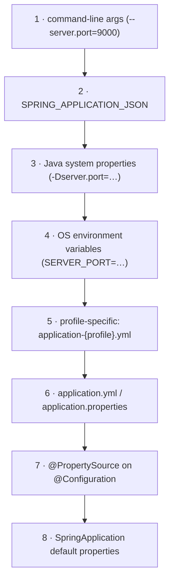

# 08 · The Environment, Properties & Configuration Binding

> How Spring resolves a property — the ordered `PropertySource` stack and its precedence — and why
> `@ConfigurationProperties` beats scattered `@Value`s for anything more than a one-off.
> [← Part 1 · The Extension Model & AOP](README.md) · prev: 07 · Spring AOP · next: 09 · Events

> **Predict first (2 min).** You set `server.port` in `application.yml` **and** pass
> `--server.port=9000` on the command line **and** export `SERVER_PORT=7000`. Which wins? And: does
> `MY_APP_PAGE_SIZE` (env var) bind to `my.app.page-size`? Write your guesses.

---

## The Environment: profiles + an ordered property stack

The `Environment` is the container's view of two things: the active **profiles** and a *prioritized
list* of **`PropertySource`s**. A `PropertySource` is just a named key→value bag (the OS environment,
JVM system properties, a `.yml` file, a `Map`, …). To resolve a key, Spring walks the sources **in
order and the first one that has the key wins** — later sources never override earlier ones.

So configuration isn't "the value in my yml" — it's "the value from the **highest-priority source**
that defines the key." Knowing the order is the whole game.

### Spring Boot's precedence (high → low, abridged)



So the predictions:

- **`--server.port=9000` wins** — command-line args sit near the top, above env vars (`SERVER_PORT`)
  and above `application.yml`. (Full order: Boot reference → "Externalized Configuration.")
- **Yes, `MY_APP_PAGE_SIZE` binds to `my.app.page-size`** — via *relaxed binding* (next section). This
  is exactly how you configure a Boot app in a container with only environment variables.

---

## `@Value` vs `@ConfigurationProperties`

Two ways to read config into your beans:

| | `@Value("${my.app.page-size}")` | `@ConfigurationProperties("my.app")` |
|---|---|---|
| Binds | one field, via placeholder/SpEL | a **whole prefix** to a typed object (nested, `List`, `Map`, `Duration`, `DataSize`) |
| Relaxed binding | no (exact key) | **yes** |
| Validation | no | **yes** (`@Validated` + Bean Validation) |
| IDE metadata / autocomplete | no | yes (with the annotation processor) |
| Best for | a one-off value, a SpEL expression | any **group** of related settings |

**Prefer `@ConfigurationProperties`** for anything structured. It gives you a single typed,
validated, relaxed-bound object instead of a dozen brittle `@Value` strings scattered across beans:

```java
@ConfigurationProperties("my.app")
@Validated
record MyAppProperties(@NotBlank String name, @Positive int pageSize, Duration timeout) {}
// my.app.page-size=20, my.app.timeout=30s  → bound, converted, validated at startup
```

Register it with `@EnableConfigurationProperties(MyAppProperties.class)` or
`@ConfigurationPropertiesScan`. Records give you **constructor binding** → immutable config.

---

## Relaxed binding

A `@ConfigurationProperties` prefix matches keys written many ways, so the *same* property can come
from a `.yml` file, an env var, or a system property without you caring about the format:

| Source | Form for `my.app.page-size` |
|---|---|
| `.yml` / `.properties` | `my.app.page-size` (kebab — canonical) or `my.app.pageSize` (camel) |
| environment variable | `MY_APP_PAGESIZE` or `MY_APP_PAGE_SIZE` (uppercase, `_` separators) |
| system property | `-Dmy.app.page-size=20` |

Env-var relaxed binding (uppercase + underscores) is *the* mechanism for 12-factor/container config —
no file needed.

---

## Type conversion & profiles

- **Conversion** is automatic via Spring's `ConversionService`: `"30s"` → `Duration`, `"10MB"` →
  `DataSize`, comma lists → `List`, etc. Add your own `Converter` beans for custom types.
- **Profiles** select which beans/config are active: `@Profile("prod")` on a bean,
  `application-prod.yml` for profile-specific props, `spring.profiles.active=prod` to activate. Keep
  environment differences in profile files, not in code.

---

## Make it visible

- **`/actuator/configprops`** — every `@ConfigurationProperties` bean and its *resolved* values.
- **`/actuator/env`** — the full ordered `PropertySource` stack and which source each property came
  from. This answers "why is this value what it is?" definitively — you can *see* the precedence.
- **Override four ways** — set one property in `application.yml`, then override it with a profile
  file, an env var, a system property, and a command-line arg in turn, checking `/actuator/env` each
  time to watch the higher-priority source win.

---

## Self-Check (close the doc, answer out loud)

1. What two things does the `Environment` hold? How does it resolve a key across `PropertySource`s?
2. Order these by precedence: `application.yml`, command-line arg, OS env var, system property.
3. `@Value` vs `@ConfigurationProperties` — when do you reach for each, and what four things does the
   latter give you?
4. What is relaxed binding, and how do you set `my.app.page-size` from an environment variable?
5. How do records give you immutable, validated configuration?
6. A property has an unexpected value in prod. Which Actuator endpoint tells you *which source* it
   came from?

> **Go deeper:** the Boot reference → "Externalized Configuration" (the full precedence list) and
> "Type-safe Configuration Properties"; then [09 · Events](README.md).
