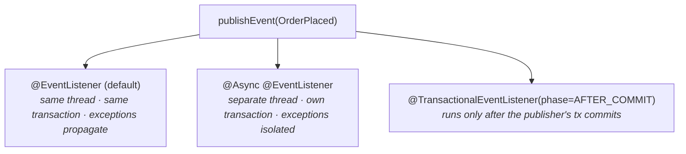

# 09 · Events & the Application Event Model

> The in-process event bus you already have — `publishEvent` + `@EventListener` — its
> **synchronous-by-default** semantics, and the two annotations (`@Async`, `@TransactionalEventListener`)
> that change *when* and *on what thread* a listener runs.
> [← Part 1 · The Extension Model & AOP](README.md) · prev: 08 · Environment & Config

> **Predict first (2 min).** A service publishes an `OrderPlaced` event, then a listener handles it.
> By default, does the listener run on the **same thread** as the publisher, and inside the
> publisher's **transaction**? If the listener throws, does the publisher's call fail? Write your
> guesses.

---

## Publish and listen

Spring's `ApplicationContext` is itself an event bus. Any bean can publish, any bean can listen:

```java
@Service
class OrderService {
    private final ApplicationEventPublisher events;
    OrderService(ApplicationEventPublisher events) { this.events = events; }
    void place(Order o) { repo.save(o); events.publishEvent(new OrderPlaced(o.id())); }
}

@Component
class EmailListener {
    @EventListener
    void on(OrderPlaced e) { mail.sendConfirmation(e.orderId()); }
}
```

Since Spring 4.2 an event can be **any object** (no need to extend `ApplicationEvent`), and
`@EventListener` can sit on any method. This is the cleanest way to **decouple within a monolith**:
`OrderService` doesn't know `EmailListener` exists.

---

## The default is synchronous — and that surprises people

> **By default, `publishEvent` is *synchronous*:** it runs every matching listener **on the
> publisher's thread, inline, before `publishEvent` returns** — and therefore inside the publisher's
> **transaction**.

So the predictions, all "yes":

- **Same thread** — the listener runs synchronously on the caller's thread.
- **Same transaction** — because it's inline within the still-open transactional method, the listener
  participates in that transaction (a DB write in the listener commits/rolls back with the publisher).
- **A throwing listener fails the publisher** — the exception propagates back into
  `publishEvent` and up through `place()`. Events are *not* a fire-and-forget queue by default.

This is the single most common surprise: people treat events as async background work and are caught
out when a slow/failing listener blocks or breaks the publishing request. Two annotations change it.



---

## Changing when and where a listener runs

- **`@Async` (+ `@EnableAsync`)** — the listener runs on a **separate thread** from a task executor.
  It no longer blocks the publisher, no longer shares the transaction, and its exceptions **don't**
  propagate to the publisher (handle them in the listener / an `AsyncUncaughtExceptionHandler`). Use
  for genuinely background work (sending email, warming a cache).
- **`@TransactionalEventListener`** — binds the listener to the publisher's **transaction lifecycle**.
  Default phase `AFTER_COMMIT`: the listener runs **only if and after the transaction commits**
  (other phases: `AFTER_ROLLBACK`, `AFTER_COMPLETION`, `BEFORE_COMMIT`). This is the right tool for
  *"do X only once the order is durably saved"* — it prevents the classic bug of emailing "order
  confirmed" and then having the transaction roll back.
- **Ordering** — multiple listeners for one event run in `@Order` order (synchronous case).

---

## When NOT to use application events

These are an **in-process, in-memory, non-durable** bus. If the JVM dies between publish and handle,
the event is gone; it does not cross service boundaries. So:

- ✅ Decoupling modules *within one app* (a modular monolith), post-commit side effects.
- ❌ Cross-service communication, work that must survive a crash, anything needing delivery
  guarantees → use a real message broker (Kafka/Rabbit/SQS — see the [HLD track](../../HLD/) on
  messaging). Don't reach for `@Async` events as a poor man's queue.

---

## Make it visible

- **Prove it's synchronous.** Log the thread name in both publisher and listener — same thread by
  default. Add `@Async` (+ `@EnableAsync`) and watch the listener thread change.
- **Prove the transaction sharing.** Throw in a default `@EventListener` and watch the publisher's
  transaction roll back. Switch to `@Async` and watch the publisher commit regardless.
- **Prove `AFTER_COMMIT`.** With `@TransactionalEventListener`, make the publisher's transaction roll
  back and confirm the listener never runs.

---

## Self-Check (close the doc, answer out loud)

1. How do you publish and listen for an event? Does an event class have to extend anything (modern Spring)?
2. By default, what thread does a listener run on, what transaction is it in, and what happens if it
   throws?
3. What does `@Async` change about a listener — thread, transaction, and exception behavior?
4. What does `@TransactionalEventListener(AFTER_COMMIT)` guarantee, and what bug does it prevent?
5. When are application events the right tool, and when must you reach for a real message broker
   instead?

> **Go deeper:** the Spring reference → "Standard and Custom Events"; then **Part 1 is complete** —
> on to [Part 2 · Spring Boot Core](../02-spring-boot-core/), where auto-configuration ties the whole
> container together.
