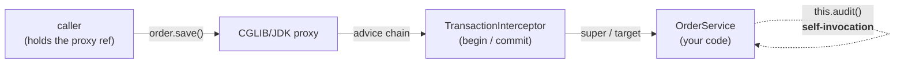

# Part 1 · The Extension Model & AOP

> Spring is built *on its own extension points*. Once you see that, the framework stops being magic:
> `@Transactional`, `@Async`, `@Cacheable`, custom scopes, and even auto-configuration are all the
> *same two mechanisms* — post-processors and proxies — applied over and over. Learn the mechanisms
> and you can debug or extend any of it. [← curriculum index](../README.md)

This is the part that turns "Spring does it for me" into "I know exactly which hook fired, when in
`refresh()`, and whether my call actually crossed a proxy." It's the conceptual hinge of the whole
track: Part 0 gave you the container; here you learn the two seams Spring opens in it — one for
rewriting bean *definitions*, one for wrapping bean *instances* — and proxies, the device every
declarative feature in Spring is secretly made of. Everything in Parts 2–5 is an application of what
you build here.

---

## Learning objectives — what "I know this" actually means

By the end of this part you can, **from memory and out loud**:

- Distinguish a `BeanFactoryPostProcessor` (operates on bean *definitions*, before any bean is
  instantiated) from a `BeanPostProcessor` (operates on bean *instances*, around initialization),
  and say *exactly* where each runs in `AbstractApplicationContext.refresh()` —
  `invokeBeanFactoryPostProcessors` then `registerBeanPostProcessors`, both before
  `finishBeanFactoryInitialization` instantiates the singletons.
- Explain how Spring AOP builds a proxy: **JDK dynamic proxy** when the target implements interfaces
  (interface-based, via `java.lang.reflect.Proxy`) versus **CGLIB** (a runtime *subclass* of the
  target), state that **Spring Boot defaults to CGLIB since 2.0** (`proxyTargetClass=true`), and name
  what CGLIB *cannot* proxy — `final` classes and `final`/`private`/`static` methods.
- Reproduce and explain **the self-invocation trap**: a call from one method of a bean to another
  advised method of the *same* bean goes through `this`, not the proxy, so `@Transactional`,
  `@Async`, and `@Cacheable` silently do nothing. State *why* (the proxy wraps the reference handed
  to *callers*, not the target's internal `this`) and name the fixes.
- Place a value coming from `@Value` versus type-safe `@ConfigurationProperties` binding, explain the
  ordered `PropertySources` and **relaxed binding** (kebab/camel/underscore all map to the same
  property), and reason about *which* source won.
- Describe the **application event model**: `ApplicationEventPublisher`, `@EventListener`, that
  publication is **synchronous on the publisher's thread by default**, and how `@Async` events and
  `@TransactionalEventListener` change that.

## Topic checklist

- [ ] **06 · `BeanPostProcessor` & `BeanFactoryPostProcessor`** — the two extension seams in the
      container. `BeanFactoryPostProcessor` runs against the `ConfigurableListableBeanFactory` *after*
      definitions are loaded but *before* instantiation (e.g.
      `PropertySourcesPlaceholderConfigurer`, `ConfigurationClassPostProcessor` — the one that
      actually processes `@Configuration`/`@ComponentScan`). `BeanPostProcessor` wraps each bean's
      initialization: `postProcessBeforeInitialization` → `@PostConstruct`/`afterPropertiesSet`/init
      → `postProcessAfterInitialization` (where AOP proxies are typically created by
      `AbstractAutoProxyCreator`). Ordering via `PriorityOrdered`/`Ordered`; the bootstrapping
      chicken-and-egg (BPPs that are themselves beans).
- [ ] **07 · Spring AOP: Proxies (JDK Dynamic vs CGLIB)** — the proxy is the delivery mechanism for
      *all* declarative behavior. JDK dynamic proxy (interface, `InvocationHandler`) vs CGLIB
      (subclass, method interception); Boot's CGLIB default since 2.0; the advice chain
      (`MethodInterceptor`s around `MethodInvocation`); pointcuts and advisors; what CGLIB can't touch
      (`final`); proxy identity ≠ target identity; and **self-invocation** as the structural
      consequence of "the proxy wraps the *reference*, not the object." Ties to `../../java/` —
      [JDK dynamic proxies & reflection](../../java/) and [why a CGLIB subclass is a class the JVM
      loads](../../java/).
- [ ] **08 · The `Environment`, Properties & Configuration Binding** — the `Environment` abstraction,
      the ordered list of `PropertySource`s and precedence (command line > env vars > profile-specific
      > `application.yml` > defaults, roughly), profiles, `@Value` SpEL injection vs type-safe
      `@ConfigurationProperties`, **relaxed binding** and nested/`List`/`Map` binding, validation with
      `@Validated`. (Full externalized-config story lands in
      [Part 2 · ch. 14](../02-spring-boot-core/); here it's the *binding mechanism*.)
- [ ] **09 · Events & the Application Event Model** — `ApplicationEventPublisher`,
      `ApplicationEvent` and arbitrary POJO events, `@EventListener` (and conditional `condition =`,
      ordered listeners). **Synchronous by default** — publication blocks the publisher and a listener
      exception propagates back. `@Async` listeners to decouple; `@TransactionalEventListener` to fire
      `AFTER_COMMIT` (the classic "publish the event but only if the transaction actually committed").
      Built-in lifecycle events (`ApplicationReadyEvent`, etc.) connect forward to
      [Part 2 · ch. 13](../02-spring-boot-core/).

## The principal-level insight

**Spring's most important features are not language features — they are proxies and
post-processors. That is exactly why they have sharp edges.** `@Transactional`, `@Async`,
`@Cacheable`, `@Retryable`, method security — none of these are keywords the compiler understands.
They are *runtime* behavior bolted on by a `BeanPostProcessor` that, on the way out of
initialization, replaces your bean with a proxy that intercepts calls and runs advice around them.
That single design choice explains every "why didn't my annotation work?" you will ever hit: the
advice only runs **when a call actually crosses the proxy boundary.** Self-invocation bypasses it.
`final` defeats CGLIB so the proxy can't be built. Injecting the bean by its concrete type instead
of its interface can hand you the wrong object identity. A junior memorizes "use a separate bean to
fix `@Async`"; a principal *reasons about whether the call crosses a proxy* and derives the fix —
and knows the same reasoning applies unchanged to `@Cacheable`, security, and your own custom
aspect. The framework is small and consistent once you see the seam; it only looks like a thousand
special cases from the outside.

## Drills (build, don't just read)

1. **Make the proxy visible.** In any advised bean, log `getClass().getName()` (or
   `AopUtils.isCglibProxy(this)` / `isJdkDynamicProxy`) from a method and from a `CommandLineRunner`
   that has it injected. Watch a name like `…$$SpringCGLIB$$0` appear. Now add
   `@EnableAsync(proxyTargetClass = false)` *and* an interface, and watch it flip to a JDK
   `$ProxyN`. You now *see* the two proxy kinds instead of reciting them.
2. **Reproduce the self-invocation bug, then fix it three ways.** Put `@Async` (or `@Transactional`)
   on `methodB()` and call it from `methodA()` in the *same* class. Confirm it runs *synchronously /
   in the same transaction* — i.e. did nothing. Then fix it: (a) self-inject the proxy
   (`@Autowired private MyBean self;`), (b) move `methodB` to a separate bean, (c) obtain the proxy
   via `AopContext.currentProxy()` with `exposeProxy=true`. Explain which you'd ship and why.
3. **Watch every bean pass through a `BeanPostProcessor`.** Write one that logs
   `beanName` in both `postProcessBeforeInitialization` and `postProcessAfterInitialization`. Start
   the app and read the order: see infrastructure beans, then yours, then watch an advised bean get
   *returned as a different object* from `postProcessAfterInitialization` (the proxy swap). Add a
   `BeanFactoryPostProcessor` that prints `beanFactory.getBeanDefinitionNames()` and confirm it ran
   *before* any of those instances existed.
4. **Bind nested config with relaxed binding.** Define
   `@ConfigurationProperties(prefix = "app.mail")` with nested objects, a `List`, and a `Map`. Set
   the values three ways — `app.mail.from-address`, `APP_MAIL_FROMADDRESS`, and
   `app.mail.fromAddress` — and prove all three land in the same field. Inject the same value with
   `@Value("${app.mail.from-address}")` and articulate when you'd reach for which.
5. **Publish and listen — then make it conditional on commit.** Publish a POJO event from a service
   method, consume it with `@EventListener`, and confirm it ran *synchronously* (throw in the
   listener; watch the publisher's call fail). Switch to `@TransactionalEventListener(phase =
   AFTER_COMMIT)`, force a rollback, and confirm the listener does *not* fire.

## Interview lens

This is high-frequency senior/principal territory because it separates people who *use* Spring from
people who *understand* it. Expect: *"How does `@Transactional` work under the hood?"* (AOP proxy →
`TransactionInterceptor` → `PlatformTransactionManager` — the full chain lands in
[Part 4 · ch. 22](../04-data-and-transactions/), but the *proxy* part is here). *"JDK dynamic vs
CGLIB proxy — what's the difference and when does Spring use each?"* *"Why does calling my `@Async`
method from another method in the same class do nothing?"* (The self-invocation question — the
single best filter for real proxy understanding.) *"`BeanPostProcessor` vs `BeanFactoryPostProcessor`
— what does each operate on and when do they run?"* *"`@Value` vs `@ConfigurationProperties`?"* The
principal signal is reaching for **"does this call cross the proxy?"** and **"is this a definition or
an instance?"** as first principles, rather than reciting a fix you memorized.

## Make the invisible visible

Spring's analog of the java track's *"measure it"* is *"make the proxy and the wiring visible."* You
never have to *believe* a claim here — you can *prove* it on a running context:

- **Log the proxy class** (`getClass()`, `AopUtils`) and enable
  `logging.level.org.springframework.aop=TRACE` to watch advisors match.
- **`--debug`** prints the `ConditionEvaluationReport`; the Actuator **`/conditions`** and
  **`/beans`** endpoints show which post-processors and proxies the container actually built.
- **`/configprops`** dumps every `@ConfigurationProperties` binding so you can see *which* property
  source won; turn on `logging.level.org.springframework.boot.context.properties=DEBUG` to watch
  binding happen.
- **Set a breakpoint** in `AbstractAutoProxyCreator.postProcessAfterInitialization` (proxy creation)
  and in `AbstractApplicationContext.refresh()` (to watch `invokeBeanFactoryPostProcessors` run
  before `registerBeanPostProcessors` before `finishBeanFactoryInitialization`). The source is
  famously readable — read it.

The solid path crosses the proxy, so advice runs. The dotted `this.audit()` call stays *inside* the
target and never touches the proxy — which is *why* the annotation on `audit()` silently does
nothing. That one picture is the whole part.

## Visualizations

See [`visualizations/`](visualizations/): **proxy-interception** (a call entering the proxy, walking
the advice chain, hitting the target — and the self-invocation call that escapes it) and
**bpp-pipeline** (every bean flowing through `before` → init callbacks → `after`, with the advised
bean coming out the far side as a proxy). Catalog and conventions in
[VISUALIZATIONS.md](../../java/VISUALIZATIONS.md).
