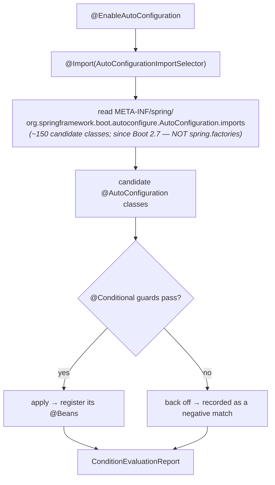

# 11 · Auto-Configuration Internals

> The single most "magic" thing Boot does, fully demystified: a pile of ordinary `@Configuration`
> classes, each gated by `@Conditional`, evaluated in order — and a report that explains every
> decision.
> [← Part 2 · Spring Boot Core](README.md) · prev: 10 · What Boot Adds · next: 12 · Starters

> **Predict first (2 min).** You add `spring-boot-starter-data-jpa` and suddenly a `DataSource`, an
> `EntityManagerFactory`, and a transaction manager exist — beans you never wrote. *How* did Boot
> decide to create them? And if you declare your *own* `DataSource @Bean`, why does Boot's not
> collide with it? Write your guesses.

---

## `@SpringBootApplication` is three annotations

```java
@SpringBootApplication   //  =  @SpringBootConfiguration  (a @Configuration)
                         //   + @ComponentScan             (find YOUR @Components)
                         //   + @EnableAutoConfiguration    (the magic — below)
class App { public static void main(String[] a){ SpringApplication.run(App.class, a); } }
```

Component scanning finds *your* beans. **`@EnableAutoConfiguration`** is what conjures the ones you
didn't write.

---

## How auto-configuration actually works



1. `@EnableAutoConfiguration` imports **`AutoConfigurationImportSelector`**.
2. The selector reads the candidate list from
   **`META-INF/spring/org.springframework.boot.autoconfigure.AutoConfiguration.imports`** — a flat
   list of ~150 `@AutoConfiguration` classes shipped by the starters on your classpath. *(This file
   replaced the legacy `META-INF/spring.factories` mechanism in Boot 2.7 — a common stale-blog
   error.)*
3. Each candidate is just a `@Configuration` class **gated by `@Conditional` annotations**. Boot
   evaluates the guards; a class only contributes its `@Bean`s **if all its conditions pass**.

So the answer to the first prediction: adding the JPA starter put `DataSource`, Hibernate, and JPA
classes on the classpath, which made `DataSourceAutoConfiguration`,
`HibernateJpaAutoConfiguration`, etc. **match their `@ConditionalOnClass` guards**, so they fired and
registered those beans. No magic — conditional configuration reacting to your classpath.

---

## The `@Conditional` family

| Condition | Fires the config when… |
|---|---|
| `@ConditionalOnClass` / `@ConditionalOnMissingClass` | a class is / isn't on the classpath |
| `@ConditionalOnBean` / `@ConditionalOnMissingBean` | a bean of some type is / isn't already defined |
| `@ConditionalOnProperty` | a property has a given value (`spring.x.enabled=true`) |
| `@ConditionalOnWebApplication` | the app is a (servlet/reactive) web app |
| `@ConditionalOnResource`, `@ConditionalOnExpression`, … | a resource exists / a SpEL expression is true |

> ▶ **Watch it:** [`autoconfig-conditions.html`](visualizations/autoconfig-conditions.html) — watch
> candidates evaluated against their guards, some apply and some are excluded, and
> `@ConditionalOnMissingBean` back off when you define your own bean.

---

## `@ConditionalOnMissingBean` — why *your* bean always wins

This is the override mechanism, and the answer to the second prediction. Boot's auto-config beans are
almost all annotated `@ConditionalOnMissingBean`:

```java
@AutoConfiguration
class DataSourceAutoConfiguration {
    @Bean
    @ConditionalOnMissingBean(DataSource.class)   // ← only if YOU haven't defined one
    DataSource dataSource(...) { return new HikariDataSource(...); }
}
```

Auto-configuration is evaluated **after** your own configuration, so by the time
`@ConditionalOnMissingBean` runs, your `DataSource @Bean` already exists — the condition fails, and
**Boot backs off**. That's the whole "sensible defaults you can override" model: Boot supplies a
bean *only if you didn't*. (This ordering is why auto-config classes run last; it's deliberate.)

---

## Ordering and exclusion

- **Order between auto-configs:** `@AutoConfiguration(before=…, after=…)` and `@AutoConfigureOrder`
  — e.g. JPA auto-config runs *after* `DataSource` auto-config because it needs the `DataSource`.
- **Turn one off:** `spring.autoconfigure.exclude=...` (or `@SpringBootApplication(exclude=…)`).
- **Write your own:** an `@AutoConfiguration` class listed in your starter's
  `AutoConfiguration.imports`, guarded by conditions — exactly how the framework does it
  ([chapter 12](README.md)).

---

## Make it visible — the ConditionEvaluationReport

You never have to *guess* why a bean exists. Boot will tell you:

- **`--debug`** (or `debug=true`) prints the **`ConditionEvaluationReport`** at startup:
  - **Positive matches** — auto-configs that applied, and *which* condition matched.
  - **Negative matches** — auto-configs that backed off, and *why* (e.g. "`@ConditionalOnClass` did
    not find `com.rabbitmq.client.Channel`").
  - **Exclusions** and **unconditional classes**.
- **`/actuator/conditions`** exposes the same report as JSON in a running app.

This is the principal habit for *any* "why is / isn't this bean here?" question: read the condition
report instead of guessing. Watching it is exactly what the animation shows.

---

## Self-Check (close the doc, answer out loud)

1. What three annotations make up `@SpringBootApplication`, and which one drives auto-configuration?
2. Walk the path from `@EnableAutoConfiguration` to a bean being registered. Where does the candidate
   list come from (and what's the *wrong*, stale answer)?
3. Name four `@Conditional` annotations and what each tests.
4. Mechanically, why doesn't Boot's `DataSource` collide with one you define? What ordering makes that
   work?
5. How do you (a) see why a bean was/wasn't created, (b) turn an auto-config off?
6. You added a starter but the expected bean isn't there. What's your first move, and what exactly
   does it tell you?

> **Go deeper:** read `AutoConfigurationImportSelector` and a real `@AutoConfiguration` class (e.g.
> `DataSourceAutoConfiguration`) in the Boot source; then [12 · Starters & Dependency Management](README.md)
> and [13 · The SpringApplication Startup Sequence](README.md).
