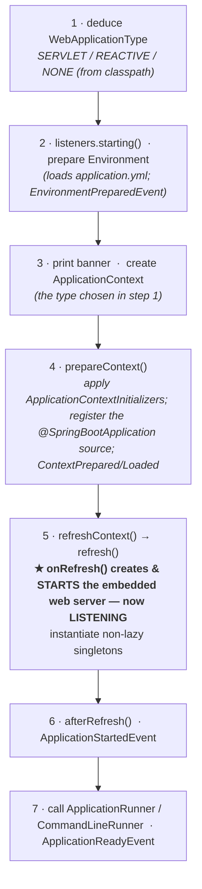

# 13 · The SpringApplication Startup Sequence

> What `SpringApplication.run()` actually does, step by step — the orchestration *around*
> `refresh()`, **where the embedded web server boots**, and the lifecycle events you can hook.
> [← Part 2 · Spring Boot Core](README.md) · prev: 12 · Starters · next: 14 · Externalized Config

> **Predict first (2 min).** At what point in startup does the embedded Tomcat actually start
> **listening** on its port — before or after your beans are created? And when does a
> `CommandLineRunner` execute relative to that? Write your guesses.

---

## `run()` orchestrates; `refresh()` does the container work

`SpringApplication.run()` is the **conductor**: it prepares the environment and context, then calls
the one method that builds the container — `AbstractApplicationContext.refresh()` ([Part 0](../00-foundations-the-container/))
— and finishes up. Roughly, in order (Boot 3.x):

> ▶ **Watch it:** [`springapplication-run.html`](visualizations/springapplication-run.html) — step
> through `run()` and watch the server flip to LISTENING *inside* `refresh()`, then the runners fire.

So both predictions resolve: the **embedded server starts inside `refresh()`** (step 5, in
`onRefresh()`), *after* the context is prepared and *as* the singletons come up — well before startup
finishes. And a **`CommandLineRunner` runs at step 7**, *after* the server is already listening and
the context is fully refreshed. (⚡ so the app can receive requests slightly before your runners
finish — don't rely on a runner to gate readiness; use `ApplicationReadyEvent` / a readiness probe.)

---

## WebApplicationType — chosen from the classpath

Step 1 inspects the classpath: **`DispatcherServlet` present → SERVLET**; only WebFlux present →
**REACTIVE**; neither → **NONE** (a plain app that exits when `run()` returns). This choice decides
*which* `ApplicationContext` implementation is created (e.g.
`AnnotationConfigServletWebServerApplicationContext`) and therefore whether a web server boots at all.

## The startup events (in order)

`SpringApplicationRunListeners` fire, in sequence:

`ApplicationStartingEvent` → `ApplicationEnvironmentPreparedEvent` → `ApplicationContextInitializedEvent`
→ `ApplicationPreparedEvent` → `ApplicationStartedEvent` (context refreshed, server up) →
`ApplicationReadyEvent` (runners done — the app is fully ready) → *(on failure)* `ApplicationFailedEvent`.

**`ApplicationReadyEvent`** is the canonical "we're live" hook — warm caches, start pollers/schedulers
here, not in a constructor or `@PostConstruct` (those run mid-startup, before the server is up).

## Runners & customization

- **`ApplicationRunner`** (gets `ApplicationArguments`) and **`CommandLineRunner`** (gets `String[]`)
  both run at step 7, after refresh; order multiple with `@Order`.
- Customize `run()` via the **`SpringApplicationBuilder`** (`.bannerMode(...)`, `.web(...)`,
  `.listeners(...)`, `.initializers(...)`), **`ApplicationContextInitializer`** (tweak the context
  before refresh), lazy init (`spring.main.lazy-initialization=true` — faster start, deferred bean
  creation), and default properties.

---

## Make it visible

- **Breakpoints.** Set them in `SpringApplication.run`, `refreshContext`, and
  `ServletWebServerApplicationContext.onRefresh` (or `.createWebServer`) — step through and watch the
  server start *inside* refresh, before the runners.
- **The startup timeline.** Enable `ApplicationStartup` (`BufferingApplicationStartup`) and read
  **`/actuator/startup`** to see each step's timing — the basis for cutting startup ([Part 6](../06-principal-skills/)).
- **Hook readiness.** `@EventListener(ApplicationReadyEvent.class)` and log the millis — confirm it
  fires *after* "Tomcat started on port 8080" in the logs.

---

## Self-Check (close the doc, answer out loud)

1. What's the relationship between `run()` and `refresh()`? Which one does the container-building work?
2. Recite the `run()` sequence. At which step does the embedded server start listening, and why does
   that matter for readiness?
3. How is the `WebApplicationType` decided, and what does it determine?
4. List the startup events in order. Which one means "fully ready," and what should you do there
   (vs. in `@PostConstruct`)?
5. `ApplicationRunner` vs `CommandLineRunner` — difference, and when do they run?
6. Name three ways to customize `SpringApplication` startup.

> **Go deeper:** read `SpringApplication.run` and `ServletWebServerApplicationContext` in the Boot
> source; the reference → "Spring Application"; then [14 · Externalized Configuration](README.md) and
> [15 · Embedded Servers](README.md).
