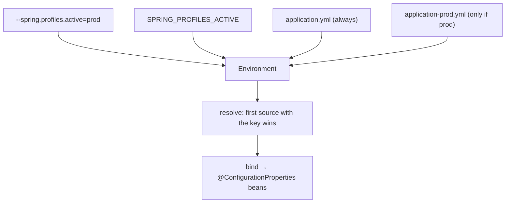

# 14 · Externalized Configuration

> One app, many environments — the same jar runs on your laptop, CI, staging, and prod, and only the
> *config* changes. Boot unifies files, env vars, and CLI args into **one ordered `Environment`**, binds
> it to typed beans, and tells you where every value came from.
> [← Part 2 · Spring Boot Core](README.md) · prev: 13 · SpringApplication Startup · next: 15 · Embedded Servers

> **Predict first (2 min).** You set `server.port=8080` in `application.properties`, *and* export
> `SERVER_PORT=9090`, *and* launch with `--server.port=7070`. Which port wins? And a subtler one:
> is `MY_APP_TIMEOUT` (env var) able to bind to a property named `my-app.timeout`? Write your guesses.

---

## The core idea: one `Environment`, many sources

Boot collects every place a value could come from — property files, YAML, OS environment variables,
JVM system properties, command-line arguments, and more — into a single ordered list of
**`PropertySource`s** behind the `Environment`. When something asks for a property, Boot walks the
list **in precedence order and returns the first hit.** "Externalized" just means: the value lives
*outside* your compiled code, so the same artifact behaves differently per environment.

## Precedence: last writer wins (highest first)

The prediction's first answer: **`--server.port=7070` wins.** Command-line args sit near the top of
the order. The order Boot uses (high → low, abridged to what you actually touch):

| Rank | Source | Typical use |
|---|---|---|
| 1 | **Command-line args** (`--key=value`) | one-off overrides, containers |
| 2 | `SPRING_APPLICATION_JSON` (inline JSON) | inject a whole tree via one env var |
| 3 | **OS environment variables** | the standard prod/12-factor knob |
| 4 | **Java system properties** (`-Dkey=value`) | JVM-level overrides |
| 5 | **Profile-specific** `application-{profile}.yml` | per-env files |
| 6 | **`application.yml` / `.properties`** | your baseline defaults |
| 7 | `@PropertySource` on `@Configuration` | legacy/extra files |
| 8 | Defaults set in code (`SpringApplication.setDefaultProperties`) | last resort |

So env vars **beat** the files in your jar (that's the point — you ship defaults, prod overrides
them), but a command-line arg beats an env var. The mental rule: **more specific / more external =
higher priority.**

- ⚡ Profile-specific files override the plain file **for keys they define** — they don't wholesale
  replace it; unspecified keys fall through to `application.yml`.
- ⚡ `spring.config.import` (Boot 2.4+) pulls in extra config (a file, a Vault/Consul URL, a k8s
  ConfigMap) as *additional* sources, ordered where the import sits.

## Relaxed binding: `MY_APP_TIMEOUT` → `my-app.timeout`

The prediction's second answer: **yes.** Boot's **relaxed binding** maps between naming styles so one
canonical property name is reachable from every source's idiom:

| Canonical | Also matches |
|---|---|
| `my-app.timeout` | `my-app.timeout`, `myApp.timeout`, `my_app.timeout`, and env var **`MY_APP_TIMEOUT`** |

Environment variables **can't** contain dots or hyphens, so the rule is: **uppercase, replace `.` and
`-` with `_`.** `my-app.timeout` → `MY_APP_TIMEOUT`. This is why 12-factor env-var config "just
works" against dotted property names. (Relaxed binding applies when binding to
`@ConfigurationProperties`; raw `@Value("${...}")` lookups are stricter — prefer typed binding.)

## Two ways to read config: `@Value` vs `@ConfigurationProperties`

```java
// @Value — one key at a time, SpEL-capable, no relaxed binding, no validation
@Value("${my-app.timeout:30}")   // :30 = default if absent
private int timeout;

// @ConfigurationProperties — a whole typed, validated, relaxed-bound tree (preferred)
@ConfigurationProperties(prefix = "my-app")
@Validated
public record MyAppProps(@DefaultValue("30") Duration timeout,
                         @NotBlank String region,
                         List<String> hosts) {}
```

Prefer **`@ConfigurationProperties`** for anything beyond a stray value: it binds a group, supports
relaxed names, does type conversion (including `Duration`/`DataSize` — `30s`, `10MB`), validates with
JSR-380, and is discoverable. Register with `@EnableConfigurationProperties(MyAppProps.class)` or
`@ConfigurationPropertiesScan`. Use `@Value` only for a lone value or when you need SpEL.

- ⚡ **Duration/DataSize parsing:** `timeout: 30s`, `max-size: 10MB` bind to `Duration`/`DataSize`
  natively — don't hand-parse ints.

## Profiles: swap whole slices of config

A **profile** is a named group of beans + property files, toggled by
`spring.profiles.active` (env var `SPRING_PROFILES_ACTIVE`, or `--spring.profiles.active=prod`):

- `application-prod.yml` loads **only** when `prod` is active (layered over the base file).
- `@Profile("prod")` on a `@Bean`/`@Configuration` includes it only for that profile.
- **Groups** (`spring.profiles.group.prod=prod,metrics,secure`) activate several at once.
- ⚡ **`@Profile("!prod")`** = everything *except* prod. Common for local-only stubs.
- ⚡ In one multi-document YAML file, `---` separates documents and each can carry
  `spring.config.activate.on-profile: prod` — profile-specific config without extra files.



## Where did this value come from? (origin tracking)

Boot records the **origin** of each property (which file, which line). When a
`@ConfigurationProperties` bind fails, the error names the source; the Actuator **`/actuator/env`** and
**`/actuator/configprops`** endpoints dump the resolved environment and bound beans with origins — the
fastest way to answer "why is this value what it is?" in a running app.

- ⚡ **Never commit secrets** to `application.yml`. Use env vars, `spring.config.import` of a secrets
  backend (Vault/AWS Secrets Manager), or k8s config trees (`spring.config.import=configtree:/etc/config/`).
  Origin tracking + `/actuator/env` **masks** keys matching `password`/`secret`/`key` by default.

## Make it visible

- **Watch precedence flip.** Set `server.port` in `application.properties`, start → 8080. Restart with
  `--server.port=7070` → the CLI arg wins. Then `SERVER_PORT=9090` (no CLI arg) → 9090. Same jar.
- **Relaxed binding proof.** Bind `@ConfigurationProperties("my-app")` with a `region` field; set it
  only via env var `MY_APP_REGION=us-east-1` and confirm it binds.
- **Ask the app.** Hit `/actuator/configprops` and `/actuator/env` — see every bound value *and its
  origin file/line*, with secrets masked.

## Self-Check (close the doc, answer out loud)

1. Give the top few precedence ranks. Does an env var beat `application.yml`? Does a CLI arg beat the env var?
2. What env-var name binds to `my-app.max-retries`, and what rule produces it?
3. When do you reach for `@ConfigurationProperties` over `@Value`, and what four things does it add?
4. How do you activate a profile, and what does `application-prod.yml` do when `prod` is active?
5. How do you find out *where* a running app got a particular value — and how are secrets handled there?

> **Go deeper:** the Boot reference → "Externalized Configuration" and "Profiles"; then
> [15 · Embedded Servers](README.md), the last piece of Boot Core.
